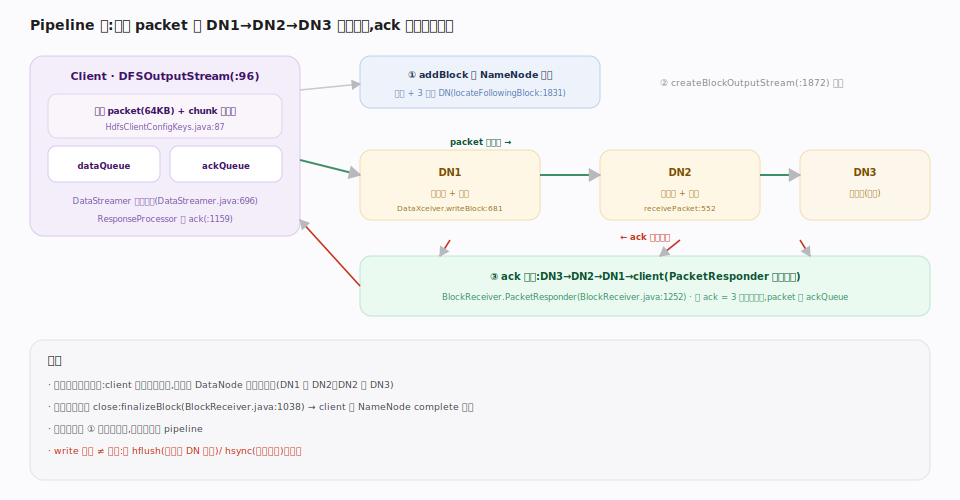
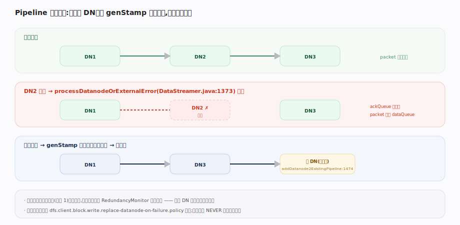

# 支撑 · Pipeline 写数据流

> **定位**：HDFS 写入的核心机制。一个块的数据不是并行发给 3 个副本，而是串成一条**管道（pipeline）**：client→DN1→DN2→DN3，数据 packet 沿管道流水复制、ack 沿管道反向确认。这样 client 只需一份出带宽，副本靠 DataNode 间转发完成。上承 FileSystem API 的 `create/write`，下启 DataNode 块存储；是「数据不经 NameNode」的具体落地。

## Pipeline 建立与 packet 流水

client 侧 `DFSOutputStream`（`hadoop-hdfs-client/.../DFSOutputStream.java:96`）把写入的字节切成 **packet**（默认 64KB，`HdfsClientConfigKeys.java:87`），每 packet 内再按 512 字节算 chunk 校验和，塞进 `dataQueue`。后台 `DataStreamer`（`.../DataStreamer.java:119`）线程 `run`（`:696`）负责发送：

1. `locateFollowingBlock`（`:1831`）向 NameNode `addBlock` 申请新块 + 3 个目标 DataNode。
2. `createBlockOutputStream`（`:1872`）向 DN1 发建管请求，DN1 转发给 DN2、DN2 转发 DN3，握手成功后 `setPipeline`（`:647`）确立管道。
3. 从 `dataQueue` 取 packet 发给 DN1，DN1 边写本地边转发 DN2……即 DataNode 侧 `DataXceiver.writeBlock`（`.../datanode/DataXceiver.java:681`）+ `BlockReceiver.receivePacket`（`BlockReceiver.java:552`）：收 packet→校验→写本地→`mirrorOut` 转发下游。

## ack 反向确认与块完成

packet 发出后移入 `ackQueue` 等确认。DataNode 侧 `PacketResponder`（`BlockReceiver.java:1252`）：DN3 写完回 ack 给 DN2，DN2 合并自己的 ack 回 DN1，DN1 回 client。client 的 `ResponseProcessor`（`DataStreamer.java:1159`）收到 ack 才把 packet 从 `ackQueue` 移除。全 ack 表示该 packet 在 3 副本都落地。

**pipeline 故障恢复**：`processDatanodeOrExternalError`（`DataStreamer.java:1373`）检测到某 DN 挂——把 `ackQueue` 未确认 packet 移回 `dataQueue`、剔除坏 DN、用递增的 genStamp 重建剩余节点的 pipeline；副本数不足时 `addDatanode2ExistingPipeline`（`:1474`）补新节点转移数据。写满一个块或 `close` 时 `receiveBlock`（`BlockReceiver.java:986`）`finalizeBlock`（`:1038`），client 回 NameNode `complete` 收尾。

## 深化 · 三级流水的角色

| 层级 | 结构 | 作用 | 源码 |
|---|---|---|---|
| packet（64KB） | 多个 chunk + 校验和 | 流水最小传输单元 | `DFSOutputStream.java:96` |
| dataQueue / ackQueue | 两个队列 | 发送中 / 待确认 | `DataStreamer.java:119` |
| pipeline（DN1→DN2→DN3） | 串行转发链 | client 一份带宽复制三副本 | `createBlockOutputStream:1872` |
| PacketResponder | 反向 ack 合并 | 逐级确认落地 | `BlockReceiver.java:1252` |

## 调优要点

- **packet/队列大小**：`dfs.client-write-packet-size`（默认 64KB）与队列深度影响吞吐与内存；高带宽网络可加大提升流水并行度。
- **hflush/hsync 语义**：`hflush` 保证数据到达所有 DataNode 内存可被读到，`hsync` 强制刷盘；对可靠性敏感场景用 hsync，代价是延迟。
- **短路写不存在，短路读存在**：写必须走 pipeline 保证副本；读可短路本地块。
- **pipeline 恢复策略**：`dfs.client.block.write.replace-datanode-on-failure.policy` 决定失败时是否补节点，小集群设 NEVER 避免频繁失败。

## 常见误区

- **误以为副本并行写**：是串行流水（DN1→DN2→DN3），不是 client 同时发 3 份。
- **误以为 write() 返回即持久**：默认只入客户端缓冲；要 hflush/hsync 才保证到 DataNode/磁盘。
- **误以为一个 DN 挂就写失败**：pipeline 会剔除坏节点继续，只要满足最小副本数（默认 1）即成功，欠副本后台补。

## 一句话总纲

**HDFS 写是一条流水管道：client 把数据切成 64KB packet 顺 DN1→DN2→DN3 流水复制、ack 反向逐级确认，client 只出一份带宽；中途 DN 挂就剔除坏点、升 genStamp 重建管道继续写。**
