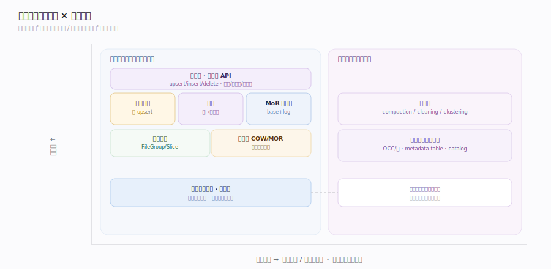
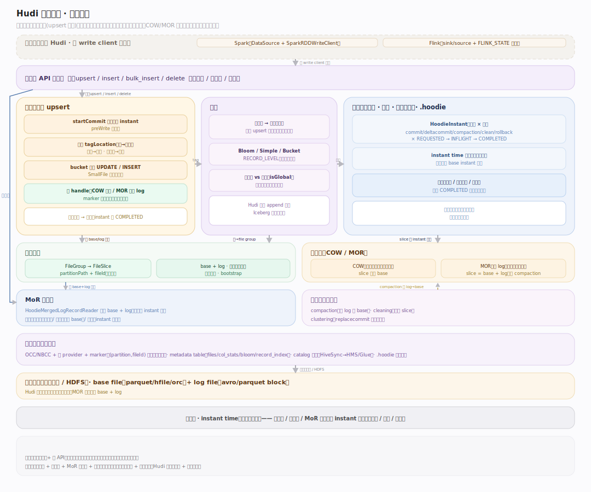
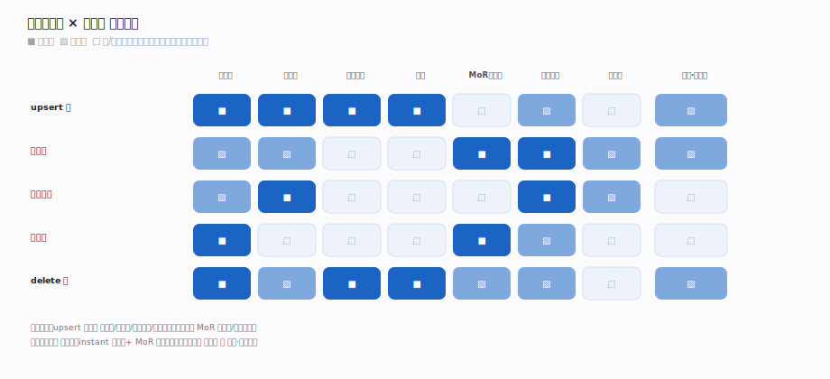
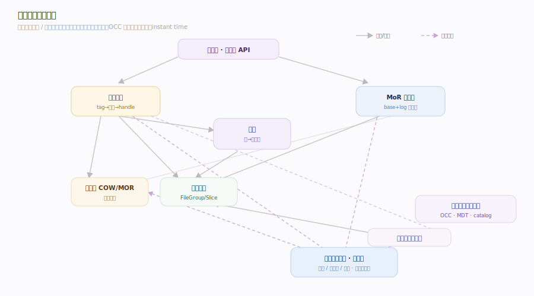

# Hudi 原理 · 全景主线框架

> 统领全部原理文档:Apache Hudi 是**事务性数据湖表格式**(新家族:表格式/湖仓表,upsert 导向——与 Iceberg 同族但设计取向不同:Hudi 以"时间线 + 高效 upsert"为核心)。源码基准 **Hudi(git 1dfbdcb)**(`~/workdir/hudi`,hudi-common/hudi-client)。

Hudi 的世界观:**表 = 一条时间线(timeline)+ 按记录键组织的文件组**。它诞生于"在数据湖上做高效 upsert/增量"的需求——每张表有一条动作时间线(commit/compaction/clean…),数据按 FileGroup 组织、靠索引把记录键映射到文件组实现高效更新。两种表类型 COW(写时重写)/MOR(读时合并)是它的核心取舍。理解"时间线 + 表类型 + 索引 upsert"三点,就懂了 Hudi。

> **结构提示(写文档必看)**:① 核心是**时间线**(.hoodie 目录里 HoodieInstant 序列,动作×状态,是表的真相);② 两种表类型 **COW(HoodieWriteMergeHandle 行级重写文件)vs MOR(HoodieAppendHandle 写 delta log)**;③ 文件组织 FileGroup→FileSlice(base file + log files);④ upsert 靠**索引**(Bloom/Simple/Bucket/RECORD_LEVEL)把记录键→文件组;⑤ MOR 读时 HoodieMergedLogRecordReader 合并 base+log;⑥ 表服务 compaction/cleaning/clustering;⑦ 并发 OCC + 锁 provider。

---

## 一、双维模型:能力域 × 执行时机

- **能力域**:接触面(表读写 API)面向计算引擎;支撑侧 **8 条能力域**——时间线、表类型(COW/MOR)、写入路径与 upsert、索引、MoR 读合并、文件布局、表服务、并发控制与元数据。
- **执行时机**:前台(upsert 写、快照/增量读)vs 后台(compaction 合 log 进 base、cleaning 清旧文件片、clustering 重组,由表服务触发)。

---

## 二、总架构图(位置即语义)

计算引擎(Spark/Flink)经 Hudi 库读写表:**写(upsert)**——`startCommit` 在时间线开一个 instant → 索引 tagLocation 标记记录属于哪个文件组 → 按 bucket(UPDATE/INSERT)路由 → COW 走 MergeHandle 重写 base 文件 / MOR 走 AppendHandle 写 delta log → 提交(时间线转 COMPLETED)。**读**——快照查(base+log 合并)/ 读优化查(仅 base)/ 增量查(时间线增量)。所有动作记在 **.hoodie 时间线**——表的真相;数据是对象存储上的 base file(parquet)+ log file。

---

## 三、主线的分层归位（接触面 + 8 支撑域）

| 层 | 主线 | 一句话职责 |
|---|---|---|
| 接触面 | **表读写 API** | 引擎经库 upsert/query,时间线驱动 |
| 时间线 | **时间线(核心·灵魂)** | HoodieInstant 动作×状态,表的真相 |
| 类型 | **表类型 COW/MOR** | 写时重写 vs 读时合并的核心取舍 |
| 写入 | **写入路径与 upsert** | 开 instant→tag→路由→handle→提交 |
| 写入 | **索引** | 记录键→文件组,高效 upsert 地基 |
| 读 | **MoR 读合并** | base + log 读时合并,三种查询类型 |
| 存储 | **文件布局** | FileGroup→FileSlice(base+log)、命名、bootstrap |
| 保障 | **表服务** | compaction/cleaning/clustering 后台维护 |
| 保障 | **并发控制与元数据** | OCC/锁/marker + metadata table + catalog |

---

## 四、接触面 × 能力域 依赖矩阵

upsert(写)依赖时间线(开 instant)+ 写入路径 + 索引(tag 定位)+ 表类型(COW/MOR 决定 handle)+ 文件布局(落到 file group)+ 并发控制(OCC);query(读)依赖 MoR 读合并(base+log)+ 时间线(可见性/增量)+ 表类型(读优化仅 base)+ 元数据(metadata table 加速)。表服务(compaction/cleaning/clustering)在后台维护文件布局。

---

## 五、能力域依赖关系图

实线=数据流/调用,虚线=状态约束。贯穿层:**instant time(单调时间戳)** 横切时间线/文件片/合并——每个动作领单调递增 instant time,FileSlice 按 base instant 组织、时间线按 instant 排序、MoR 合并按 instant 序。

---

## 六、三条贯穿声明(Hudi 区别于 Hive 表/Iceberg)

1. **时间线是表的真相**:Hudi 表 = .hoodie 目录里的一条动作时间线(HoodieInstant:commit/deltacommit/compaction/clean/rollback × REQUESTED/INFLIGHT/COMPLETED)。文件片是否可见、增量读从哪读、回滚到哪,全看时间线。时间线不可变,操作产新时间线视图。

2. **为 upsert 而生:索引 + 文件组**:Hudi 的核心竞争力是高效 upsert——靠**索引**(Bloom/Simple/Bucket/RECORD_LEVEL)把记录键映射到文件组,更新时直接路由到对应文件组(不用全表扫)。数据按 FileGroup 组织,每组多个 FileSlice(base + log)。这是 Iceberg(append 导向)没有的。

3. **COW vs MOR 是写读代价的取舍**:COW(Copy-on-Write)更新时重写整个文件(写慢、读快、无合并);MOR(Merge-on-Read)写 delta log(写快、读时 base+log 合并、慢)。两种表类型让用户按"写多读少"还是"读多写少"选——这是 Hudi 的定义性设计选择。

---

**一句话定位**:Hudi 是事务性数据湖表格式(upsert 导向,与 Iceberg 同族异构)——核心是 .hoodie 时间线(HoodieInstant 动作×状态,表的真相),数据按 FileGroup→FileSlice(base+log)组织,靠索引(Bloom/Bucket/记录级)把记录键映射到文件组实现高效 upsert;两种表类型 COW(重写文件,写慢读快)/MOR(写 delta log,写快读时合并)是核心取舍;表服务 compaction/cleaning/clustering 后台整理,OCC + 锁 provider 管并发;贯穿的 instant time 单调定序一切。
