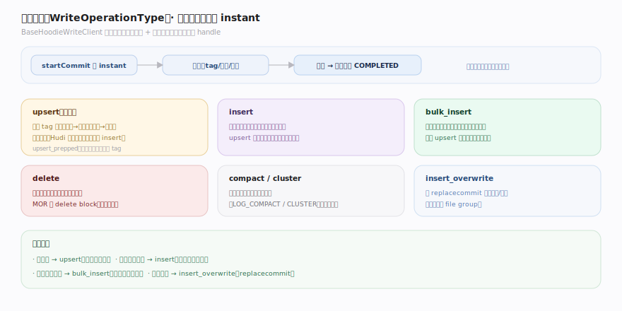
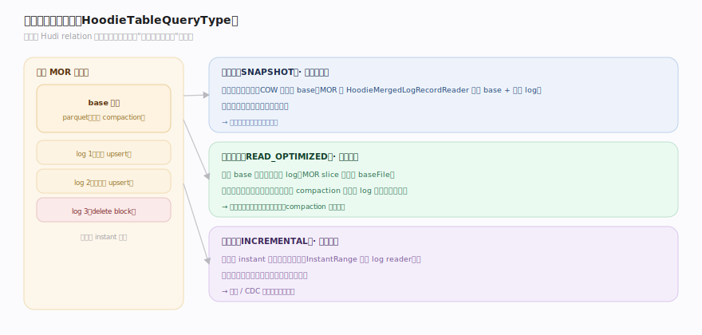
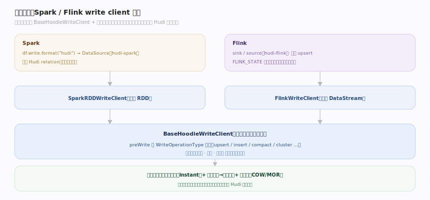

# Hudi 原理 · 接触面主线 · 表读写 API

> **定位**：属"接触面主线"(计算引擎可见)。Hudi 的接触面是**表读写 API**:通过 Spark/Flink 的 write client 做 upsert/insert/delete,通过三种查询类型读。它是链接进引擎的库 + write client,不是终端 SQL。调用【写入与索引】写、【MoR 读合并】读、【时间线】定序。源码基准 **Hudi(1dfbdcb)**(`hudi-client/`)。

Hudi 怎么被用?**通过计算引擎的 write client**:Spark DataSource / Flink sink 调 `BaseHoodieWriteClient` 做 upsert/insert/bulk_insert/delete;读通过 Spark/Flink 的 Hudi relation 按查询类型(快照/读优化/增量)读。用户写的是引擎 SQL/DataFrame,底下调 Hudi API。所以接触面是引擎集成层 + write client 的操作族。

---

## 一、写操作族:upsert / insert / delete

`BaseHoodieWriteClient` 的写操作(`WriteOperationType`):

- **upsert**:主操作——索引 tag 后更新已存在键、插入新键(见写入与索引篇)。Hudi 的招牌能力。
- **insert**:不查索引直接插(允许重复键),比 upsert 快,适合无更新场景。
- **bulk_insert**:大批量初始导入,优化文件大小分布(不走小文件合并逻辑)。
- **delete**:按记录键删除(写删除标记)。
- **upsert_prepped / insert_prepped**:记录已预标位置,跳过 tag。

每个写操作:`startCommit` 开 instant → 执行 → 提交(时间线转 COMPLETED)。写操作类型 + 表类型(COW/MOR)共同决定用哪个 handle。

---

## 二、读:三种查询类型

读通过引擎的 Hudi relation,按 `HoodieTableQueryType` 选(见 MoR 读合并篇):

- **快照查(SNAPSHOT)**:最新一致视图——COW 读 base、MOR 合并 base+log。默认,最全。
- **读优化查(READ_OPTIMIZED)**:仅 base 文件(MOR 略旧但快)。
- **增量查(INCREMENTAL)**:读 instant 区间内的变更——流式/CDC 下游,时间线驱动。

引擎(Spark/Flink)把用户查询翻译成对应查询类型 + 时间线可见性判定,交给 Hudi 读文件片。

---

## 三、集成:Spark / Flink write client

Hudi 通过引擎适配层接入:

- **Spark**:DataSource(`hudi-spark`)——`df.write.format("hudi")` 调 SparkRDDWriteClient(BaseHoodieWriteClient 的 Spark 实现);读经 Hudi relation。
- **Flink**:sink/source(`hudi-flink`)——流式 upsert,FLINK_STATE 索引(状态后端存记录位置)。
- **write client 分层**:`BaseHoodieWriteClient`(引擎无关逻辑)+ 引擎特定实现(SparkRDD/FlinkWriteClient);`preWrite` 按 `WriteOperationType` 分派(upsert/compact/cluster 等)。

所有引擎都走同一套时间线 + 索引 + 表类型语义;引擎适配层只负责把引擎的数据抽象(RDD/DataStream)桥接到 Hudi 的写入模型。

---

## 拓展 · 接触面关键结构一览

| 结构 | 定义 | 职责 |
|---|---|---|
| BaseHoodieWriteClient | `client/BaseHoodieWriteClient.java:468` | 写操作族(upsert/insert/delete) |
| WriteOperationType | `common/model/` | upsert/insert/bulk_insert/delete/compact/cluster |
| HoodieTableQueryType | `common/model/HoodieTableQueryType.java:33` | 快照/读优化/增量查 |
| startCommit | `client/BaseHoodieWriteClient.java:1088` | 开时间线 instant |

## 调优要点（关键开关）

- **写操作选择**:有更新用 upsert;纯追加无更新用 insert(快);初始大批导入用 bulk_insert。
- **查询类型**:要最新用快照;要快容忍略旧用读优化;流式下游用增量。
- **Flink 索引**:流式 upsert 用 FLINK_STATE 索引(状态存位置,低延迟)。
- **写并行度/批大小**:Spark write 的分区数、批大小影响文件大小与写吞吐。

## 常见误区与工程要点

- **误区:Hudi 是独立查询引擎。** 不。它是库 + write client,链接进 Spark/Flink;查询在引擎里执行,引擎调 Hudi 读写文件片。
- **误区:insert 和 upsert 一样。** insert 不查索引(允许重复键,快);upsert 查索引去重更新(招牌但略慢)。
- **误区:bulk_insert 走小文件合并。** bulk_insert 优化初始导入的文件分布,不走 upsert 的小文件塞入逻辑。
- **误区:读总是最新。** 快照查最新;读优化查(MOR)略旧;增量查只拿区间变更——按查询类型定。
- **归属提醒**:写的索引/路由在【写入与索引】;COW/MOR handle 在【表类型】;MOR 读合并在【MoR 读合并】;写动作 instant 在【时间线】;并发在【表服务与并发】。

## 一句话总纲

**Hudi 接触面是引擎集成的表读写 API(非终端 SQL):写经 BaseHoodieWriteClient 的操作族(upsert 招牌能力索引去重更新、insert 不查索引快、bulk_insert 大批导入、delete 写删除标记),每次 startCommit 开时间线 instant→执行→提交;读经引擎 Hudi relation 按三种查询类型(快照最新/读优化快略旧/增量流式);Spark(DataSource+SparkRDDWriteClient)/Flink(sink+FLINK_STATE 索引)通过适配层桥接引擎数据抽象到 Hudi 的时间线+索引+表类型模型。**
