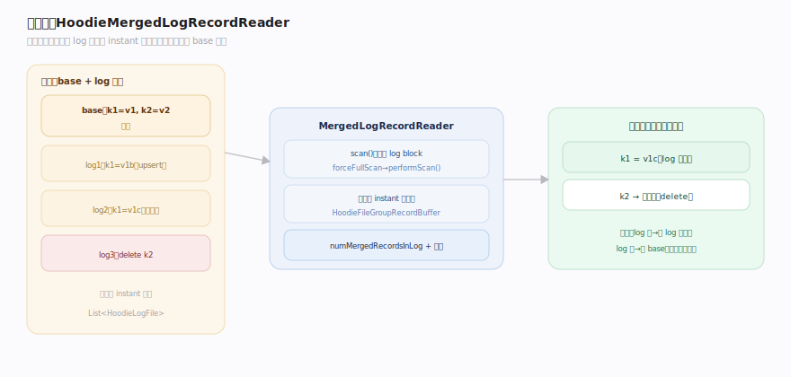
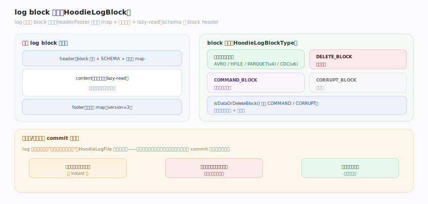
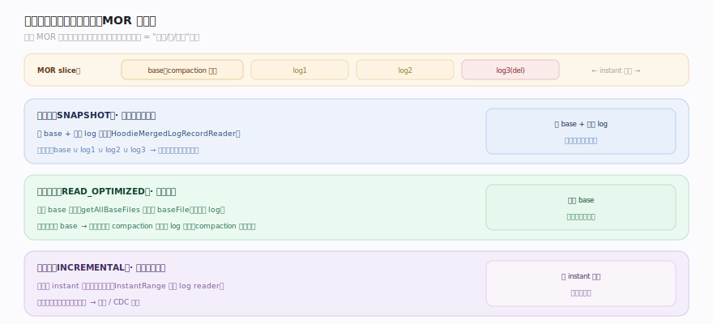

# Hudi 原理 · 支撑主线 · MoR 读合并

> **定位**：属"读能力域"。管 MOR 表的读取:base + log 文件读时合并(HoodieMergedLogRecordReader)、log block 格式、三种查询类型(快照/读优化/增量)。依赖【表类型 MOR】的 log 文件、【时间线】定可见性。源码基准 **Hudi(1dfbdcb)**(`hudi-common/`)。

MOR 表写时只追加 delta log(快),代价是**读时要合并 base + log**。Hudi 用 `HoodieMergedLogRecordReader` 把同一记录键的多个 log 版本合并出最新值,再与 base 文件归并。log 以 block 组织(数据块/删除块/命令块)。查询有三种类型:快照(合并)、读优化(仅 base)、增量(时间线增量)。理解读合并 + 查询类型,就懂了 MOR 的读侧。

---

## 一、读合并:HoodieMergedLogRecordReader

**HoodieMergedLogRecordReader**(`HoodieMergedLogRecordReader.java:50`)= "合并相同记录键的 log record 的 log 读取器"。它:

- 扩展 `BaseHoodieLogRecordReader`,接一个 `List<HoodieLogFile>` + 一个 `HoodieFileGroupRecordBuffer`(`:57`)。
- `scan()`/`scan(boolean)` 处理 log block;`forceFullScan` 触发 `performScan()` 前置(`:76`)。
- 跟踪 `numMergedRecordsInLog` + 合并耗时(`:62`)。

**合并逻辑**:同一记录键在多个 log 里可能有多版本(多次 upsert),reader 按 instant 序合并出最新;再与 base 文件里的记录归并——base 有、log 无覆盖则用 base,log 有则用 log 最新。这就是"读时把增量 log 叠加到基线"。

---

## 二、log block 格式

log 文件由 **HoodieLogBlock**(`HoodieLogBlock.java:77`,version=3)组织,含 header/footer 元数据 map、内容位置、lazy-read。schema 在 block header(`HeaderMetadataType.SCHEMA`)。

**block 类型**(`HoodieLogBlockType`,`:211`):
- `AVRO_DATA_BLOCK`(avro)/ `HFILE_DATA_BLOCK`(hfile)/ `PARQUET_DATA_BLOCK`(parquet,v4)/ `CDC_DATA_BLOCK`(cdc,v6):数据块,存记录。
- `DELETE_BLOCK`(:delete):删除标记。
- `COMMAND_BLOCK`(:command):命令(如回滚)。
- `CORRUPT_BLOCK`(:corrupted):损坏块。

`isDataOrDeleteBlock()` 排除 COMMAND/CORRUPT(`:241`)。log 文件扩展名让删除排在数据后"保证 commit 时间序"(`HoodieLogFile.java:58`)——合并时先应用数据再应用删除。

---

## 三、三种查询类型

`HoodieTableQueryType { SNAPSHOT, INCREMENTAL, READ_OPTIMIZED }`(`HoodieTableQueryType.java:33`):

- **快照查(SNAPSHOT)**:读最新一致视图——MOR 表 base + 所有 log 合并(用 HoodieMergedLogRecordReader)。最新最全,读最慢。
- **读优化查(READ_OPTIMIZED)**:**仅读 base 文件**(不合并 log)——MOR slice 只暴露 baseFile(`HoodieFileGroup.getAllBaseFiles`,`:238`)。快,但看不到最后一次 compaction 之后的 log 增量(略旧)。
- **增量查(INCREMENTAL)**:读两个 instant 之间提交的变更——时间线驱动,`InstantRange` 穿进 log reader(`:70`)。用于流式/CDC 下游。

**取舍**:快照查全但慢(合并);读优化查快但可能旧(仅 base);增量查只拿变更(流式)。用户按需选。

---

## 拓展 · MoR 读合并关键结构一览

| 结构 | 定义 | 职责 |
|---|---|---|
| HoodieMergedLogRecordReader | `table/log/HoodieMergedLogRecordReader.java:50` | 合并同键 log record |
| HoodieLogBlock | `table/log/block/HoodieLogBlock.java:77` | log block(header/内容,v3) |
| HoodieLogBlockType | `.../HoodieLogBlock.java:211` | AVRO/PARQUET/DELETE/COMMAND 块 |
| HoodieTableQueryType | `model/HoodieTableQueryType.java:33` | SNAPSHOT/READ_OPTIMIZED/INCREMENTAL |

## 调优要点（关键开关）

- **查询类型选择**:要最新用快照(慢);能容忍略旧、要快用读优化;流式下游用增量。
- **compaction 频率**:log 攒太多则快照查合并慢;及时 compaction 把 log 合进 base、缩小合并量。
- **log block 格式**:parquet log block(v4)比 avro 读更高效(列式),按场景选。
- **读优化 + compaction 节奏**:读优化查看到的是最后 compaction 的 base;compaction 越勤读优化越新。

## 常见误区与工程要点

- **误区:MOR 读优化查是最新的。** 读优化只读 base,看不到最后 compaction 之后的 log;要最新用快照查(合并 base+log)。
- **误区:log 里一条记录一个版本。** 同键可能多次 upsert 有多 log 版本;reader 按 instant 序合并出最新。
- **误区:log 只存数据。** 有数据块(avro/parquet/hfile/cdc)、删除块、命令块;删除排数据后保序。
- **误区:COW 表也要读合并。** COW 无 log(base 即最新),直接读;只有 MOR 快照查才合并。
- **归属提醒**:被合并的 log 文件来自【表类型 MOR】的 AppendHandle;可见性/增量区间靠【时间线】;compaction 把 log 合进 base 在【表服务】;合并结果交计算引擎。

## 一句话总纲

**MOR 表读时合并 base + log:HoodieMergedLogRecordReader 把同一记录键的多个 log 版本(多次 upsert)按 instant 序合并出最新、再与 base 归并(log 有用 log、log 无用 base);log 以 HoodieLogBlock 组织(数据块 avro/parquet/hfile/cdc + 删除块 + 命令块,删除排数据后保序);三种查询类型——快照(base+log 合并,最新最慢)/读优化(仅 base,快但略旧)/增量(instant 区间变更,流式)——用户按"要最新还是要快"选。**
