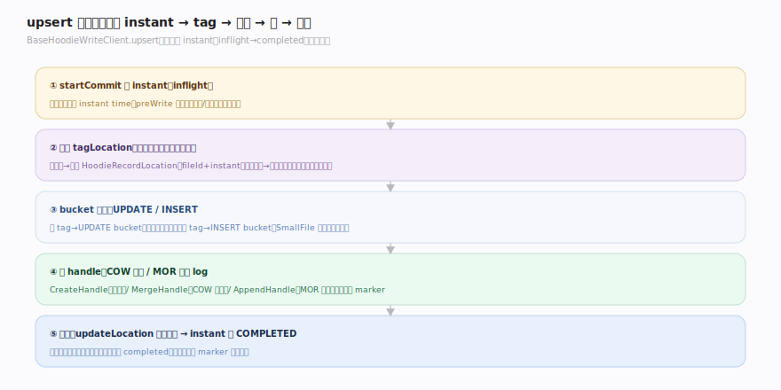
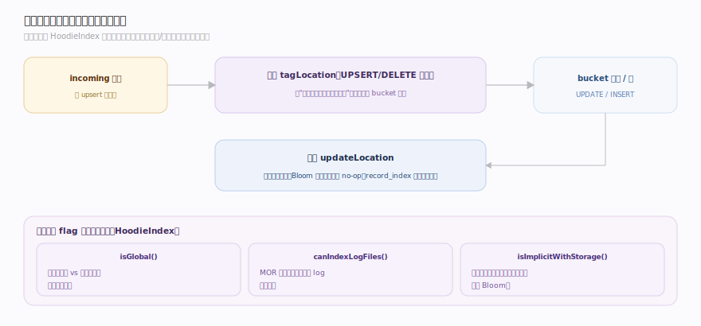
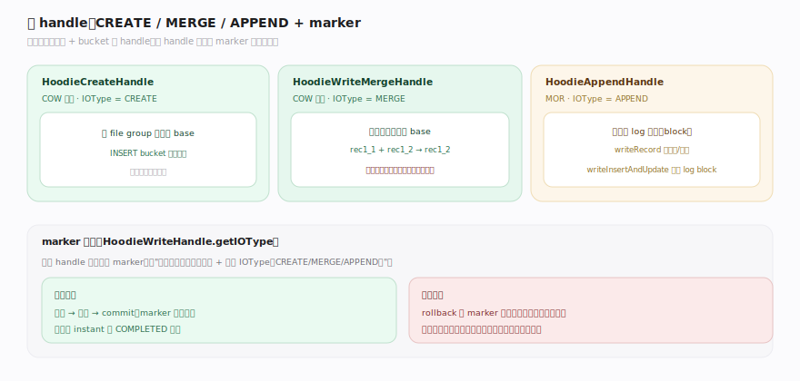

# Hudi 原理 · 支撑主线 · 写入路径与 upsert

> **定位**：属"写入能力域"——Hudi 招牌能力 upsert 的主流程。管一次写从开 instant 到落盘的生命周期:startCommit → 索引 tag → bucket 路由(UPDATE/INSERT)+ 小文件塞入 → 写 handle → 提交。索引的内部机制在【索引】、写哪种文件由【表类型 COW/MOR】定、开/提交 instant 靠【时间线】、多写并发在【并发控制与元数据】。源码基准 **Hudi(1dfbdcb)**(`hudi-client/`)。

Hudi 为 upsert 而生,写路径的主线是:"来一批记录,怎么高效地把它们更新到已有文件、或插入到新文件,并保证原子提交?"。答案是一条流水线——**开时间线 instant → 索引 tag 标位置 → 按 bucket 路由 → 选 handle 写 → 提交**。索引负责"标记该更新哪里"(细节见【索引】),本篇聚焦"整条写流水线怎么串起来、handle 怎么落盘、marker 怎么保证失败可清理"。

---

## 一、upsert 生命周期:开 instant → tag → 路由 → 写 → 提交

`BaseHoodieWriteClient.upsert(records, instantTime)`(`client/BaseHoodieWriteClient.java:468`)的生命周期:

1. **开 instant**:`startCommit` 在时间线分配一个 instant(`BaseHoodieWriteClient.java:1088`),转 inflight;`preWrite` 做预处理(`:582`)。
2. **索引 tag**:`HoodieIndex.tagLocation`(`index/HoodieIndex.java:80`)给每条记录标出已有位置——命中键带上其文件组位置,未命中标为待插入(索引类型/作用域细节见【索引】)。
3. **bucket 路由**:`BucketType { UPDATE, INSERT }`(`table/action/commit/BucketType.java:21`)——已 tag(键已存在)→ UPDATE bucket(路由到其现有文件组);未 tag → INSERT bucket。INSERT 时用 `SmallFile`/`Partitioner` 把新记录**塞进未满的小文件**(减少碎片)。
4. **写 handle**:按表类型 + bucket 选 handle 落盘(见第三节)。
5. **提交**:所有 handle 写完 → 校验 → 写 commit/deltacommit 元数据、`updateLocation` 回写索引 → 时间线 instant 转 **COMPLETED**(此刻新数据才对读可见)。

**为什么这条流水线**:tag 把"该更新哪"这个昂贵问题在写前一次性解决(不必写时全表 join);路由 + 小文件塞入让更新走对文件组、插入不产碎片;两阶段 instant(inflight→completed)保证原子——崩溃在中途则无 completed,可回滚。

---

## 二、索引接口在写路径中的位置（概览）

写路径通过 `HoodieIndex` 的两个接口与索引交互(索引类型/作用域/一致性哈希的完整机制见【索引】篇):

- **写前 `tagLocation`**(`HoodieIndex.java:80`):UPSERT/DELETE 必须先 tag——把 incoming 记录标上"是更新(带位置)还是插入"。这一步决定后续 bucket 路由。
- **写后 `updateLocation`**(`HoodieIndex.java:88`):把这批记录的最终位置回写索引(对 Bloom 这类"信息在数据文件里"的隐式索引可能是 no-op;对 record_index 这类持久索引则更新元数据表)。
- **索引能力 flag**:`isGlobal()`(跨分区唯一 vs 分区内)、`canIndexLogFiles()`(MOR 下可否把插入直送 log)等(`HoodieIndex.java:111`)驱动路由决策。

**归属**:本篇只讲"写路径怎么调索引";Bloom/Simple/Bucket/RECORD_LEVEL 各自怎么实现、怎么选,在【索引】篇。

---

## 三、写 handle:COW 重写 vs MOR 追加 + marker

路由后按表类型 + bucket 选 handle(IOType 见【表类型】):

- **HoodieCreateHandle**(COW 新建,IOType=CREATE):新 file group 写全新 base 文件。
- **HoodieWriteMergeHandle**(COW 更新,IOType=MERGE):逐行合并到已有 base 文件、产**新版本**(`io/HoodieWriteMergeHandle.java:71`)——工作例 rec1_1 + rec1_2 → 输出 rec1_2。这是 COW "写慢"的根源(重写整文件)。
- **HoodieAppendHandle**(MOR,IOType=APPEND):追加到 log 文件(`io/HoodieAppendHandle.java:68`);`writeRecord` 判断是更新还是删除,`writeInsertAndUpdate`(`:353`)把记录攒进 log block。
- **marker 文件**:每个 handle 写前创建 marker(记 `getIOType()`,`io/HoodieWriteHandle.java:204`)——标记"本次写产生了哪些文件 + 什么 IO 类型"。失败回滚时按 marker 精确删除部分写的孤儿文件(见【并发控制与元数据】)。

**为什么 handle 分三种**:CREATE(全新)/MERGE(COW 重写)/APPEND(MOR 追加)对应"新建、写慢读快、写快读慢"三种落盘方式;marker 让"写到一半崩溃"可被干净回滚,不留孤儿文件污染表。

---

## 拓展 · 写入路径关键结构一览

| 结构 | 定义 | 职责 |
|---|---|---|
| BaseHoodieWriteClient.upsert | `client/BaseHoodieWriteClient.java:468` | upsert 生命周期入口 |
| startCommit / preWrite | `client/BaseHoodieWriteClient.java:1088 / :582` | 开 instant / 预处理 |
| tagLocation / updateLocation | `index/HoodieIndex.java:80 / :88` | 写前标位置 / 写后回写 |
| BucketType | `table/action/commit/BucketType.java:21` | UPDATE / INSERT 路由 |
| HoodieWriteMergeHandle / AppendHandle / CreateHandle | `io/` | COW 重写 / MOR 追加 / 新建 |
| getIOType(marker) | `io/HoodieWriteHandle.java:204` | 写产物标记(失败回滚) |

## 调优要点（关键开关）

- **写操作选择**:有更新用 upsert;纯追加无更新用 insert(不查索引,快);初始大批导入用 bulk_insert(优化文件分布,不走小文件塞入)。
- **小文件塞入** `hoodie.parquet.small.file.limit`:让 INSERT 塞进未满小文件,减少碎片(与文件目标大小配合)。
- **写并行度/批大小**:Spark write 的分区数、批大小影响文件大小分布与写吞吐。
- **索引选型**:见【索引】——它是 upsert 效率的第一杠杆(tag 快不快看索引)。
- **inline 服务**:小表可 inline compaction/clustering 简化运维;大表 async 独立作业避免阻塞写。

## 常见误区与工程要点

- **误区:数据写完就可见。** 只有时间线 instant 转 COMPLETED 后新数据才可见;inflight 中途崩溃可回滚,读不到。
- **误区:insert 和 upsert 一样。** insert 不查索引(允许重复键,快);upsert 先 tag 去重/更新(招牌但略慢)。
- **误区:COW 更新只改变化的行。** COW 用 MergeHandle 重写**整个文件**产新版本,不是原地改行——这是写慢的原因。
- **误区:bulk_insert 走小文件塞入。** bulk_insert 优化初始导入的文件分布,不走 upsert 的小文件合并逻辑。
- **误区:marker 是数据。** marker 只标本次写产物 + IOType,用于失败回滚清理孤儿。
- **归属提醒**:索引类型/作用域/一致性哈希在【索引】;写哪种文件、COW/MOR 取舍在【表类型】;开/提交 instant 在【时间线】;文件组/文件片物理组织在【文件布局】;多写冲突检测在【并发控制与元数据】。

## 一句话总纲

**Hudi 的招牌 upsert 是一条原子流水线:BaseHoodieWriteClient.upsert 先 startCommit 开时间线 instant(inflight)→ HoodieIndex.tagLocation 给每条记录标出已有位置(命中→更新、未命中→插入)→ 按 BucketType 路由(UPDATE 到现有文件组 / INSERT 到小文件,SmallFile 塞入减碎片)→ 按表类型选 handle 落盘(COW CreateHandle 新建 / MergeHandle 逐行重写整文件产新版本 / MOR AppendHandle 追加 log block)→ 每 handle 写前建 marker 标产物供失败回滚 → 全部写完后 updateLocation 回写索引、instant 转 COMPLETED 才对读可见;索引的内部实现是这条流水线的效率关键,独立成【索引】篇。**
