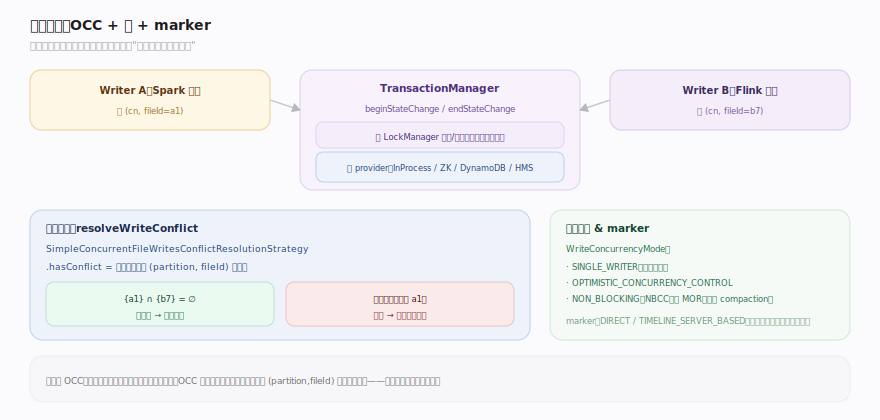
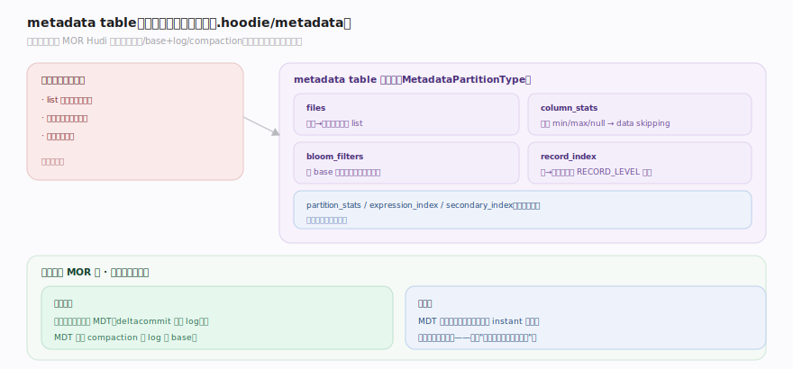
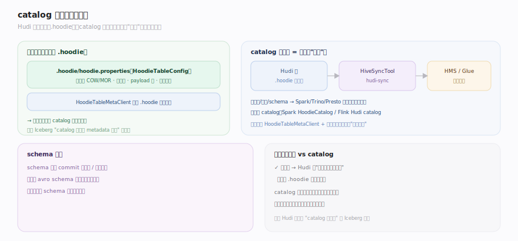

# Hudi 原理 · 支撑主线 · 并发控制与元数据

> **定位**：属"保障能力域"——多写正确性 + 表自描述与加速。管两件事:① **并发控制**(多引擎并发写靠 OCC/NBCC + 可插拔锁 provider + marker + (partition,fileId) 交集冲突检测);② **元数据**(内置 metadata table 加速文件列举/统计/索引,catalog 同步让引擎发现表)。依赖【时间线】的 instant 定序冲突、维护【文件布局】的文件、承载【索引】的 record_index。源码基准 **Hudi(1dfbdcb)**(`hudi-client/`、`hudi-common/`)。

Hudi 表常被多个引擎/作业同时写(Spark 批 + Flink 流 + compaction 后台)。怎么保证不互相踩?靠**乐观并发控制**——假设冲突少,提交前才检测"是否改了同一文件组"。同时,大表的元数据操作(列文件、取统计、查键位置)本身很贵,Hudi 用一张**内置元数据表**把这些加速起来,并通过 **catalog 同步**让外部引擎发现表结构。理解"OCC + 锁 + marker""metadata table""catalog"三点,就懂了 Hudi 的多写保障与元数据加速。

---

## 一、并发控制:OCC + 锁 + marker

多写并发靠**乐观并发控制(OCC)**:

- **并发模式**(`WriteConcurrencyMode.java:30`):`SINGLE_WRITER` / `OPTIMISTIC_CONCURRENCY_CONTROL` / `NON_BLOCKING_CONCURRENCY_CONTROL`(NBCC)。OCC 与 NBCC 支持多写;NBCC(仅 MOR)让并发写都能提交、冲突延到 compaction 解决。
- **事务管理**:`TransactionManager`(`client/transaction/TransactionManager.java:33`)"允许客户端开始/结束事务,保证原子",`beginStateChange`/`endStateChange` 在需要锁时经 `LockManager` 获取/释放。
- **冲突检测**:提交前 `resolveWriteConflict(table, metadata, pendingInstants)`(`BaseHoodieWriteClient.java:435`);`SimpleConcurrentFileWritesConflictResolutionStrategy.hasConflict` 计算两次写**改动的 (partition, fileId) 对的交集**,非空即冲突(`:133`)——只有两个并发写改了同一文件组才失败。
- **锁 provider**(可插拔,OCC 提交临界区需要):`InProcessLockProvider`、`ZookeeperBasedLockProvider`、AWS `DynamoDBBasedLockProvider`、`HiveMetastoreBasedLockProvider` 等。
- **marker 文件**(`MarkerType { DIRECT, TIMELINE_SERVER_BASED }`,`common/table/marker/MarkerType.java:30`):每次写创建 marker 标记它产生的文件 + IOType;失败回滚时按 marker 删除部分写的孤儿文件。

**为什么 OCC 而非悲观锁**:数据湖多引擎写,悲观锁跨引擎难协调、开销大;OCC 假设冲突罕见(不同作业通常写不同分区/文件组),只在提交时用 (partition,fileId) 交集做一次轻量检测——真改同一文件组才失败重试。

---

## 二、metadata table:内置的元数据加速表

大表在对象存储上的"列文件""取列统计""查键位置"操作很贵(list 慢、要读文件页脚)。Hudi 把这些做成一张**内置的 MOR 元数据表**(`.hoodie/metadata/`),自己就是一张 Hudi 表(有自己的时间线、base+log、compaction):

- **分多个分区(MetadataPartitionType)**,各加速一类操作:
  - `files`:分区 → 文件列表,免 list 对象存储。
  - `column_stats`:各文件各列的 min/max/null 等统计,用于查询谓词剪枝(data skipping)。
  - `bloom_filters`:各 base 文件的布隆过滤器,供 Bloom 索引查找免读数据文件页脚。
  - `record_index`:记录键 → 位置映射,支撑 RECORD_LEVEL 索引(见【索引】)。
  - `partition_stats` / `expression_index` / `secondary_index` 等按需启用。
- **它本身是 MOR 表**:写主表时同步更新 metadata table(deltacommit 追加 log),它也需要 compaction 合 log 进 base——所以 metadata table 的更新与主表提交在同一事务里保持一致。
- **一致性**:metadata table 与主表时间线对齐;主表某 instant 完成,对应元数据也可见——避免"文件已写但元数据没跟上"的读错。

**为什么内置而非外部**:Iceberg 靠 manifest 树 + catalog 记文件;Hudi 选择把这套加速信息做成一张自管的 Hudi 表,复用时间线/MOR/compaction 机制,更新随主表事务走。

---

## 三、catalog 同步与表自描述

Hudi 表是**自描述**的——表根 `.hoodie/hoodie.properties`(`HoodieTableConfig`)存表类型(COW/MOR)、表版本、payload 类、分区字段等;`HoodieTableMetaClient`(`table/HoodieTableMetaClient.java:131`)加载 `.hoodie` 目录即可完整还原表(时间线 + 配置)。所以 Hudi **不强依赖外部 catalog** 来定位表状态(与 Iceberg 的 catalog 持有当前 metadata 指针不同)。

- **catalog 的角色 = 让引擎"发现"表**:通过 **HiveSyncTool**(`hudi-sync`)把表/分区/schema 同步到 Hive Metastore / AWS Glue,让 Spark/Trino/Presto 能按库表名查到这张 Hudi 表并读它。同步的是"目录信息",表的真相仍在 `.hoodie` 时间线。
- **引擎侧 catalog**:Spark 的 `HoodieCatalog`、Flink 的 Hudi catalog——把 Hudi 表接入引擎的 catalog 体系(建表/改表/查表),底层仍是 HoodieTableMetaClient + 时间线。
- **schema 演进**:schema 存于 commit 元数据 / 表配置,写入按 avro schema 演进(加列等);读端按最新 schema 读历史文件。

**取舍**:自描述让 Hudi 表"搬到哪都能独立读"(不丢 catalog 就丢表);catalog 同步只是为外部引擎提供发现入口,是可选的便利层,而非正确性的一部分。

---

## 拓展 · 并发控制与元数据关键结构一览

| 结构 | 定义 | 职责 |
|---|---|---|
| WriteConcurrencyMode | `common/model/WriteConcurrencyMode.java:30` | SINGLE/OCC/NBCC |
| TransactionManager | `client/transaction/TransactionManager.java:33` | 事务原子 + 锁 |
| SimpleConcurrentFileWritesConflictResolutionStrategy | `client/transaction/.../...java:133` | (partition,fileId) 交集冲突检测 |
| MarkerType | `common/table/marker/MarkerType.java:30` | DIRECT / TIMELINE_SERVER_BASED |
| MetadataPartitionType | `common/` | files/col_stats/bloom/record_index |
| HoodieTableMetaClient | `common/table/HoodieTableMetaClient.java:131` | 加载 .hoodie(时间线+配置) |
| HoodieTableConfig | `common/table/` | hoodie.properties 表自描述 |

## 调优要点（关键开关）

- **并发模式**:单写用 SINGLE_WRITER(无锁开销);多引擎写用 OCC + 配锁 provider(ZK/DynamoDB/HMS);MOR 高并发流写可试 NBCC(冲突延到 compaction)。
- **锁 provider 选型**:同进程 InProcess;跨进程/引擎用 Zookeeper / DynamoDB;已有 HMS 可用 HiveMetastore 锁。
- **metadata table**:大表务必开启(加速 list);启用 column_stats 做 data skipping、record_index 支撑记录级点更新。
- **marker 类型**:HDFS/流式用 DIRECT;超大规模用 TIMELINE_SERVER_BASED(减少 marker 小文件)。
- **catalog 同步**:需被 Trino/Presto/Hive 发现则配 HiveSyncTool 同步到 HMS/Glue。

## 常见误区与工程要点

- **误区:OCC 下并发写总冲突。** 只有改**同一文件组**((partition,fileId) 交集非空)才冲突;写不同分区/文件组可并发提交。
- **误区:OCC 不需要锁。** OCC 无长事务锁,但提交的临界区(读时间线→检测冲突→写完成 instant)仍需短锁(LockManager),故要配锁 provider。
- **误区:metadata table 是可有可无的缓存。** 它与主表事务一致、承载 record_index 等索引;禁用会退回慢 list 且失去部分索引能力。
- **误区:Hudi 表必须挂在 catalog 才能读。** Hudi 表自描述(.hoodie/hoodie.properties + 时间线),不丢目录就不丢表;catalog 同步只是外部引擎的发现入口。
- **误区:marker 是表元数据。** marker 只标"本次写产生了哪些文件",用于失败回滚清理孤儿文件。
- **归属提醒**:冲突检测依据的 instant 定序在【时间线】;被并发写/清理的文件在【文件布局】;record_index 的语义在【索引】;compaction 维护(含 metadata table 自身的 compaction)在【表服务】。

## 一句话总纲

**Hudi 的多写正确性靠乐观并发控制:WriteConcurrencyMode(SINGLE/OCC/NBCC),TransactionManager + 可插拔锁 provider(ZK/DynamoDB/HMS)守提交临界区,提交前按两次写改动的 (partition,fileId) 交集检测冲突(只有改同一文件组才失败),marker 文件标写产物用于失败回滚清理孤儿;元数据侧,Hudi 把慢 list/统计/索引做成一张内置的 MOR metadata table(.hoodie/metadata,分 files/column_stats/bloom_filters/record_index 等分区,随主表事务一致更新),而表本身靠 .hoodie/hoodie.properties + 时间线自描述(HoodieTableMetaClient 加载即还原),catalog(HiveSyncTool→HMS/Glue、引擎 HoodieCatalog)只是让外部引擎发现表的可选入口,非正确性一部分——这是 Hudi 区别于"catalog 持指针"的 Iceberg 之处。**
