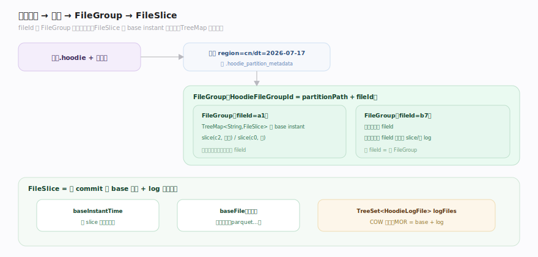
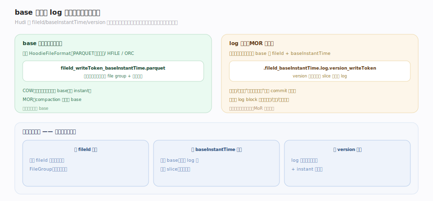
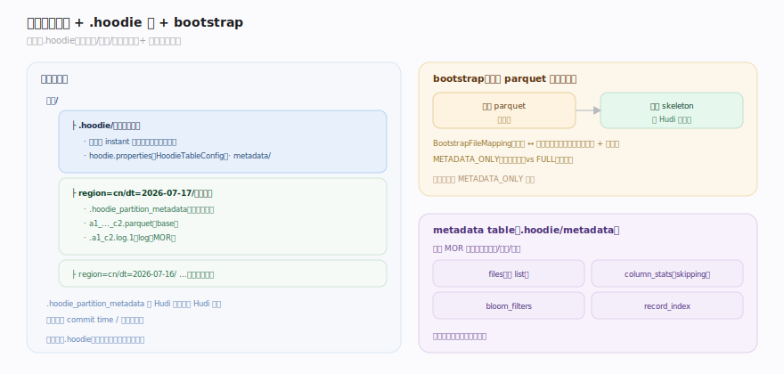

# Hudi 原理 · 支撑主线 · 文件布局

> **定位**：属"存储能力域"——Hudi 表在对象存储上的物理组织。管 **FileGroup → FileSlice(base + log)** 的层次、base 文件格式(parquet/hfile/orc)与 log 文件结构/命名、分区目录布局与 bootstrap。它是索引路由的目标(file group)、表类型取舍的载体(slice 有无 log)、时间线定序的对象(slice 按 base instant)。被【索引】路由到、【写入路径】写入、【MoR 读合并】读取。源码基准 **Hudi(1dfbdcb)**(`hudi-common/`)。

Hudi 的数据不是"一堆文件",而是有严格层次的物理组织:表 → 分区 → **FileGroup**(upsert 的路由单元)→ **FileSlice**(某 commit 的版本 = 一个 base 文件 + 若干 log 文件)。索引把记录键映射到 file group,写入产生新的 file slice,读取按 slice 合并 base+log。理解这套"file group / file slice / base+log"布局,才能理解 Hudi 的更新、版本、compaction 到底在动哪些文件。

---

## 一、层次:FileGroup → FileSlice

- **FileGroup**(`model/HoodieFileGroup.java:42`)= "一组 base 文件 + 一组 log 文件,构成所有操作的单元",内部持 `TreeMap<String, FileSlice>`(按 base instant time 排序,新版本在前)。每个 file group 由 `HoodieFileGroupId`(`partitionPath` + `fileId`)唯一标识——**fileId 是 file group 的身份**,记录一旦被索引绑定到某 fileId,后续更新都进这个 file group。
- **FileSlice**(`model/FileSlice.java:37`)= "某 commit 时写的 base 文件 + 从该 commit 起改动的 log 文件列表",字段:`baseInstantTime`、一个 `baseFile`(可空)、`TreeSet<HoodieLogFile> logFiles`。**COW slice 只有 base(log 恒空);MOR slice = base + log**。
- **一分区多 file group,每 file group 每 commit 一个 slice**:`addBaseFile` 按 base 文件的 commit time 建/更新 slice,`addLogFile` 把 log 附到对应 base instant 的 slice(`HoodieFileGroup.java` 附近)。老的 slice 是历史版本(供时间旅行/回滚),cleaning 会回收过旧的。

**为什么这样分层**:file group(稳定 fileId)让"同一批键的更新总落同一组文件"成为可能(索引路由的落点);file slice(按 commit)让每次写产生一个可回滚、可对比的版本;base+log 让 COW/MOR 用同一套布局表达两种取舍。

---

## 二、base 文件与 log 文件

- **base 文件**:列式基线,格式由 `HoodieFileFormat`(PARQUET 默认 / HFILE / ORC)决定。文件名编码 `fileId_writeToken_baseInstantTime.parquet`——从名字就能读出它属于哪个 file group(fileId)、哪个版本(baseInstantTime)。COW 每次更新重写产新 base(新 instant);MOR compaction 才产新 base。
- **log 文件**(`model/HoodieLogFile.java`):MOR 的增量,命名 `.fileId_baseInstantTime.log.version_writeToken`——绑定到它所修饰的 base 文件的 fileId + baseInstantTime,`version` 递增(一个 slice 可有多个 log)。log 文件扩展名/排序刻意让"删除排在数据之后""保证 commit 时间序"(`HoodieLogFile.java:58` 附近的比较逻辑)。
- **log block**:log 文件内部由 block 组成(数据块/删除块/命令块),是读时合并的最小单位——详见【MoR 读合并】。这里只强调:log 是"追加写"的,一个 slice 的多个 log 文件 + 多个 block 共同构成该 base 之上的增量。

**命名即元数据**:Hudi 大量信息编码在文件名里(fileId、baseInstantTime、version、writeToken),读端不必打开文件就能按名字归组、定版本、排序——这是"位置即语义"在文件层的体现。

---

## 三、分区布局与 bootstrap

- **分区目录**:表根下按分区键分目录(如 `region=cn/dt=2026-07-17/`),每个分区目录里放该分区所有 file group 的 base+log 文件。每个分区含一个 `.hoodie_partition_metadata` 标记文件(记该分区的 commit time / 分区深度),让 Hudi 识别这是一个 Hudi 分区。
- **.hoodie 元数据根**:表根下的 `.hoodie/` 目录存时间线(见【时间线】)与表配置(`hoodie.properties`),是分区数据之外的"表的大脑"。
- **bootstrap(存量接入)**:把已有的非 Hudi parquet 表低成本变成 Hudi 表——不重写原始数据文件,只生成**骨架(skeleton)文件**存 Hudi 元字段(_hoodie_record_key 等)+ 一份 base 文件到原始文件的映射(BootstrapFileMapping)。读时把骨架的 Hudi 元字段与原始文件的数据列拼起来。METADATA_ONLY(只建骨架)vs FULL(重写)两种模式。
- **metadata table 的布局**:大表的文件列举很贵(list 对象存储慢),Hudi 内置一张 MOR 的**元数据表**(`.hoodie/metadata/`)把 files/col_stats/bloom_filters/record_index 等以分区形式存起来——详见【并发控制与元数据】。

**为什么关注布局**:小文件问题(碎片多→查询慢)、分区裂化(分区太细→file group 太多)、bootstrap(存量迁移)都是布局层的工程问题;compaction/clustering(【表服务】)本质就是在重排这套布局。

---

## 拓展 · 文件布局关键结构一览

| 结构 | 定义 | 职责 |
|---|---|---|
| HoodieFileGroup | `model/HoodieFileGroup.java:42` | upsert 路由单元(多 slice) |
| HoodieFileGroupId | `model/` | partitionPath + fileId(身份) |
| FileSlice | `model/FileSlice.java:37` | base + log(某 commit 版本) |
| HoodieLogFile | `model/HoodieLogFile.java` | log 文件命名/排序 |
| HoodieFileFormat | `common/model/` | PARQUET / HFILE / ORC |
| .hoodie_partition_metadata | `common/model/HoodiePartitionMetadata` | 分区标记 |
| BootstrapFileMapping | `common/` | 骨架↔原始文件映射 |

## 调优要点（关键开关）

- **文件大小** `hoodie.parquet.max.file.size` + `hoodie.parquet.small.file.limit`:base 目标大小与"小文件"阈值——太小碎片多、查询慢,太大 COW 重写贵。
- **分区粒度**:分区太细→每分区 file group 少但分区数爆炸(list 贵);太粗→单分区文件多。配合 metadata table 缓解 list。
- **log 文件大小/滚动**:MOR log block 与滚动大小影响读合并效率与 log 数量。
- **bootstrap 模式**:存量表迁移用 METADATA_ONLY(只建骨架,不重写)最省;需彻底转格式用 FULL。
- **metadata table**:开启内置元数据表加速文件列举,大表尤其显著。

## 常见误区与工程要点

- **误区:FileGroup 就是一个文件。** FileGroup 是逻辑单元,含多个 FileSlice(按 commit 版本),每 slice = base + log。
- **误区:fileId 会变。** fileId 是 file group 的稳定身份,更新只在同 fileId 内产新 slice/加 log;换 fileId 意味着新 file group。
- **误区:文件名不重要。** Hudi 把 fileId/baseInstantTime/version 编码进文件名,读端靠名字归组定版排序,不必打开文件——命名即元数据。
- **误区:bootstrap 会重写数据。** METADATA_ONLY 只建骨架 + 映射,不动原始 parquet;只有 FULL 才重写。
- **归属提醒**:slice 有无 log 的取舍在【表类型 COW/MOR】;file group 是【索引】路由的落点;slice 按 base instant 定序、可见性在【时间线】;重排布局(compaction/clustering/cleaning)在【表服务】;metadata table 详情在【并发控制与元数据】。

## 一句话总纲

**Hudi 表在存储上有严格层次:表 → 分区(带 .hoodie_partition_metadata,表根另有 .hoodie 时间线/配置)→ FileGroup(由 partitionPath+fileId 唯一标识,是 upsert 的稳定路由单元,内部 TreeMap 按 base instant 存多个版本)→ FileSlice(某 commit 的 base 文件 + log 文件列表,COW 只有 base、MOR 有 base+log);base 文件(parquet/hfile/orc)与 log 文件把 fileId/baseInstantTime/version 编码进文件名(命名即元数据,读端不打开文件即可归组定版);bootstrap 用骨架文件 + 映射低成本接入存量 parquet,大表靠内置 metadata table 加速文件列举——这套布局是索引路由、表类型取舍、时间线定序、表服务重排的共同物理载体。**
