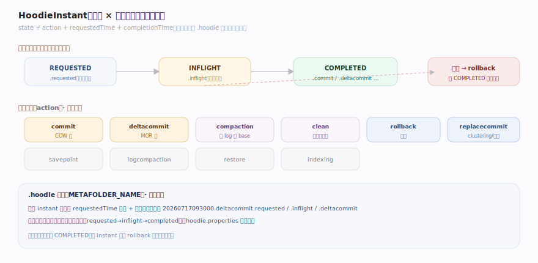
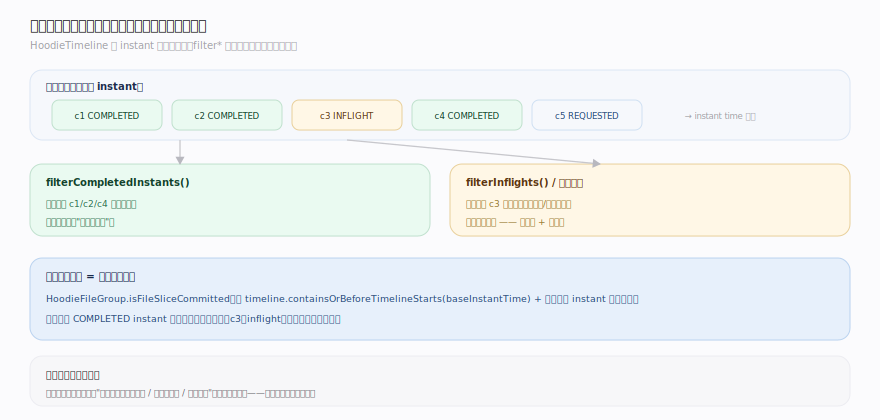
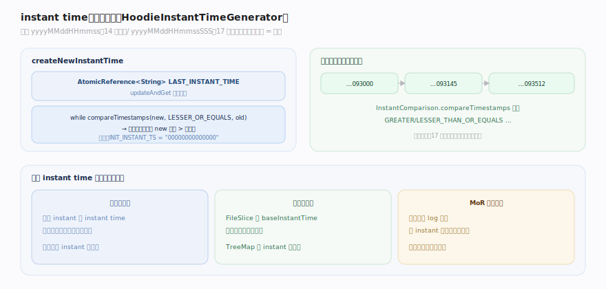

# Hudi 原理 · 支撑主线 · 时间线

> **定位**：属"元数据能力域"——Hudi 的核心与真相。管表上所有动作的有序记录:HoodieTimeline / HoodieInstant(动作×状态)、instant time 单调定序、.hoodie 元数据目录。决定文件片可见性、增量读起点、回滚点。被所有主线依赖。源码基准 **Hudi(1dfbdcb)**(`hudi-common/`)。

Hudi 的立身之本:**表 = 一条动作时间线**。每次写、compaction、cleaning、rollback 都是时间线上的一个 **HoodieInstant**(有动作类型 + 状态 + 时间戳)。文件片是否对读可见、增量查从哪读起、崩溃回滚到哪,全看时间线。时间线不可变——操作产生新的时间线视图。理解时间线,就理解了 Hudi 的一致性与可见性模型。

---

## 一、HoodieInstant:动作 × 状态

**HoodieInstant**(`hudi-common/.../timeline/HoodieInstant.java:31`)= 表上的一个动作:`state` + `action` + `requestedTime` + `completionTime`,注释"所有动作以 inflight instant 开始,完成后创建 completed instant"。

- **状态**(`HoodieInstant.java:110`):`REQUESTED`(已请求)→ `INFLIGHT`(执行中)→ `COMPLETED`(完成),另有 `NIL`。状态编码为文件扩展名(`.requested`/`.inflight`/`.commit` 等)。
- **动作**(`HoodieTimeline.java:59`):`commit`(COW 写)、`deltacommit`(MOR 写)、`compaction`、`clean`、`rollback`、`savepoint`、`replacecommit`、`clustering`、`logcompaction`、`restore`、`indexing`。
- **.hoodie 目录**(`METAFOLDER_NAME=".hoodie"`,`HoodieTableMetaClient.java:131`)存所有 instant 文件——表的元数据根。

一个动作从 REQUESTED 文件开始,转 INFLIGHT,完成写 COMPLETED——三个文件标记生命周期,崩溃时未完成(无 COMPLETED)的可回滚。

---

## 二、时间线视图:不可变、可过滤

**HoodieTimeline**(`HoodieTimeline.java:46`)是"元数据 instant 的视图……不可变,操作创建新实例(在 instant 上过滤)"。

- **不可变 + 过滤**:时间线是 instant 序列的视图,`filterCompletedInstants`/`filterInflights` 等产生新的过滤视图——不改原时间线。
- **文件片可见性靠时间线**:`HoodieFileGroup.isFileSliceCommitted` 用 `timeline.containsOrBeforeTimelineStarts(baseInstantTime)` + 最后完成 instant 水位判定某文件片是否可见(`HoodieFileGroup.java:154`)——只有时间线上已 COMPLETED 的 instant 对应的文件片才可读。
- **增量读**:时间线是增量查的基础——读两个 instant 之间提交的变更。

**为什么时间线是真相**:文件在对象存储上,但"哪些文件属于已提交的哪个版本、增量从哪读、回滚到哪"这些语义,只有时间线知道——它是表状态的唯一权威。

---

## 三、instant time:单调定序

**instant time** 由 `HoodieInstantTimeGenerator`(`HoodieInstantTimeGenerator.java:43`)生成:格式 `yyyyMMddHHmmss`(14 位秒)或 `yyyyMMddHHmmssSSS`(17 位毫秒)。

- **单调保证**:`AtomicReference<String> LAST_INSTANT_TIME`,`createNewInstantTime` 用 `updateAndGet` 循环 `while (compareTimestamps(newCommitTime, LESSER_THAN_OR_EQUALS, oldVal))`——保证每个新 instant 严格大于上一个(`:75`)。
- **全局排序**:所有 instant 靠 `InstantComparison.compareTimestamps`(GREATER_THAN_OR_EQUALS/LESSER_THAN…)比较——时间线严格有序。
- **哨兵**:`INIT_INSTANT_TS="00000000000000"`、metadata/full bootstrap 特殊值(`HoodieTimeline.java:123`)。

单调递增的 instant time 让时间线成为全序——文件片按 base instant 归位、MoR 合并按 instant 序、增量读按 instant 区间,都靠它。

---

## 拓展 · 时间线关键结构一览

| 结构 | 定义 | 职责 |
|---|---|---|
| HoodieInstant | `timeline/HoodieInstant.java:31` | 动作(action)× 状态(state)+ 时间 |
| HoodieTimeline | `timeline/HoodieTimeline.java:46` | 不可变 instant 视图 + 动作常量 |
| HoodieInstantTimeGenerator | `timeline/HoodieInstantTimeGenerator.java:43` | 单调 instant time 生成 |
| HoodieTableMetaClient | `table/HoodieTableMetaClient.java:131` | .hoodie 元数据目录 |
| isFileSliceCommitted | `model/HoodieFileGroup.java:154` | 文件片可见性(靠时间线) |

## 调优要点（关键开关）

- **时间线归档**:时间线过长(instant 多)拖慢加载;归档旧 instant(archived timeline)保活跃时间线精简。
- **instant time 格式**:毫秒精度(17 位)避免高频写的时间戳冲突。
- **元数据表(metadata table)**:大表用内置元数据表加速文件列举,减少 list。
- **回滚/清理**:失败的 inflight instant 及时 rollback,避免脏文件积累。

## 常见误区与工程要点

- **误区:目录里的文件就是表状态。** 不。时间线才是真相——只有时间线上 COMPLETED 的 instant 对应的文件片可见;未完成的 inflight 文件不可读、可回滚。
- **误区:instant 是版本号。** 它是"带类型和状态的动作记录";单调 instant time 提供全序,但含丰富语义(动作/状态)。
- **误区:时间线可变。** 不可变——过滤操作产生新视图,原时间线不变。
- **误区:所有动作都是 commit。** 有 commit(COW)/deltacommit(MOR)/compaction/clean/rollback/clustering… 多种动作,各有语义。
- **归属提醒**:文件片(FileGroup/FileSlice)在【表类型 COW/MOR】;写动作开 instant 在【写入与索引】;compaction/clean 动作在【表服务】;并发提交的 instant 冲突检测在【并发控制】。

## 一句话总纲

**Hudi 的表就是 .hoodie 目录里的一条动作时间线:每个 HoodieInstant 是一个动作(commit/deltacommit/compaction/clean/rollback…)× 状态(REQUESTED→INFLIGHT→COMPLETED,编码为文件扩展名),由单调递增的 instant time(AtomicReference 保证严格递增)全序排列;时间线不可变(过滤产生新视图),是表状态的唯一真相——文件片可见性(只有 COMPLETED 对应的可读)、增量读起点、回滚点全看它,而非目录里的文件。**
