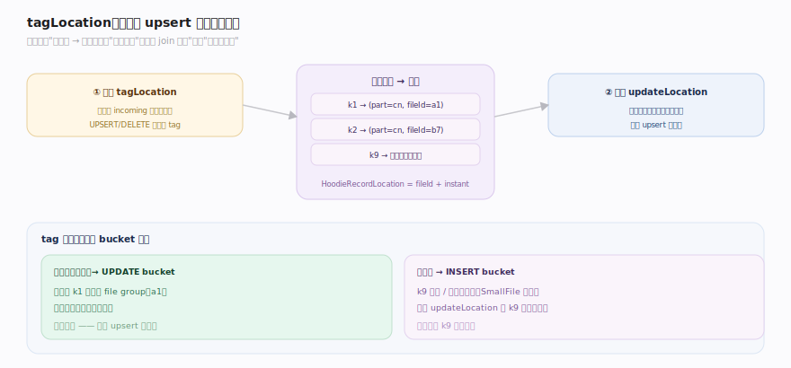
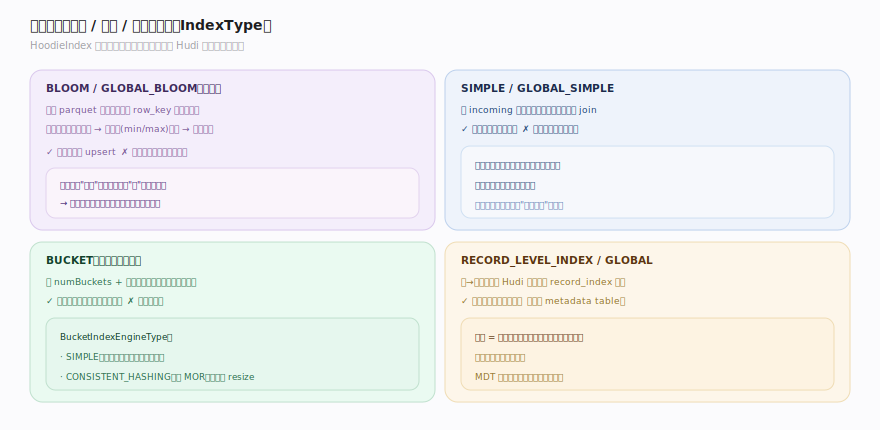
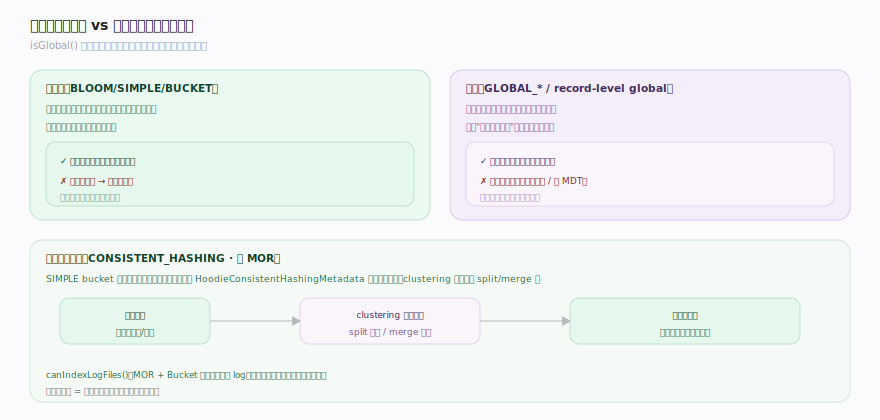

# Hudi 原理 · 支撑主线 · 索引

> **定位**：属"写入能力域"的核心机制——Hudi 相对 Iceberg(append 导向)最本质的差异。管**记录键 → 文件组位置**的映射:`HoodieIndex.tagLocation` 在 upsert 前给每条记录标出它该更新的文件组,让更新不必全表扫。索引类型(Bloom/Simple/Bucket/RECORD_LEVEL)+ 作用域(分区内/全局)决定 upsert 效率。被【写入路径与 upsert】调用做 tag/路由,依赖【文件布局】的 file group、【元数据】的 metadata table。源码基准 **Hudi(1dfbdcb)**(`hudi-client/`、`hudi-common/`)。

Hudi 为 upsert 而生,写路径要回答一个问题:"来一批记录,每条该更新哪个已有文件、还是新插入?"。**索引**就是这个问题的答案——它维护"记录键 → 所在文件组"的映射。有了索引,更新一条已存在的键就能直接路由到它所在的 file group,而不是扫全表找。索引选型是 Hudi 调优的第一杠杆:选错索引,upsert 要么慢(每次都 join 全量键)、要么错(重复键)。理解"tag 生命周期 → 四类索引 → 作用域"就懂了 Hudi 的索引。

---

## 一、tagLocation:索引在 upsert 里的生命周期

`HoodieIndex`(`index/HoodieIndex.java:40`)是"决定 uuid(记录键)映射到哪的索引基类",在写路径里承担两次交互:

- **写前 tag**:`tagLocation(records, context, table)`(`HoodieIndex.java:80`)——给每条 incoming 记录查已有位置,命中(键已存在)则给记录带上 `HoodieRecordLocation`(所在 fileId + instant),未命中则标记为待插入。`UPSERT`/`DELETE` 操作**必须**先 tag(`isImplicitWithStorage` 等能力 flag 决定行为,`HoodieIndex.java:111`)。
- **写后 update**:`updateLocation(writeStatuses, context, table)`(`HoodieIndex.java:88`)——写完后把这批记录的最终位置回写索引,让下次 upsert 能查到。对存储隐式索引(如 Bloom,信息本就在数据文件里)这步可能是 no-op。

tag 的结果直接喂给 bucket 路由:带位置的 → `UPDATE` bucket(路由到现有文件组),没位置的 → `INSERT` bucket(去小/新文件)。**索引把"要不要 join 全表"的问题变成"查一次索引"的问题**,这是高效 upsert 的地基。

---

## 二、四类索引:精度 / 速度 / 规模的取舍

`IndexType`(`HoodieIndex.java:161`)枚举 Hudi 的索引实现,各有取舍:

- **BLOOM / GLOBAL_BLOOM**:`HoodieBloomIndex`——"基于布隆过滤器,每个 parquet 文件在其元数据里含 row_key 的布隆过滤器"(`bloom/HoodieBloomIndex.java:59`)。查键时先用布隆快速排除大部分文件,再用键范围(min/max record key)剪枝,最后精确校验候选。默认索引,适合随机 upsert;有假阳性,需回读校验。
- **SIMPLE / GLOBAL_SIMPLE**:`HoodieSimpleIndex`——把 incoming 记录键与从存储上提取的键做精简 join。逻辑简单、无布隆的假阳性问题,但要读取存储键,大表开销大。
- **BUCKET**:`HoodieBucketIndex`(`bucket/HoodieBucketIndex.java:53`)——按 `numBuckets` + 索引键字段哈希直接定位文件组,**免查找**(哈希即位置)。`BucketIndexEngineType { SIMPLE, CONSISTENT_HASHING }`——SIMPLE 桶数固定,CONSISTENT_HASHING(仅 MOR)可动态 resize。
- **RECORD_LEVEL_INDEX / GLOBAL**:把"记录键 → 位置"映射持久化到 Hudi **元数据表**的 record_index 分区,"支持分片达到极高规模"(`HoodieIndex.java:203`)。查找是点查元数据表,不必读数据文件的布隆。

**取舍轴**:Bloom(通用、有假阳性)vs Simple(精确、贵)vs Bucket(免查、需预设桶数)vs RecordLevel(超大规模、依赖 MDT)。

---

## 三、作用域:分区内 vs 全局,与一致性哈希

索引还有一个正交维度——**作用域**,由 `isGlobal`(`HoodieIndex.java:111`)决定:

- **分区内(BLOOM/SIMPLE/BUCKET)**:键在其所属分区内唯一;查找只在记录的目标分区里进行,快。要求同一键始终落同一分区(否则会产生重复)。
- **全局(GLOBAL_BLOOM/GLOBAL_SIMPLE/RECORD_LEVEL global)**:键在**全表**唯一,跨分区查找并保证唯一;支持"键的分区可变"(记录换分区),但查找开销更大(要扫所有分区或依赖 MDT)。
- **一致性哈希桶(CONSISTENT_HASHING)**:Bucket 索引的进阶——用 `HoodieConsistentHashingMetadata` 记录桶的哈希环划分,clustering 时可**动态 split/merge 桶**(SIMPLE bucket 桶数一旦定死难改),解决"数据增长后桶不均"的问题;仅 MOR 支持。
- **canIndexLogFiles**(`HoodieIndex.java`):某些索引(如 Bucket)在 MOR 下可把插入**直接送 log**(不经小文件塞入),提写吞吐。

**为什么作用域重要**:全局唯一保证跨分区去重(如维度表主键),但代价是查找范围;分区内索引最快但要求分区键稳定。选错作用域 = 要么重复键、要么白付全局开销。

---

## 拓展 · 索引关键结构一览

| 结构 | 定义 | 职责 |
|---|---|---|
| HoodieIndex | `index/HoodieIndex.java:40` | 索引基类:记录键→位置 |
| tagLocation | `index/HoodieIndex.java:80` | 写前标记记录已有位置 |
| updateLocation | `index/HoodieIndex.java:88` | 写后回写最终位置 |
| IndexType | `index/HoodieIndex.java:161` | Bloom/Simple/Bucket/RecordLevel |
| HoodieBloomIndex | `index/bloom/HoodieBloomIndex.java:59` | 布隆过滤器 + 键范围剪枝 |
| HoodieBucketIndex | `index/bucket/HoodieBucketIndex.java:53` | 哈希桶(免查),含一致性哈希 |
| isGlobal / canIndexLogFiles | `index/HoodieIndex.java:111` | 作用域 / 可否直送 log |

## 调优要点（关键开关）

- **索引选型(第一杠杆)**:随机 upsert 用 Bloom(默认);键天然分桶/已知基数用 Bucket(免查最快);超大规模点更新用 RECORD_LEVEL(依赖 metadata table);需跨分区唯一用 GLOBAL_*。
- **Bloom 键范围剪枝**:让每个文件记录 min/max record key,配合布隆先剪掉键不在范围的文件,减少布隆检查与回读。
- **Bucket 桶数**:SIMPLE bucket 桶数难改,估不准会不均;数据会大幅增长选 CONSISTENT_HASHING(MOR)让 clustering 动态调桶。
- **全局索引开销**:GLOBAL_* 与 record-level global 保证跨分区唯一但查找贵;分区键稳定就用分区内索引。
- **canIndexLogFiles**:MOR + Bucket 可把插入直送 log,免小文件塞入路径,提写吞吐。

## 常见误区与工程要点

- **误区:upsert 靠全表扫找记录。** 不。索引把记录键映射到文件组,直接路由——这是 Hudi 高效 upsert(相对 Iceberg append 导向)的核心。
- **误区:Bloom 索引精确。** 布隆有假阳性(命中需回读校验),只能"快速排除肯定不含键的文件";配合键范围剪枝才准。
- **误区:所有索引都跨表唯一。** 分区内(BLOOM/SIMPLE/BUCKET)只在目标分区唯一;全局(GLOBAL_*/record-level)才跨分区唯一,开销大。
- **误区:Bucket 桶数可随意改。** SIMPLE bucket 桶数固定难改;要动态调桶用 CONSISTENT_HASHING(仅 MOR,靠 clustering split/merge)。
- **误区:RECORD_LEVEL 索引凭空存在。** 它把键→位置映射存在 metadata table 的 record_index 分区里,依赖【并发控制与元数据】的 MDT。
- **归属提醒**:tag 后的 bucket 路由与写 handle 在【写入路径与 upsert】;文件组/文件片的物理组织在【文件布局】;record_index 所在的元数据表在【并发控制与元数据】;索引维护的 file group 版本按【时间线】的 instant。

## 一句话总纲

**索引是 Hudi 高效 upsert 的地基,维护"记录键 → 文件组位置"映射:写前 HoodieIndex.tagLocation 给每条记录标出已有位置(命中带 HoodieRecordLocation→UPDATE、未命中→INSERT)、写后 updateLocation 回写;四类实现按精度/速度/规模取舍——Bloom(每 parquet 存 row_key 布隆 + 键范围剪枝,默认,有假阳性)、Simple(读存储键做 join,精确但贵)、Bucket(哈希直接定位,免查,SIMPLE 桶固定 / CONSISTENT_HASHING 仅 MOR 可动态调桶)、RECORD_LEVEL(键→位置存 metadata table,超大规模);另有分区内 vs 全局(isGlobal)作用域正交维度——这套"查一次索引即路由"取代全表扫,是 Hudi 区别于 append 导向 Iceberg 的本质。**
