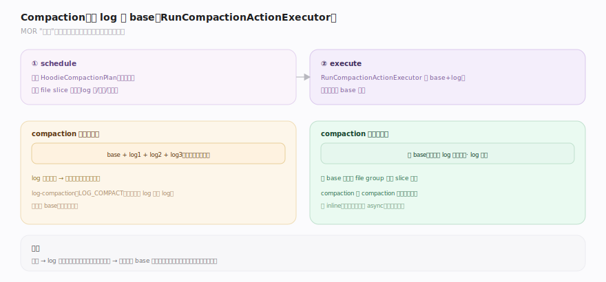
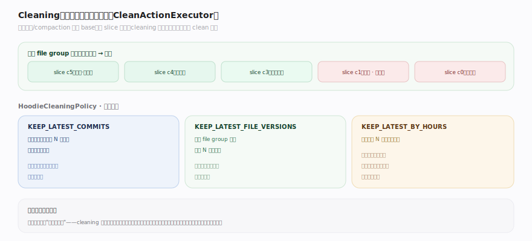
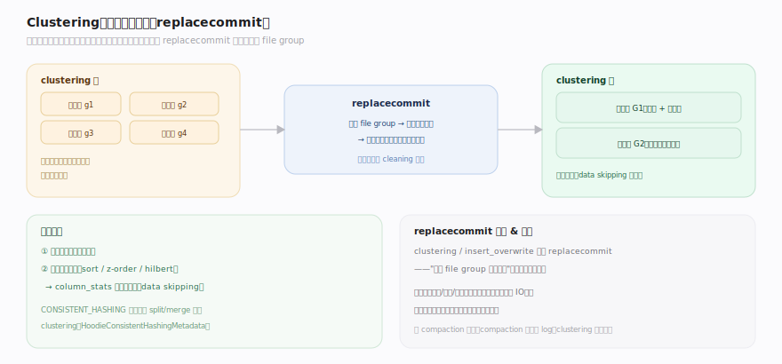

# Hudi 原理 · 支撑主线 · 表服务（compaction / cleaning / clustering）

> **定位**：属"保障能力域"——让 Hudi 表长期健康运行的后台维护。管三大表服务:**compaction**(MOR 合 log 进 base,缩小读合并量)、**cleaning**(按策略回收旧文件片,控空间)、**clustering**(重排数据布局,提查询性能)。都是【时间线】上的独立动作,维护【文件布局】的文件、影响【MoR 读合并】的代价;多写协调见【并发控制与元数据】。源码基准 **Hudi(1dfbdcb)**(`hudi-client/`)。

Hudi 的写路径为了快,会留下"技术债":MOR 表攒下越来越多 log(读越来越慢)、旧文件片堆积(占空间)、小文件与无序布局(查询低效)。**表服务**就是后台的"物业"——compaction 合 log、cleaning 清旧、clustering 重排。它们都以时间线动作的形式记录(与写动作交织但独立调度),让前台写不被维护阻塞。理解这三大服务,就懂了 Hudi 的运维面。

---

## 一、Compaction:合 log 进 base

MOR 表写时只追加 log(快),代价是读要合并 base+log(慢)。**compaction** 把攒下的 log 合并进 base,产出新的 base 文件,缩小后续读的合并量:

- **两阶段**:先 **schedule** 生成 `HoodieCompactionPlan`(挑哪些 file slice 要合、按策略),再 **execute** 由 `RunCompactionActionExecutor`(`table/action/compact/RunCompactionActionExecutor.java:19`)实际读 base+log、合并、写新 base。
- **时间线动作**:compaction 是 `compaction` 动作,走 requested→inflight→completed 三态;完成后新 base 成为该 file group 的最新 slice 基线。
- **log-compaction**(`WriteOperationType.LOG_COMPACT`):轻量变体——只合并小 log 成大 log(不产新 base),减少 log 数量而不付重写 base 的代价。
- **调度策略**:按 log 数量 / log 大小 / 提交间隔触发;可 inline(写后同步)或 async(独立作业)。

**取舍**:compaction 太疏 → log 越攒越多、快照读越来越慢;太勤 → 频繁重写 base 耗资源。它是 MOR "写快"红利的必要还款。

---

## 二、Cleaning:按策略回收旧文件片

每次 COW 更新产新 base、每次 compaction 产新 base,旧的 file slice 会堆积(供时间旅行/回滚)。**cleaning** 按保留策略回收超窗口的旧 slice:

- **执行器**:`CleanActionExecutor`(`table/action/clean/CleanActionExecutor.java:61`)按策略计算要删的旧文件,记 `clean` 动作,删除并归档。
- **保留策略** `HoodieCleaningPolicy`(`common/model/HoodieCleaningPolicy.java:34`):
  - `KEEP_LATEST_COMMITS`(默认):保留最近 N 次提交涉及的文件片,兼顾时间旅行与空间。
  - `KEEP_LATEST_FILE_VERSIONS`:每个 file group 保留最新 N 个版本。
  - `KEEP_LATEST_BY_HOURS`:保留最近 N 小时的版本。
- **与增量/时间旅行的关系**:保留窗口决定"能回溯多久"——cleaning 删掉的版本就无法再时间旅行或增量读起点回退到那。

**取舍**:保留多 → 时间旅行/回滚能力强但占空间;保留少 → 省空间但历史窗口短。默认 KEEP_LATEST_COMMITS 是平衡点。

---

## 三、Clustering:重排数据布局

写入是"按到达顺序"落文件的,时间久了布局对查询不友好(小文件多、相关数据分散)。**clustering** 在不改变记录内容的前提下**重排文件布局**:

- **机制**:经 `WriteOperationType.CLUSTER`(`client/BaseHoodieWriteClient.java:1414`),用 **replacecommit** 动作——把一批旧 file group 的数据读出、按新布局(如按某列排序、合并小文件)重写成新 file group,并在时间线上用 replacecommit 原子替换(旧的被后续 cleaning 回收)。
- **典型收益**:① 合并小文件(减碎片);② 按查询高频列排序(sort/z-order/hilbert),让 column_stats 剪枝更有效(data skipping)。
- **与一致性哈希桶**:CONSISTENT_HASHING bucket 索引的动态 split/merge 桶就通过 clustering 完成,用 `HoodieConsistentHashingMetadata` 记录桶划分变化(见【索引】)。
- **replacecommit 语义**:clustering / insert_overwrite 都用 replacecommit——"用新 file group 替换旧的",时间线上是一个原子替换动作。

**取舍**:clustering 改善读(布局/排序/小文件)但要重写数据(耗 IO);对查询延迟敏感、写模式松散的表收益大。

---

## 拓展 · 表服务关键结构一览

| 结构 | 定义 | 职责 |
|---|---|---|
| RunCompactionActionExecutor | `table/action/compact/RunCompactionActionExecutor.java:19` | 合 log 进 base |
| HoodieCompactionPlan | `table/action/compact/` | compaction 计划(挑 slice) |
| CleanActionExecutor | `table/action/clean/CleanActionExecutor.java:61` | 清旧文件片 |
| HoodieCleaningPolicy | `common/model/HoodieCleaningPolicy.java:34` | 版本/提交/小时保留策略 |
| WriteOperationType.CLUSTER | `client/BaseHoodieWriteClient.java:1414` | clustering(replacecommit) |
| HoodieConsistentHashingMetadata | `common/model/` | 一致性哈希桶划分 |

## 调优要点（关键开关）

- **compaction 触发**:MOR 按 log 数/大小/提交间隔触发;读延迟敏感调勤、资源紧张调疏;inline vs async 按是否有独立算力选。
- **log-compaction**:log 文件过多(小 log 碎)先做 log-compaction 合并 log,不必每次重写 base。
- **cleaning 策略**:默认 KEEP_LATEST_COMMITS;时间旅行需求低可 KEEP_LATEST_FILE_VERSIONS 省空间。
- **clustering 排序键**:按查询高频过滤列排序,配合 column_stats 做 data skipping,收益最大。
- **服务调度**:三服务可 async 独立作业跑,避免阻塞前台写(compaction/clustering 尤其耗资源)。

## 常见误区与工程要点

- **误区:MOR 不用管 compaction。** 不 compaction 则 log 无限攒、快照读越来越慢;必须定期 compaction 合进 base。
- **误区:cleaning 会删正在用的数据。** 按策略只回收超出保留窗口的旧 slice;当前版本与保留窗口内的历史都保留。
- **误区:clustering 会改数据。** clustering 只重排布局(排序/合并小文件),不改记录内容;用 replacecommit 原子替换旧 file group。
- **误区:compaction 和 clustering 是一回事。** compaction 合 MOR 的 log 进 base(同 file group);clustering 跨 file group 重排布局(replacecommit 替换)。
- **归属提醒**:三服务都记为【时间线】动作;维护的 base/log/file group 在【文件布局】;compaction 直接影响【MoR 读合并】的代价;多引擎下服务与写的并发协调、metadata table 自身的 compaction 在【并发控制与元数据】。

## 一句话总纲

**表服务是 Hudi 长期健康的后台物业,都是时间线上的独立动作:compaction(RunCompactionActionExecutor 两阶段 schedule/execute,把 MOR 的 log 合并进 base 产新基线、缩小读合并量,log-compaction 是只合 log 的轻量变体)、cleaning(CleanActionExecutor 按 HoodieCleaningPolicy 的 KEEP_LATEST_COMMITS/FILE_VERSIONS/BY_HOURS 回收超窗口的旧文件片、控空间与时间旅行窗口)、clustering(WriteOperationType.CLUSTER 用 replacecommit 原子替换旧 file group,合并小文件、按列排序提 data skipping,也承载一致性哈希桶的动态调整);三者以异步作业跑不阻塞前台写,是 MOR "写快"红利与写入布局债的必要还款。**
