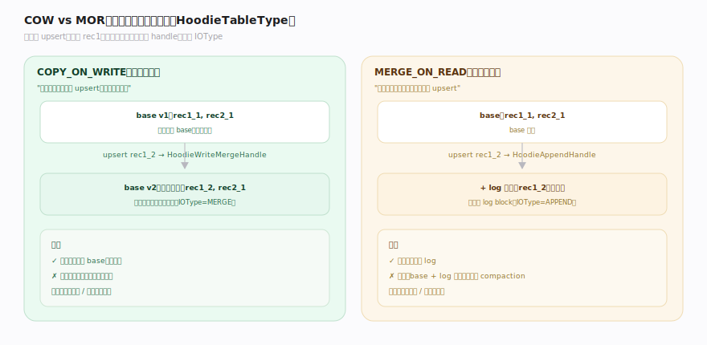
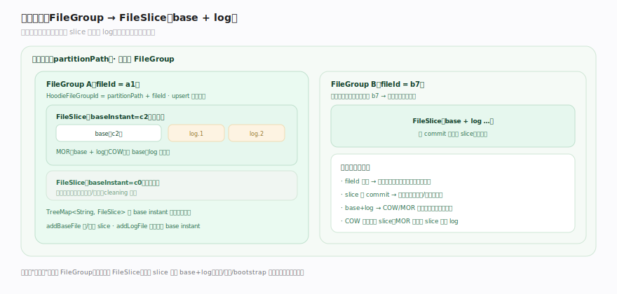

# Hudi 原理 · 支撑主线 · 表类型（COW / MOR）

> **定位**：属"存储能力域"——Hudi 的定义性设计选择。管数据的两种组织方式:Copy-on-Write(写时重写)vs Merge-on-Read(读时合并),以及文件组织 FileGroup/FileSlice(base + log)。决定写读代价的取舍。被【写入路径与 upsert】用不同 handle、被【MoR 读合并】读、物理布局在【文件布局】。源码基准 **Hudi(1dfbdcb)**(`hudi-common/`、`hudi-client/`)。

Hudi 最核心的设计选择:**两种表类型**。`HoodieTableType { COPY_ON_WRITE, MERGE_ON_READ }`(`HoodieTableType.java:30`)——COW 更新时重写整个文件(写慢读快),MOR 写 delta log 文件、读时合并(写快读慢)。这是"写代价 vs 读代价"的取舍,让用户按工作负载选。数据都按 FileGroup/FileSlice 组织,区别只在 slice 有无 log 文件。

---

## 一、COW vs MOR:写读代价取舍

`HoodieTableType`(`HoodieTableType.java:26`)注释直言取舍:

- **Copy-on-Write(COW)**:"通过版本化整个文件做 upsert,后版本含记录新值"。更新走 `HoodieWriteMergeHandle`——"逐行合并到存储:对每个已存在记录,合并;否则原样写;所有 incoming 待处理记录写入文件"(`HoodieWriteMergeHandle.java:71`),输出**新文件版本**。**写慢**(重写整文件)、**读快**(直接读 base 文件,无合并)。
- **Merge-on-Read(MOR)**:"延迟合并到攒够工作量,加速 upsert"。更新走 `HoodieAppendHandle`——"MOR log 文件的追加 handle",把记录攒进 Hudi log block(`HoodieAppendHandle.java:68`)。**写快**(只追加 log)、**读慢**(base + log 读时合并)。

IOType 枚举区分操作:`MERGE, CREATE, APPEND`(`IOType.java:25`)——COW 更新=MERGE、新建=CREATE,MOR=APPEND。

---

## 二、文件组织:FileGroup → FileSlice

- **FileGroup**(`HoodieFileGroup.java:42`)= "一组 data/base 文件 + 一组 log 文件,构成所有操作的单元",持 `TreeMap<String, FileSlice>`(按 base instant 排序,新的在前)。带 `HoodieFileGroupId`(partitionPath + fileId)。
- **FileSlice**(`FileSlice.java:37`)= "某 commit 时写的 data 文件 + 从该 commit 起改动的 log 文件列表",字段:`baseInstantTime`、一个 `baseFile`、`TreeSet<HoodieLogFile> logFiles`。**COW slice 只有 base file(log 恒空,`:63`);MOR slice 有 base + log**。
- **一个分区含多个 file group,每个 file group 每 commit 一个 slice**:`addBaseFile` 按 base 文件 commit time 建/更新 slice,`addLogFile` 把 log 附到对应 base instant 的 slice(`HoodieFileGroup.java:108`)。

**为什么这样组织**:file group 是 upsert 的路由目标(索引把记录键映射到 file group);slice 按 commit 分版本;COW 每次更新产新 slice(新 base),MOR 在当前 slice 追加 log——组织统一,类型只影响 slice 里有无 log。

---

## 拓展 · 表类型关键结构一览

| 结构 | 定义 | 职责 |
|---|---|---|
| HoodieTableType | `model/HoodieTableType.java:30` | COPY_ON_WRITE / MERGE_ON_READ |
| HoodieWriteMergeHandle | `io/HoodieWriteMergeHandle.java:71` | COW 逐行重写文件 |
| HoodieAppendHandle | `io/HoodieAppendHandle.java:68` | MOR 追加 log 文件 |
| FileGroup | `model/HoodieFileGroup.java:42` | upsert 路由单元(多 slice) |
| FileSlice | `model/FileSlice.java:37` | base file + log files(某 commit) |
| IOType | `model/IOType.java:25` | MERGE / CREATE / APPEND |

## 调优要点（关键开关）

- **COW vs MOR 选型**:写多读少/低延迟摄入 → MOR;读多写少/查询延迟敏感 → COW。
- **MOR compaction 频率**:log 攒太多读越慢;定期 compaction 合 log 进 base(见表服务)。
- **文件大小** `hoodie.parquet.max.file.size`:base 文件目标大小;太小碎片多、太大重写贵(COW)。
- **log block 大小**:MOR log 块大小影响读合并效率。

## 常见误区与工程要点

- **误区:MOR 永远比 COW 好(写快)。** MOR 写快但读要合并 base+log(慢),且需 compaction 维护;读多场景 COW 更优。
- **误区:COW 更新只改变化的行。** COW 重写**整个文件**(逐行合并产新版本),不是原地改行——这是写慢的原因。
- **误区:FileGroup 就是一个文件。** FileGroup 是逻辑单元,含多个 FileSlice(按 commit 版本),每 slice 是 base + log。
- **误区:MOR 读只读 log。** MOR 快照读要 base file + 所有 log 合并;读优化查才只读 base。
- **归属提醒**:写用哪个 handle 由本类型决定,写流程在【写入路径与 upsert】;FileGroup/FileSlice 的命名/分区/bootstrap 深化在【文件布局】;MOR 的读合并在【MoR 读合并】;compaction 合 log 进 base 在【表服务】;slice 版本按时间线 instant(【时间线】)。

## 一句话总纲

**Hudi 两种表类型是写读代价的核心取舍:COW(Copy-on-Write)更新时用 HoodieWriteMergeHandle 逐行重写整个文件产新版本(写慢、读快无合并),MOR(Merge-on-Read)用 HoodieAppendHandle 写 delta log(写快、读时 base+log 合并慢、需 compaction);数据都按 FileGroup(upsert 路由单元,带 partitionPath+fileId)→ FileSlice(某 commit 的 base file + log files)组织,COW slice 只有 base、MOR slice 有 base+log——用户按写多读少(MOR)还是读多写少(COW)选。**
