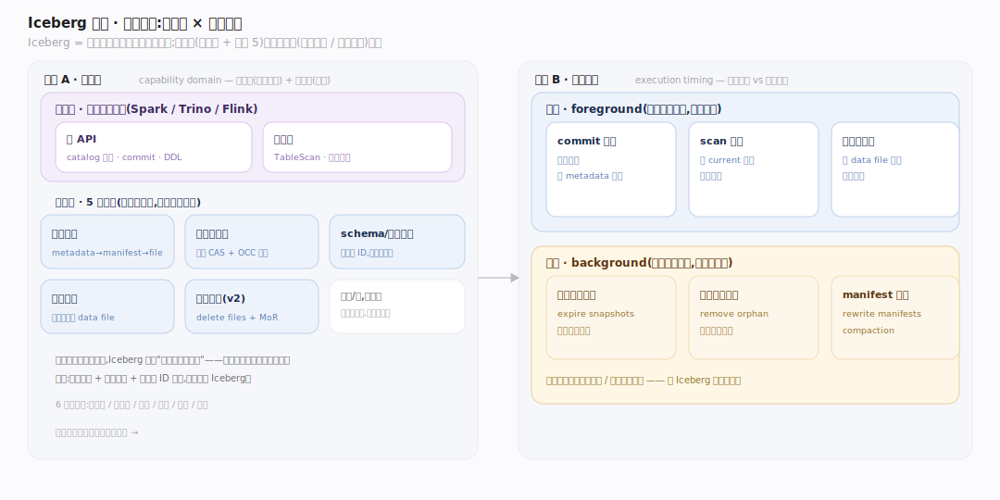
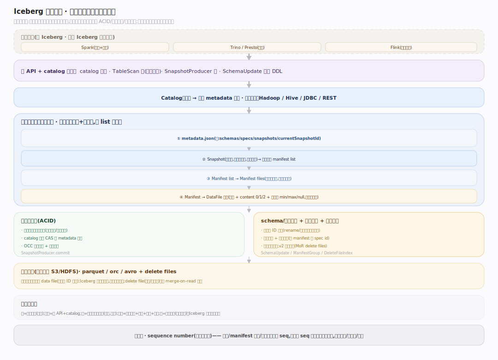
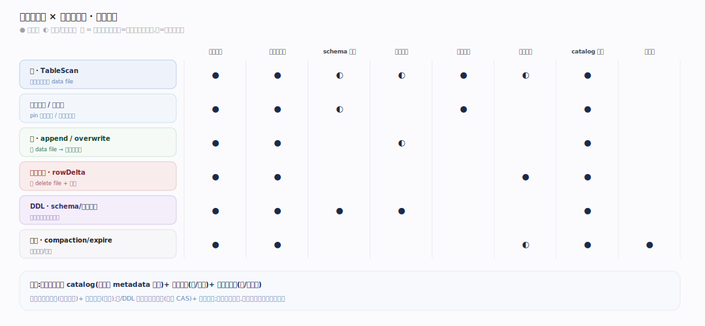
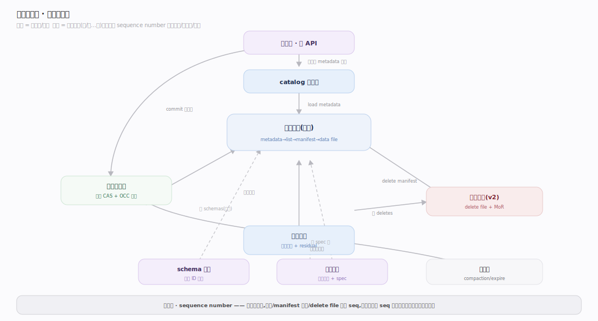

# Iceberg 原理 · 全景主线框架

> 统领全部原理文档:Apache Iceberg 是**开放表格式**(新家族:表格式/湖仓表——不是存储引擎、不是查询引擎,而是**数据文件之上的一层元数据规范**,让对象存储上的一堆文件表现得像有 ACID、schema 演进、时间旅行的表)。源码基准 **Iceberg(apache/iceberg main · commit 6ec1a01)**(core/src/main/java/org/apache/iceberg/、api/src/main/java/org/apache/iceberg/)。

Iceberg 的世界观:**表 = 一棵不可变元数据树**。数据还是那些 parquet/orc 文件躺在对象存储上,但 Iceberg 在其上加一层元数据(metadata.json → manifest list → manifest → data file),让"一堆文件"变成有快照、有 ACID 提交、能安全演进 schema/分区的表。它自己不读写数据、不执行查询——那是 Spark/Trino/Flink 的事;Iceberg 只管"表的元数据规范"。理解"元数据树 + 原子提交 + 按字段 ID 演进"三点,就懂了 Iceberg。

> **结构提示(写文档必看)**:① 元数据是**不可变树**——每次提交产生新 metadata.json + 新 snapshot,旧的保留(时间旅行);② 原子提交靠**目录的 CAS**(catalog 原子换 metadata 指针 + 乐观重试);③ schema 演进靠**字段 ID**(非名字/位置)——rename 不重写数据;④ 隐藏分区 + 分区演进(每个 manifest 记自己的 spec id,老数据留老 spec);⑤ v2 行级删除(position/equality delete files,读时 merge-on-read);⑥ Iceberg 是**库/规范**,链接进计算引擎,不是独立进程。

---

## 一、双维模型:能力域 × 执行时机

- **能力域**:接触面(表 API + 快照读)面向计算引擎;支撑侧 8 域——元数据树、快照与提交、schema 演进、分区演进与隐藏分区、扫描规划、行级删除、表维护、catalog 与并发。
- **执行时机**:前台(commit 提交、scan 规划、读数据文件)vs 后台(过期快照清理、孤儿文件清理、compaction 小文件/manifest 合并、这些由计算引擎/维护任务触发)。

---

## 二、总架构图(位置即语义)

计算引擎(Spark/Trino/Flink)通过 Iceberg 库读写表:**读**——catalog 找当前 metadata.json → 读 snapshot 的 manifest list → manifest → 按分区+列统计剪枝 → 得 data file 列表交引擎扫;**写**——写新 data file → 写新 manifest/manifest list → 构建新 TableMetadata → catalog **原子 CAS 换 metadata 指针**(乐观重试冲突)。数据文件在对象存储,元数据树也在对象存储,catalog(Hive/JDBC/REST/Hadoop)只存"当前 metadata 位置"这一个指针。

---

## 三、6 条主线的分层归位

| 层 | 主线 | 一句话职责 |
|---|---|---|
| 接触面 | **表 API + 快照读** | 计算引擎经库读写表、时间旅行 |
| 元数据 | **元数据树(核心)** | metadata.json→manifest list→manifest→data file |
| 事务 | **快照与提交(灵魂)** | 每提交产新快照;catalog 原子 CAS + OCC 乐观重试 |
| 演进 | **schema 演进** | 列靠不可变字段 ID 追踪,rename/加删列/类型提升不重写数据 |
| 演进 | **分区演进与隐藏分区** | 隐藏分区从源列派生 + 每 manifest 记 spec id,改规则不重写老数据 |
| 规划 | **扫描规划** | 两级剪枝(manifest 分区剪 + 文件列统计剪) |
| 删除 | **行级删除(v2)** | position/equality delete files + merge-on-read |
| 维护 | **表维护** | compaction 合并小文件/物化删除 + expire snapshots + 清孤儿 |
| 事务 | **catalog 与并发** | catalog 类型(Hadoop/Hive/JDBC/REST)+ TableOperations 提交契约 |

---

## 四、接触面 × 能力域 依赖矩阵

读(scan)依赖元数据树(遍历 manifest)+ 扫描规划(两级剪枝)+ schema(按字段 ID 投影)+ 行级删除(叠加 delete files);写(commit)依赖快照与提交(原子 CAS)+ 元数据树(写新 manifest)+ schema/分区演进(spec)。

---

## 五、能力域依赖关系图

实线=数据流/调用,虚线=状态约束。贯穿层:**sequence number(序列号)** 横切快照/manifest/删除——每次提交分配递增 seq,manifest 条目带 data/file sequence number,行级删除靠 seq 比较决定作用于哪些 data file(delete.seq ≥ dataFile.seq 才生效)。

---

## 六、三条贯穿声明(Iceberg 区别于 Hive 表/存储引擎)

1. **表是一棵不可变元数据树,不是目录列表**:Hive 表 = "某目录下所有文件",list 目录慢且无事务;Iceberg 表 = metadata.json 明确列出快照 → manifest → 每个 data file(带分区值 + 列统计)。**不 list 目录**,元数据自带全部文件清单 + 统计,规划快且原子。

2. **原子提交靠 catalog 的 CAS,不靠锁表**:每次提交写全新 metadata.json(UUID 路径),然后 catalog 原子比较并交换"当前 metadata 位置"指针(HadoopTableOps 靠 rename、JDBC 靠条件 UPDATE、REST 靠服务端);冲突则乐观重试(re-apply)。快照不可变,读者永远看一致的历史快照(快照隔离/时间旅行免费)。

3. **按字段 ID 演进,不重写数据**:列靠不可变字段 ID 追踪(非名字/位置)——rename/加列/删列只改元数据、不碰数据文件;分区也能演进(每个 manifest 记自己的 spec id,老数据留老分区规则),隐藏分区让用户查源列而非分区列。这是 Iceberg 相对 Hive 的杀手锏。

---

**一句话定位**:Iceberg 是开放表格式——在对象存储的数据文件之上加一层不可变元数据树(metadata.json→manifest list→manifest→data file,自带文件清单+列统计,不 list 目录),让一堆文件变成有 ACID(catalog 原子 CAS 提交 + OCC 乐观重试)、快照隔离/时间旅行(每提交产不可变快照)、按字段 ID 安全演进 schema/分区(不重写数据)的表;扫描两级剪枝(manifest 分区剪 + 文件列统计剪),v2 支持行级删除(position/equality delete + merge-on-read);它是链接进 Spark/Trino/Flink 的库/规范,不自己读写数据或执行查询。
