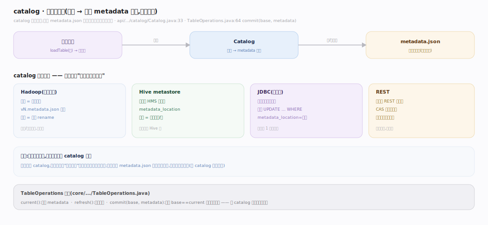
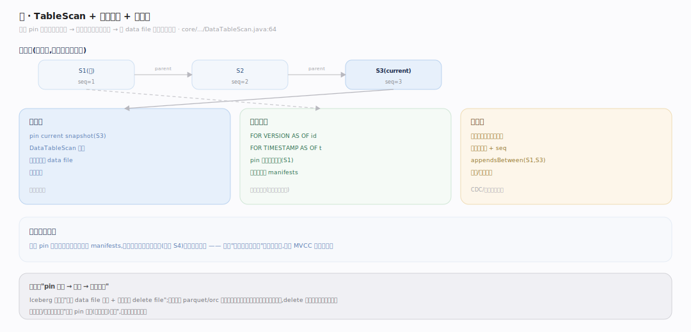
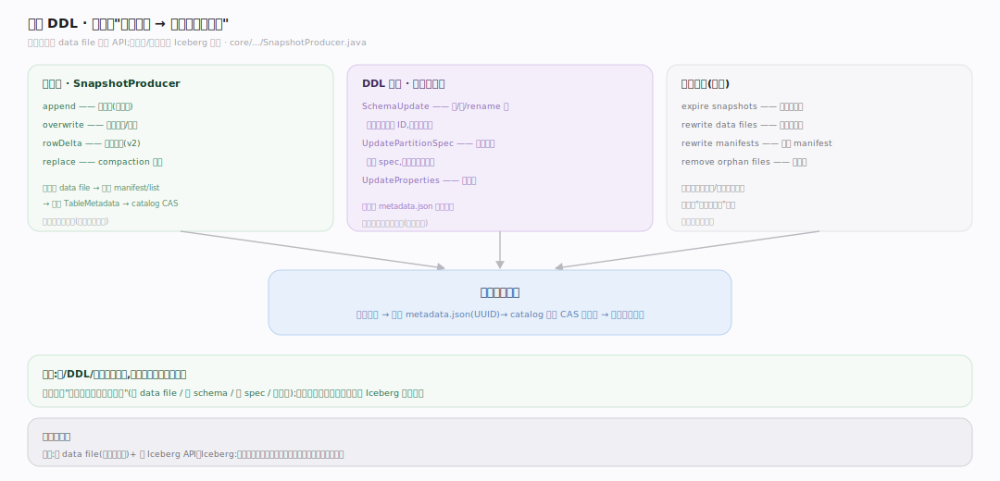

# Iceberg 原理 · 接触面主线 · 表 API 与快照读

> **定位**：属"接触面主线"(计算引擎可见)。Iceberg 的接触面是**表操作 API**:通过计算引擎(Spark/Trino/Flink)读写表、时间旅行读历史快照、DDL 演进。它不是给终端用户的 SQL,而是给引擎集成的库 API + catalog。调用【元数据树】遍历、【快照与提交】写、【扫描规划】读。源码基准 **Iceberg(apache/iceberg main · commit 6ec1a01)**(`api/`、`core/`)。

Iceberg 怎么被用?**不直接面向终端用户**——它是链接进 Spark/Trino/Flink 的库,引擎通过 Iceberg 的表 API + catalog 读写表。用户写的 SQL 在引擎里执行,引擎调 Iceberg 做元数据操作(找文件、提交快照)。所以 Iceberg 的"接触面"是引擎集成层:catalog(找表)、TableScan(读)、SnapshotProducer(写)、时间旅行(读历史)。

---

## 一、catalog:表的入口

catalog 是找表的入口,存"表名 → 当前 metadata 位置"的映射,类型多样:

- **Hadoop catalog**(文件系统):metadata 位置由目录约定,rename 提交。
- **Hive/JDBC catalog**(元存储):metadata 位置存 Hive metastore / 关系表,条件 UPDATE 提交。
- **REST catalog**:metadata 位置由 REST 服务管,CAS 在服务端。

catalog 只存一个指针(当前 metadata.json 位置);拿到 metadata 就能顺元数据树读整张表。计算引擎经 catalog 找到表,再走 TableScan/提交。

---

## 二、读:TableScan + 时间旅行

- **读当前**:引擎经 `TableScan` 规划(`DataTableScan`,见扫描规划篇)——读 current snapshot 的元数据树、两级剪枝出 data file 列表,交引擎扫。
- **时间旅行**:因每个快照不可变、旧快照保留(`snapshotsById` 索引所有),可按 snapshot id 或时间戳读任意历史版本——`SELECT ... FOR VERSION AS OF` / `FOR TIMESTAMP AS OF`。规划时 pin 那个历史快照即可。
- **增量读**:读两个快照之间新增的数据(基于快照链 + sequence number),用于流式/增量处理。

**快照隔离免费**:读者 pin 一个快照读它不可变的 manifests,读期间别人提交不影响——这是不可变元数据树的天然红利。

---

## 三、写与 DDL:SnapshotProducer + 演进 API

- **写数据**:引擎写 data file 后,经 `SnapshotProducer`(append/overwrite/rowDelta 等)提交——写新 manifest/manifest list、构建新 TableMetadata、catalog 原子 CAS(见快照与提交篇)。
- **DDL 演进**:`SchemaUpdate`(加删改列,按字段 ID)、`UpdatePartitionSpec`(演进分区)、`UpdateProperties`——都只改元数据、不重写数据(见 schema 与分区演进篇)。
- **维护操作**:expire snapshots(过期旧快照)、rewrite data files(合并小文件/物化删除)、rewrite manifests(合并 manifest)——由引擎的存储过程/维护任务触发。

所有写/DDL 都走"改元数据 → 原子提交新快照"的统一模式;引擎只管产 data file 和调 API,原子性/一致性由 Iceberg 保证。

---

## 拓展 · 接触面关键结构一览

| 结构 | 定义 | 职责 |
|---|---|---|
| Catalog | `api/.../catalog/` | 表名→metadata 位置(Hadoop/Hive/JDBC/REST) |
| TableScan / DataTableScan | `core/.../DataTableScan.java:64` | 读规划(含时间旅行 pin 快照) |
| SnapshotProducer | `core/.../SnapshotProducer.java` | 写提交(append/overwrite/rowDelta) |
| SchemaUpdate | `core/.../SchemaUpdate.java` | schema 演进 DDL |
| Snapshot(时间旅行) | `api/.../Snapshot.java:42` | 按 id/时间读历史 |

## 调优要点（关键开关）

- **catalog 选型**:生产用 REST/Hive/JDBC(集中管理);测试可用 Hadoop(文件系统)。
- **时间旅行 + 快照过期**:保留策略平衡"能回溯多久"与"元数据/数据膨胀";定期 expire。
- **写模式**:append(纯追加,无冲突)、overwrite(覆盖分区)、rowDelta(行级删除,v2)——按语义选。
- **维护任务**:定期 rewrite data files/manifests + expire snapshots,防小文件/快照膨胀。

## 常见误区与工程要点

- **误区:Iceberg 是查询引擎/有自己的 SQL 执行。** 不。它是库/规范,链接进 Spark/Trino/Flink;SQL 在引擎里执行,引擎调 Iceberg 做元数据操作。
- **误区:时间旅行要额外存储。** 旧快照本就保留(不可变),时间旅行是读历史快照,零额外成本(直到 expire)。
- **误区:catalog 存表数据。** catalog 只存"表名→当前 metadata 位置"一个指针;数据和元数据树都在对象存储。
- **误区:DDL 要停写/重写。** schema/分区演进只改元数据(按字段 ID/spec id),不重写数据、不停写。
- **归属提醒**:读规划在【扫描规划】;写提交/CAS 在【快照与提交】;演进逻辑在【schema 与分区演进】;元数据树结构在【元数据树】;实际数据读写由计算引擎。

## 一句话总纲

**Iceberg 的接触面是给计算引擎集成的表 API + catalog(不面向终端用户 SQL):catalog(Hadoop/Hive/JDBC/REST)存"表名→当前 metadata 位置"指针作入口;读经 TableScan 规划当前快照(时间旅行 pin 历史快照读任意版本、增量读快照间差异,快照隔离免费);写经 SnapshotProducer(append/overwrite/rowDelta)+ DDL(SchemaUpdate/UpdatePartitionSpec 按字段 ID/spec id 演进不重写数据)统一走"改元数据→原子提交新快照";Spark/Trino/Flink 产 data file 调 API,原子性一致性由 Iceberg 保证。**
