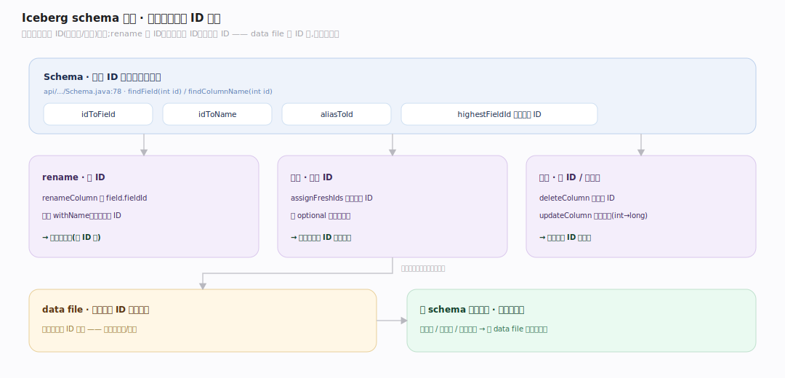

# Iceberg 原理 · 支撑主线 · schema 与分区演进

> **定位**：属"演进能力域"——Iceberg 相对 Hive 的杀手锏。管安全的表结构演进:列靠不可变字段 ID 追踪(schema 演进不重写数据)、隐藏分区 + 分区演进(改分区规则不重写老数据)。依赖【元数据树】存 schemas/specs、被【扫描规划】按 spec 读。源码基准 **Iceberg(f2875fd)**(`api/`、`core/`)。

Hive 表改 schema 是噩梦:加列要小心位置、rename 可能读错列、改分区要重写全表。Iceberg 用**字段 ID**根治:每列有个不可变的整数 ID,schema 里靠 ID 追踪而非名字/位置——rename 只改元数据、加列给新 ID、删列去掉 ID,**都不碰数据文件**。分区同理:每个 manifest 记自己用的 spec id,老数据留老分区规则,分区规则能演进而不重写历史。

---

## 一、schema 演进:按字段 ID 追踪

**列靠不可变字段 ID 追踪**(非名字/位置):`Schema` 维护 `idToField`/`idToName`/`aliasToId` 映射(`api/.../Schema.java:75`),`findField(int id)`/`findField(String name)`/`findColumnName(int id)`。

- **rename 保 ID**:`SchemaUpdate.renameColumn` 读 `int fieldId = field.fieldId()`、只改名字(`.withName(newName)`)、保持同 ID(`SchemaUpdate.java:205`)——**所以 rename 从不重写数据**(data file 里按 ID 存)。
- **加列给新 ID**:`TypeUtil.assignFreshIds(...)` 分配全新 ID(`:179`);加列须 optional 或有默认值(除非 `allowIncompatibleChanges`)。
- **删列/改类型**:`deleteColumn` 去掉 ID、`updateColumn` 做类型提升(`:273`);不兼容改动被 flag 挡住。
- `highestFieldId` 单调发新 ID(`:75`)。

**为什么按 ID**:data file 里列按字段 ID 标识,读时按 ID 投影——名字变了、位置变了、加删了列,老数据文件照样能正确读,零重写。

---

## 二、隐藏分区:分区值从源列派生

**PartitionField** = (源列字段 ID, 分区字段 ID, 目标名, Transform)(`api/.../PartitionSpec.java:461`)。分区值**从源列派生**(不是单独一列)——这就是"隐藏分区":用户查源列(如 `WHERE ts > '2024-01-01'`),Iceberg 自动用分区(如 `day(ts)`)剪枝,用户无需知道分区列。

Transform 全集(`Transforms.java:88`):`identity`/`year`/`month`/`day`/`hour`/`bucket(n)`/`truncate(w)`。例如 `day(ts)` 把时间戳映射到天分区。

**对比 Hive**:Hive 要用户显式建一个分区列 `dt` 并在查询里写 `WHERE dt='...'`(忘写就全扫);Iceberg 隐藏分区让用户查源列、引擎自动剪枝——不会因忘写分区谓词而全扫。

---

## 三、分区演进:改规则不重写老数据

分区规则能**演进而不重写历史数据**:

- **每个 manifest 记自己的 spec id**(`ManifestFile.java:36`),`TableMetadata` 保留**所有** spec(`specsById`,`:262`)。
- 改分区规则(如从 `day(ts)` 改成 `hour(ts)`)只加新 spec;**老 data file 保留老 spec、新数据用新 spec**——不重写历史。
- 扫描时按每 manifest 的 spec 正确读:`ManifestFiles.read(manifest, io, specsById)`(`ManifestGroup.java:345`)——不同 spec 的数据各按自己的规则剪枝。

**为什么能演进**:因为分区值是派生的、且每批数据记了自己的 spec,新旧规则共存;Hive 改分区必须重写全表(分区是物理目录结构)。

---

## 拓展 · 演进关键结构一览

| 结构 | 定义 | 职责 |
|---|---|---|
| Schema | `api/.../Schema.java:75` | idToField/idToName 字段 ID 映射 |
| SchemaUpdate | `core/.../SchemaUpdate.java:205` | rename 保 ID / 加列新 ID / 类型提升 |
| PartitionSpec / PartitionField | `api/.../PartitionSpec.java:461` | (源列 ID, Transform) 派生分区 |
| Transforms | `api/.../transforms/Transforms.java:88` | identity/bucket/truncate/year/month/day/hour |
| specsById | `core/.../TableMetadata.java:262` | 保留所有分区规则(演进基础) |

## 调优要点（关键开关）

- **分区 transform 选择**:高基数用 bucket(n) 控分区数;时间用 day/hour(按查询粒度);别用 identity 于高基数列(分区爆炸)。
- **分区演进时机**:数据量/查询模式变了再演进;新老 spec 共存,查询自动适配。
- **schema 加列**:优先加 optional 列(兼容);改类型只能安全提升(int→long)。
- **字段 ID 稳定性**:不要绕过 API 手改 schema,保 ID 稳定是安全演进的前提。

## 常见误区与工程要点

- **误区:rename 列要重写数据。** 不。data file 按字段 ID 存,rename 只改元数据名字、保 ID,零重写。
- **误区:改分区要重写全表(Hive 思维)。** Iceberg 每 manifest 记 spec、保留所有 spec,老数据留老规则、新数据用新规则,不重写。
- **误区:要在查询里写分区谓词。** 隐藏分区让用户查源列,引擎从 transform 自动剪枝——不写也不会全扫。
- **误区:分区列是真实存在的一列。** 分区值从源列派生(隐藏),不是单独物理列。
- **归属提醒**:schemas/specs 存在【元数据树】的 TableMetadata;按 spec 剪枝在【扫描规划】;演进本身(加删改列/spec)是本主线;字段 ID 让 data file 跨演进可读。

## 一句话总纲

**Iceberg 用字段 ID + 分区演进根治 Hive 的表结构演进痛点:列靠不可变字段 ID 追踪(非名字/位置)——rename 只改元数据保 ID、加列给新 ID、删列去 ID,data file 按 ID 存故全部不重写数据;隐藏分区让分区值从源列经 transform(identity/bucket/truncate/year/month/day/hour)派生(用户查源列、引擎自动剪枝,不会忘写分区谓词而全扫);分区规则能演进(每 manifest 记自己的 spec id、TableMetadata 保留所有 spec,老数据留老规则、新数据用新规则)——都不重写历史数据。**
