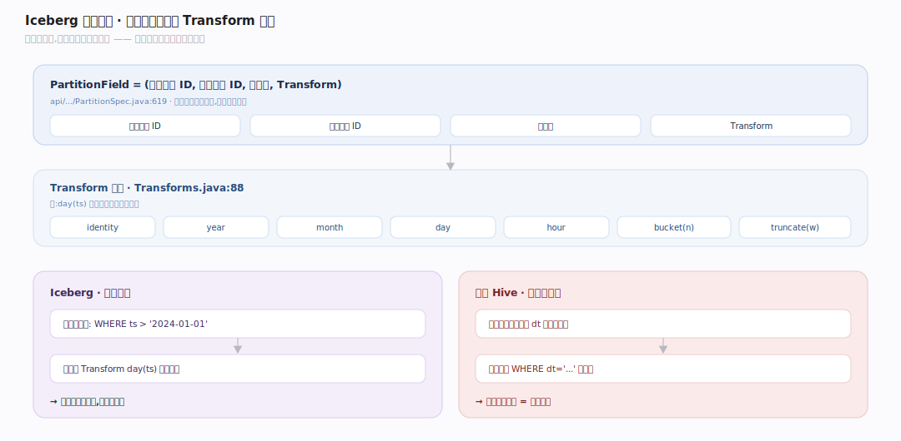
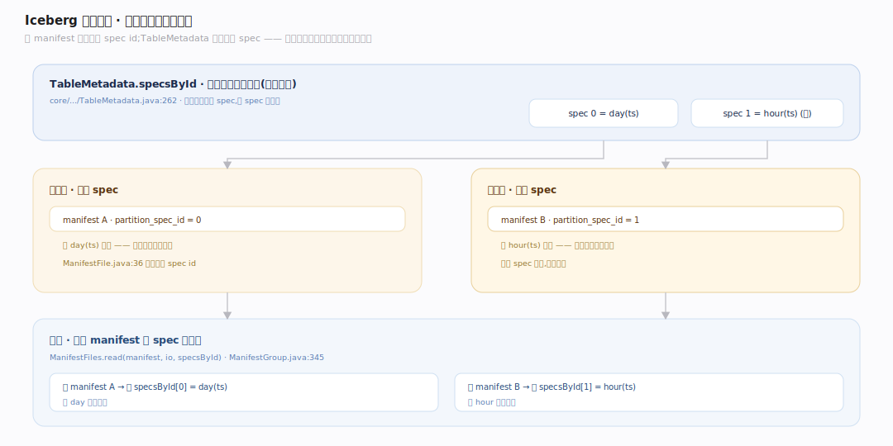

# Iceberg 原理 · 支撑主线 · 分区演进与隐藏分区

> **定位**：属"演进能力域"。管分区的两大能力:**隐藏分区**(分区值从源列经 transform 派生,用户查源列即自动剪枝)与**分区演进**(改分区规则不重写老数据,每批数据记自己的 spec id)。依赖【元数据树】存 specs(specsById),被【扫描规划】按每 manifest 的 spec 剪枝。姊妹主线【schema 演进】管列结构。源码基准 **Iceberg(apache/iceberg main · commit 6ec1a01)**(`api/`、`core/`)。

Hive 的分区是"物理目录结构 + 一个真实分区列",用户查询必须显式写分区谓词(忘写就全扫),改分区规则要重写全表。Iceberg 把分区变成**从源列派生的隐藏概念**:分区值由 transform(如 `day(ts)`)从源列算出,用户只管查源列、引擎自动剪枝;而且每个 manifest 记录自己写入时用的 spec id、TableMetadata 保留所有 spec,所以分区规则能**演进而不重写历史数据**。

---

## 一、隐藏分区:分区值从源列派生

**PartitionField** = (源列字段 ID, 分区字段 ID, 目标名, Transform)(`api/.../PartitionSpec.java:619`)。分区值**从源列派生**(不是单独一列存储)——这就是"隐藏分区":用户查源列(如 `WHERE ts > '2024-01-01'`),Iceberg 自动用分区(如 `day(ts)`)剪枝,用户无需知道分区列存在。

Transform 全集(`api/.../transforms/Transforms.java:88`):`identity`/`year`/`month`/`day`/`hour`/`bucket(n)`/`truncate(w)`。例如 `day(ts)` 把时间戳映射到天分区,`bucket(16, id)` 把 id 哈希到 16 个桶。

**对比 Hive**:Hive 要用户显式建一个分区列 `dt` 并在查询里写 `WHERE dt='...'`(忘写就全扫);Iceberg 隐藏分区让用户查源列、引擎从 transform 反推分区谓词自动剪枝——**不会因忘写分区谓词而全扫**,也不会因手写错分区值而漏数据。

---

## 二、分区演进:改规则不重写老数据

分区规则能**演进而不重写历史数据**,靠"每批数据记自己的 spec":

- **每个 manifest 记自己的 spec id**(`api/.../ManifestFile.java:37` partition_spec_id),`TableMetadata` 保留**所有** spec(`specsById`,`core/.../TableMetadata.java:262`)。
- 改分区规则(如从 `day(ts)` 改成 `hour(ts)`)只**加新 spec**;**老 data file 保留老 spec、新数据用新 spec**——不重写历史。
- 扫描时按每 manifest 的 spec 正确读:`ManifestFiles.read(manifest, io, specsById)`(`core/.../ManifestGroup.java:345`)——不同 spec 的数据各按自己的规则剪枝(ManifestEvaluator/ResidualEvaluator 都按 spec id 缓存)。

**为什么能演进**:因为分区值是派生的、且每批数据记了自己的 spec,新旧规则天然共存;Hive 改分区必须重写全表(分区是物理目录结构,改规则=改目录布局)。

---

## 拓展 · 分区演进关键结构一览

| 结构 | 定义 | 职责 |
|---|---|---|
| PartitionSpec / PartitionField | `api/.../PartitionSpec.java:619` | (源列 ID, 分区字段 ID, name, Transform) 派生分区 |
| Transforms | `api/.../transforms/Transforms.java:88` | identity/bucket/truncate/year/month/day/hour |
| ManifestFile.partition_spec_id | `api/.../ManifestFile.java:37` | 每 manifest 记自己写入时的 spec id |
| specsById | `core/.../TableMetadata.java:262` | 保留所有分区规则(演进基础) |
| ManifestFiles.read(...) | `core/.../ManifestGroup.java:345` | 按每 manifest 的 spec 正确读/剪枝 |

## 调优要点（关键开关）

- **分区 transform 选择**:高基数用 `bucket(n)` 控分区数;时间用 `day`/`hour`(按查询粒度);别用 `identity` 于高基数列(分区爆炸)。
- **分区演进时机**:数据量/查询模式变了再演进(如从 `day` 细化到 `hour`);新老 spec 共存,查询自动适配,无需重写。
- **分区字段就是常用过滤列**:让隐藏分区对齐高频查询谓词,第一级 manifest 剪枝才有效(见【扫描规划】)。
- **避免过度分区**:分区太细 → 小文件多、manifest 膨胀;结合 compaction 与合理 transform 控制。

## 常见误区与工程要点

- **误区:改分区要重写全表(Hive 思维)。** Iceberg 每 manifest 记 spec、保留所有 spec,老数据留老规则、新数据用新规则,不重写。
- **误区:要在查询里写分区谓词。** 隐藏分区让用户查源列,引擎从 transform 自动剪枝——不写也不会全扫。
- **误区:分区列是真实存在的一列。** 分区值从源列经 transform 派生(隐藏),不是单独物理列。
- **误区:分区演进会让老查询失效。** 老 data file 仍按老 spec 被正确剪枝读取;演进只影响之后写入的数据用哪套规则。
- **归属提醒**:specs 存在【元数据树】的 TableMetadata(specsById);按 spec 剪枝在【扫描规划】;列结构演进在【schema 演进】;分区值派生与 spec 演进本身是本主线。

## 一句话总纲

**Iceberg 把分区从 Hive 的"物理目录+真实分区列"升级为"从源列派生的隐藏概念":PartitionField 用 transform(identity/bucket/truncate/year/month/day/hour)从源列算出分区值,用户查源列、引擎自动反推剪枝(不会忘写分区谓词而全扫);而每个 manifest 记录自己的 spec id、TableMetadata 用 specsById 保留所有 spec,改分区规则只加新 spec、老数据留老规则、新数据用新规则、扫描时各按自己的 spec 剪枝——分区规则因而能随业务演进而不重写任何历史数据。**
