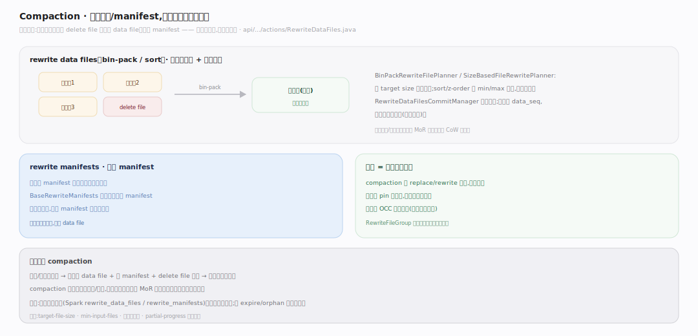
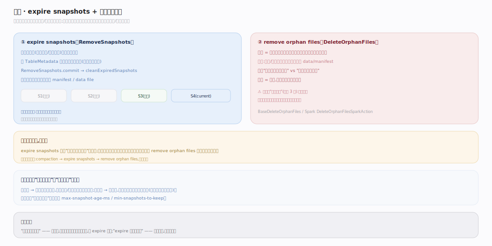

# Iceberg 原理 · 支撑主线 · 表维护（Compaction / Expire / Orphan）

> **定位**：属"维护能力域"——后台侧,保证表长期健康。管三件事:compaction(合并小文件、物化删除、合并 manifest)、expire snapshots(过期旧快照回收)、remove orphan files(清理孤儿文件)。都经【快照与提交】的原子提交路径落地,消费【元数据树】,与前台读写共享同一并发模型。源码基准 **Iceberg(apache/iceberg main · commit 6ec1a01)**(`api/actions/`、`core/actions/`)。

Iceberg 的不可变元数据 + MoR 删除带来一个代价:频繁小批写会堆积大量小 data file、小 manifest、delete file,时间旅行又让旧快照/文件无限增长。**表维护**就是把这些"熵"周期性清理掉的后台任务——compaction 合并碎片、expire 回收旧快照、orphan 清理无主文件。它不是可选项:MoR 表不做 compaction 会越读越慢,不做 expire 会存储无限膨胀。

---

## 一、Compaction:重写数据/manifest,物化删除

compaction 把碎片合并、把 MoR 删除物化进 data file:

- **rewrite data files**(`api/.../actions/RewriteDataFiles.java`):bin-pack 按 target size 把小文件装箱重写成大文件,顺带把适用的 delete file 应用掉(物化删除)。规划由 `BinPackRewriteFilePlanner`/`SizeBasedFileRewritePlanner` 完成,提交由 `RewriteDataFilesCommitManager` 分组进行;可选 sort/z-order 让 min/max 更紧凑、提升后续剪枝。
- **rewrite manifests**(`api/.../actions/RewriteManifests.java`、`core/.../BaseRewriteManifests`):把大量小 manifest 合并成少数大 manifest,并按分区聚簇,提升第一级 manifest 剪枝命中。
- **保留 data_sequence_number**:重写数据文件时保留原 data_seq,故行级删除的作用范围语义不乱(见【元数据树】序列号 / 【行级删除】)。

**compaction = 一种特殊提交**:走 replace/rewrite 操作产新快照,读者仍 pin 旧快照不受影响;同样有 OCC 冲突检测,`RewriteFileGroup` 分组降低单次提交的冲突面。

---

## 二、Expire snapshots + 清理孤儿文件

两步回收,分工不同、都要跑:

- **expire snapshots**(`core/.../RemoveSnapshots.java`):按保留策略(最大快照年龄 / 最少保留个数)选出过期快照,从 TableMetadata 移除其条目(提交新元数据),再删除**仅被过期快照引用**的 manifest/data file(`cleanExpiredSnapshots`)。这界定了时间旅行的回溯窗口——只能回到最老保留快照。
- **remove orphan files**(`api/.../actions/DeleteOrphanFiles.java`、`core/.../actions/BaseDeleteOrphanFiles`):孤儿 = 存储上存在、但**不被任何元数据引用**的文件(失败/中断的写任务残留)。做法是对比"存储实际文件列表"与"元数据引用集合",差集即孤儿。**必须设最小年龄阈值**(默认约 3 天),否则可能误删正在提交、尚未被元数据引用的新文件。

**为什么两个都要**:expire 只删"被过期快照引用"的文件,管不了从没进过元数据的孤儿;孤儿要靠 remove orphan files 扫存储对比清理。典型维护流水:**compaction → expire snapshots → remove orphan files**,周期调度。

---

## 拓展 · 表维护关键结构一览

| 结构 | 定义 | 职责 |
|---|---|---|
| RewriteDataFiles | `api/.../actions/RewriteDataFiles.java` | 合并小文件 / 物化删除(bin-pack、sort) |
| RewriteManifests | `api/.../actions/RewriteManifests.java` | 合并 manifest、按分区聚簇 |
| RemoveSnapshots | `core/.../RemoveSnapshots.java` | expire 过期快照 + 回收其独占文件 |
| DeleteOrphanFiles | `api/.../actions/DeleteOrphanFiles.java` | 对比存储 vs 元数据引用,清孤儿 |
| BinPackRewriteFilePlanner | `core/.../actions/BinPackRewriteFilePlanner.java` | 按 target size 装箱规划重写 |

## 调优要点（关键开关）

- **compaction 触发与粒度**:`target-file-size-bytes` 定合并后文件大小;`min-input-files` 定触发阈值;分区级并行 + `partial-progress` 分批提交降低单次冲突/失败代价。
- **删除堆积就 compaction**:MoR 表 delete file 多则读慢;定期 compaction 把删除物化进 data file(近似转 CoW 读性能)。
- **保留策略权衡**:`max-snapshot-age-ms` / `min-snapshots-to-keep` 平衡"能回溯多久"与"存储膨胀";下游还在读旧快照时别 expire 太狠。
- **orphan 最小年龄**:保守设(默认约 3 天),避免误删并发写入中尚未提交引用的新文件。

## 常见误区与工程要点

- **误区:时间旅行零成本。** 读免费,但保留旧快照的存储不免费;需 expire 定期回收。
- **误区:expire 了就干净了。** expire 只删被过期快照引用的文件;孤儿还在,需单独 remove orphan files。
- **误区:compaction 会影响正在读的查询。** 不。它产新快照,读者仍 pin 旧快照;只是之后的读走新文件。
- **误区:orphan 清理可以设 0 年龄立即删。** 危险——可能删掉并发写正在生成、还没被元数据引用的文件;必须留足最小年龄。
- **归属提醒**:维护经【快照与提交】的原子提交 + OCC;消费【元数据树】判断文件引用关系;删除的物化涉及【行级删除】的 seq 语义;维护是后台执行时机(区别于前台 scan/commit)。

## 一句话总纲

**表维护是 Iceberg 后台侧的"熵回收":compaction(RewriteDataFiles bin-pack 合并小文件+物化 MoR 删除、RewriteManifests 合并 manifest,保留 data_seq 故删除语义不乱)恢复读性能;expire snapshots(RemoveSnapshots 按保留策略移除旧快照并删其独占文件)界定时间旅行窗口、回收存储;remove orphan files(对比存储与元数据引用、留足最小年龄)清掉失败写残留的无主文件——三者都走原子提交路径、对读者透明,是 MoR + 不可变元数据 + 时间旅行这套设计能长期健康运行的必需后台任务。**
