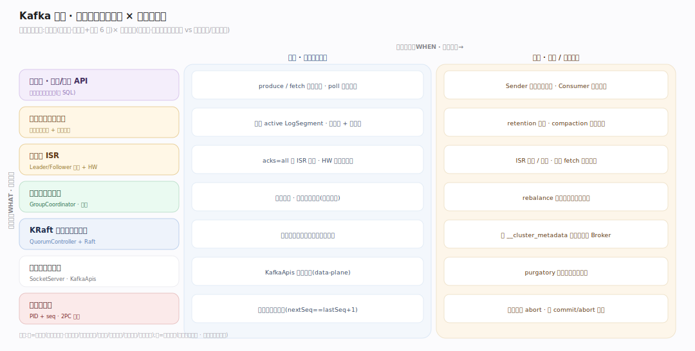
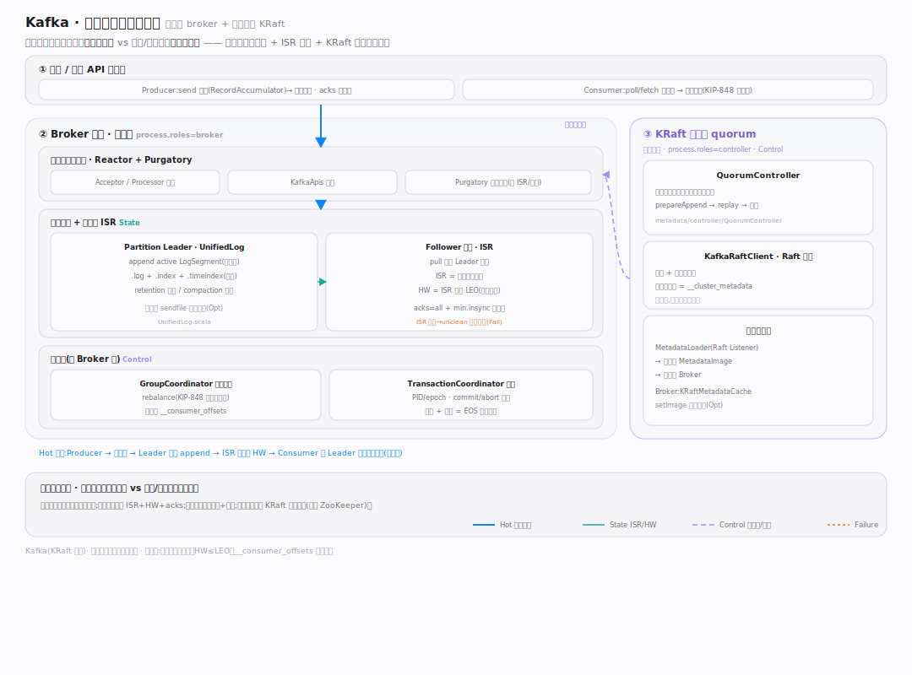
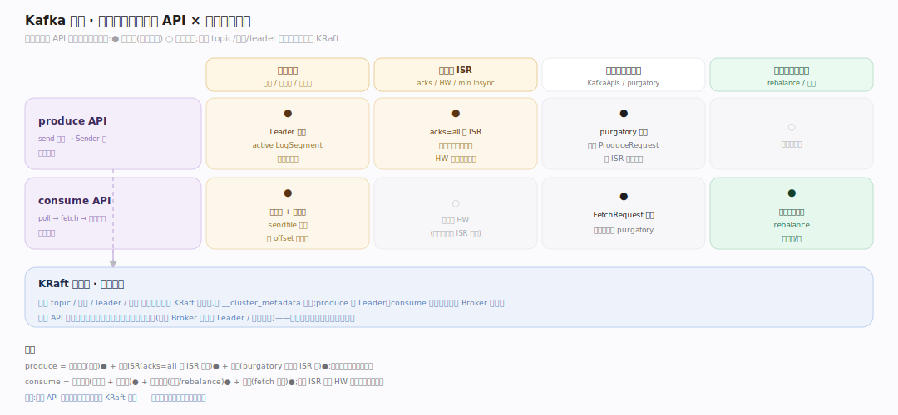
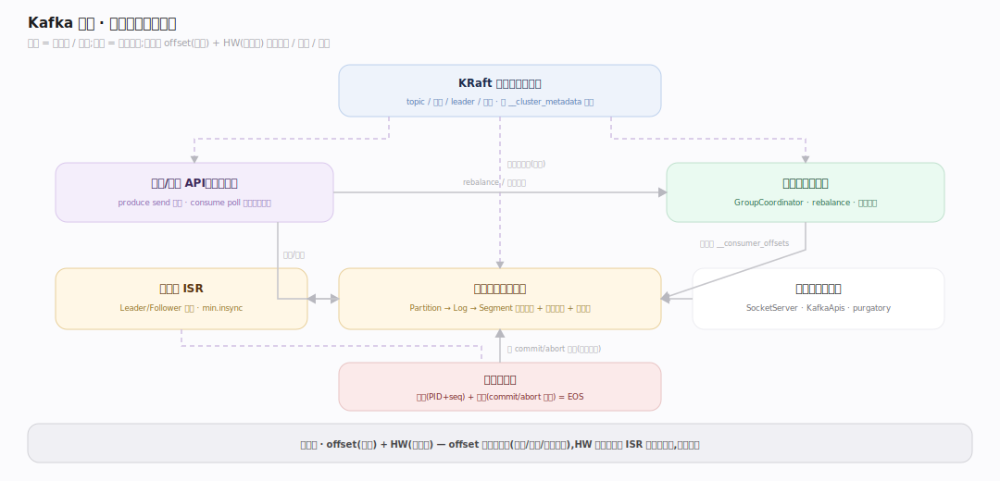

# Kafka 原理 · 全景主线框架

> 统领全部原理文档:Apache Kafka 是**分布式事件流平台**(新家族:消息/事件流——接触面是生产/消费 API,核心是分区的追加日志,靠副本 ISR 容错、KRaft 共识管元数据)。源码基准 **Kafka 4.4.0-SNAPSHOT**(`~/workdir/kafka`,git `da3b5e7`)。

Kafka 的世界观:一切都是**分区的追加日志(append-only log)**。生产者往日志尾追加、消费者按位点顺序读、副本复制日志保容错。它不像数据库(无查询优化/事务表),也不像 KV(无随机读写)——它是"把日志做到极致"的流平台。理解"分区日志 + ISR 副本 + KRaft 共识"三根支柱,就理解了 Kafka。

> **Kafka 4.x 结构提示(写文档必看)**:① **KRaft 取代 ZooKeeper**——元数据是一条 Raft 复制的事件日志(`__cluster_metadata`),ZK 已彻底移除;② 日志/记录子系统已**从 Scala 迁到 Java**(`UnifiedLog`/`LogManager`/`LogSegment`/`LogCleaner` 在 `storage/`),`core` 里的 Scala shim 只剩薄封装;③ `MetadataCache` 也已 Java 化(`metadata/`);④ 控制平面网络路径已移除(SocketServer 只剩 data-plane)。

---

## 一、双维模型:能力域 × 执行时机

- **能力域**:接触面(生产/消费 API)面向用户;支撑侧——日志存储、副本与 ISR、消费者组与协调、KRaft 元数据、网络与请求处理、事务与幂等。
- **执行时机**:前台(produce/fetch 请求路径、KafkaApis 分派)vs 后台(日志 retention/compaction 清理、ISR 收缩扩张、副本 fetch 线程、延迟操作 purgatory 到期)。

---

## 二、总架构图(位置即语义)

生产者 `send` 攒批 → 经网络到 Broker → `KafkaApis` 分派 → Leader 的 `UnifiedLog` 追加到 active LogSegment(`.log`+`.index`+`.timeindex`)→ Follower 通过 fetch 线程复制、进 ISR → HW 推进后对消费者可见 → 消费者 poll/fetch 顺序读、提交位点到 `__consumer_offsets`。集群元数据由 **KRaft 控制器**(QuorumController + KafkaRaftClient)以事件日志形式管理、经 `__cluster_metadata` 传播给所有 Broker。

---

## 三、8 条主线的分层归位

| 层 | 主线 | 一句话职责 |
|---|---|---|
| 接触面 | **生产/消费 API** | send 攒批分区 / poll fetch 提交位点 |
| 存储 | **日志存储(核心)** | Topic→Partition→Log→Segment 追加日志 + 稀疏索引 + 零拷贝 |
| 复制 | **副本与 ISR** | Leader/Follower 复制、ISR、高水位、min.insync.replicas |
| 协调 | **消费者组与协调** | GroupCoordinator、rebalance、位点管理 |
| 元数据 | **KRaft 元数据(灵魂)** | QuorumController + Raft 事件日志 + 元数据传播 |
| 通信 | **网络与请求处理** | SocketServer、KafkaApis 分派、purgatory 延迟操作 |
| 一致性 | **事务与幂等** | 幂等生产者(PID+seq)、事务(2PC 标记) |

---

## 四、接触面 × 能力域 依赖矩阵

produce 依赖日志存储(追加)+ 副本 ISR(acks=all 等 ISR 确认)+ 网络(purgatory 延迟到 ISR 齐);consume 依赖日志存储(顺序读+零拷贝)+ 消费者组(位点/rebalance);一切元数据(topic/分区/leader)来自 KRaft。

---

## 五、能力域依赖关系图

实线=数据流/调用,虚线=状态约束。贯穿层:**offset(位点)与 HW(高水位)** 横切存储/复制/消费——offset 是日志的地址,HW 是"已复制到 ISR、可见"的边界。

---

## 六、三条贯穿声明(Kafka 区别于数据库/KV)

1. **一切是分区的追加日志**:没有随机写、没有 update-in-place。Topic 分成 Partition,每个 Partition 是一条只追加的日志,切成不可变 Segment;顺序写 + 页缓存 + 零拷贝(sendfile)是它高吞吐的根基。

2. **容错靠副本 ISR,不靠共享存储**:每个 Partition 有 Leader + Follower 副本,Follower 拉取复制;ISR(同步副本集)+ 高水位 + `acks=all` + `min.insync.replicas` 共同定义"写成功且不丢"的语义——HW 只在 ISR 足够时推进。

3. **KRaft 用共识管元数据(4.x 立身之本)**:ZooKeeper 已移除;集群元数据(topic/分区/leader/配置)本身是一条 **Raft 复制的事件日志**,由 QuorumController 单线程处理、经 `__cluster_metadata` 传播给所有 Broker——元数据即日志,与数据日志同构。

---

**一句话定位**:Kafka 是把"分区追加日志"做到极致的分布式事件流平台——生产者顺序追加、消费者按位点顺序读、副本 ISR 复制保容错(HW+acks+min.insync 定义不丢语义)、KRaft 共识以事件日志管元数据(替代 ZooKeeper);高吞吐靠顺序写+页缓存+零拷贝,不做查询优化也不做随机读写。
