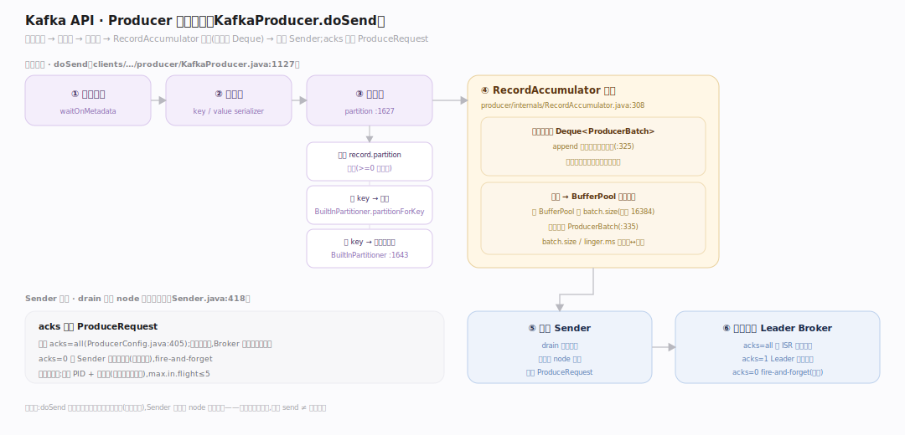
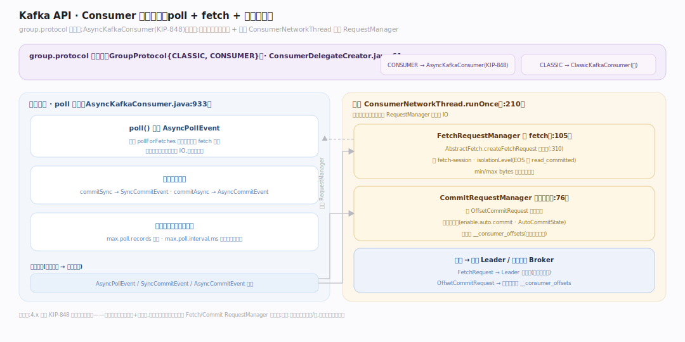
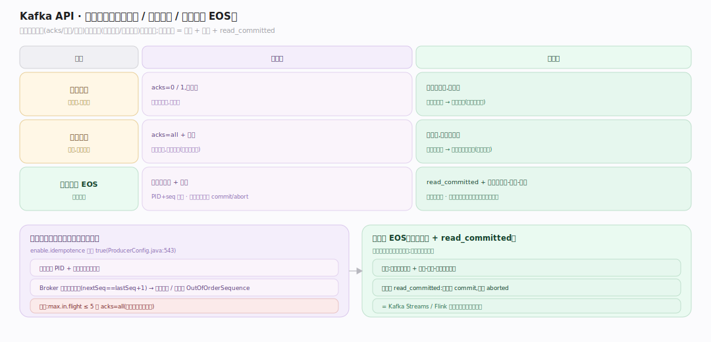

# Kafka 原理 · 接触面主线 · 生产与消费 API

> **定位**：属"接触面主线"(用户可见)。Kafka 的接触面是**生产/消费 API**(非 SQL、非文件系统):Producer 攒批发送、Consumer 拉取消费提交位点、投递语义(至少一次/精确一次)。调用【日志存储】追加/读取、依赖【副本与 ISR】的 acks、【消费者组与协调】管 rebalance。源码基准 **Kafka 4.4.0-SNAPSHOT**(`clients/.../producer/`、`clients/.../consumer/`)。

用户怎么和 Kafka 打交道?两个客户端:**Producer**(往 topic 分区追加消息)与 **Consumer**(按位点顺序读)。它们看似简单,内藏关键机制:Producer 的攒批与分区选择、Consumer 的拉取与位点提交、以及贯穿两者的投递语义。4.x 引入 KIP-848 新消费者协议(服务端主导分配)。

---

## 一、Producer 发送路径:攒批 + 分区 + acks

`KafkaProducer.doSend`(`clients/.../producer/KafkaProducer.java:1127`)核心路径:等元数据 → 序列化 key/value → 算分区 → 追加到累积器 → 唤醒 Sender 线程。

- **分区选择**(`partition()`,`:1627`):显式 `record.partition()` 优先;否则自定义 partitioner 插件;否则按 key 哈希(`BuiltInPartitioner.partitionForKey`);无 key 则累积器自适应粘性选择(`:1643`)。
- **攒批**(`RecordAccumulator`):每分区一个 `Deque<ProducerBatch>`,`append` 往最后一个批追加(`:325`),满则从 `BufferPool` 分配 `batch.size`(默认 16384)缓冲建新批(`:335`)。攒批是吞吐关键——多条消息合并成一个批一次发。
- **acks**(默认 `all`,`ProducerConfig.java:405`):写进 `ProduceRequest`;`acks=0` 时 fire-and-forget、Sender 本地完成批(不等响应)。Sender `drain` 后按 node 组请求发送(`Sender.java:418`)。

---

## 二、Consumer 消费路径:poll + fetch + 提交位点

`group.protocol` 选实现(`GroupProtocol{CLASSIC, CONSUMER}`,默认 CLASSIC):`CONSUMER` → `AsyncKafkaConsumer`(KIP-848);否则 `ClassicKafkaConsumer`(`ConsumerDelegateCreator.java:61`)。

- **异步消费者 = 双线程事件模型**:应用线程 `poll()` 提交 `AsyncPollEvent`、循环 `pollForFetches`(`AsyncKafkaConsumer.java:933`);后台 `ConsumerNetworkThread.runOnce` 排空事件、驱动各 RequestManager 与网络(`ConsumerNetworkThread.java:210`)。
- **拉取**:`FetchRequestManager` 备 fetch(`:105`),`AbstractFetch.createFetchRequest` 建请求带 fetch-session、`isolationLevel`(EOS 用 read_committed)、min/max bytes(`:310`)。
- **位点提交**:`commitSync` → `SyncCommitEvent`,`commitAsync` → `AsyncCommitEvent`;后台 `CommitRequestManager` 建 `OffsetCommitRequest`、管自动提交(`enable.auto.commit`,`AutoCommitState`)。

---

## 三、投递语义:至少一次 / 精确一次

| 语义 | 生产端 | 消费端 |
|---|---|---|
| **至多一次** | acks=0/1,不重试 | 先提交位点再处理 |
| **至少一次** | acks=all + 重试 | 先处理再提交位点(可能重复) |
| **精确一次(EOS)** | 幂等生产者 + 事务 | read_committed + 事务性消费-处理-生产 |

- **幂等生产者**(默认开,`enable.idempotence=true`,`ProducerConfig.java:543`):每消息带 PID + 序列号,Broker 校验序列连续(`ProducerAppendInfo.checkSequence`,`storage/.../log/ProducerAppendInfo.java:156`),重复批被去重、乱序抛 `OutOfOrderSequenceException`——单分区不重不乱。要求 `max.in.flight ≤ 5` 且 `acks=all`。
- **事务**:跨分区原子写 + 消费-处理-生产原子性,靠 TransactionCoordinator 写 commit/abort 标记(见事务与幂等篇)。

---

## 拓展 · API 关键结构一览

| 结构 | 定义 | 职责 |
|---|---|---|
| KafkaProducer.doSend | `producer/KafkaProducer.java:1127` | 序列化→分区→攒批→唤醒 Sender |
| RecordAccumulator | `producer/internals/RecordAccumulator.java:308` | 每分区攒批 |
| BuiltInPartitioner | `producer/internals/BuiltInPartitioner.java:74` | 粘性/自适应分区 |
| AsyncKafkaConsumer | `consumer/internals/AsyncKafkaConsumer.java:933` | KIP-848 双线程消费者 |
| FetchRequestManager | `consumer/internals/FetchRequestManager.java:105` | 备 fetch 请求 |
| CommitRequestManager | `consumer/internals/CommitRequestManager.java:76` | 位点提交/自动提交 |

## 调优要点（关键开关）

- **batch.size / linger.ms**:攒批大小与等待;调大提吞吐、增延迟。
- **acks / enable.idempotence**:不丢+不重用 acks=all + 幂等(默认开)。
- **max.in.flight.requests.per.connection**:幂等下 ≤5 保序;否则重试可能乱序。
- **max.poll.records / max.poll.interval.ms**:消费批大小与处理超时;处理慢调大 interval 防被踢。
- **enable.auto.commit**:精确控制位点则关自动提交、手动 commit。

## 常见误区与工程要点

- **误区:一条 send 一次网络。** 攒批:多条合并成 ProducerBatch 一次发,batch.size/linger.ms 控制。
- **误区:消费者读完消息就删。** 消费只推进位点,数据按 retention 淘汰;可重置位点重读。
- **误区:精确一次只靠幂等生产者。** 幂等只保单分区不重不乱;端到端 EOS 还需事务 + read_committed 消费。
- **误区:自动提交安全。** 自动提交可能在处理前就提交(丢)或处理后未提交(重);严格语义要手动提交。
- **归属提醒**:追加/读取的日志在【日志存储】;acks 等 ISR 确认在【副本与 ISR】;rebalance/位点存储在【消费者组与协调】;PID/事务在【事务与幂等】。

## 一句话总纲

**Kafka 接触面是生产/消费 API:Producer 的 doSend 序列化→选分区(显式/key哈希/粘性自适应)→RecordAccumulator 每分区攒批(batch.size/linger.ms)→Sender 按 node 组发,acks 定确认强度;Consumer(4.x 默认 KIP-848 双线程异步模型)poll 循环拉取、按 isolationLevel 读、经 CommitRequestManager 提交位点;投递语义从至多一次到精确一次,幂等生产者(默认开,PID+序列号,Broker 校验连续去重)保单分区不重不乱,端到端 EOS 再叠事务+read_committed。**
