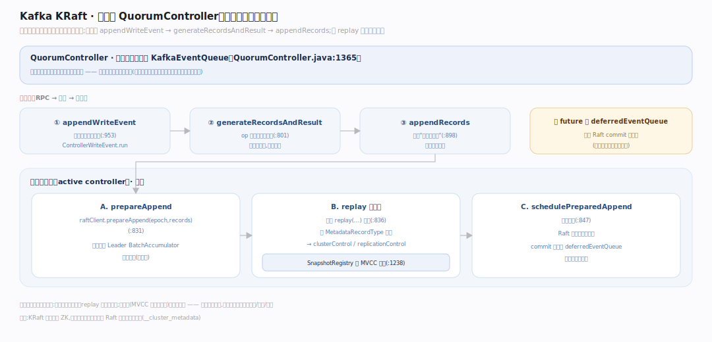
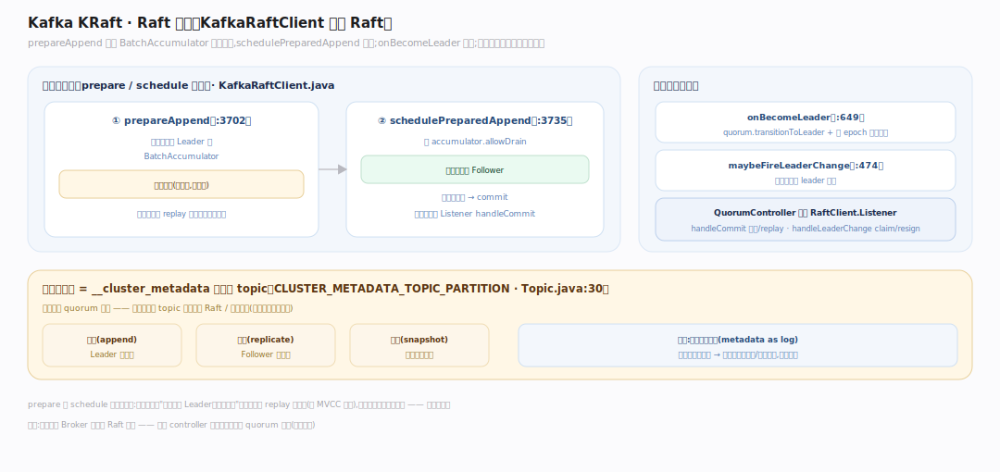
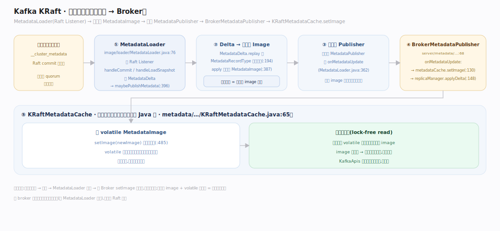
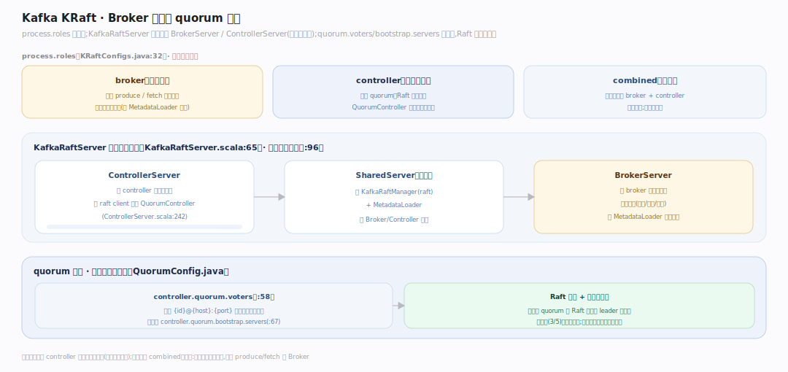

# Kafka 原理 · 支撑主线 · KRaft 元数据

> **定位**：属"元数据/共识能力域"——Kafka 4.x 的灵魂与最大变革。管集群元数据(topic/分区/leader/配置)的存储与传播:元数据本身是一条 **Raft 复制的事件日志**,由 QuorumController 单线程处理、经 `__cluster_metadata` 传播给所有 Broker。**ZooKeeper 已彻底移除。** 源码基准 **Kafka 4.4.0-SNAPSHOT**(`metadata/.../controller/`、`raft/.../raft/`)。

老 Kafka 靠 ZooKeeper 存元数据——外部依赖、扩展性瓶颈、双系统一致性难题。**KRaft**(Kafka Raft)把元数据管理内建进 Kafka 自己:集群元数据不再存在 ZK,而是一条**自我复制的事件日志**(`__cluster_metadata` topic),用 Raft 共识保证多控制器间一致。理解 KRaft 的关键洞察:**元数据即日志**——与数据日志同构,同样是追加、复制、快照。

---

## 一、KRaft 控制器:元数据即事件日志

**QuorumController**(`metadata/.../controller/QuorumController.java:1365`)在**单线程事件队列**(KafkaEventQueue)上处理所有元数据变更——单线程消除并发、保证确定性。

写路径(RPC→记录→日志):写请求 → `appendWriteEvent`(`:953`)→ `ControllerWriteEvent.run` 调 `op.generateRecordsAndResult`(`:801`)产出元数据记录 → `appendRecords`(`:898`)。

**先写后应用(active controller)**:`raftClient.prepareAppend(epoch, records)`(`:831`)→ 立即 `replay(...)` 进内存(`:836`)→ `schedulePreparedAppend`(`:847`);写 future 挂在 `deferredEventQueue` 直到 commit。replay 按 `MetadataRecordType` 分派到各域管理器(`clusterControl`/`replicationControl`),用 `SnapshotRegistry` 做 MVCC 快照(`:1238`)。

---

## 二、Raft 共识:KafkaRaftClient

底层 **KafkaRaftClient**(`raft/.../raft/KafkaRaftClient.java`)是标准 Raft:

- `prepareAppend` 把记录追加到 Leader 的 `BatchAccumulator`(暂不复制,`:3702`),`schedulePreparedAppend` 调 `accumulator.allowDrain` 放行复制(`:3735`)。
- 选举:`onBecomeLeader` → `quorum.transitionToLeader` + 写 epoch 起始记录(`:649`);监听者经 `maybeFireLeaderChange` 通知(`:474`)。
- QuorumController 作为 `RaftClient.Listener`(`QuorumMetaLogListener`,`QuorumController.java:976`):`handleCommit` 推进 offset(active)/replay(standby),`handleLeaderChange` → `claim`(成 Leader)/ `resign`(退位)。

元数据日志 = `__cluster_metadata` 单分区 topic(`CLUSTER_METADATA_TOPIC_PARTITION`,`Topic.java:30`),由控制器 quorum 复制——与普通数据 topic 同一套 Raft/日志机制。

---

## 三、元数据传播:控制器 → Broker

元数据从控制器流到每个 Broker:

- **MetadataLoader**(`metadata/.../image/loader/MetadataLoader.java:76`)是 Raft Listener:`handleCommit`/`handleLoadSnapshot` 建 `MetadataDelta`、调 `maybePublishMetadata`(`:396`)。
- **Delta → 不可变 Image**:`MetadataDelta.replay` 按 `MetadataRecordType` 分域重放(`image/MetadataDelta.java:194`),`apply` 构建新的不可变 `MetadataImage`(`:387`)——每次元数据变更产生一个新 image 快照。
- **扇出到 Publisher**:遍历 `MetadataPublisher` 调 `onMetadataUpdate`(`MetadataLoader.java:362`)。
- **Broker 应用**:`BrokerMetadataPublisher`(`core/.../server/metadata/BrokerMetadataPublisher.scala:68`)`onMetadataUpdate` → `metadataCache.setImage(newImage)`(`:130`)+ `replicaManager.applyDelta`(`:148`)。
- **MetadataCache**(已 Java 化,`metadata/.../metadata/KRaftMetadataCache.java:65`)持 `volatile MetadataImage`,`setImage` 原子换引用(`:485`),查询从中读——**无锁读**当前元数据视图。

---

## 四、Broker 角色与 quorum 形成

`process.roles` 定义节点角色(`raft/.../raft/KRaftConfigs.java:32`):`broker`(数据面)/ `controller`(元数据面)/ 两者(combined 模式)。

- 启动:`KafkaRaftServer`(`KafkaRaftServer.scala:65`)按角色建 `BrokerServer`(有 broker 角色)和/或 `ControllerServer`(有 controller 角色),控制器先启动(`:96`)。
- **SharedServer** 持 `KafkaRaftManager`(raft)+ `MetadataLoader`;ControllerServer 把 raft client 注入 QuorumController(`ControllerServer.scala:242`)。
- **quorum**:`controller.quorum.voters`(`{id}@{host}:{port}`,`QuorumConfig.java:58`)或新的 `controller.quorum.bootstrap.servers`(`:67`)定义控制器投票成员;控制器 quorum 用 Raft 选主、多数派提交元数据。

生产部署常把 controller 独立成专用节点(隔离元数据面),小集群可用 combined 模式。

---

## 拓展 · KRaft 关键结构一览

| 结构 | 定义 | 职责 |
|---|---|---|
| QuorumController | `controller/QuorumController.java:1365` | 单线程处理元数据变更 |
| KafkaRaftClient | `raft/.../raft/KafkaRaftClient.java` | Raft 共识(选举/复制/提交) |
| MetadataLoader | `image/loader/MetadataLoader.java:76` | Raft Listener,建 delta 发布 |
| MetadataImage / Delta | `image/MetadataDelta.java:194` | 不可变元数据快照 + 增量 |
| KRaftMetadataCache | `metadata/.../metadata/KRaftMetadataCache.java:65` | Broker 侧无锁元数据视图 |
| controller.quorum.* | `raft/.../raft/QuorumConfig.java:58` | 控制器 quorum 成员定义 |

## 调优要点（关键开关）

- **process.roles**:生产环境控制器独立(隔离元数据面);小集群 combined。
- **controller.quorum.voters / bootstrap.servers**:控制器成员;奇数个(3/5)便于多数派。
- **metadata.log.***:元数据日志的段/快照参数,类比数据日志。
- **迁移**:从 ZK 版升级需 ZK→KRaft 迁移;4.x 起纯 KRaft、无 ZK 回退。

## 常见误区与工程要点

- **误区:KRaft 只是把 ZK 内嵌。** 不。元数据变成一条 Raft 复制的**事件日志**(与数据日志同构),不是内嵌一个 ZK;架构上更简、扩展性更好。
- **误区:控制器处理数据请求。** 控制器只管元数据;数据 produce/fetch 走 Broker。combined 模式下同进程但职责分离。
- **误区:每个 Broker 都参与 Raft 选举。** 只有 controller 角色的节点组成 quorum 投票;纯 broker 角色只是元数据的消费者(经 MetadataLoader 应用)。
- **误区:元数据变更立即全局生效。** 控制器提交后经 `__cluster_metadata` 复制、MetadataLoader 发布、各 Broker `setImage` 才应用——有传播延迟(最终一致)。
- **归属提醒**:元数据日志复用【日志存储】机制;Raft 复制类比【副本与 ISR】但用于元数据;Broker 应用元数据后驱动【副本与 ISR】的分区 leader 分配。

## 一句话总纲

**KRaft 是 Kafka 4.x 用共识内建元数据管理、彻底取代 ZooKeeper 的方案:集群元数据(topic/分区/leader/配置)本身是一条 Raft 复制的事件日志(__cluster_metadata 单分区),QuorumController 单线程处理变更(先 prepareAppend+replay 进内存、再 schedulePreparedAppend 复制),经 MetadataLoader 把提交的记录构建成不可变 MetadataImage、扇出给各 Broker 的 KRaftMetadataCache 无锁应用;process.roles 分 broker/controller 角色,controller quorum 用 Raft 选主提交——核心洞察是"元数据即日志",与数据日志同构。**
