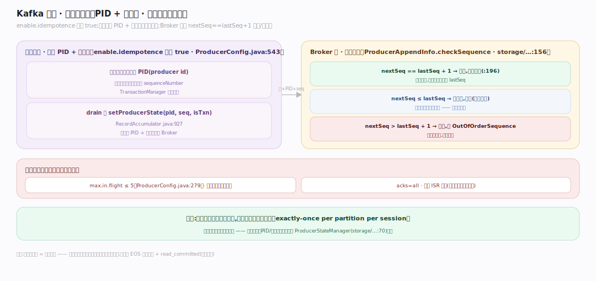
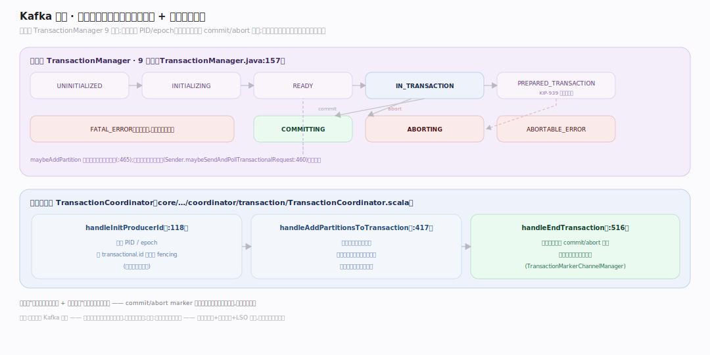
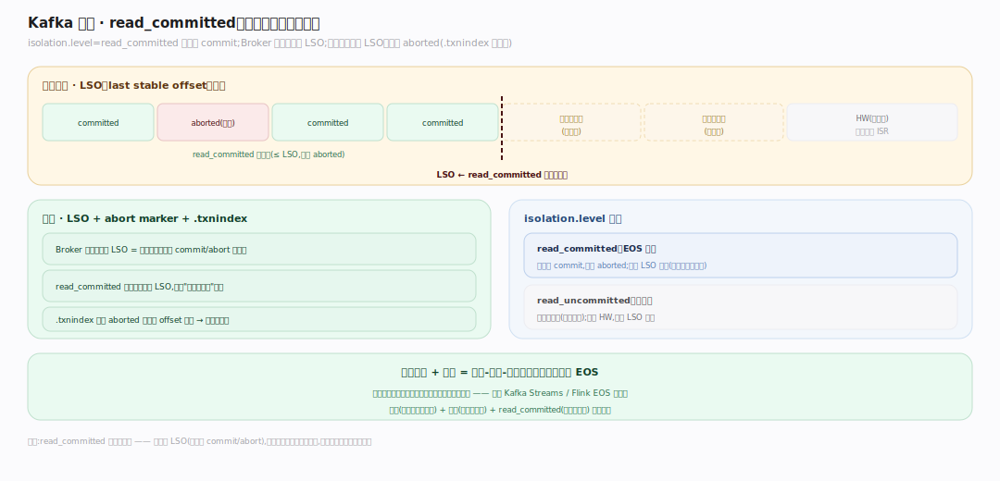

# Kafka 原理 · 支撑主线 · 事务与幂等

> **定位**：属"一致性能力域"。管精确一次(EOS)的两块基石:幂等生产者(PID + 序列号,单分区不重不乱)与事务(跨分区原子写 + 消费-处理-生产原子性)。依赖【日志存储】写事务标记、【副本与 ISR】的 acks=all、被【生产/消费 API】的 EOS 语义使用。源码基准 **Kafka 4.4.0-SNAPSHOT**(`clients/.../producer/internals/TransactionManager.java`、`core/.../coordinator/transaction/`)。

网络会重传、生产者会重试——怎么保证消息不重不丢不乱?两层:**幂等生产者**解决单分区的重复与乱序(默认开),**事务**解决跨分区原子性与"消费-处理-生产"闭环的精确一次。这是 Kafka 支撑 EOS 流处理(如 Flink/Kafka Streams)的底座。

---

## 一、幂等生产者:PID + 序列号

`enable.idempotence` 默认 `true`(`ProducerConfig.java:543`)。机制:

- 每个生产者领一个 **PID**(producer id),每分区维护递增**序列号**;`TransactionManager.sequenceNumber()` 给批分配、drain 时 `batch.setProducerState(pid, seq, isTxn)`(`RecordAccumulator.java:927`)。
- **Broker 校验**:`ProducerAppendInfo.checkSequence`(`storage/.../log/ProducerAppendInfo.java:156`)校验序列连续——`nextSeq == lastSeq+1`(`:196`);重复序列的批被去重(重传不重复写),乱序抛 `OutOfOrderSequenceException`。
- 要求:`max.in.flight ≤ 5`(`ProducerConfig.java:279`)且 `acks=all`——否则重试可能乱序。

效果:**单个生产者对单个分区,不重复不乱序**(exactly-once per partition per session)。但跨分区、跨会话不保证——那要事务。

---

## 二、事务:跨分区原子写

事务让"一批跨多分区的写 + 位点提交"要么全成要么全不:

- **客户端状态机**(`TransactionManager.java:157`)9 态:`UNINITIALIZED/INITIALIZING/READY/IN_TRANSACTION/PREPARED_TRANSACTION/COMMITTING/ABORTING/ABORTABLE_ERROR/FATAL_ERROR`(`PREPARED_TRANSACTION` 支持 KIP-939 两阶段提交)。`maybeAddPartition` 把分区登记进当前事务(`:465`)。
- **事务协调器**(`core/.../coordinator/transaction/TransactionCoordinator.scala`):`handleInitProducerId`(`:118`,分配 PID/epoch)、`handleAddPartitionsToTransaction`(`:417`)、`handleEndTransaction`(`:516`,写 commit/abort 标记)。
- **commit/abort 标记**:事务结束时协调器往涉及的分区写**控制记录**(commit 或 abort marker),标记事务边界。

事务性请求串行发送(`Sender.maybeSendAndPollTransactionalRequest`,`Sender.java:460`),保证顺序。

---

## 三、read_committed:消费端只读已提交

事务的另一半在消费端:`isolation.level=read_committed` 时,消费者只读**已 commit** 的事务消息,跳过 aborted 的:

- Broker 维护每分区的 **LSO**(last stable offset,最后一个已确定 commit/abort 的位置);read_committed 消费者只读到 LSO,不读"进行中事务"的消息。
- 事务的 abort marker 让消费者知道哪些消息该跳过(`.txnindex` 记录 aborted 事务的 offset 区间)。
- 配合幂等生产者 + 事务,实现**消费-处理-生产的精确一次**:读入位点提交与结果输出在同一事务里原子完成——这是 Kafka Streams / Flink EOS 的基础。

---

## 拓展 · 事务与幂等关键结构一览

| 结构 | 定义 | 职责 |
|---|---|---|
| TransactionManager | `producer/internals/TransactionManager.java:157` | 客户端事务/序列状态机 |
| ProducerAppendInfo.checkSequence | `storage/.../log/ProducerAppendInfo.java:156` | Broker 序列校验去重 |
| ProducerStateManager | `storage/.../log/ProducerStateManager.java:70` | 分区级 PID/序列状态 |
| TransactionCoordinator | `coordinator/transaction/TransactionCoordinator.scala:118` | 事务协调(PID/标记) |
| TransactionMarkerChannelManager | `coordinator/transaction/TransactionMarkerChannelManager.scala` | 写 commit/abort 标记 |

## 调优要点（关键开关）

- **enable.idempotence**(默认 true):单分区不重不乱;关掉退回可能重复。
- **transactional.id**:开事务必设;同 id 跨会话保证 fencing(旧生产者被隔离)。
- **max.in.flight.requests.per.connection ≤ 5**:幂等/事务下保序的前提。
- **isolation.level**:EOS 消费用 read_committed;默认 read_uncommitted 读所有(含未提交)。
- **transaction.timeout.ms**:事务超时未提交则 abort。

## 常见误区与工程要点

- **误区:幂等生产者 = 精确一次。** 幂等只保单生产者单分区单会话不重不乱;端到端 EOS 还需事务 + read_committed。
- **误区:事务能跨 Kafka 集群。** 事务在单集群内跨分区原子;跨集群不保证。
- **误区:read_committed 读不到最新。** 只读到 LSO(已确定 commit/abort);进行中事务的消息暂不可见——这是原子可见的代价。
- **误区:开事务不影响吞吐。** 事务有协调开销 + 标记写入 + LSO 约束;非必要 EOS 场景用幂等即可。
- **归属提醒**:PID/序列的分区状态在【日志存储】的 ProducerStateManager;commit/abort 标记是【日志存储】的控制记录;acks=all 依赖【副本与 ISR】;EOS 消费语义在【生产/消费 API】。

## 一句话总纲

**Kafka 精确一次分两层:幂等生产者(默认开,每生产者领 PID + 每分区递增序列号,Broker 校验 nextSeq==lastSeq+1 去重、乱序抛 OutOfOrderSequence,要求 max.in.flight≤5 + acks=all)保单分区单会话不重不乱;事务(TransactionManager 9 态机 + TransactionCoordinator 分配 PID/写 commit-abort 标记)保跨分区原子写,消费端 read_committed 只读到 LSO(已确定的 commit/abort)、跳过 aborted——两者叠加实现消费-处理-生产的端到端 EOS(Kafka Streams/Flink 的基础)。**
