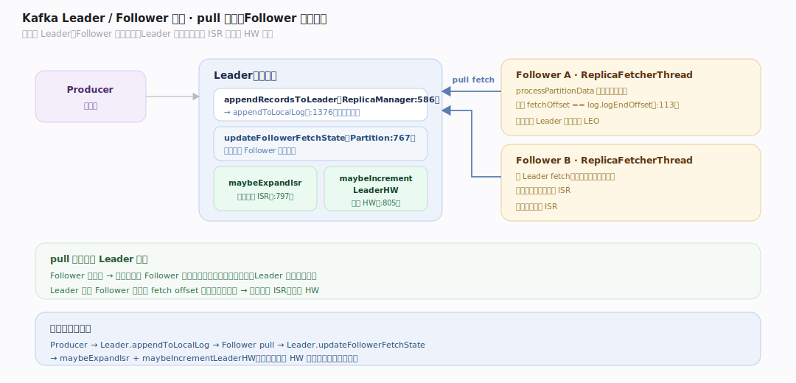
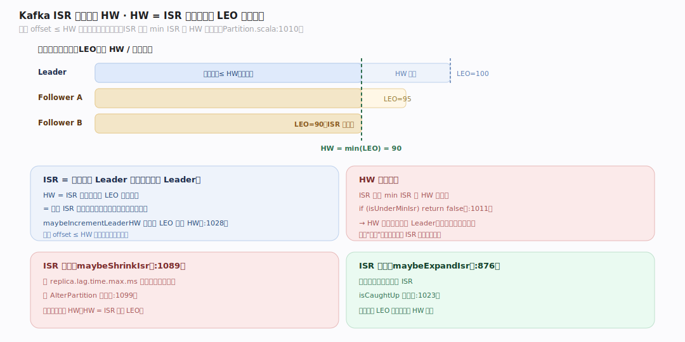
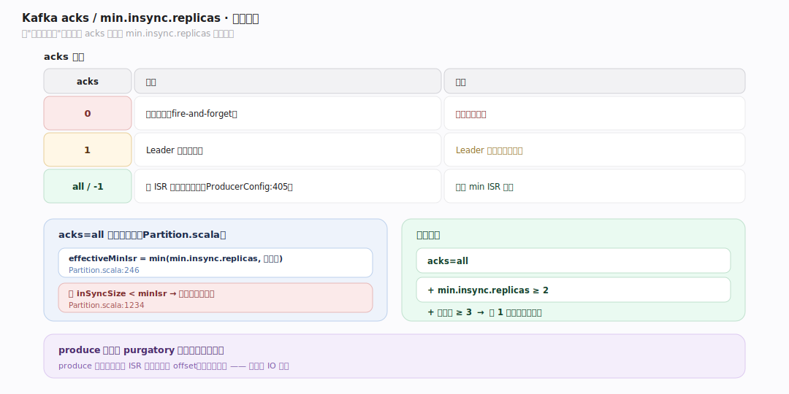
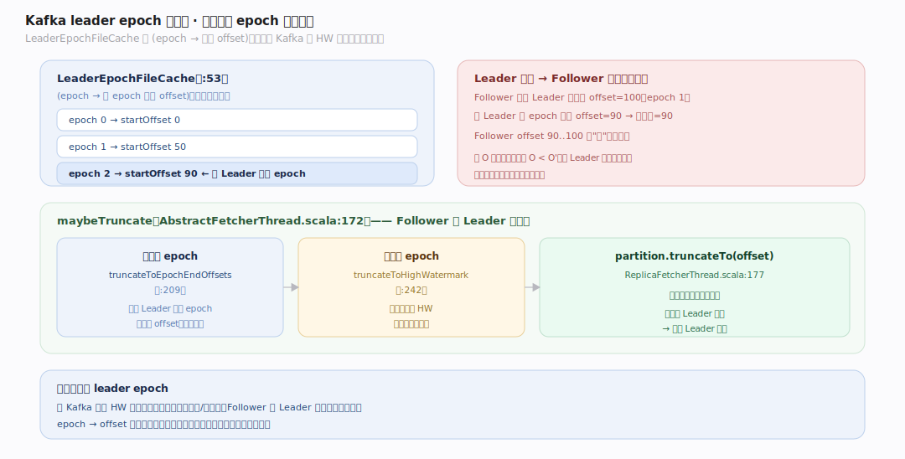

# Kafka 原理 · 支撑主线 · 副本与 ISR

> **定位**：属"容错能力域"。管数据不丢与高可用:Leader/Follower 复制、ISR(同步副本集)、高水位(HW)、`acks` 与 `min.insync.replicas`、leader epoch 与截断。依赖【日志存储】的日志、被【生产/消费 API】的 acks 语义使用、副本变更元数据来自【KRaft】。源码基准 **Kafka 4.4.0-SNAPSHOT**(`core/src/main/scala/kafka/cluster/Partition.scala`、`server/ReplicaManager.scala`)。

单机日志会随机器故障而丢。Kafka 让每个 Partition 有多个副本:一个 **Leader**(读写)+ 若干 **Follower**(拉取复制)。关键概念是 **ISR**(in-sync replicas,跟上进度的副本集)与 **高水位 HW**(已复制到 ISR、对消费者可见的边界)——它们与 `acks`/`min.insync.replicas` 一起定义"写成功且不丢"的确切语义。

---

## 一、Leader / Follower 复制

- 写只走 Leader:`ReplicaManager.appendRecordsToLeader`(`server/ReplicaManager.scala:586`)→ `appendToLocalLog`(`:1376`)。
- Follower 主动拉:`ReplicaFetcherThread` 从 Leader fetch(`core/.../server/ReplicaFetcherThread.scala`),`processPartitionData` 追加拉到的记录并校验 `fetchOffset == log.logEndOffset`(`:113`)。
- Leader 记录每个 Follower 的拉取进度:`Partition.updateFollowerFetchState`(`cluster/Partition.scala:767`)→ 触发 `maybeExpandIsr`(`:797`)+ `maybeIncrementLeaderHW`(`:805`)。

复制是 **pull 模型**(Follower 主动拉),不是 Leader 推——简化了流控与 Follower 落后处理。

---

## 二、ISR 与高水位（HW）

**ISR** = 当前跟上 Leader 的副本集(含 Leader)。**HW** = ISR 中所有副本 LEO(log end offset)的最小值——即"已被 ISR 都复制、可安全暴露给消费者"的边界。

- **HW 推进**:`maybeIncrementLeaderHW`(`Partition.scala:1010`)取 Leader 与所有 ISR Follower 的最小 LEO 作新 HW(`:1028`)。**守卫**:ISR 不足 min ISR 时 HW 不推进(`if (isUnderMinIsr) return false`,`:1011`)。
- **ISR 收缩**:`maybeShrinkIsr`(`:1089`)把超 `replica.lag.time.max.ms` 没跟上的副本移出 ISR,发 `AlterPartition` 请求(`:1099`)。
- **ISR 扩张**:`maybeExpandIsr`(`:876`)把追上的副本重新加入(`isCaughtUp` 判定,`:1023`)。
- 只有 offset ≤ HW 的消息对消费者可见——保证消费者读到的都是已复制的、不会因 Leader 故障丢失的数据。

---

## 三、acks / min.insync.replicas：不丢语义

写"成功且不丢"由生产者 `acks` 与主题 `min.insync.replicas` 共同定义:

| acks | 含义 | 保证 |
|---|---|---|
| `0` | 不等确认(fire-and-forget) | 最快,可能丢 |
| `1` | Leader 落盘即确认 | Leader 挂且未复制则丢 |
| `all`/`-1` | 等 ISR 都确认 | 配合 min ISR 不丢 |

`acks=all`(默认,`ProducerConfig.java:405`)时,`effectiveMinIsr = min(min.insync.replicas, 副本数)`(`Partition.scala:246`);若 `inSyncSize < minIsr` 则拒绝写并抛异常(`:1234`)。所以**不丢 = acks=all + min.insync.replicas≥2 + 副本数≥3**:至少 2 个副本确认才算成功,挂 1 个仍有完整数据。

生产端等待由 **purgatory** 延迟操作实现(见网络篇):produce 请求挂起直到 ISR 都复制到该 offset。

---

## 四、leader epoch 与截断

Leader 换届可能导致 Follower 日志与新 Leader 分叉。**LeaderEpochFileCache**(`storage/.../epoch/LeaderEpochFileCache.java:53`)存 `(epoch → 起始 offset)`,由控制器分配。

- Follower 换 Leader 后 `maybeTruncate`(`AbstractFetcherThread.scala:172`):有已知 epoch 的走 `truncateToEpochEndOffsets`(向新 Leader 查该 epoch 的结束 offset、算分叉点,`:209`),否则 `truncateToHighWatermark`(`:242`)。
- `partition.truncateTo(offset)`(`ReplicaFetcherThread.scala:177`)丢弃分叉点之后的记录,再从新 Leader 续拉——保证 Follower 与新 Leader 一致。

leader epoch 机制解决了老 Kafka 靠 HW 截断的一致性漏洞(极端场景可能丢/重数据)。

---

## 拓展 · 副本关键结构一览

| 结构 | 定义 | 职责 |
|---|---|---|
| ReplicaManager | `server/ReplicaManager.scala:586` | 管本 Broker 所有分区副本读写 |
| Partition | `cluster/Partition.scala:767` | 单分区:ISR/HW/复制状态 |
| ReplicaFetcherThread | `server/ReplicaFetcherThread.scala:113` | Follower 拉取复制 |
| maybeIncrementLeaderHW | `Partition.scala:1010` | HW 推进(ISR 最小 LEO) |
| LeaderEpochFileCache | `storage/.../epoch/LeaderEpochFileCache.java:53` | epoch→offset,换届截断依据 |

## 调优要点（关键开关）

- **replication.factor**:副本数;生产环境 ≥3 才容忍单机故障。
- **min.insync.replicas**:配合 acks=all;≥2 保证挂 1 个不丢。
- **acks**:不丢用 all;极致吞吐可 1(容忍少量丢)。
- **replica.lag.time.max.ms**:Follower 落后多久移出 ISR;太小频繁抖动、太大 HW 被慢副本拖住。
- **unclean.leader.election.enable**:默认 false(不选落后副本当 Leader,保一致);开则可用性优先但可能丢。

## 常见误区与工程要点

- **误区:副本数=3 就不丢。** 还需 acks=all + min.insync.replicas≥2;否则 acks=1 时 Leader 挂仍丢。
- **误区:消费者能读到 Leader 最新写。** 只能读到 ≤ HW 的;未被 ISR 复制的(HW 之上)不可见——这是不丢的代价。
- **误区:ISR 越大越好。** ISR 大则 HW 被最慢副本拖住(HW=ISR 最小 LEO);慢副本会被 replica.lag 移出。
- **误区:复制是 Leader 推。** 是 Follower 主动拉(pull),简化流控。
- **归属提醒**:被复制的日志在【日志存储】;produce 等 ISR 确认的挂起在【网络与请求处理】purgatory;副本分配/leader 选举元数据在【KRaft】;acks 语义在【生产/消费 API】。

## 一句话总纲

**Kafka 靠副本 ISR 容错:每个 Partition 一个 Leader(读写)+ 若干 Follower(pull 复制),ISR=跟上进度的副本集,高水位 HW=ISR 中最小 LEO(=已复制、对消费者可见的边界,ISR 不足 min ISR 时不推进);不丢语义 = acks=all(等 ISR 确认)+ min.insync.replicas≥2 + 副本≥3;Leader 换届靠 leader epoch 记录 (epoch→offset),Follower 据此算分叉点截断再续拉,保证与新 Leader 一致。**
