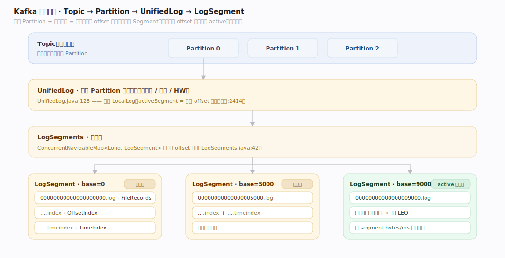
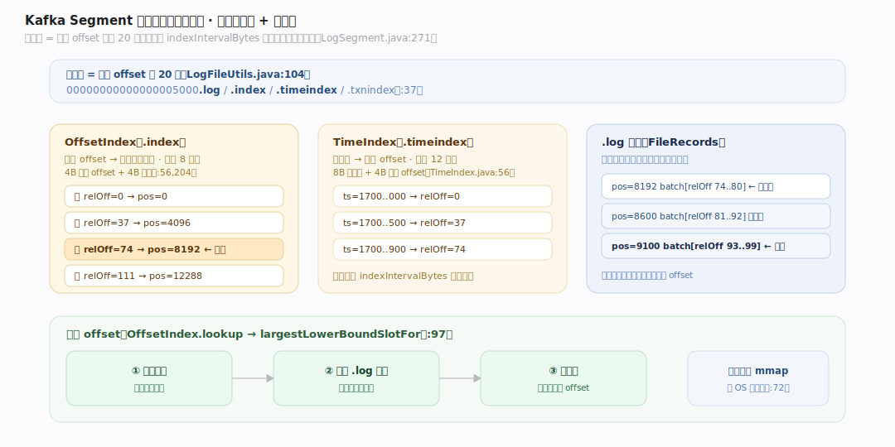
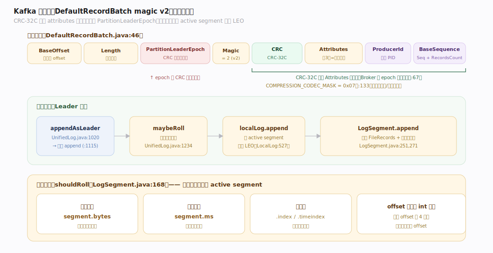
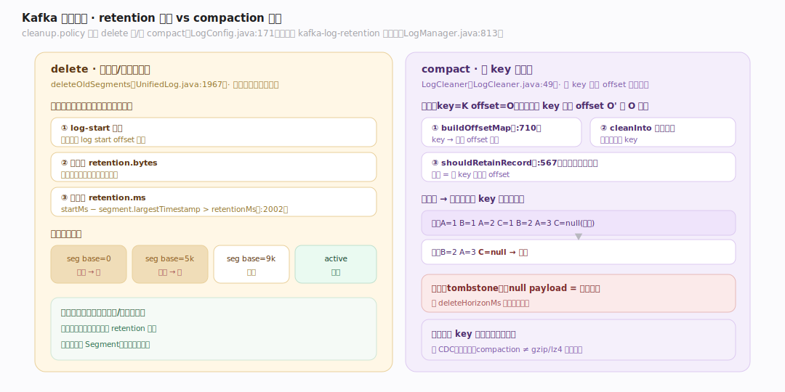
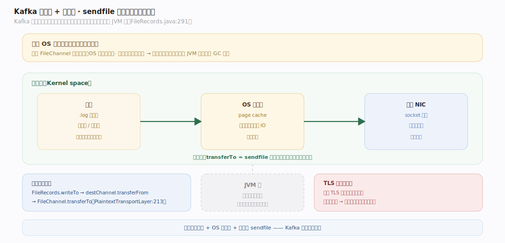

# Kafka 原理 · 支撑主线 · 日志存储

> **定位**：属"存储能力域"——Kafka 的核心。管数据的物理组织:Topic→Partition→Log→LogSegment 的追加日志、稀疏索引、记录批格式、retention 与 compaction、页缓存与零拷贝。被【生产/消费 API】追加与读取、被【副本与 ISR】复制。源码基准 **Kafka 4.4.0-SNAPSHOT**(`storage/src/main/java/org/apache/kafka/storage/internals/log/`)。

Kafka 的一切建立在一个朴素结构上:**只追加的日志(append-only log)**。没有随机写、没有 update-in-place——写永远在尾部追加,读按位点(offset)顺序扫。这让写变成顺序 IO(极快),配合稀疏索引定位、零拷贝传输,撑起了 Kafka 的高吞吐。4.x 里这套子系统已从 Scala 迁到 Java(`storage/`),`core` 里只剩薄封装。

---

## 一、层级：Topic → Partition → Log → Segment

- Broker 在 `allPartitions`(`ConcurrentHashMap[TopicPartition, HostedPartition]`,`core/src/main/scala/kafka/server/ReplicaManager.scala:212`)里持有各分区,每个在线分区包一个 **UnifiedLog**(`storage/.../log/UnifiedLog.java:128`)。
- UnifiedLog 内是 **LocalLog**,它把 Segment 存成 `LogSegments`——一个按**基准 offset** 排序的 `ConcurrentNavigableMap<Long, LogSegment>`(`storage/.../log/LogSegments.java:42`)。
- **LogSegment**(`storage/.../log/LogSegment.java:66`)捆绑物理文件:`FileRecords log`(.log)、`LazyIndex<OffsetIndex>`、`LazyIndex<TimeIndex>`(`:80`)。
- 只有基准 offset 最高的是 **active segment**,可追加;其余不可变(`activeSegment`,`UnifiedLog.java:2414`)。

Topic 是逻辑名,Partition 才是并行与复制单位;一个 Partition = 一条日志 = 一串 Segment。

---

## 二、Segment 磁盘格式：.log + .index + .timeindex（稀疏）

文件名 = 基准 offset 补齐 20 位(`LogFileUtils.java:104`),后缀 `.log`/`.index`/`.timeindex`/`.txnindex`(`:37`)。

- **OffsetIndex**:相对 offset → 物理字节位置,每条 **8 字节**(4 字节相对 offset + 4 字节位置,`OffsetIndex.java:56,204`)。存相对 offset 才能只用 4 字节。
- **TimeIndex**:时间戳 → 相对 offset,每条 **12 字节**(8 字节时间戳 + 4 字节相对 offset,`TimeIndex.java:56`)。
- **稀疏**:每累积 `indexIntervalBytes` 字节才加一条索引(`LogSegment.java:271`)——索引小到能内存映射常驻。查找:二分找最大下界槽(`OffsetIndex.lookup→largestLowerBoundSlotFor`,`:97`),再从该位置顺序扫 .log。
- 索引**内存映射**(`AbstractIndex` 的 `MappedByteBuffer mmap`,`:72`),走 OS 缓冲区直接访问。

---

## 三、记录批格式（magic v2）与追加路径

**记录批 DefaultRecordBatch**(`clients/.../record/internal/DefaultRecordBatch.java:46`)头含 BaseOffset/Length/PartitionLeaderEpoch/Magic/**CRC**/Attributes/…/ProducerId/ProducerEpoch/BaseSequence/RecordsCount。CRC 是 **CRC-32C**,覆盖 attributes 到批尾但**排除 PartitionLeaderEpoch**(Broker 盖 epoch 时不用重算 CRC,`:67`)。Attributes 低 3 位是压缩编码(`COMPRESSION_CODEC_MASK=0x07`,`:133`),另有事务/控制标记位。

**追加路径**:`appendAsLeader`/`appendAsFollower`(`UnifiedLog.java:1020,1080`)→ 私有 `append`(`:1115`)→ 先 `maybeRoll`(判是否滚新段,`:1234`)→ `localLog.append` 写 active segment + 更新 LEO(`LocalLog.java:527`)→ `LogSegment.append` 追加 FileRecords + 条件加索引(`:251,271`)。

**滚段触发**(`shouldRoll`,`LogSegment.java:168`):段大小超 `segment.bytes` / 非空且超 `segment.ms` / 索引满 / offset 超相对 int 范围。

---

## 四、retention 删除 vs compaction 压缩

`cleanup.policy` 可为 `delete` 和/或 `compact`(`LogConfig.java:171`),后台 `kafka-log-retention` 任务周期跑(`LogManager.java:813`)。

- **删除 retention**(delete):`deleteOldSegments`(`UnifiedLog.java:1967`)按三条谓词删:log-start 越界 / 大小超 `retention.bytes` / 时间超 `retention.ms`(`startMs - segment.largestTimestamp > retentionMs`,`:2002`)。整段删除,不改段内。
- **压缩 compaction**(compact,基于 key):`LogCleaner`——"key=K offset=O 的消息,若存在同 key 更大 offset O' 则 O 过时"(`LogCleaner.java:49`)。`Cleaner` 先 `buildOffsetMap`(key→最新 offset,`:710`),再 `cleanInto` 重拷贝段、丢被覆盖的 key(`shouldRetainRecord`,`:567`);null payload = 墓碑(删除标记),过 `deleteHorizonMs` 后清除。

删除适合流水日志(按时间/大小淘汰),压缩适合"每 key 保最新值"的变更流(如 CDC、状态表)。

---

## 五、页缓存 + 零拷贝（高吞吐根基）

- **依赖 OS 页缓存**:Kafka 不做应用层缓存——写经 FileChannel 落页缓存(OS 异步刷盘),读多从页缓存命中。这把缓存管理交给内核,省去 JVM 堆内缓存的 GC 压力。
- **零拷贝读**:`FileRecords.writeTo` → `destChannel.transferFrom` → `FileChannel.transferTo`(`clients/.../record/internal/FileRecords.java:291`,`PlaintextTransportLayer.java:213`)= **sendfile 系统调用**,数据从磁盘页缓存直达网卡,**不经 JVM 堆**。这是 Kafka 能以近乎磁盘顺序读速度向消费者推数据的关键。

零拷贝只在明文传输可用;开启 TLS 时需经用户态加密,失去零拷贝。

---

## 拓展 · 日志存储关键结构一览

| 结构 | 定义 | 职责 |
|---|---|---|
| UnifiedLog | `storage/.../log/UnifiedLog.java:128` | 分区日志抽象(追加/滚段/HW) |
| LogSegments | `storage/.../log/LogSegments.java:42` | 按基准 offset 排序的段集 |
| LogSegment | `storage/.../log/LogSegment.java:66` | .log + .index + .timeindex |
| OffsetIndex / TimeIndex | `storage/.../log/OffsetIndex.java:56` | 稀疏索引(8B / 12B 每条) |
| DefaultRecordBatch | `clients/.../record/internal/DefaultRecordBatch.java:46` | magic v2 记录批(CRC-32C) |
| LogCleaner | `storage/.../log/LogCleaner.java:49` | key 级 compaction |
| FileRecords | `clients/.../record/internal/FileRecords.java:291` | 零拷贝读(sendfile) |

## 调优要点（关键开关）

- **segment.bytes / segment.ms**:段大小/时长;太小段多元数据重,太大 retention 粒度粗。
- **retention.ms / retention.bytes**:delete 策略的保留窗口。
- **cleanup.policy**:流水日志用 delete;每 key 保最新用 compact(可叠加)。
- **index.interval.bytes**:稀疏索引密度;密则查快占内存,疏则反之。
- **注意 TLS 破坏零拷贝**:高吞吐场景权衡加密开销。

## 常见误区与工程要点

- **误区:Kafka 是消息队列(读完即删)。** 不。它是保留日志,消费不删数据;按 retention/compaction 淘汰,同数据可多消费者多次读。
- **误区:offset 是数组下标随机访问。** offset 是日志逻辑地址,靠稀疏索引二分定位 + 顺序扫,不是 O(1) 随机读。
- **误区:压缩(compaction)= 压缩算法。** 这里 compaction 指"每 key 保最新值"的日志压实;压缩算法(gzip/lz4/zstd)是记录批的 attributes 位,两回事。
- **误区:Kafka 靠 fsync 保证不丢。** 主要靠副本复制(ISR)+ 页缓存,不强依赖每写 fsync;不丢语义见副本篇。
- **归属提醒**:日志被【副本与 ISR】复制;produce/consume 入口在【生产/消费 API】;HW 推进逻辑在【副本与 ISR】;幂等的 PID/seq 校验在【事务与幂等】。

## 一句话总纲

**Kafka 的一切是分区的追加日志:Topic→Partition→UnifiedLog→按基准 offset 排序的不可变 LogSegment(.log 数据 + .index/.timeindex 稀疏索引,每 indexIntervalBytes 一条、内存映射),写永远追加到 active segment(超 segment.bytes/ms 滚新段)、记录批是 magic v2 带 CRC-32C;清理分 delete(按 retention.ms/bytes 整段删)与 compact(LogCleaner 按 key 保最新、null=墓碑);高吞吐靠顺序写 + OS 页缓存 + 零拷贝 sendfile(明文时数据磁盘直达网卡不经 JVM 堆)。**
