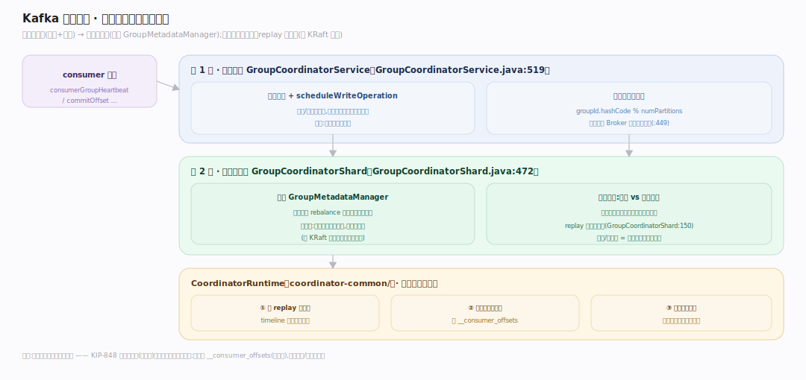
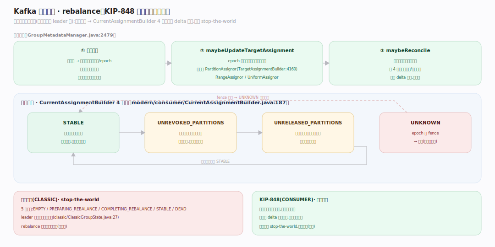
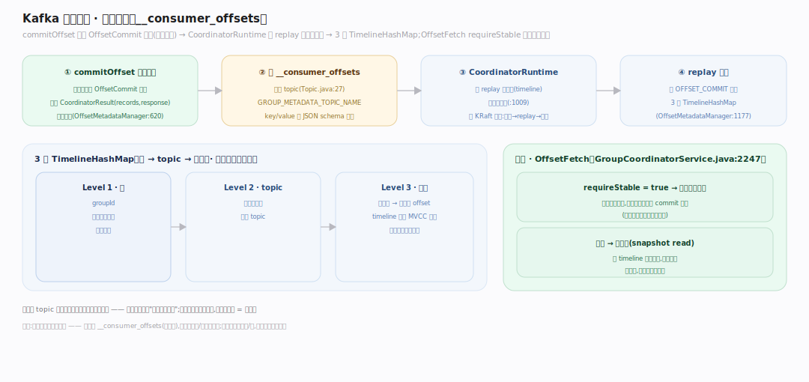

# Kafka 原理 · 支撑主线 · 消费者组与协调

> **定位**：属"协调能力域"。管消费的横向扩展与位点持久化:消费者组、rebalance(分区分配)、位点存储(`__consumer_offsets`)。被【生产/消费 API】的 consumer 依赖、位点存进【日志存储】、组协调器由【KRaft】感知 Broker。源码基准 **Kafka 4.4.0-SNAPSHOT**(`group-coordinator/src/main/java/org/apache/kafka/coordinator/group/`)。

一个 topic 的多个分区要被多个消费者并行消费,谁读哪个分区?这就是**消费者组**要解决的:组内成员分摊分区、成员增减时 **rebalance** 重新分配、各成员的消费进度(位点)持久化到 `__consumer_offsets`。4.x 的 KIP-848 把分配从"客户端主导"改成"服务端(协调器)主导",更稳更快。

---

## 一、组协调器:两层架构

**两层:异步服务 → 单线程分片**。`GroupCoordinatorService.consumerGroupHeartbeat` 校验后 `runtime.scheduleWriteOperation`(`GroupCoordinatorService.java:519`);`GroupCoordinatorShard` 委托 `GroupMetadataManager`(`GroupCoordinatorShard.java:472`)。

**关键模式:请求处理器只生成记录、不改状态;`replay` 方法才应用**(`GroupCoordinatorShard.java:150`)——与 KRaft 控制器同构:先记录、replay 进内存、再复制日志(`CoordinatorRuntime`,在 `coordinator-common/`)。位点/组状态是复制日志上的状态机。

组协调器分布在 Broker 上:`groupId.hashCode % numPartitions` 决定哪个 Broker 是某组的协调器(`GroupCoordinatorService.java:449`)。

---

## 二、rebalance:KIP-848 服务端主导分配

KIP-848 新协议:分配由**协调器计算**(不再客户端 leader 算)。心跳三步(`GroupMetadataManager.java:2479`):

1. 更新成员;
2. `maybeUpdateTargetAssignment`——epoch 推进时重算全组目标分配(用可插拔 `PartitionAssignor`:RangeAssignor/UniformAssignor,`TargetAssignmentBuilder`,`:4160`);
3. `maybeReconcile`——推进单成员向目标收敛。

**增量对账**:`CurrentAssignmentBuilder` 4 态机(`modern/consumer/CurrentAssignmentBuilder.java:187`):`STABLE`/`UNREVOKED_PARTITIONS`(等客户端放弃被撤分区)/`UNRELEASED_PARTITIONS`/`UNKNOWN`(epoch 被 fence → 重入)。分配以**增量(delta)**下发,不是每次全量——避免"stop-the-world" rebalance。

对比经典协议:5 态组机(`EMPTY/PREPARING_REBALANCE/COMPLETING_REBALANCE/STABLE/DEAD`),leader 客户端算分配上传(`classic/ClassicGroupState.java:27`)。

---

## 三、位点管理:__consumer_offsets

消费进度(位点)持久化,而非存内存:

- **提交产生记录**:`commitOffset` 校验后追加 `OffsetCommit` 记录、返回 `CoordinatorResult(records, response)`(`OffsetMetadataManager.java:620`)——不原地改。
- **存储**:位点存进内部 topic `__consumer_offsets`(`Topic.GROUP_METADATA_TOPIC_NAME`,`clients/.../common/internals/Topic.java:27`),key/value 由 JSON schema 生成(`OffsetCommitKey`/`Value`)。
- **复制日志 + replay**:`CoordinatorRuntime` 先 replay 进内存(timeline 结构)再追加日志(`coordinator-common/.../runtime/CoordinatorRuntime.java:1009`);`replay` 把 `OFFSET_COMMIT` 存进 3 级 `TimelineHashMap`(组→topic→分区,`OffsetMetadataManager.java:1177`)。
- **读取**:`OffsetFetch` 的 `requireStable` 强制读已提交(写操作)否则快照读(`GroupCoordinatorService.java:2247`)。

位点存 topic 意味着协调器故障可从日志恢复——位点本身也是"日志上的状态"。

---

## 拓展 · 消费者组关键结构一览

| 结构 | 定义 | 职责 |
|---|---|---|
| GroupCoordinatorService | `group/GroupCoordinatorService.java:519` | 异步服务层(校验+调度) |
| GroupCoordinatorShard | `group/GroupCoordinatorShard.java:472` | 单线程分片(生成记录+replay) |
| GroupMetadataManager | `group/GroupMetadataManager.java:2479` | 组状态与 rebalance 逻辑 |
| CurrentAssignmentBuilder | `group/modern/consumer/CurrentAssignmentBuilder.java:187` | 增量对账 4 态机 |
| PartitionAssignor | `group-coordinator-api/.../assignor/PartitionAssignor.java:39` | 分配策略 SPI(Range/Uniform) |
| OffsetMetadataManager | `group/OffsetMetadataManager.java:620` | 位点提交/读取 |

## 调优要点（关键开关）

- **group.protocol**:CONSUMER(KIP-848,增量对账,推荐)vs CLASSIC(旧,stop-the-world)。
- **partition.assignment.strategy / server-side assignor**:Range(按 topic 连续分)/Uniform(均衡)。
- **session.timeout.ms / heartbeat.interval.ms**:成员存活判定;太短误判掉线频繁 rebalance。
- **max.poll.interval.ms**:处理超时会被踢出组;处理慢调大。
- **__consumer_offsets 分区数/副本数**:决定位点存储的并行与容错。

## 常见误区与工程要点

- **误区:组内消费者数 > 分区数更快。** 多出的消费者空闲(一分区最多一消费者);并行度上限 = 分区数。
- **误区:rebalance 无代价。** 经典协议 rebalance 是 stop-the-world(全组暂停);KIP-848 增量对账大幅缓解,但仍应避免频繁触发。
- **误区:位点存在消费者本地。** 位点存 `__consumer_offsets` topic(服务端),故换消费者/重启能续上。
- **误区:分配是消费者自己商量的。** KIP-848 起由协调器(服务端)算分配、客户端只对账;经典协议才是 leader 客户端算。
- **归属提醒**:位点数据存【日志存储】的 `__consumer_offsets`;协调器所在 Broker 由【KRaft】元数据定;consumer poll/commit 入口在【生产/消费 API】。

## 一句话总纲

**Kafka 消费者组管消费的横向扩展与位点持久化:组协调器两层(异步服务 GroupCoordinatorService → 单线程分片,请求只生成记录、replay 才应用,与 KRaft 同构);KIP-848 起 rebalance 由协调器服务端算分配(RangeAssignor/UniformAssignor)、经 CurrentAssignmentBuilder 4 态机增量对账下发(避免 stop-the-world),位点提交产生 OffsetCommit 记录存进 __consumer_offsets topic(复制日志上的状态,可从故障恢复);一分区最多一消费者,并行度上限=分区数。**
