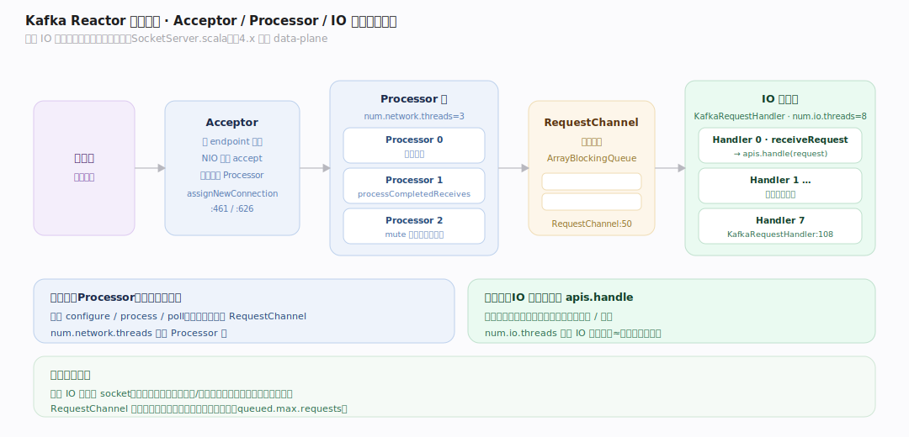
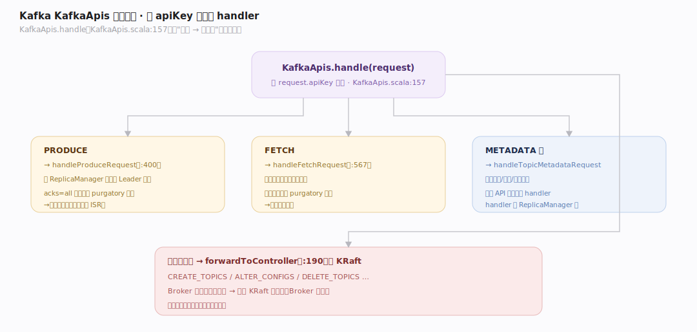
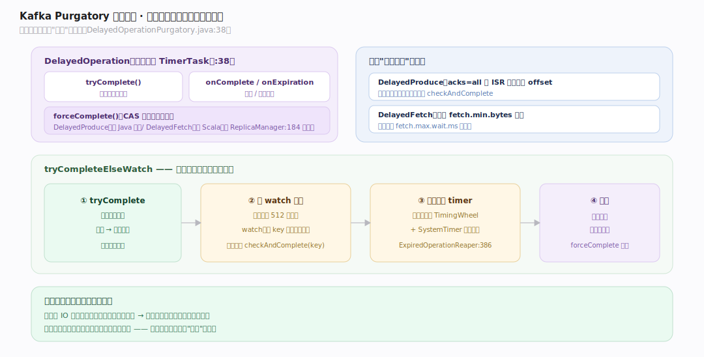

# Kafka 原理 · 支撑主线 · 网络与请求处理

> **定位**：属"通信能力域"。管 Broker 如何收发请求:SocketServer 的 Acceptor/Processor 线程、KafkaApis 请求分派、purgatory 延迟操作(等 ISR 复制/等 fetch 数据)。承载【生产/消费 API】的请求、驱动【日志存储】追加与读取。源码基准 **Kafka 4.4.0-SNAPSHOT**(`core/src/main/scala/kafka/network/`、`server/`)。

Broker 每秒处理海量 produce/fetch 请求,怎么不阻塞?Kafka 用**Reactor 线程模型**(Acceptor 接连接、Processor 收发、IO 线程处理)+ **purgatory 延迟操作**(把"要等条件的请求"挂起而非占线程)。4.x 里控制平面网络路径已移除,SocketServer 只剩 data-plane。

---

## 一、Reactor 线程模型:Acceptor / Processor / IO 线程

三级线程(`core/.../network/SocketServer.scala`):

- **Acceptor**(每 endpoint 一个,`:461`):NIO 循环 accept 新连接,轮询分给 Processor(`assignNewConnection`,`:626`)。
- **Processor**(各自一线程,`:800`):有界 `newConnections` + `responseQueue`,每轮 configure/process/poll;`processCompletedReceives` 解析请求 → `requestChannel.sendRequest` 并 mute 连接直到响应发出(`:1003,1040`)。
- **RequestChannel**:有界 `ArrayBlockingQueue`,Processor 放请求、IO 线程取(`RequestChannel.scala:50`)。
- **IO 线程**(`KafkaRequestHandler`,`:108`):`receiveRequest` 取 → `apis.handle(request)`;池大小 = `num.io.threads`(默认 8)。

`num.network.threads`(默认 3)定 Processor 数,`num.io.threads`(默认 8)定 IO 线程数——网络 IO 与业务处理分离,互不阻塞。

---

## 二、KafkaApis 请求分派

`KafkaApis.handle`(`core/.../server/KafkaApis.scala:157`)按 `apiKey` 分派:`PRODUCE → handleProduceRequest`、`FETCH → handleFetchRequest`、`METADATA → handleTopicMetadataRequest` 等。集群变更类(`CREATE_TOPICS`/`ALTER_CONFIGS`…)`forwardToController`(`:190`)——转给 KRaft 控制器,Broker 不直接改元数据。

每个 API 对应一个 handler(`handleProduceRequest:400`、`handleFetchRequest:567`),handler 调 ReplicaManager 等完成实际工作。这层是"请求 → 能力域"的路由中枢。

---

## 三、Purgatory:延迟操作不占线程

有些请求要"等条件":produce(acks=all)等 ISR 复制到该 offset、fetch 等够 `fetch.min.bytes` 数据。若占着 IO 线程等,线程很快耗尽。**Purgatory** 解决:

- `DelayedOperation`(`server-common/.../purgatory/DelayedOperation.java:38`)是带超时的 TimerTask,有 `tryComplete`/`onComplete`/`onExpiration`;`forceComplete` 保证只完成一次。
- `DelayedOperationPurgatory.tryCompleteElseWatch`:先试立即完成,不行则挂到 512 个分片 watch 列表 + 加入超时 timer;`checkAndComplete(key)` 在事件(如副本复制进度更新)到来时重试(`.../DelayedOperationPurgatory.java:38`)。
- 超时由**分层时间轮**(TimingWheel + SystemTimer)驱动,`ExpiredOperationReaper` 线程推进时钟(`:386`)。
- `DelayedProduce`(已 Java 化)/`DelayedFetch`(仍 Scala)在 ReplicaManager 里实例化(`ReplicaManager.scala:184`)。

关键思想:**等条件的请求挂起、释放线程**,条件满足或超时才完成——少量线程扛住大量"在等"的请求。

---

## 拓展 · 网络关键结构一览

| 结构 | 定义 | 职责 |
|---|---|---|
| SocketServer / Acceptor / Processor | `network/SocketServer.scala:461` | Reactor 收发线程 |
| RequestChannel | `network/RequestChannel.scala:50` | 请求队列(Processor↔IO 线程) |
| KafkaRequestHandler | `server/KafkaRequestHandler.scala:108` | IO 线程,调 apis.handle |
| KafkaApis.handle | `server/KafkaApis.scala:157` | 按 apiKey 分派 |
| DelayedOperationPurgatory | `server-common/.../purgatory/DelayedOperationPurgatory.java:38` | 延迟操作挂起/完成 |
| TimingWheel / SystemTimer | `server-common/.../util/timer/` | 分层时间轮超时 |

## 调优要点（关键开关）

- **num.network.threads**(默认 3):Processor 数;高连接数调大。
- **num.io.threads**(默认 8):IO 线程数;高请求量调大(≈磁盘数或核数)。
- **queued.max.requests**:RequestChannel 队列深度;满则背压到网络层。
- **fetch.min.bytes / fetch.max.wait.ms**:fetch 攒够多少或等多久(purgatory 延迟),攒批降请求数。
- **socket.request.max.bytes**:单请求上限,防超大请求打爆。

## 常见误区与工程要点

- **误区:一个请求占一个线程直到完成。** acks=all/fetch 等待的请求进 purgatory 挂起、释放线程,不空占。
- **误区:Broker 自己改元数据。** 元数据变更 forwardToController 转给 KRaft 控制器;Broker 只应用。
- **误区:网络线程也处理业务。** 网络线程(Processor)只收发字节;业务在 IO 线程(KafkaRequestHandler);两池分离。
- **误区:控制平面还有独立网络路径。** 4.x 已移除,SocketServer 只剩 data-plane。
- **归属提醒**:请求最终调【日志存储】追加/读、【副本与 ISR】复制;元数据请求转【KRaft】;purgatory 的 produce 完成条件是 ISR 复制到位(【副本与 ISR】)。

## 一句话总纲

**Kafka Broker 用 Reactor 线程模型 + purgatory 扛高并发:Acceptor 接连接轮询分给 Processor(num.network.threads,只收发字节)、经 RequestChannel 交给 IO 线程(num.io.threads,调 KafkaApis.handle 按 apiKey 分派,元数据变更 forwardToController 转 KRaft);要等条件的请求(acks=all 等 ISR 复制、fetch 等够数据)进 DelayedOperationPurgatory 挂起(分层时间轮超时、事件到来 checkAndComplete),释放线程——少量线程扛大量在等的请求。**
