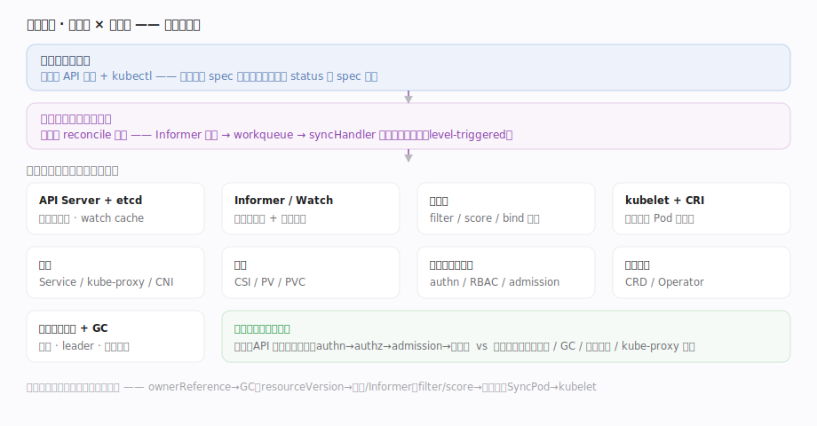
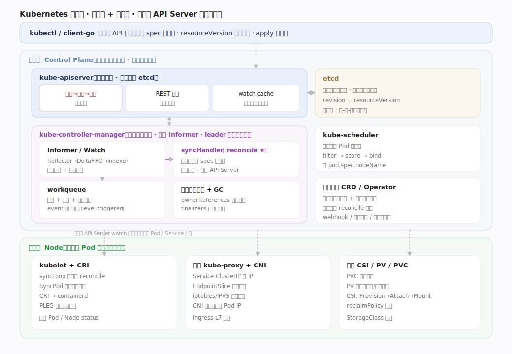
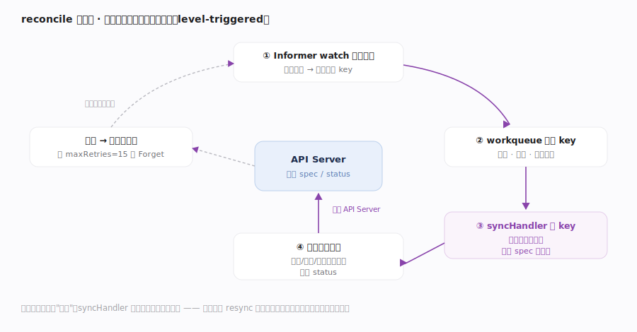
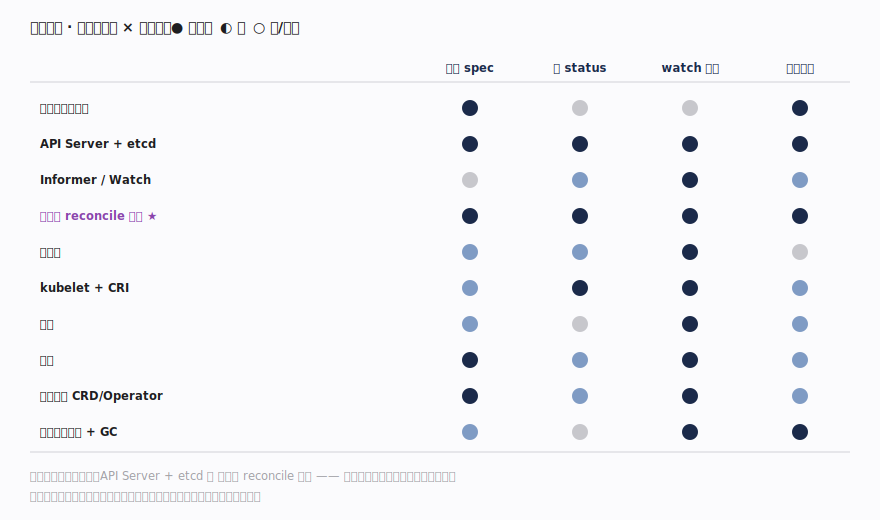

# Kubernetes 核心原理 · 全景主线框架

> **定位**：家族 3（编排 / 控制平面）范例。全库总纲——用"接触面 × 能力域 × 执行时机"三维把 K8s 拆成可导航的主线，并点出灵魂：**声明式期望态 + reconcile 控制循环让实际状态持续向期望收敛**。核实基准（pin：kubernetes `v1.32.0`，因超大仓浅克隆超时，改用 `raw.githubusercontent.com` 按 tag 定向抓核心 Go 文件 `grep -n`）：`pkg/controller/deployment/deployment_controller.go`、`staging/src/k8s.io/client-go/tools/cache/shared_informer.go`、`staging/src/k8s.io/apiserver/pkg/server/config.go`。

## 一、双维模型：接触面 × 能力域

K8s 的外部**接触面**只有一个：**声明式 API 资源**——用户经 kubectl / client-go 向 API Server 提交一个对象的 `spec`（期望态），系统负责把 `status`（实际态）驱动到 `spec`。这与命令式 API（"创建一个容器"）截然不同：用户描述"我要 3 个副本"，而非"启动第 3 个容器"。**能力域**是内部公共机制：API Server + etcd（声明态存储）、Informer/Watch（客户端缓存）、**控制器 reconcile 循环（灵魂）**、调度器、kubelet + CRI、网络、存储、认证授权与准入、扩展机制、控制器管理器与 GC。每个能力域一篇文档；接触面一篇；本篇统摄全局。**正交性检验**：任取一个核心概念都能唯一归位——`ownerReference` 归 GC、`ResourceVersion` 归 Informer/存储、`DeltaFIFO` 归 Informer、`filter/score` 归调度器、`SyncPod` 归 kubelet。

## 二、总架构：控制面 + 节点面

**控制面（Control Plane）**：`kube-apiserver` 是唯一读写 etcd 的组件、所有交互的枢纽（REST + watch）；`etcd` 存全量声明态；`kube-controller-manager` 内嵌几十个控制器（Deployment/ReplicaSet/Node/GC…），各跑 reconcile 循环；`kube-scheduler` 只做一件事——给未绑定的 Pod 选节点。**节点面（Node）**：`kubelet` 在每台机器上把"分给我的 Pod"变成真实容器（经 CRI 调 containerd）；`kube-proxy` 把 Service 抽象落成本机转发规则（iptables/IPVS）。**关键约束**：组件间**不直接互相调用**，全部经 API Server 读写对象、经 watch 收变更——这是 K8s 松耦合、可扩展的根基。控制器发现"期望≠实际"就动作，动作又写回对象，触发新一轮 watch。

## 三、贯穿主线：reconcile 控制循环（灵魂）

**一切控制器都是同一个骨架**：`Informer` 经 Watch 把对象缓存到本地 `Indexer`（`shared_informer.go` Run:471 建 `DeltaFIFO`、Process:486 交 `HandleDeltas`），事件只是**唤醒**——把对象 key 塞进 `workqueue`（`deployment_controller.go` enqueue）；worker 从队列取 key（processNextWorkItem:487，`queue.Get()`:488），调 `syncHandler`（:494，即 `syncDeployment`:590）；syncHandler 读缓存里的**当前完整状态**、对比 `spec`、执行差异动作、写回 API Server；出错经 `handleErr`（:500）按指数退避 `AddRateLimited` 重入队（`maxRetries=15`:58），成功则 `Forget`。这叫 **level-triggered（水平触发）**：不关心"发生了什么事件"，只关心"现在和期望差多少"——丢事件不致命，下次 resync（`minimumResyncPeriod=1s`:579）会全量重算。这条环横切所有能力域，是 K8s 自愈、最终一致的本质。

## 四、依赖矩阵：接触面 × 能力域

矩阵显示"声明式 API 提交"这条接触面强依赖哪些能力域：任何写请求都必过**认证授权与准入**（handler chain filter + REST 内 admission）→ 落 **API Server + etcd**；此后所有响应式行为都由**控制器 reconcile 循环**驱动，而循环的输入来自 **Informer/Watch**。调度器、kubelet、网络、存储都是"特定资源的专职控制器/守护"。可见 **API Server + reconcile 循环**是被依赖度最高的两格——它们塌了全盘皆停，这也解释了为何本库把 reconcile 定为灵魂。

## 深化 · 三维覆盖自检

| 维度 | K8s 落点 | 代表主线 |
|---|---|---|
| 接触面 | 声明式 API 资源 + kubectl（spec/status） | 接口_声明式API与期望态 |
| 能力域·存储 | API Server + etcd（声明态 + watch） | 支撑_APIServer与etcd |
| 能力域·响应 | 控制器 reconcile 循环（灵魂） | 支撑_控制器reconcile循环 |
| 能力域·调度 | filter/score/bind 选节点 | 支撑_调度器 |
| 能力域·执行 | kubelet + CRI 把 Pod 变容器 | 支撑_kubelet与CRI |
| 执行时机·前台 | API 请求同步路径（authn→authz→admission→存储） | 支撑_认证授权与准入 |
| 执行时机·后台 | 各控制器循环 / GC / 节点心跳 / kube-proxy 同步 | 支撑_控制器管理器与GC |

## 拓展 · 与其它家族的同构对照

| 对照系（K8s 第一列） | K8s | 相似家族 | 关键差异 |
|---|---|---|---|
| 状态存储 | etcd 存全量声明态 | 家族 6 etcd 本身 | K8s 把 etcd 当唯一后端、外套 API Server + watch cache |
| 期望→实际收敛 | reconcile 控制循环 | 家族 4 HDFS 块汇报对账 | K8s 泛化成"任意资源的通用控制器框架" |
| 声明式接触面 | spec/status 对象 | 家族 0 SQL 的 DDL | K8s 无命令式接口，一切声明 |
| 节点执行代理 | kubelet + CRI | 家族 4 DataNode | kubelet 也是一个 reconcile 循环（syncLoop） |

## 调优要点

- API Server 是全局咽喉：`--max-requests-inflight`（默认 400）/`--max-mutating-requests-inflight`（默认 200）与 APF（优先级与公平）决定过载行为。
- etcd 是唯一有状态后端：磁盘 IO 延迟直接决定写吞吐；对象数量与 watch 数量决定内存。
- 控制器数量多但共享 Informer：合理设置 resync 周期，过短会放大无谓 reconcile。
- 组件全经 API Server 通信：apiserver 抖动会级联影响调度、控制器、kubelet。

## 常见误区

- **控制器"监听事件后处理该事件"**：实为 level-triggered，事件只唤醒、syncHandler 重算全量差异；丢事件靠 resync 兜底。
- **组件之间互相 RPC 调用**：几乎所有交互都经 API Server 读写对象 + watch，组件间零直接耦合。
- **调度器负责启动容器**：调度器只写 `pod.spec.nodeName`（绑定），真正拉起容器的是目标节点的 kubelet。
- **kubectl 直接改 etcd**：kubectl 只与 API Server 对话，只有 API Server 读写 etcd。

## 一句话总纲

**Kubernetes 是一台"声明式期望态机器"：用户只提交 spec，所有组件经 API Server 读写对象 + watch 松耦合协作，而每个控制器都是同一个 reconcile 骨架（Informer 缓存→workqueue→syncHandler 对比 spec 与实际、执行差异、写回）——level-triggered 让系统对丢事件、崩溃、漂移都能持续自愈收敛，这条控制循环就是贯穿全库的灵魂。**
