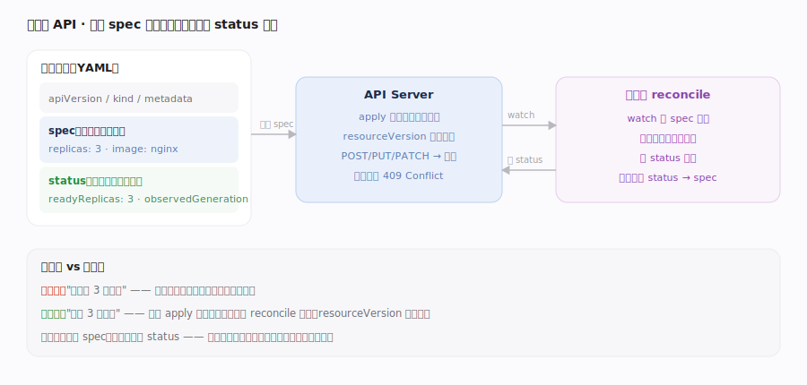

# Kubernetes 核心原理 · 接触面 · 声明式 API 与期望态

> **定位**：K8s 唯一的外部接触面——用户经 kubectl / client-go 向 API Server 提交资源对象的 `spec`（期望态），系统负责把 `status`（实际态）驱动到 `spec`。这是"命令式 → 声明式"的范式转变：描述"要什么"，而非"做什么"。核实基准：`staging/src/k8s.io/apiserver/pkg/registry/generic/registry/store.go`（REST 存储）、`staging/src/k8s.io/apiserver/pkg/server/config.go`（请求链）。

## 一、资源对象与 spec/status 期望态提交

**资源对象的统一形状**：每个 K8s 对象都有 `apiVersion`/`kind`（类型）、`metadata`（name/namespace/labels/annotations/**ownerReferences**/**resourceVersion**/**uid**/finalizers）、`spec`（用户写的期望）、`status`（控制器写的实际）。**接触面动词**：`kubectl apply/create/get/delete/edit` 映射到 REST `POST/PUT/PATCH/GET/DELETE`，落到 `Store.Create`（`staging/src/k8s.io/apiserver/pkg/registry/generic/registry/store.go:446`）、`Store.Update`（store.go:617，经 `Storage.GuaranteedUpdate`:638 读-改-写）、`Store.Get`（store.go:844）、`Store.Delete`（store.go:1128）、`Store.Watch`（store.go:1415）。**声明式的精髓在 apply**：PATCH 请求经 `PatchResource`（`staging/src/k8s.io/apiserver/pkg/endpoints/handlers/patch.go:68`）分发；`apply` 走 `newApplyPatcher`（patch.go:474）用**服务端字段管理（SSA）** 三方合并，只改用户关心的字段——反复 apply 同一份 YAML 是**幂等**的，最终仍调 `restPatcher.Update`（patch.go:704）落库。**乐观并发**：每个对象带 `resourceVersion`，Update 时若版本不匹配，`GuaranteedUpdate` 里检测冲突并返回 `NewConflict`（store.go:733，即 409），客户端重取重试——这是无锁多写者协调的基础。**spec 与 status 分离**：用户永远只写 spec，控制器只写 status；`status` 子资源让权限可分离（用户能改 spec 不能伪造 status）。SSA 的 `managedFields` 记录"哪个 manager 拥有哪些字段"，冲突时告警（`fieldmanager/admission.go:31`）。

## 深化 · 三种写入语义与冲突处理

同一个"提交期望"接触面，底层有三条写路径，理解差异才能避坑：

- **PUT（replace / client-side apply）**：整对象替换，必须带正确的 `resourceVersion`；并发写者版本落后 → `GuaranteedUpdate`（store.go:638）里 `OptimisticPut` 失败 → `NewConflict`（store.go:733）返回 409。客户端 `kubectl replace` 遇冲突需重取重放，易丢别人的并发改动。
- **PATCH（strategic / merge / json patch）**：只发差量，经 `PatchResource`（patch.go:68）在服务端 `restPatcher.Update`（patch.go:704）前把 patch 应用到当前对象上，避免整对象覆盖；但多客户端仍可能互相踩字段。
- **Server-Side Apply（`newApplyPatcher`，patch.go:474）**：每个 manager 声明式地"拥有"一组字段并记进 `managedFields`；两个 manager 改同一字段才报冲突（`fieldManager` 冲突检测），是 GitOps / 多控制器协作下**最不易互相覆盖**的方式。经准入后 `managedFields` 若被 mutating webhook 改坏，会记 `InvalidManagedFieldsAfterMutatingAdmission` 告警（fieldmanager/admission.go:31）。

**失败与收敛**：无论哪种写法，写成功只代表"期望态已持久化"，**不代表实际态已达成**——status 由控制器异步回填；写失败（409/超时）时客户端应"重取最新对象、重算期望、再提交"，绝不能盲目重放旧请求体。这正是声明式的容错内核：**任何时刻的真相是 etcd 里的对象，动作永远是收敛而非命令**。

## 拓展 · 命令式 vs 声明式接触面

| 维度 | 命令式（传统） | 声明式（K8s） |
|---|---|---|
| 用户表达 | "启动第 3 个容器" | "我要 3 个副本"（spec.replicas=3） |
| 重复执行 | 副作用叠加 | 幂等（apply 收敛到同一态） |
| 故障恢复 | 需人工补偿 | 控制器持续 reconcile 自愈 |
| 并发协调 | 显式加锁 | resourceVersion 乐观并发 |
| 谁写实际态 | 调用方 | 控制器写 status，用户只读 |

## 拓展 · metadata 关键字段的横切作用

| 字段 | 作用 | 归属能力域 |
|---|---|---|
| `resourceVersion` | 乐观并发 + watch 断点续传 | APIServer与etcd / Informer |
| `ownerReferences` | 级联删除与 GC 的对象图边 | 控制器管理器与GC |
| `finalizers` | 删除前置钩子（阻塞删除做清理） | 控制器管理器与GC |
| `labels` / selector | 控制器/Service 选中哪些对象 | 控制器循环 / 网络 |
| `uid` | 对象身份（同名重建也不同 uid） | 全局 |

## 调优要点

- 优先 `kubectl apply` 而非 `create/replace`：apply 走三方合并、幂等、可 GitOps 化。
- 大对象/高频写会放大 etcd 与 watch cache 压力：避免把大 blob 塞进 annotations。
- 用 `--server-side` apply（SSA）由 API Server 做字段管理，避免 client 端合并歧义。
- 遇 409 Conflict 属正常乐观并发：客户端应重取 `resourceVersion` 重试，而非重试原请求。
- 多控制器/多流水线协作同一对象时优先 SSA：让每个 manager 只声明自己的字段，把"谁拥有什么字段"交给服务端仲裁（patch.go:474 的 apply 路径），避免 client-side 三方合并在跨工具场景下互相抹字段。
- 只读 status 判断"是否就绪"：spec 提交成功不等于达成，应 watch 对象直到 status 条件（如 `Available`）满足再继续，避免"发了 YAML 就以为生效"。

## 常见误区

- **spec 里能读到实际状态**：spec 只是期望；实际态在 status，且可能短暂不等于 spec（正在收敛）。
- **apply 会删掉我没写的字段**：SSA/三方合并只管理你声明过的字段，其它控制器写的字段保留。
- **写 status 能改变现实**：status 只是控制器观测的记录；改 status 不驱动任何实际动作。
- **API 是命令式 RPC**：K8s 无"执行动作"接口，只有"提交期望对象"，动作由控制器异步产生。

## 一句话总纲

**K8s 的接触面只有一件事——向 API Server 提交带 spec 的资源对象声明"我要什么"，靠 resourceVersion 乐观并发、apply 三方合并做到幂等协调；用户只写 spec、控制器只写 status，实际态由 reconcile 循环持续驱动向期望收敛，这种"声明期望、异步收敛"正是 K8s 区别于命令式编排的分水岭。**
