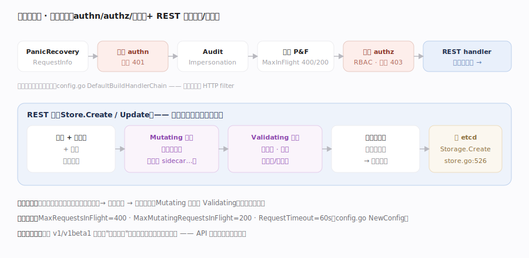
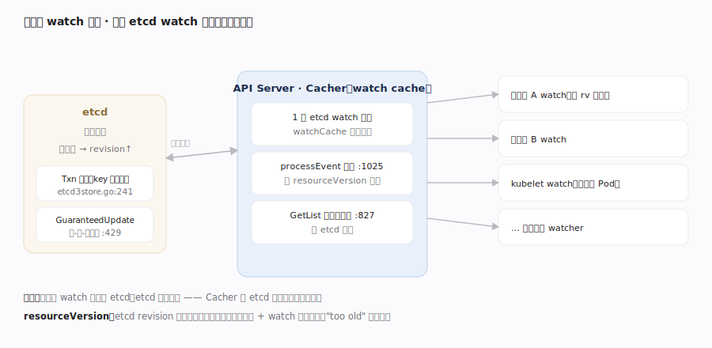

# Kubernetes 核心原理 · 支撑能力域 · API Server 与 etcd

> **定位**：声明态的唯一存储与枢纽。API Server 是集群里**唯一读写 etcd** 的组件，对外暴露 REST + watch；etcd 是唯一有状态后端，存全量对象。所有组件都经它读写对象、订阅变更——这是 K8s 松耦合的物理中心。核实基准：`staging/src/k8s.io/apiserver/pkg/registry/generic/registry/store.go`、`storage/etcd3/store.go`、`storage/cacher/cacher.go`、`server/config.go`。

## 一、请求处理链：从 HTTP 到 REST 存储

一个写请求进入 API Server 后穿过 `DefaultBuildHandlerChain`（`staging/src/k8s.io/apiserver/pkg/server/config.go:1004`）构建的过滤器链。**这条链在代码里是"由内向外"层层包裹的**：源码里最先出现的 `WithAuthorization`（:1008）是**最内层**，最后出现的 `WithPanicRecovery`（:1076）是**最外层**，所以请求真实的**入向执行顺序**是：PanicRecovery（:1076）→ RequestInfo（:1073，解析出 group/version/resource/verb）→ WithHTTPLogging（:1062）→ WithTimeoutForNonLongRunningRequests（:1046）→ **Authentication**（认证，`WithAuthentication`:1035）→ Audit（:1027）→ Impersonation（:1023）→ **MaxInFlight / PriorityAndFairness**（限流，`WithMaxInFlightLimit`:1019、`WithPriorityAndFairness`:1016，默认 `MaxRequestsInFlight=400`、`MaxMutatingRequestsInFlight=200`，见 config.go:432-433）→ **Authorization**（鉴权，`WithAuthorization`:1008）→ 到达 REST handler。**注意**：认证、鉴权是 http filter；而**准入控制（admission）不在这条链里**，它在 REST 层的 handler 内、编解码之后落库之前被调用——`staging/src/k8s.io/apiserver/pkg/endpoints/handlers/create.go:203` 的 `mutatingAdmission.Admit(ctx, ...)` 先跑 mutating，随后把 validating admission 作为 `createValidation` 回调传进存储层，在 `Store.create`（`.../registry/generic/registry/store.go:506`）里 `createValidation(ctx, obj.DeepCopyObject())` 触发（详见"认证授权与准入"篇）。REST handler 的完整套路：解码对象 → 默认值/校验 → mutating admission → validating admission → 转换为存储版本 → `Storage.Create`（store.go:526）或 `GuaranteedUpdate`（store.go:638）。**多版本统一**：外部可用 v1/v1beta1 等多个 API 版本，内部统一转换成**存储版本**再落 etcd，读时再转回请求版本——这让 API 演进不破坏已存数据。

## 二、etcd 存储与 watch 缓存

**etcd3 后端**：对象经 codec 编码成字节，`store.Create`（`staging/src/k8s.io/apiserver/pkg/storage/etcd3/store.go:241`）用 etcd 事务原子创建——v1.32 已封装成 `s.client.Kubernetes.OptimisticPut(ctx, key, newData, 0, ...)`（store.go:269，传入期望 revision=0 即"key 不存在才 Put"）；`GuaranteedUpdate`（etcd3/store.go:429）是**读-改-写重试循环**——读当前 `origState`、应用 `tryUpdate` 变更函数、`OptimisticPut(ctx, key, newData, origState.rev, ...)`（store.go:562）带原 revision 做 CAS 写回，`if !txnResp.Succeeded`（store.go:573）说明有并发写、`getState` 重读后重试。etcd 的每次写产生一个全局单调递增的 **revision**（`kv.ModRevision`，store.go:232/972），映射为对象的 `resourceVersion`。**watch cache（Cacher）**：若每个 watch 都直连 etcd，etcd 会被压垮。API Server 为每种资源维护一个 `Cacher`（`staging/src/k8s.io/apiserver/pkg/storage/cacher/cacher.go`，内含 `watchCache`:279 与 `reflector *cache.Reflector`:280）——`cacher.go:413-418` 起一个内部 Reflector 对 etcd 做 `ListAndWatch` 灌入 `watchCache` 环形缓冲，所有客户端 watch 都从这个内存缓存分发（`Cacher.Watch`:516；`processEvent`:1025 灌入、`dispatchEvents`:1033 与 `dispatchEvent`:1125 扇出给各 `cacheWatcher`）；`GetList`（cacher.go:827）也可直接由缓存应答（强一致读除外），`Cacher.Get`:697 同理。**resourceVersion 语义**：客户端 watch 带上次收到的 rv，断线重连从该点续传，不丢不重；`GetList` 按 `ResourceVersionMatch`（etcd3/store.go:664-675，`NotOlderThan`/`Exact`）决定读一致性；watch 返回的每个事件都是 ADDED/MODIFIED/DELETED + 对象快照，并周期发 bookmark 事件推进客户端 rv。

## 深化 · REST 存储关键路径

| 操作 | 入口 | 落点 | 并发语义 |
|---|---|---|---|
| Create | `Store.Create` store.go:446 | `Storage.Create`:526 → etcd Txn（key 不存在） | 同名冲突 409 |
| Update | `Store.Update` :617 | `GuaranteedUpdate` :638 读-改-写重试 | resourceVersion 不匹配 → Conflict |
| Get | `Store.Get` :844 | etcd Range 或 watch cache | 可选一致性读 |
| Watch | `Store.Watch` :1415 | Cacher 内存缓存分发 | 按 rv 续传 |

## 拓展 · 为什么要 watch 缓存

| 无缓存直连 etcd | 有 Cacher 内存缓存 |
|---|---|
| N 个 watcher = N 个 etcd watch | 1 个 etcd watch 扇出给 N 个客户端 |
| etcd 成瓶颈，扩不动 | etcd 压力与客户端数解耦 |
| List 全打 etcd | List 可由缓存应答，降 etcd 负载 |

## 深化 · 删除的两阶段与失败路径

删除不是"从 etcd 抹掉"这么简单。`Store.Delete`（`.../registry/generic/registry/store.go:1128`）先判断对象有无 `finalizers` 或 `deletionGracePeriodSeconds`：**有则走优雅删除**——`updateForGracefulDeletionAndFinalizers`（store.go:1041）只把 `metadata.deletionTimestamp` 写上（对象仍在 etcd），等各 finalizer 控制器做完清理、把自己从 `finalizers` 摘除；**列表空了才真删**——`deleteWithoutFinalizers`（store.go:590）内部再走一次 `GuaranteedUpdate`（store.go:638）确保并发安全后从 etcd 移除。几条典型失败路径：

- **写冲突（乐观锁）**：`GuaranteedUpdate` 里 `OptimisticPut` 返回 `!txnResp.Succeeded`（etcd3/store.go:573）→ 用最新 revision 重读重算，若客户端带了 `resourceVersion` 前置条件且不匹配则直接返回 `409 Conflict`，控制器需重取重试。
- **generateName 撞名**：`create` 走 `createWithGenerateNameRetry`（store.go:467），随机名撞已存在对象时捕获 AlreadyExists 并重试若干次。
- **准入拒绝**：`createValidation`（store.go:506）里 validating webhook/内建 admission 返回错误 → 请求 4xx，**对象绝不落库**。
- **etcd 不可用 / 超时**：请求在 `WithTimeoutForNonLongRunningRequests`（config.go:1046）超时被截断返回 504；此时写可能已在 etcd 提交但响应丢失，客户端需靠"重试幂等 + 期望态收敛"兜底。
- **watch too old**：客户端 rv 落后于 watch cache 环形缓冲已淘汰的最小 rv → 返回 `410 Gone`，client-go 的 Reflector 回退到全量 LIST 重建（见 Informer 篇）。

## 调优要点

- etcd 磁盘（fsync 延迟）是写吞吐上限：用 SSD、独立盘、监控 `wal_fsync` 时延。
- 控制 etcd 内对象总数与单对象大小：大对象/海量对象拖慢 List 与 compaction。
- `--watch-cache-sizes` 调 watch cache 容量，避免客户端频繁 "too old resource version" 重列。
- 定期 etcd compaction + defrag，回收 revision 历史占用的空间。

## 常见误区

- **控制器直接连 etcd**：只有 API Server 读写 etcd；其它组件一律经 API Server。
- **watch 直达 etcd**：默认经 API Server 的 watch cache 分发，不直连 etcd。
- **resourceVersion 是时间戳/可比大小做业务判断**：它是 etcd revision，仅用于并发与续传，不应参与业务序。
- **多个 API 版本各存一份**：内部只存"存储版本"一份，读写时按需转换。

## 一句话总纲

**API Server 是集群唯一读写 etcd 的枢纽：写请求穿过"认证→限流→鉴权"过滤器链、在 REST 层做准入与多版本转换后经 etcd 事务/读-改-写落库；每次写产生单调 revision（即 resourceVersion），支撑乐观并发与断点续传；而 watch cache（Cacher）用一个 etcd watch 扇出给成千上万客户端，让 etcd 压力与集群规模解耦——这是所有组件松耦合协作的物理基础。**
