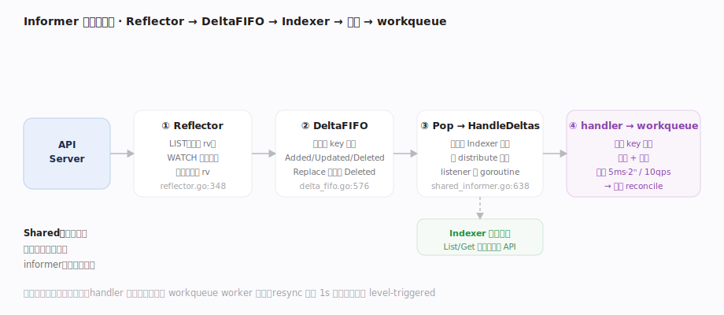

# Kubernetes 核心原理 · 支撑能力域 · Informer 与 Watch 机制

> **定位**：控制器的"眼睛"与缓存层。client-go 的 SharedInformer 把 API Server 的对象经 List+Watch 同步进本地内存索引，事件经 DeltaFIFO 有序处理后既更新缓存又通知 handler——它把"每个控制器各自轮询 API Server"降维成"共享一份本地缓存 + 增量事件"，是 reconcile 循环的输入源。核实基准：`staging/src/k8s.io/client-go/tools/cache/`（`shared_informer.go`、`reflector.go`、`delta_fifo.go`、`controller.go`）、`util/workqueue/`。

## 一、Reflector → DeltaFIFO → Indexer → 工作队列

数据流五级流水线：① **Reflector**（`staging/src/k8s.io/client-go/tools/cache/reflector.go`）在 `Run`（reflector.go:312）里反复调 `ListAndWatch`（reflector.go:348）——先一次全量 LIST（`list`:502，起始 `resourceVersion` 由 `relistResourceVersion`:504 给出）拿到基线，之后从该 rv 起 `watch`（reflector.go:418）持续收增量；v1.32 若开启 `WatchListClient` 特性则走 `watchList`（reflector.go:627）用流式 LIST 建一致快照，省内存峰值。断线用最新 rv 续传，遇 `isExpiredError`（reflector.go:475/548，即 "too old resource version" 410）则回退重列。② **DeltaFIFO**（`.../cache/delta_fifo.go:101`）：Reflector 把 ADDED/MODIFIED/DELETED 经 `queueActionLocked`（delta_fifo.go:439）转成 Delta（类型 `Added`:164 / `Updated`:165 / `Deleted`:166 / `Replaced`:173 / `Sync`:175）按对象 key 排队；`Replace`（delta_fifo.go:636）在重列时对账——为缓存中已消失的对象补发 Deleted。③ **Pop + HandleDeltas**：informer 的控制器 `processLoop`（`.../cache/controller.go:193`）不断 `Pop`（delta_fifo.go:576），交给 `HandleDeltas`（`.../cache/shared_informer.go:638`）→ `processDeltas`（controller.go:541），**先更新本地 Indexer 缓存、再分发通知**。④ **sharedProcessor.distribute**（shared_informer.go:779）把通知投给每个 listener；`processorListener` 用两条 goroutine（`pop`:936 环形缓冲兜积压 + `run`:966 调 handler）串行、不阻塞地回调 `OnAdd/OnUpdate/OnDelete`。⑤ 控制器的 handler 通常**只做一件事**：算出对象 key `Add` 进 **workqueue**——真正的业务在 worker 里跑（见 reconcile 篇）。**Shared 的意义**：同一资源多个控制器共用一个 informer（一份 List+Watch、一份缓存），省 API Server 压力。

## 深化 · 断链、积压与最终一致的失败路径

Informer 的可靠性全靠"重列对账 + 背压 + resync 兜底"三件套：

- **watch 断链续传**：`watch`（reflector.go:418）里 watch channel 关闭属正常，用最后收到事件的 rv 重新发起 watch，不回退到 LIST；只有 `isExpiredError`（reflector.go:475）——服务端 watch cache 已淘汰该 rv（410 Gone）——才触发 `list`（reflector.go:502）全量重列。
- **重列对账**：重列后 `Replace`（delta_fifo.go:636）用新列表和本地缓存做差集，**为期间被删、watch 又没收到 Deleted 的对象补发 Deleted**，保证缓存不残留幽灵对象——这是"丢事件也最终一致"的关键。
- **listener 背压**：`processorListener.pop`（shared_informer.go:936）用一个可增长的 `pendingNotifications` 环形缓冲吸收突发事件，`run`（shared_informer.go:966）串行消费；若 handler 慢，积压只在本 listener 内涨，**不阻塞 DeltaFIFO 也不阻塞其他 listener**。但缓冲无限增长会吃内存——handler 必须"快进快出、只入队 key"。
- **resync 兜底**：`minimumResyncPeriod = 1s`（shared_informer.go:579），周期到时对全量缓存对象重发 Update（`Sync` 类型），即便没有任何真实变更也让控制器重算一次差异——**这就是 level-triggered 能自愈"漏处理"的底层机制**。resync 只走本地缓存、不打 API Server。
- **首次同步屏障**：`HasSynced`（shared_informer.go:909）在初始 LIST 全部分发完前为 false，控制器应 `WaitForCacheSync` 后再启动 worker，避免"缓存还没热就 reconcile"导致误删。

## 深化 · 五级流水线职责

| 组件 | 职责 | 关键点 |
|---|---|---|
| Reflector | List+Watch 拉取 | 起始 rv + 续传 + 重列对账 |
| DeltaFIFO | 增量按 key 排队 | Replace 补发消失对象的 Deleted |
| Indexer | 本地对象缓存 + 按 label/field 索引 | List/Get 走本地，不打 API Server |
| sharedProcessor | 事件扇出给多 listener | 每 listener 两 goroutine 串行不阻塞 |
| workqueue | 去重 + 限速 + 重试 | 见 reconcile 篇 |

## 拓展 · workqueue 限速默认值

| 机制 | 默认 | 来源 |
|---|---|---|
| 指数退避 | 基 5ms、上限 1000s（`5ms·2^n`） | `default_rate_limiters.go:52` |
| 全局令牌桶 | 10 qps、突发 100 | `default_rate_limiters.go:54`（`rate.NewLimiter(10,100)`） |
| 去重 | 同 key 处理中不重复入队 | workqueue 语义 |
| resync | 最小 1s（`minimumResyncPeriod`） | shared_informer.go:579 |

## 调优要点

- 多控制器共享 SharedInformerFactory：避免为同一资源起多个 informer 重复 List+Watch。
- resync 周期别过短：resync 会给所有对象重发 Update（level-triggered 兜底），过短放大无谓 reconcile。
- Indexer 加合适的自定义索引（如按 label），避免 handler 里全量遍历缓存。
- 大规模集群关注 informer 内存：缓存全量对象，对象多/大则常驻内存高。

## 常见误区

- **informer 直接触发业务逻辑**：handler 通常只入队 key，业务在 workqueue worker（解耦事件速率与处理速率）。
- **DeltaFIFO 存的是对象**：存的是"对同一 key 的一串增量 Delta"，Pop 时合并处理。
- **watch 丢事件会导致状态永久错**：重列 + Replace 对账 + resync 全量重发保证最终一致。
- **缓存就是 etcd 的实时镜像**：缓存是最终一致的近实时副本，可能短暂落后。

## 一句话总纲

**Informer 是控制器与 API Server 之间的缓存中枢：Reflector 用 List+Watch 拉增量、DeltaFIFO 按 key 有序排队并在重列时对账、Pop 出的增量先更新本地 Indexer 再扇出通知，handler 只把 key 塞进限速去重的 workqueue——它把"人人轮询"降维成"共享一份近实时缓存 + 增量事件"，既喂饱了 reconcile 循环又护住了 API Server。**
