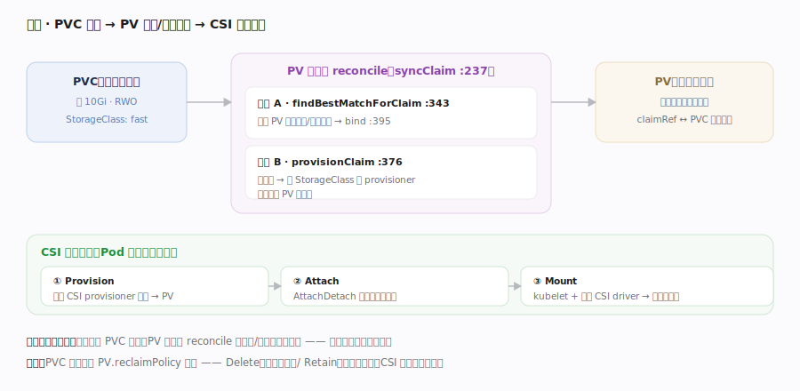

# Kubernetes 核心原理 · 支撑能力域 · 存储（CSI / PV / PVC）

> **定位**：把"持久存储"也做成声明式期望态。用户用 **PVC**（PersistentVolumeClaim）声明"我要一块 10Gi 的存储"，控制器负责找到或动态创建一块 **PV**（PersistentVolume）与之绑定；真正的挂载经 **CSI**（Container Storage Interface）由存储驱动完成。存储的申领与供给同样由 reconcile 循环驱动。核实基准：`pkg/controller/volume/persistentvolume/pv_controller.go`。

## 一、PVC → PV 绑定与动态供给

**声明与供给分离**：用户只写 PVC（容量、访问模式、StorageClass）；PV 是实际存储资源（可由管理员静态创建，或动态供给）。**PV 控制器**（pv_controller.go）跑经典 reconcile：`syncClaim`（:237）对未绑定的 PVC → `findBestMatchForClaim`（:343）在现有 PV 里找容量/模式匹配的最优 PV，找到就 `bind`（:395，双向写 PVC.spec.volumeName 与 PV.spec.claimRef）；找不到且 PVC 指定了 StorageClass，则 `provisionClaim`（:376）触发**动态供给**——按 StorageClass 调对应 provisioner（多为外部 CSI provisioner）在后端（云盘/NFS/Ceph…）真实创建一块存储、生成 PV、再绑定。`syncBoundClaim`（:492）维护已绑定关系。**挂载到 Pod（CSI 三段）**：Pod 调度到节点后，① **Provision**（建卷，上一步）；② **Attach**（AttachDetach 控制器把卷挂到节点，如云盘 attach 到 VM）；③ **Mount**（kubelet 经节点上的 CSI driver 把卷 mount 进 Pod 容器目录）。**回收策略**：PVC 删除后按 PV 的 `reclaimPolicy` 处理——`Delete`（连底层存储一起删）或 `Retain`（保留数据待人工处理）。整条链把"存储生命周期"纳入了声明式 + reconcile 框架。

## 深化 · 存储对象职责

| 对象 | 谁写 | 含义 |
|---|---|---|
| PVC | 用户 | 申领：要多大、什么访问模式、哪个 StorageClass |
| PV | 管理员 / provisioner | 实际存储资源（静态或动态生成） |
| StorageClass | 管理员 | 动态供给模板（provisioner + 参数） |
| VolumeAttachment | AttachDetach 控制器 | 卷是否已 attach 到某节点 |
| CSIDriver / CSINode | 驱动注册 | 节点上有哪些 CSI 能力 |

## 拓展 · CSI 挂载三阶段

| 阶段 | 执行者 | 动作 |
|---|---|---|
| Provision | 外部 CSI provisioner | 在后端创建卷 → 生成 PV |
| Attach | AttachDetach 控制器 | 卷挂到目标节点（如云盘 attach VM） |
| Mount | kubelet + 节点 CSI driver | mount 进 Pod 容器目录 |

## 调优要点

- 用 StorageClass + 动态供给替代手工建 PV，避免容量碎片与人工绑定。
- 访问模式（RWO/ROX/RWX）要与工作负载匹配：多数块存储只支持 RWO（单节点读写）。
- `volumeBindingMode: WaitForFirstConsumer` 让卷绑定延迟到 Pod 调度后，避免卷与 Pod 落到不同拓扑域。
- reclaimPolicy 生产慎用 Delete：误删 PVC 会连带删除底层数据。

## 常见误区

- **PVC 就是存储本身**：PVC 是申领，PV 才是实际资源，二者绑定后使用。
- **kubelet 负责创建云盘**：创建（provision）是 CSI provisioner，kubelet 只做节点上的 mount。
- **绑定是单向的**：PVC↔PV 双向引用（volumeName / claimRef），一一对应独占。
- **删 PVC 数据一定没了**：取决于 reclaimPolicy，Retain 会保留 PV 与数据。

## 一句话总纲

**K8s 把持久存储也声明式化：用户用 PVC 声明"要多大的什么存储"，PV 控制器 reconcile 地为其匹配现有 PV 或经 StorageClass 动态供给新 PV 并双向绑定，随后经 CSI 的 Provision→Attach→Mount 三段把卷真正挂进 Pod——存储的申领、供给、挂载、回收全部纳入"期望态 + 控制器收敛"的统一框架，驱动逻辑与具体存储后端由 CSI 解耦。**
