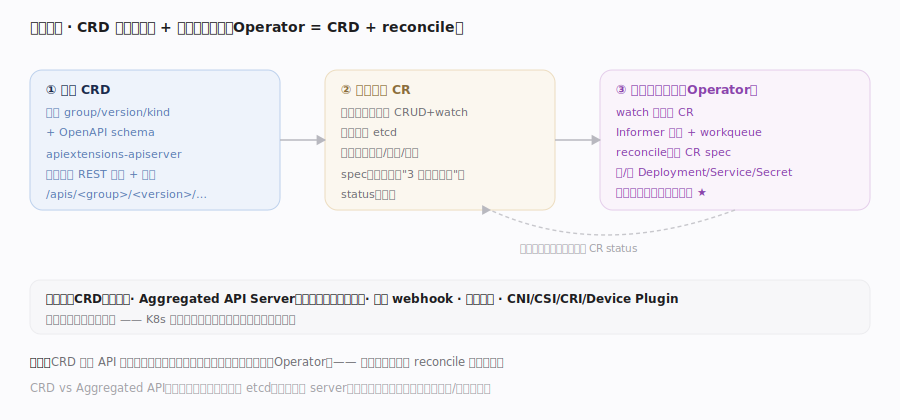

# Kubernetes 核心原理 · 支撑能力域 · 扩展机制（CRD / Operator）

> **定位**：让 K8s 的声明式 + reconcile 范式**对用户开放**。**CRD**（CustomResourceDefinition）向 API Server 动态注册新的资源类型，用户就能像用内建对象一样 kubectl 提交自定义资源（CR）；**Operator** = CRD + 自定义控制器，把"运维某个复杂应用的领域知识"编码成一个 reconcile 循环。这是 K8s 生态得以无限生长的根基。核实基准：`staging/src/k8s.io/apiextensions-apiserver/pkg/apiserver/apiserver.go`、复用 reconcile 与 Informer 篇。

## 一、CRD 注册新类型 + 自定义控制器 reconcile

**CRD 扩展 API**：提交一个 CRD 对象（声明 group/version/kind + OpenAPI schema）后，apiextensions-apiserver 动态为这个新类型装配 REST 存储与校验——此后 `/apis/<group>/<version>/<plural>` 就像内建资源一样支持 CRUD + watch，对象照样存进同一个 etcd、走同一套认证授权准入。**Operator 模式**：光有 CRD 只是"能存自定义对象"，要让它"活起来"还需一个**自定义控制器**——它 watch 自己的 CR（用 Informer 建缓存 + workqueue），reconcile 时读 CR 的 spec、对比集群实际、创建/调整内建对象（Deployment/Service/Secret…）或调外部系统，把实际驱动到期望，再写回 CR status。**这正是内建控制器的同一骨架**（见 reconcile 篇），只是被拥有领域知识的开发者复用来管理"数据库集群""消息队列""证书"等复杂应用。**扩展 API 的两条路**：CRD（轻量，绝大多数场景）vs **Aggregated API Server**（重量，自建 apiserver 经 aggregation layer 挂到主 API Server，用于需要自定义存储/复杂逻辑的场景）。**其它扩展点**：准入 webhook（改写/校验）、调度器插件、CNI/CSI/CRI（可插拔驱动）、Device Plugin——K8s 几乎每层都留了扩展缝。

## 深化 · 扩展机制谱系

| 扩展点 | 扩展什么 | 典型用途 |
|---|---|---|
| CRD | 新增 API 资源类型 | 自定义对象（轻量） |
| Aggregated API | 挂载独立 apiserver | 自定义存储/复杂 API（重量） |
| 自定义控制器 / Operator | 新增 reconcile 逻辑 | 运维复杂有状态应用 |
| Admission Webhook | 写路径改写/校验 | 策略注入、sidecar 注入 |
| Scheduler 插件 | 调度决策 | 自定义 filter/score |
| CNI / CSI / CRI / Device Plugin | 可插拔驱动 | 网络/存储/运行时/硬件 |

## 拓展 · CRD vs Aggregated API

| 维度 | CRD | Aggregated API Server |
|---|---|---|
| 复杂度 | 低（声明即用） | 高（自建 server） |
| 存储 | 复用主 etcd | 可自定义后端 |
| 校验 | OpenAPI schema + webhook | 任意自定义逻辑 |
| 适用 | 绝大多数扩展 | 需特殊存储/协议时 |

## 调优要点

- CRD 加 `structural schema` + validating webhook 保证自定义对象数据质量。
- Operator 控制器复用 controller-runtime / client-go 的 Informer + workqueue，别自己轮询 API Server。
- 大量 CR 会占 etcd 与 watch cache：为 CR 设合理保留与清理（finalizer + GC）。
- CRD 版本演进用 conversion webhook 平滑迁移，避免破坏已存对象。

## 常见误区

- **CRD 自带行为**：CRD 只让 API 能存新类型对象；要产生行为必须配一个控制器（Operator）。
- **自定义资源存在别的地方**：CR 和内建对象一样存主 etcd、走同一套 API 机制。
- **Operator 是新范式**：它就是内建控制器的 reconcile 骨架被复用，无新机制。
- **扩展必须改 K8s 源码**：CRD/webhook/插件让绝大多数扩展在集群外以声明+控制器完成，无需 fork。

## 一句话总纲

**扩展机制把 K8s 的"声明式 + reconcile"范式开放给所有人：CRD 向 API Server 动态注册新资源类型（复用同一套存储/认证/准入），Operator = CRD + 一个复用内建控制器骨架的自定义控制器，把运维某类复杂应用的领域知识编码成 reconcile 循环——加上准入 webhook、调度插件、CNI/CSI/CRI 等可插拔缝，K8s 得以成为一个可无限生长的平台而非封闭产品。**
