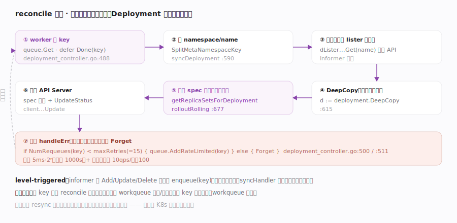
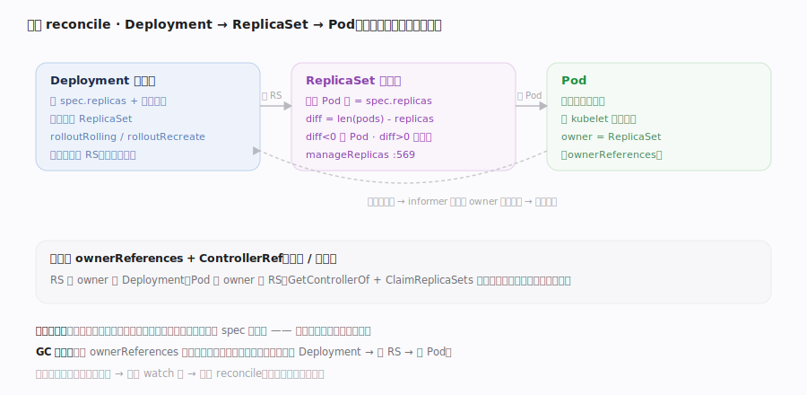

# Kubernetes 核心原理 · 支撑能力域 · 控制器 reconcile 循环（灵魂）

> **定位**：★ K8s 的灵魂主线。每个控制器都是同一个骨架——从 workqueue 取对象 key、读缓存里的当前完整状态、对比 `spec` 与实际、执行差异动作、写回 API Server；出错退避重试。**level-triggered（水平触发）**：不处理"事件"，只消除"期望与实际的差距"。漏了这条，K8s 文档就是散的。核实基准：`pkg/controller/deployment/deployment_controller.go`、`pkg/controller/replicaset/replica_set.go`、`util/workqueue/`。

## 一、reconcile 闭环：取 key → 对比 → 收敛 → 重试

以 Deployment 控制器为标准骨架：`worker`（deployment_controller.go:482）循环调 `processNextWorkItem`（:487）——`key, quit := dc.queue.Get`（:488）、`defer dc.queue.Done(key)`、`err := dc.syncHandler(ctx, key)`（:494，即 `syncDeployment`:590）、`dc.handleErr(ctx, err, key)`（:500）。**syncHandler 的固定套路**：`SplitMetaNamespaceKey` 拆出 namespace/name → 从 **本地 lister（Informer 缓存）** 读对象（不打 API Server）→ `d := deployment.DeepCopy`（:615，绝不改缓存）→ 对比期望与实际、算差异 → 写回 API Server。**错误处理即重试策略**：`handleErr` 里 `if dc.queue.NumRequeues(key) < maxRetries { dc.queue.AddRateLimited(key) }`（:511，`maxRetries=15`:58），否则 `Forget` 丢弃并告警；`AddRateLimited` 走指数退避（基 5ms、上限 1000s）+ 全局令牌桶（10 qps/突发 100）。**level-triggered 的关键**：informer 的 AddFunc/UpdateFunc/DeleteFunc 都只做 `enqueue(key)`——**事件只是"叫醒信号"**，syncHandler 永远重算当前全量差异；因此丢一个事件不致命（resync 会重发），重复入队无害（去重 + 重算幂等）。这就是 K8s 自愈的机制根源。

## 二、级联 reconcile：Deployment → ReplicaSet → Pod

高层意图经**多级控制器逐层翻译**，每级只管自己那层的期望与实际：**Deployment 控制器** 不直接管 Pod——它据 `spec.replicas` 与滚动策略维护若干 **ReplicaSet**（`rolloutRolling`:677 / `rolloutRecreate`；新版本建新 RS、逐步调整新旧 RS 副本数实现滚动升级）。**ReplicaSet 控制器**（replica_set.go）只干一件事：让"贴合 selector 的 Pod 数"等于 `spec.replicas`——`manageReplicas`（:569）算 `diff := len(filteredPods) - int(*(rs.Spec.Replicas))`（:570），diff<0 就创建 Pod、diff>0 就删多余的；`syncReplicaSet`（:675）末尾 `calculateStatus`（:725）写回 status。**归属靠 ownerReferences**：RS 的 owner 是 Deployment、Pod 的 owner 是 RS；控制器用 `GetControllerOf` + ControllerRefManager 做**领养/弃养**（getReplicaSetsForDeployment 里 `ClaimReplicaSets`）——一个对象只被一个控制器拥有，避免多控制器抢管。**跨层唤醒**：RS 变化经 informer 事件把它的 owner Deployment 重新入队（addReplicaSet→enqueueDeployment），于是"底层实际变了→上层重算"形成闭环。这条级联链是 K8s "抽象分层、各司其职"的范本，也是 GC 级联删除的对象图基础。

## 深化 · expectations 与失败路径（为什么不会重复创建）

reconcile 的幂等在"创建 Pod"这类**异步生效**动作上有个陷阱：控制器创建了 N 个 Pod，但 informer 缓存要过一会儿才看到这 N 个新 Pod；若此时又被唤醒 reconcile，会误以为"还差 N 个"而再建一批。K8s 用 **expectations 机制**解决：

- **期望登记**：RS 控制器在 `manageReplicas`（`pkg/controller/replicaset/replica_set.go:569`）算出 `diff := len(filteredPods) - *rs.Spec.Replicas`（replica_set.go:570）后，创建前先 `expectations.ExpectCreations(logger, rsKey, diff)`（replica_set.go:587）登记"我预期会看到 diff 个创建"。
- **观察销账**：Pod 创建事件到来时 `expectations.CreationObserved`（replica_set.go:405）递减，删除事件 `DeletionObserved`（replica_set.go:536）同理。
- **门禁**：下一轮 `syncReplicaSet`（replica_set.go:675）开头 `rsNeedsSync := rsc.expectations.SatisfiedExpectations(logger, key)`（replica_set.go:696）——**只有预期已被观察满足（或超时）才真正 manageReplicas**，否则本轮只更新 status 不再建/删，从根上杜绝"缓存滞后导致的重复创建"。
- **慢启动防雪崩**：批量创建走 `slowStartBatch(diff, controller.SlowStartInitialBatchSize=1, ...)`（replica_set.go:597，常量见 `controller_utils.go:85`），批大小 1→2→4 指数递增；某批失败即停止，避免一次性把 API Server 打爆。单轮创建/删除还受 `burstReplicas`（默认 `BurstReplicas=500`，replica_set.go:68/580）截断。
- **领养冲突**：`getReplicaSetsForDeployment`（`pkg/controller/deployment/deployment_controller.go:525`）经 `ClaimReplicaSets`（deployment_controller.go:549）用 `GetControllerOf`（:229）确认归属；若 selector 命中了别的控制器已拥有的对象，**不会强抢**，避免两个控制器互相拉扯同一 Pod。
- **重试上限**：`handleErr`（deployment_controller.go:500）在 `NumRequeues(key) < maxRetries=15`（:511/:58）内指数退避重入队，超限 `Forget` 并告警——**放弃的是"这个 key 的本次重试"，不是对象本身**；下次事件/resync 仍会重新拉起。

## 深化 · 通用控制器骨架七步

| 步 | 动作 | 代码锚点 |
|---|---|---|
| 1 | 从 workqueue 取 key | `queue.Get` :488 |
| 2 | 拆 namespace/name | `SplitMetaNamespaceKey` |
| 3 | 从本地缓存 lister 读对象 | `dLister...Get(name)` |
| 4 | DeepCopy（不改缓存） | :615 |
| 5 | 对比 spec 与实际、算差异动作 | `getReplicaSetsForDeployment` / `manageReplicas` |
| 6 | 写回 API Server（spec 动作 + status） | `client...Update` |
| 7 | 出错退避重入队，达上限 Forget | `handleErr` :500 / :511 |

## 拓展 · edge-triggered vs level-triggered

| 维度 | edge-triggered（边沿） | level-triggered（K8s） |
|---|---|---|
| 处理对象 | "发生了什么事件" | "现在与期望差多少" |
| 丢事件 | 状态永久错 | resync 全量重算兜底 |
| 重复事件 | 需去重逻辑 | 重算幂等，无害 |
| 崩溃恢复 | 需重放事件 | 重启后重列 + reconcile 即恢复 |

## 调优要点

- syncHandler 必须幂等：同一 key 被多次 reconcile 结果一致，才敢让 workqueue 重试/去重。
- 不要在 syncHandler 里改 informer 缓存对象：先 DeepCopy，否则污染共享缓存引发诡异 bug。
- worker 数（`--concurrent-*-syncs`）权衡吞吐与 API Server 压力；同一 key 永不并发（workqueue 保证）。
- 控制器只写自己拥有的对象；跨控制器协调靠"改对象→对方 watch 到→对方 reconcile"，别直接调用。

## 常见误区

- **控制器处理"这次收到的事件"**：level-triggered——重算当前全量差异，事件只唤醒。
- **Deployment 直接创建/删除 Pod**：Deployment 管 ReplicaSet、RS 才管 Pod，逐层翻译。
- **一个 Pod 可被多控制器管理**：ownerReferences + ControllerRef 保证唯一拥有者。
- **reconcile 失败就丢**：先按指数退避重试至 `maxRetries=15`，仍失败才 Forget 并告警。

## 一句话总纲

**控制器 reconcile 循环是 K8s 的灵魂：每个控制器都是同一骨架——从限速去重的 workqueue 取 key、读本地缓存的当前状态、对比 spec 与实际、执行差异动作、写回 API Server、出错指数退避重试；它是 level-triggered 的（只消除差距、不处理事件），所以对丢事件、重复、崩溃、漂移都能持续自愈；Deployment→ReplicaSet→Pod 的级联正是"每层只管自己那层期望"的分层收敛范本。**
