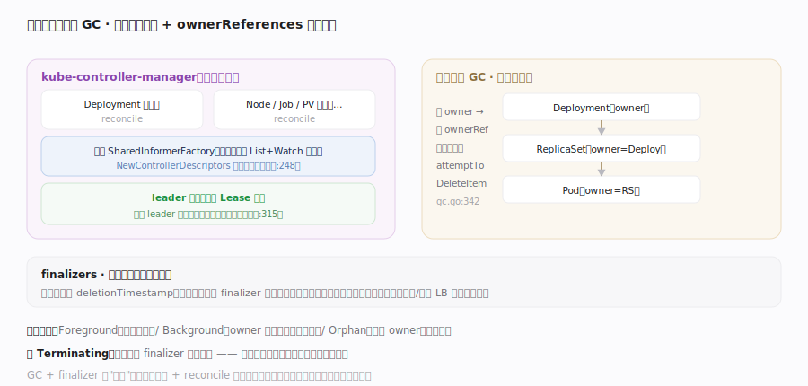

# Kubernetes 核心原理 · 支撑能力域 · 控制器管理器与垃圾回收

> **定位**：几十个控制器的"运行时底座"与集群级清理器。`kube-controller-manager` 把众多控制器编排进一个进程（共享 Informer、leader 选举保只有一个实例在跑），而**垃圾回收（GC）**控制器沿 `ownerReferences` 构成的对象图做级联删除、`finalizers` 提供删除前钩子——它们是让"控制器群"稳定运行、让"删除"正确收敛的公共机制。核实基准：`cmd/kube-controller-manager/app/controllermanager.go`、`pkg/controller/garbagecollector/garbagecollector.go`。

## 一、多控制器编排 + ownerReferences 级联 GC

**控制器编排**：controller-manager 启动时 `NewControllerDescriptors`（`cmd/kube-controller-manager/app/controllermanager.go:495`）注册全部控制器（Deployment/ReplicaSet/Node/Job/PV/GC…），由 `StartControllers`（controllermanager.go:662）逐个拉起，共用一个 SharedInformerFactory（同一资源只 List+Watch 一次）。**高可用靠 leader 选举**：多副本时在 `Run`（controllermanager.go:180）里用 `leaderelection`（controllermanager.go:51 导入、`LeaderCallbacks`:315）竞争一个 Lease 锁，`OnStartedLeading`（:316）里才真正 `StartControllers`，其余实例待命、`leaderelection lost`（:328）即退出——避免多实例同时 reconcile 同一对象产生冲突。**垃圾回收（GC）**：K8s 的删除不是控制器一个个手动删下游。GC 控制器（`pkg/controller/garbagecollector/garbagecollector.go`）由 `GraphBuilder`（`.../garbagecollector/graph_builder.go:78`）消费所有资源的 informer 事件，在内存里维护一张**对象依赖图** `uidToNode`（graph_builder.go:109）——边就是 `ownerReferences`（子对象 metadata 里指向 owner）。`processGraphChanges`（graph_builder.go:678）持续更新图；当一个 owner 被删，GC 的 `attemptToDeleteWorker`（garbagecollector.go:317）→ `attemptToDeleteItem`（garbagecollector.go:498）沿图级联删除孤儿子对象（如删 Deployment → 删其 ReplicaSet → 删 Pod）；`absentOwnerCache`（graph_builder.go:115，容量 500 见 :160）缓存"已确认不存在的 owner"避免反复查 API Server。**删除传播策略**：`attemptToDeleteItem` 里据请求选 `Foreground`（garbagecollector.go:622，先删下游、owner 最后消失）/ `Background`（:638，owner 先删、GC 后台清下游）/ `Orphan`（:632，保留下游、只删 owner）。**finalizers**：对象 metadata 里的 finalizer 列表让删除**可阻塞**——API Server 收到删除只是打上 `deletionTimestamp`，对象要等所有 finalizer 被对应控制器处理并移除后才真正消失（Foreground 用 `FinalizerDeleteDependents`:653、Orphan 用 `FinalizerOrphanDependents`:754）。GC + finalizer 共同保证"删除"这件事也在声明式 + reconcile 框架内正确收敛。

## 深化 · 级联删除的图算法与失败路径

GC 的正确性来自"依赖图 + 虚拟节点 + 双队列"的协作，几个易被忽视的机制与坑：

- **虚拟节点（virtual node）**：某对象声明了 owner，但 owner 还没被 informer 观察到时，`GraphBuilder` 先建一个"虚拟" owner 节点占位（graph_builder.go:410 附近注释），待真身出现或确认不存在再修正——避免"引用了尚未入图的 owner"时误判为孤儿。
- **absentOwnerCache 防抖**：确认某 owner 确实不存在后写入 `absentOwnerCache`（graph_builder.go:115），后续同引用直接判孤儿，不再打 API Server 查询——大规模删除时这是省 API 调用的关键。
- **Foreground 的两段式**：Foreground 删除时先给 owner 打上 `FinalizerDeleteDependents`（garbagecollector.go:653），owner 进入 `deletingDependents` 状态；GC 把它的每个下游加入删除队列（:657 注释），**下游全删净后才移除 owner 的 finalizer**，owner 这才真正消失——保证"看到 owner 还在就代表下游没删完"。
- **Orphan 的解绑**：Orphan 策略经 `runAttemptToOrphanWorker`（garbagecollector.go:706）把下游的对应 ownerReference 摘除、再移除 owner 的 `FinalizerOrphanDependents`（:754），使子对象成为无主对象被保留。
- **典型故障——卡 Terminating**：对象 `deletionTimestamp` 已置、却迟迟不消失，几乎总是某个 finalizer 对应的控制器没跑/没把自己摘除；GC 本身不会删有未完成 finalizer 的对象。强删（`--force --grace-period=0`）会绕过 finalizer，可能遗留外部资源泄漏，应先排查控制器健康。
- **discovery 抖动**：GC 靠 `Sync`（garbagecollector.go:175）周期性发现集群所有资源类型（含 CRD）重建 monitors；API 资源列表拉取失败会让新类型的对象暂时不被 GC 覆盖，需关注 controller-manager 的 discovery 错误日志。

## 深化 · 删除传播策略

| 策略 | 行为 | 用途 |
|---|---|---|
| Foreground | 先删所有下游，owner 最后删 | 需保证下游先清理 |
| Background（默认多数） | owner 先删，GC 后台清下游 | 快速返回 |
| Orphan | 只删 owner，保留下游 | 保留子对象（解绑管理） |

## 拓展 · 对象图与清理机制

| 机制 | 数据 | 作用 |
|---|---|---|
| ownerReferences | 子对象 → owner 的边 | GC 级联删除的图 |
| GC 控制器 | 内存依赖图 + attemptToDelete | 删 owner 连带删孤儿 |
| finalizers | metadata 字符串列表 | 删除前置钩子（阻塞至清理完） |
| deletionTimestamp | 删除标记 | "正在删除"而非立即消失 |
| leader 选举 | Lease 锁 | 保证控制器单实例运行 |

## 调优要点

- controller-manager 多副本 + leader 选举做 HA：`--leader-elect` 默认开，调 lease 时长权衡切换速度与抖动。
- `--concurrent-*-syncs` 调各控制器 worker 数，权衡收敛速度与 API Server 压力。
- 卡在 Terminating 的对象几乎总是 finalizer 未被移除：排查对应控制器是否健康，勿盲目强删。
- 大规模集群 GC 依赖图内存与 discovery 开销大：关注 GC 控制器的同步（Sync:175）健康。

## 常见误区

- **每个控制器一个进程**：几十个控制器共处 kube-controller-manager 一个进程、共享 Informer。
- **多副本控制器同时工作**：leader 选举保证只有一个实例跑循环。
- **删 Deployment 要手动删 Pod**：GC 沿 ownerReferences 级联删除下游。
- **删除即刻生效**：有 finalizer 时先打 deletionTimestamp，待 finalizer 清完才真正删除。

## 一句话总纲

**控制器管理器是控制器群的运行时底座：把几十个控制器编排进一个进程、共享 Informer、用 leader 选举保单实例运行；而垃圾回收沿 ownerReferences 对象图做级联删除、finalizers 提供可阻塞的删除前钩子、deletionTimestamp 标记"正在删除"——让"删除"也纳入声明式 + reconcile 的正确收敛，是支撑整个控制平面稳定运转的公共机制。**
