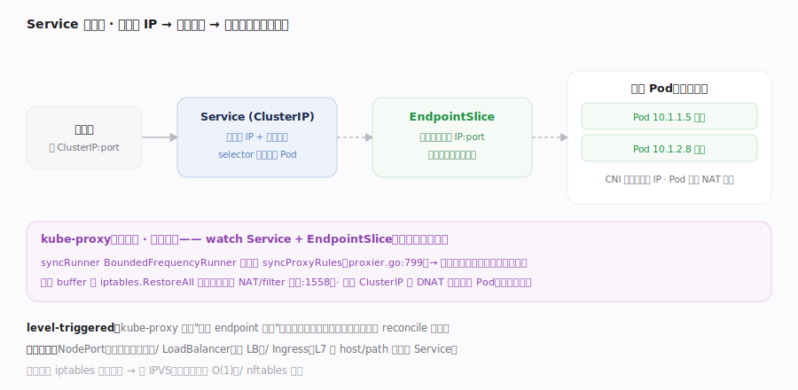

# Kubernetes 核心原理 · 支撑能力域 · 网络（Service / kube-proxy / CNI）

> **定位**：把"一组会漂移的 Pod"抽象成稳定的访问入口。Pod IP 随生灭而变，**Service** 提供固定的虚拟 IP（ClusterIP）+ 负载均衡；**EndpointSlice** 记录 Service 当前后端 Pod IP；**kube-proxy** 在每个节点把这套抽象落成本机转发规则；**CNI** 负责给 Pod 分配可路由的 IP。核实基准：`pkg/proxy/iptables/proxier.go`。

## 一、Service 数据面：ClusterIP → EndpointSlice → kube-proxy

**控制面**：用户建 Service（selector 选中一组 Pod）；EndpointSlice 控制器持续 reconcile——`syncService`（`pkg/controller/endpointslice/endpointslice_controller.go:354`）把匹配 selector 且就绪的 Pod IP:port 经 `reconciler.Reconcile`（endpointslice_controller.go:429）写进 EndpointSlice 对象（后端会漂移，这里始终反映当前就绪后端）。**数据面（kube-proxy）**：每个节点跑一个 kube-proxy，它 watch Service 与 EndpointSlice，经一个"节流的 reconcile"把全量规则刷进内核——`syncRunner`（`pkg/proxy/iptables/proxier.go:164`）是个 `BoundedFrequencyRunner`（`NewBoundedFrequencyRunner("sync-runner", proxier.syncProxyRules, minSyncPeriod, time.Hour, burstSyncs)` 注册于 proxier.go:328），事件回调 `OnServiceUpdate`（proxier.go:566）等只标脏 + `Sync()`（proxier.go:526 → `syncRunner.Run()`:531），由后台 `syncRunner.Loop`（proxier.go:543）限频调用 `syncProxyRules`（proxier.go:799）；后者**不增量改单条规则，而是重算整张表**写进 buffer（`iptablesData`）后 `proxier.iptables.RestoreAll(...)`（proxier.go:1558）一次性原子替换 NAT/filter 表。**转发语义**：访问 ClusterIP:port 的包被 iptables DNAT 到某个后端 Pod IP（多后端间随机/概率分摊做负载均衡）；这又是 level-triggered——kube-proxy 不追"哪条 endpoint 变了"，而是周期重算整表，保证与期望一致。**IP 分配**：Pod 的 IP 由 CNI 插件（Calico/Cilium/flannel）在 kubelet 建沙箱时分配并接入集群网络，保证 Pod 间可直接路由（K8s 网络模型要求"所有 Pod 无 NAT 互通"）。**暴露到集群外**：NodePort（每节点开端口）/ LoadBalancer（云 LB）/ Ingress（L7 反向代理，按 host/path 路由到 Service）。

## 深化 · 节流重刷的失败路径与整表原子性

kube-proxy 的"周期重算整表"看似暴力，却正是其鲁棒性来源，几个关键机制：

- **限频 + 突发**：`NewBoundedFrequencyRunner`（proxier.go:328）设 `minSyncPeriod`（两次刷表最小间隔，防抖）与 `burstSyncs`（允许的突发次数），既不会每来一个 endpoint 变更就刷一次表（CPU 爆炸），也不会让紧急变更等太久。
- **刷表失败自愈**：若 `RestoreAll`（proxier.go:1558）执行 `iptables-restore` 失败（如规则冲突、内核繁忙），`syncProxyRules` 记失败并 `syncRunner.RetryAfter`（proxier.go:834）安排稍后重试——因为是**整表重算**，重试不需要知道"上次改到哪"，天然幂等，这是增量式改规则做不到的容错。
- **整表原子替换**：`iptables-restore --noflush` 把新表一次性载入，避免"删旧规则到加新规则之间"出现流量黑洞；对比逐条 `iptables -A/-D` 的中间不一致态，整表替换保证任意时刻内核里都是一份自洽的规则集。
- **就绪后端才入表**：EndpointSlice 只收录 `Ready` 的 Pod（`reconciler.Reconcile`，endpointslice_controller.go:429），未就绪/正在删的 Pod 不进转发目标——所以滚动升级时流量不会打到还没起好的新 Pod，也不会打到正在优雅退出的旧 Pod（配合 terminating 端点的特殊处理）。
- **规模退化**：iptables 模式规则数随 Service×后端线性增长，syncProxyRules 单次刷表耗时也随之上升；超大集群应切 IPVS（内核哈希表 O(1) 查找）或 nftables，把"整表重算"的成本从 O(N) 降下来。
- **有状态转发不丢连接**：iptables DNAT 依赖 conntrack 记录已建立连接的后端，规则重刷只影响**新连接**的选路，已建立的长连接仍按 conntrack 里的旧后端走——所以 endpoint 变更不会粗暴切断在途连接，但被删后端的 conntrack 表项需清理（`--cleanup-conntrack`），否则可能把新连接误导到已消失的后端。

## 深化 · 网络对象与职责

| 对象/组件 | 职责 | 类比 |
|---|---|---|
| Service (ClusterIP) | 稳定虚 IP + 负载均衡入口 | 内部 VIP |
| EndpointSlice | 当前就绪后端 Pod IP 列表 | 后端池（会变） |
| kube-proxy | 把 Service→后端 落成本机转发规则 | 分布式 LB 数据面 |
| CNI 插件 | 给 Pod 分配可路由 IP + 接入网络 | 网卡 + 路由 |
| Ingress | L7（host/path）路由到 Service | 反向代理 |

## 拓展 · kube-proxy 后端模式

| 模式 | 机制 | 特点 |
|---|---|---|
| iptables | DNAT 规则链，概率分摊 | 默认、成熟；规则数随 Service 线性增长 |
| IPVS | 内核 LVS 哈希表 | 大规模下查找 O(1)、更快 |
| nftables | 新一代内核过滤框架 | 替代 iptables 的演进方向 |

## 调优要点

- 大规模 Service/Endpoint 下 iptables 规则膨胀 → 改用 IPVS/nftables 模式降低同步与查找开销。
- `minSyncPeriod` 控制 kube-proxy 重刷频率：太小 CPU 高、太大收敛慢。
- EndpointSlice（替代旧 Endpoints）分片降低大 Service 的 watch/更新压力。
- Service 拓扑感知路由（内部流量策略）可让流量优先本地节点后端，降跨区延迟。

## 常见误区

- **Service 有自己的进程在转发**：ClusterIP 是虚 IP，转发靠各节点内核规则（kube-proxy 只写规则不代理流量，iptables 模式下）。
- **kube-proxy 增量改规则**：iptables 模式是周期重算整表原子替换（level-triggered）。
- **Pod 通信要经过 Service**：Pod 间可直接用 Pod IP 互通；Service 只是给"一组会变的 Pod"一个稳定入口。
- **Ingress 和 Service 同层**：Ingress 是 L7，通常路由到 Service（L4）再到 Pod。

## 一句话总纲

**K8s 网络把"会漂移的一组 Pod"抽象成稳定入口：Service 给固定 ClusterIP + 负载均衡、EndpointSlice 记录当前就绪后端、kube-proxy 在每个节点把这套抽象周期重算成内核转发规则（iptables/IPVS，DNAT 到后端），而 CNI 保证所有 Pod 无 NAT 可路由互通——同样是 level-triggered 的整表重刷，让数据面持续贴合期望。**
