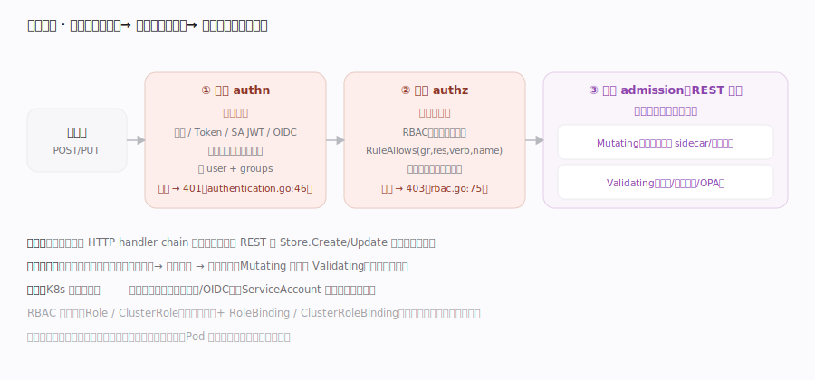

# Kubernetes 核心原理 · 支撑能力域 · 认证授权与准入

> **定位**：写请求进入 API Server 后的三道关卡——**认证（你是谁）→ 授权（你能不能）→ 准入（内容合规吗，可改可拒）**。前两道是 HTTP 过滤器链的一环，第三道在 REST 层落库前触发。这是集群的安全边界与策略注入点。核实基准：`staging/src/k8s.io/apiserver/pkg/endpoints/filters/authentication.go`、`plugin/pkg/auth/authorizer/rbac/rbac.go`、`admission/plugin/webhook/mutating/dispatcher.go`、`server/config.go`。

## 一、三道关卡：authn → authz → admission

**① 认证（Authentication）**：`WithAuthentication`（`staging/src/k8s.io/apiserver/pkg/endpoints/filters/authentication.go:46` → 内部 `withAuthentication`:50）在 handler chain 里调 `auth.AuthenticateRequest(req)`（authentication.go:67）——多个认证器由 union 组合器聚合（`staging/src/k8s.io/apiserver/pkg/authentication/request/union/union.go:36` 的 `New(...)`），按证书 / Bearer Token / ServiceAccount JWT / OIDC 等**联合**尝试，任一成功就得出 user + groups；全失败走 `Unauthorized`（authentication.go:127，返回 401）。K8s **不存用户表**：普通用户由外部身份系统 + 证书/OIDC 承载，ServiceAccount 才是集群内建身份（其 JWT 由 SA token authenticator 校验）。**② 授权（Authorization）**：`WithAuthorization`（`staging/src/k8s.io/apiserver/pkg/endpoints/filters/authorization.go:53`）调 `a.Authorize(ctx, attributes)`（authorization.go:71），主力是 **RBAC**——`RBACAuthorizer.Authorize`（`plugin/pkg/auth/authorizer/rbac/rbac.go:75`）构造 `authorizingVisitor` 后经 `VisitRulesFor`（rbac.go:78）遍历该 user/group 绑定的所有 Role/ClusterRole 规则，`RuleAllows`（rbac.go:178）逐条比对 (apiGroup, resource, verb, name)；**默认拒绝**，只有命中某条允许规则、`ruleCheckingVisitor.allowed==true`（rbac.go:79）才返回 `DecisionAllow`（rbac.go:80）。过滤器侧：`DecisionAllow`（authorization.go:79）放行，否则记 `Forbidden`（authorization.go:92）返回 403。角色（Role/ClusterRole）定义"能对什么资源做什么动作"，绑定（RoleBinding/ClusterRoleBinding）把角色授予主体。**③ 准入（Admission）**：过了 authn/authz 后，在 REST handler 内、对象解码后落库前，先跑 **Mutating**（可改写对象，如注入 sidecar、补默认值；`mutatingDispatcher.Dispatch`:105 逐个 `callAttrMutatingHook`:244 调 webhook，改写后可触发**重调用（reinvocation）**:150/195）再跑 **Validating**（只校验、可拒；`validatingDispatcher.Dispatch`:88 并发 `callHook`:248 调 webhook，如 OPA/Gatekeeper 策略）。准入是策略注入的关键切面——配额（ResourceQuota）、Pod 安全、镜像策略都在此实现。**顺序铁律**：认证在前（不知道你是谁无法鉴权）、鉴权居中、准入最后（且 Mutating 必在 Validating 前，否则改完不复检）。

## 深化 · 三关对比

| 关卡 | 问题 | 主力机制 | 失败 | 位置 |
|---|---|---|---|---|
| 认证 authn | 你是谁 | 证书 / Token / SA JWT / OIDC | 401 | handler chain filter |
| 授权 authz | 你能不能 | RBAC（默认拒绝） | 403 | handler chain filter |
| 准入 admission | 内容合规吗 | Mutating + Validating webhook | 拒绝/改写 | REST 落库前 |

## 拓展 · RBAC 四对象

| 对象 | 作用域 | 含义 |
|---|---|---|
| Role | namespace | 一组权限规则（资源×动作） |
| ClusterRole | 集群 | 跨 namespace / 集群级资源的规则 |
| RoleBinding | namespace | 把 (Cluster)Role 授予主体 |
| ClusterRoleBinding | 集群 | 集群范围授予主体 |

## 深化 · webhook 准入的失败路径与重调用

准入 webhook 在**写请求关键路径**上，其失败处理是集群稳定性的敏感点：

- **failurePolicy=Fail vs Ignore**：webhook 服务不可达/超时时，`Fail` 直接拒绝请求（保护策略优先，但 webhook 挂会阻断整个资源的写），`Ignore` 放行（可用性优先，但策略可能被绕过）。dispatcher 在 `callHook`（validating/dispatcher.go:248）/`callAttrMutatingHook`（mutating/dispatcher.go:244）里按此策略把网络错误转成拒绝或忽略。
- **Mutating 重调用（reinvocation）**：若某 webhook 改了对象、而更靠后的 webhook 又改了它，先前的 webhook 可能需要基于新对象再跑一次——`mutatingDispatcher.Dispatch` 用 `reinvokeCtx`（mutating/dispatcher.go:106），检测 `IsOutputChangedSinceLastWebhookInvocation`（:115）后 `SetShouldReinvoke`（:195），对 `reinvocationPolicy=IfNeeded` 的 webhook 二次调用；这要求 webhook **幂等**，否则会产生累积改写。
- **Validating 并发**：validating webhook 之间无依赖，`Dispatch`（validating/dispatcher.go:88）并发调用所有 hook，任一拒绝即整体拒绝——延迟取决于最慢的 webhook。
- **authn/authz 内部错误**：认证器返回 err（非"认证失败"）时 `withAuthentication`（authentication.go:50 起）按实现处理；授权器内部 error 走 `InternalError`（authorization.go:88）返回 500 而非 403，以区分"明确拒绝"与"暂时故障"。
- **matchPolicy / namespaceSelector 漏配**：webhook 只对匹配的资源生效，配错 selector 会让本该拦截的对象**静默漏过**——这是策略失效最常见的运维事故。

## 调优要点

- 遵循最小权限：优先 namespace 级 Role/RoleBinding，慎用 ClusterRoleBinding 与通配 `*`。
- ServiceAccount 是 Pod 的身份：给工作负载专用 SA + 精确 RBAC，别用 default SA 附高权限。
- Validating/Mutating webhook 在写路径关键路径上：webhook 慢或挂会拖垮/阻断写请求，设 `failurePolicy` 与超时要谨慎。
- 用 `kubectl auth can-i` 验证有效权限；审计日志（Audit）回溯"谁在何时做了什么"。

## 常见误区

- **K8s 有内建用户数据库**：普通用户来自外部（证书/OIDC），集群只内建 ServiceAccount。
- **RBAC 默认放行**：默认拒绝，必须显式规则允许。
- **准入是 HTTP 过滤器**：认证鉴权是 filter，准入在 REST 层落库前（Mutating 先于 Validating）。
- **认证通过就能操作**：认证只确认身份，还要过授权与准入。

## 一句话总纲

**每个写请求进 API Server 都要过三道关：认证（联合认证器确认 user/groups，失败 401）→ 授权（RBAC 默认拒绝、命中允许规则才放行，失败 403）→ 准入（落库前 Mutating 改写 + Validating 校验，注入配额/安全/策略）；三者顺序固定、职责正交，构成 K8s 的安全边界与策略切面，且准入是把组织策略织进声明式流程的核心扩展点。**
