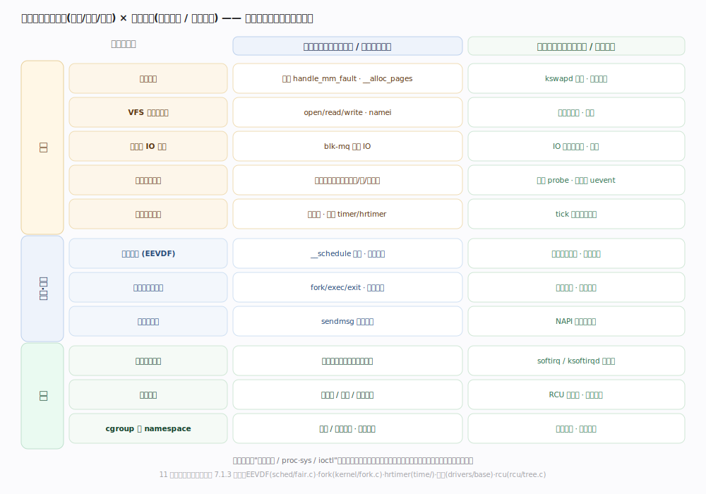
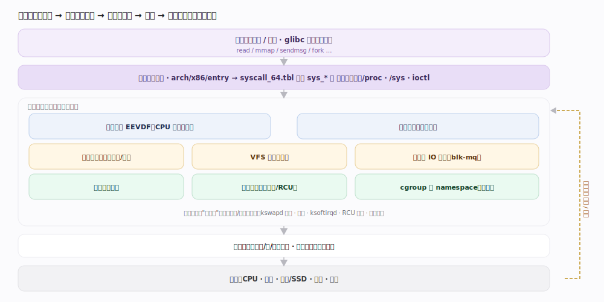
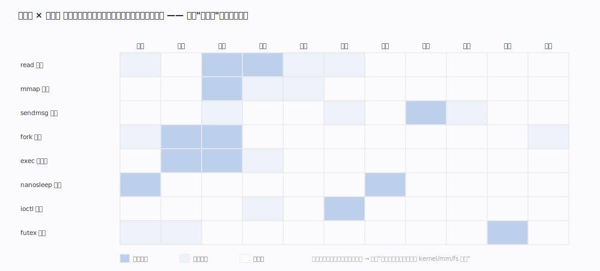

# Linux 内核原理 · 全景主线框架

> **定位**：用"双维模型"把 Linux 内核的**接触面主线**与**支撑能力域**归位。范例基于内核源码树自述版本 **7.1.3**（`/Users/zhangdongdong92/workdir/linux-7.1.3`，Makefile `VERSION=7 PATCHLEVEL=1 SUBLEVEL=3`）——**一切机制、默认值、数据结构均以该树源码为准**，不跨版本拼凑。判型：OS 内核家族(接触面=系统调用/伪文件系统/ioctl；引擎自管硬件与进程)。

## 一、双维模型（能力域 × 执行时机）

内核不按目录(kernel/mm/fs/net…)理解，而按**两维**归位：一维是**能力域**(底座 / 计算·通信 / 保障)，一维是**执行时机**(前台：系统调用与中断上下文，同步 vs 后台：内核线程/软中断，异步)。**与 Doris 等把"后台任务"单列为一个能力域不同，Linux 的后台是分散在各能力域里的**(kswapd 属内存、ksoftirqd 属中断、回写属 VFS/块层)，故"异步"在此是执行时机维、不是独立能力域。**每个能力域都有前台与后台两半**——内存前台是缺页、后台是 kswapd 回收；网络前台是 `sendmsg`、后台是软中断收包。

| 能力域层 | 主线 | 前台(同步) | 后台(异步) |
|---|---|---|---|
| 底座 | 虚拟内存 | 缺页 `handle_mm_fault` | kswapd 回收、脏页回写 |
| 底座 | VFS 与文件系统 | `open/read/write` 路径 | 回写、预读 |
| 底座 | 块层与 IO 调度 | `blk-mq` 提交 | IO 完成软中断、合并 |
| 底座 | 设备驱动模型 | 设备操作转驱动 | 探测、热插拔 uevent |
| 底座 | 时间与定时器 | 读时间、设定时器 | tick 驱动到期回调 |
| 计算 | 进程调度 | 调度切换 `__schedule` | 负载均衡、时钟节拍 |
| 计算 | 进程与任务管理 | `fork`/`exec`/`exit`、信号 | 僵尸回收 |
| 计算·通信 | 网络协议栈 | `sendmsg` 发送 | NAPI 软中断收包 |
| 保障 | 中断与软中断 | 硬中断上半部 | softirq/ksoftirqd 下半部 |
| 保障 | 同步原语 | 自旋锁/原子 | RCU 宽限期回调 |
| 保障 | cgroup 与 namespace | 记账/限额校验 | 统计与释放 |

（接触面主线"系统调用/伪文件系统/ioctl"是**入口**，不占能力域，见下。）

---

## 二、总架构（用户态 / 内核态边界）

用户进程通过**系统调用**(x86-64 经 `arch/x86/entry`，查 `syscall_64.tbl` 分派到 `sys_*`)穿过特权边界进入内核；内核把请求交给对应子系统(调度/内存/VFS/网络…)，子系统经驱动访问硬件；硬件事件经**中断**异步回灌。`/proc`、`/sys` 是把内核状态映射成文件的旁路接触面。

---

## 二·补　接触面 × 能力域 依赖矩阵

一条 `read` 系统调用会**横跨**多条能力域主线，这正是"按能力域而非按目录"归位的理由：

| 接触面动作 | 经手的能力域主线(依赖) |
|---|---|
| `read` 文件 | 系统调用入口 → VFS → 文件系统 → 页缓存(虚拟内存) → 块层 → 调度(阻塞让出) |
| `mmap` + 访问 | 系统调用 → 虚拟内存(VMA/缺页) → 文件系统(映射页) |
| `sendmsg` | 系统调用 → 网络协议栈 → 软中断 → 驱动 |
| `fork` | 系统调用 → 进程与任务管理(`copy_process`) → 进程调度(入队) → 虚拟内存(地址空间 COW) → namespace/cgroup |

---

## 三、三条贯穿声明

- **一切皆"进入内核再返回"**：用户态经系统调用/中断/异常三种方式陷入内核，处理毕返回——接触面主线讲这道边界。
- **一切资源都被抽象+隔离**：进程(调度)、内存(地址空间)、文件(VFS)、设备(驱动)被统一抽象；cgroup/namespace 在其上再切一层隔离。
- **前台尽快返回、重活丢后台**：中断上半部只登记、下半部(软中断/内核线程)慢慢做；内存/IO 的回收回写同理——这是"执行时机"维度的贯穿。

---

## 一句话总纲

**Linux 内核是一台"陷入—分派—返回"的机器：用户态经系统调用/中断/异常陷入，内核按能力域(进程调度分配 CPU、进程管理司生灭、虚拟内存管地址空间、VFS 管文件、块层/驱动/时间垫底座、网络栈管通信，同步原语与中断保正确、cgroup/namespace 保隔离)处理，重活交后台内核线程，处理毕返回用户态。**
