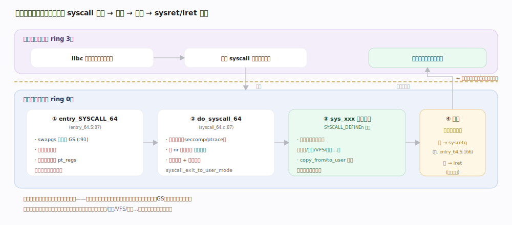
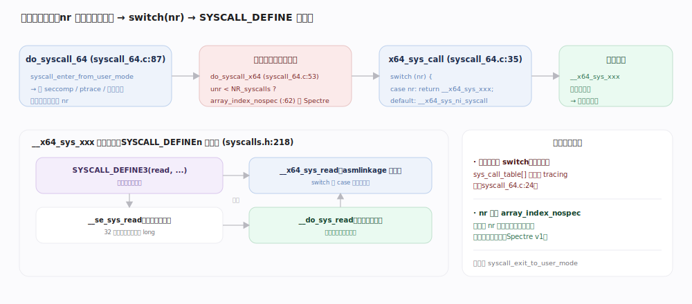
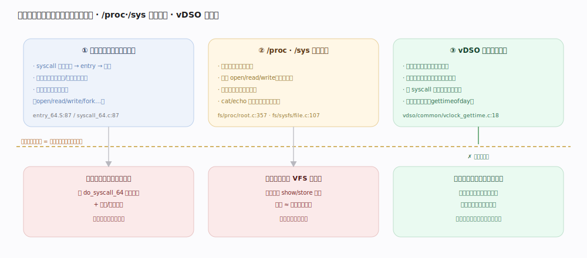
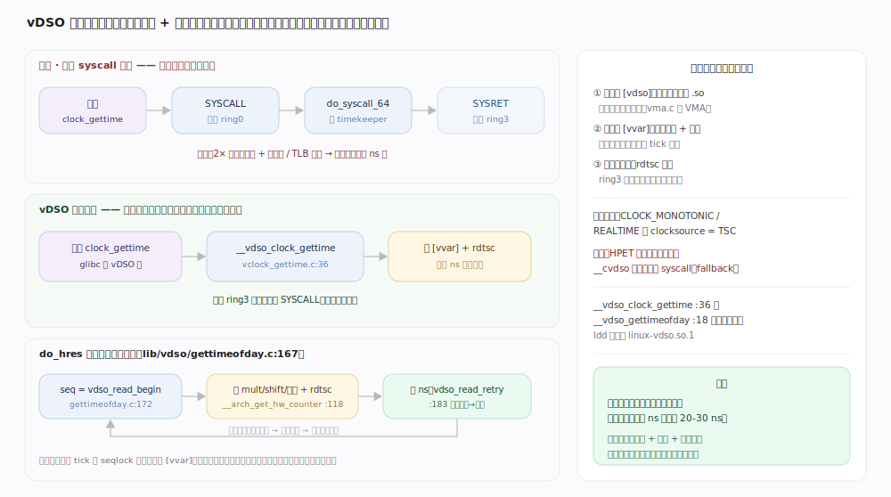

# Linux 内核原理 · 接触面（系统调用 / proc·sys / ioctl）

> **定位**：**接触面主线**——用户态进入内核的常规入口。以"陷入 → 分派 → 返回"为骨架；主入口是**系统调用**，旁路是 `/proc`、`/sys` 伪文件系统与 `ioctl`。它不占能力域，而是把请求**分派给**所有能力域主线（调度/内存/VFS/网络…），故被下游全部依赖、依赖上下文切换与内存（`copy_from/to_user`）。源码树 7.1.3（x86_64）。

## 一、陷入与返回（entry → syscall → 返回用户态）

一次系统调用是一次**受控的特权级切换**。用户态执行 `syscall` 指令，CPU 跳到内核预设的入口 `entry_SYSCALL_64`（`arch/x86/entry/entry_64.S:87`）：先 `swapgs`（`entry_64.S:91`，切到内核 per-CPU 数据）、切到内核栈、把用户寄存器压成 `pt_regs`（后续系统调用的参数来源），再 `call do_syscall_64`（`entry_64.S:121`）进入 C 层处理。返回时按条件走**快路径 `sysretq`**（`entry_64.S:166`）或慢而全能的 `iret`——`do_syscall_64` 末尾逐条校验寄存器是否满足 SYSRET 前提（`arch/x86/entry/syscall_64.c:112`），不满足才回退 IRET。**用户代码从不直接跳进内核函数**，只能经这个唯一的硬件门，内核在门内完全掌控栈、GS、权限。

## 二、参数传递与用户态内存访问

系统调用参数经寄存器传入、封装在 `pt_regs` 里。**内核绝不直接解引用用户指针**——用户传来的地址可能非法、可能指向内核空间（提权攻击）。跨越边界必须走专用原语：`copy_from_user`/`copy_to_user`（`include/linux/uaccess.h:166`）先 `access_ok`（`arch/x86/include/asm/uaccess_64.h:98`，校验地址落在用户空间 `valid_user_address`）再拷贝，并在拷贝前后插入 `barrier_nospec` 防投机执行泄漏（`uaccess.h:182`）；短拷贝时还会把目标缓冲区剩余部分清零（`uaccess.h:190`）防信息泄漏。这是用户/内核地址空间隔离的**强制关卡**。

---

## 深化 · 系统调用分派全景

进内核后，`do_syscall_64`（`arch/x86/entry/syscall_64.c:87`）按系统调用号 `nr` 分派：先 `syscall_enter_from_user_mode`（处理 ptrace/seccomp/审计等进入钩子），再 `do_syscall_x64`（`syscall_64.c:53`）用 `array_index_nospec` 对 `nr` 做**防投机边界检查**（`syscall_64.c:62`，抵御 Spectre），命中后进 `x64_sys_call`——7.1.3 里分派已从函数指针数组改为 **`switch(nr)` 语句**（`syscall_64.c:35`，`sys_call_table` 仅留给 tracing 用，`syscall_64.c:24`）。每个 `case nr` 调到 `__x64_sys_xxx`。这个符号由 `SYSCALL_DEFINEn` 宏（`include/linux/syscalls.h:218`）生成：宏展开出 `__se_sys_xxx`（对 32 位参数做符号扩展）→ `__do_sys_xxx`（真正实现体），并做类型别名与参数注入。完成后 `syscall_exit_to_user_mode`（`syscall_64.c:100`）跑退出钩子（含前述返回用户态时的信号处理）。

## 深化 · /proc、/sys 伪文件系统旁路

系统调用是**动作**入口，但很多**状态查看/调参**用不着专门的系统调用——Linux 把它们映射成文件，复用 `open/read/write` 这套 VFS 接口，这就是**旁路接触面**。`/proc`（`fs/proc/`，`proc_fs_type` 在 `fs/proc/root.c:357`）暴露进程与内核运行态（`/proc/<pid>/*`、`/proc/sys/*` 即 sysctl）；`/sys`（`fs/sysfs/`）把内核对象模型 `kobject` 映射成目录树，读写某文件即触发对应 `kobject` 的 `show`/`store` 回调（`fs/sysfs/file.c:107`）。**好处**：无需为每个可观测项新增系统调用，`cat`/`echo` 即可交互，天然可脚本化。

## 深化 · vDSO 与快速路径

有些系统调用（如取时间 `gettimeofday`/`clock_gettime`）**极高频且只读内核维护的公共数据**，为每次调用付一次陷入/返回代价太亏。**vDSO**（virtual dynamic shared object，`arch/x86/entry/vdso/`）把这些函数的实现**以一个共享库页面映射进每个进程的地址空间**：用户调用 `__vdso_gettimeofday`（`arch/x86/entry/vdso/common/vclock_gettime.c:18`）时**在用户态直接读内核映射的时间数据页**算出结果，**完全不陷入内核**（无 `syscall` 指令、无特权切换）。这是"用共享只读内存换掉陷入开销"的经典优化——快路径快在**根本没进内核**。

---

## 拓展 · ioctl 与其它接触面

| 接触面 | 用途 | 源码 |
|---|---|---|
| 系统调用 | 主入口（动作） | `entry_64.S:87` / `syscall_64.c:87` |
| /proc · /sys | 状态查看 / 调参（映射为文件） | `fs/proc/root.c:357` · `fs/sysfs/` |
| ioctl | 设备特定操作（字符/块设备控制） | `fs/ioctl.c` |
| vDSO | 免陷入的高频只读调用（gettimeofday 等） | `arch/x86/entry/vdso/` |
| netlink / eventfd / io_uring | 特定通信 / 异步 IO 提交 | 各自子系统 |

---

## 调优要点（关键开关，均据 7.1.3 源码）

- `sysctl`（即写 `/proc/sys/*`）：内核绝大多数运行时开关都经此调，本身就是 `/proc` 旁路的落地。
- vDSO 生效前提：依赖时钟源支持用户态读（如 TSC）；不支持时 `__vdso_*` 会回退真正的系统调用。
- `seccomp`：在 `syscall_enter_from_user_mode` 进入钩子处按过滤规则拦截系统调用，是沙箱基石（`syscall_64.c:89` 路径）。
- SYSRET vs IRET：由 `do_syscall_64` 末尾的寄存器校验（`syscall_64.c:112`）自动选择，无用户开关，但异常寄存器状态会强制走慢路径 IRET。

---

## 常见误区与工程要点

- **"系统调用就是调用一个内核函数"**：错。它是经 `syscall` 指令触发的**特权级切换 + 硬件门**，内核在门内重建栈/GS/权限后才分派，用户无法直接跳进内核代码。
- **"内核可以直接读用户传来的指针"**：错。必须 `copy_from_user`/`access_ok` 校验并防投机，否则是提权与信息泄漏漏洞。
- **"分派靠一张函数指针表 `sys_call_table`"**：7.1.3 里实际分派已改为 `switch(nr)`（`syscall_64.c:35`），`sys_call_table` 只留给 tracing。
- **"`gettimeofday` 每次都陷入内核"**：走 vDSO 时在用户态直接读内核映射的数据页算出，**根本不进内核**。

---

## 一句话总纲

**用户态经 `syscall` 指令走唯一硬件门 `entry_SYSCALL_64` 陷入：切栈、把寄存器封成 `pt_regs`，`do_syscall_64` 用防投机边界检查后经 `switch(nr)` 分派到 `SYSCALL_DEFINE` 生成的 `__x64_sys_*`，跨边界数据一律经 `copy_from/to_user`+`access_ok` 校验，最后按寄存器状态选 `sysret`/`iret` 返回；`/proc`·`/sys` 把内核状态映射成文件作旁路，vDSO 则让高频只读调用在用户态直接读数据页、根本不陷入。**
