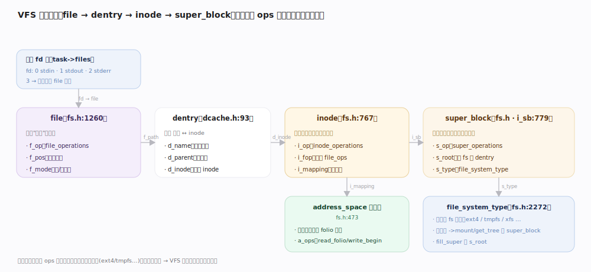
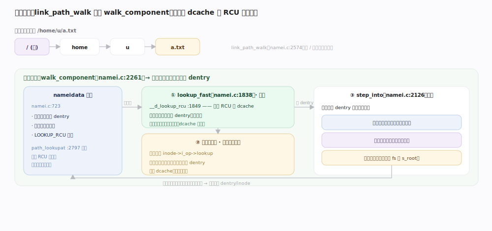
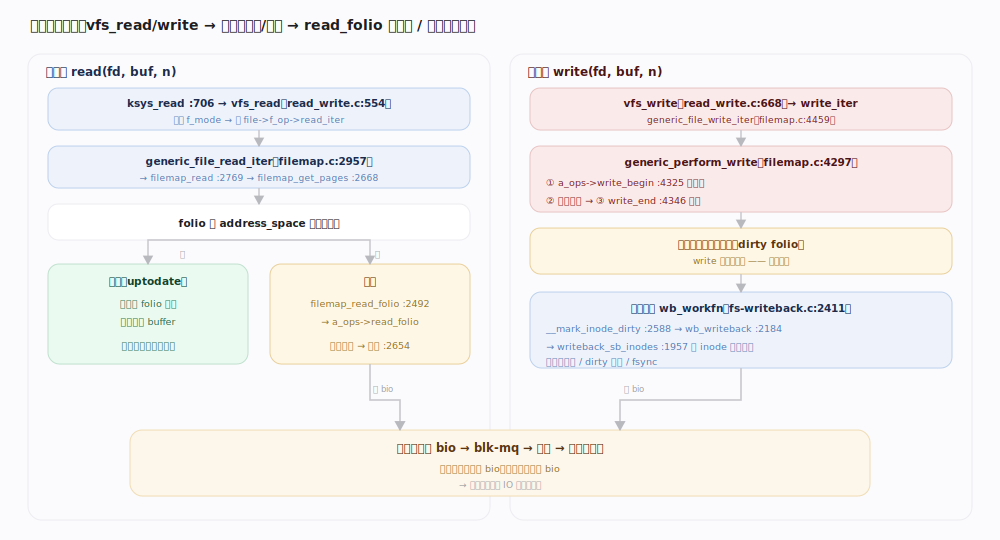
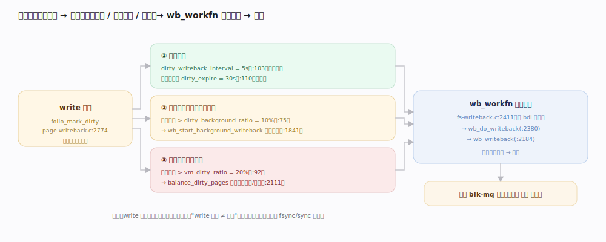
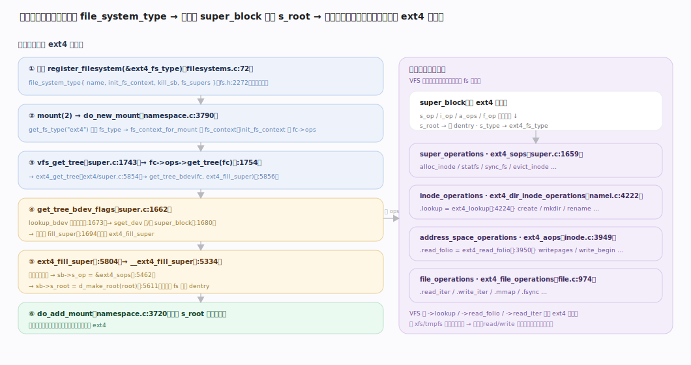

# Linux 内核原理 · VFS 与文件系统

> **定位**：**底座能力域**。用统一抽象(super_block/inode/dentry/file)屏蔽各具体文件系统，向上支撑 `open/read/write`，向下对接块层。前台 = 系统调用读写路径；后台 = 页缓存回写、预读。依赖**虚拟内存**（页缓存）与**块层**；被接触面(文件类系统调用)依赖。源码树 7.1.3。

## 一、VFS 四大对象：一套抽象套住所有文件系统

VFS 定义四个核心对象，每个挂一组**函数指针操作表**，具体文件系统(ext4/xfs/tmpfs…)填自己的实现——这就是"面向接口"的多态：

| 对象 | 代表 | 关键字段 / ops | file:line |
|---|---|---|---|
| super_block | 一个已挂载的文件系统实例 | `s_op`(super_operations)、`s_root`、`s_type` | `include/linux/fs.h`（`i_sb`，:779） |
| inode | 一个文件的元数据（与名字无关） | `i_op`(inode_operations)、`i_fop`、`i_mapping`(页缓存) | `fs.h:767` |
| dentry | 路径中的一个名字，连接名字↔inode | `d_parent`、`d_inode`、`d_name` | `include/linux/dcache.h:93` |
| file | 一个进程打开文件的实例（含偏移） | `f_op`(file_operations)、`f_pos`、`f_mode` | `fs.h:1260` |

进程的 `fd` 表指向 `file`，`file` 经 dentry 找到 `inode`，`inode` 属于某个 `super_block`；`inode->i_mapping` 指向 `address_space`(`fs.h:473`)——即该文件的**页缓存**。文件系统类型由 `file_system_type`(`fs.h:2272`)注册，挂载时经 `->mount/get_tree` 建 `super_block` 并填 `s_root`。

## 二、打开与路径解析：从字符串到 dentry

`open` → `do_sys_open`(`fs/open.c:1367`) → `do_sys_openat2`(`open.c:1355`) → `do_filp_open` → `path_openat`。核心是把路径**字符串**逐段翻译成 `dentry`：`link_path_walk`(`fs/namei.c:2574`)按 `/` 拆分，逐段 `walk_component`(`namei.c:2261`)。

---

## 深化 · 路径解析与 dcache（RCU 快速 walk）

解析在 `nameidata`(`namei.c:723`)里维护"当前所在目录 + 剩余路径"游标，逐段前进：

1. **查 dentry 缓存**：`lookup_fast`(`namei.c:1838`)先走 `__d_lookup_rcu`(`namei.c:1849`)——**无锁 RCU 查 dcache**，命中即拿到子 dentry，避免每段都下盘。
2. **缓存未命中**：回退到持锁慢路，调父目录 `inode->i_op->lookup` 让**具体文件系统**读目录项、建新 dentry 填入 dcache。
3. **步进** `step_into`(`namei.c:2126`)：进入子目录/跟随符号链接/跨越挂载点，更新游标。

整条路径由 `path_lookupat`(`namei.c:2797`)驱动，**先试 `LOOKUP_RCU` 无锁模式，失败再降级持锁重试**。dcache 是路径解析的性能命脉——热路径几乎全在内存里完成。

## 深化 · read/write 全路径（VFS → 页缓存 → 块层）

**读路径**（贯穿示例：`read(fd, buf, n)`）：`ksys_read`(`fs/read_write.c:706`) → `vfs_read`(`read_write.c:554`) → `file->f_op->read_iter` → 通用实现 `generic_file_read_iter`(`mm/filemap.c:2957`) → `filemap_read`(`filemap.c:2769`) → `filemap_get_pages`(`filemap.c:2668`)：

- **页缓存命中**：目标 folio 已在 `address_space` 且 uptodate → 直接拷回用户 buffer，**不碰块层**。
- **缺失**：`filemap_read_folio`(`filemap.c:2492`) → `a_ops->read_folio`（具体文件系统实现）→ 提交 **bio 到块层**读盘，读毕唤醒；顺序访问由 `filemap_readahead`(`filemap.c:2654`)**预读**后续页。

**写路径**：`vfs_write`(`read_write.c:668`) → `generic_file_write_iter`(`filemap.c:4459`) → `generic_perform_write`(`filemap.c:4297`)：`a_ops->write_begin`(`:4325`)准备页 → 拷入用户数据 → `a_ops->write_end`(`:4346`)**把 folio 标脏**。**write 返回时数据只在页缓存**，尚未落盘。

## 深化 · 页缓存与回写

脏页何时落盘由后台回写决定：`__mark_inode_dirty`(`fs/fs-writeback.c:2588`)把 inode 挂到其 bdi 的脏链表。每个 bdi 一个 `wb_workfn`(`fs-writeback.c:2411`)工作线程 → `wb_do_writeback`(`:2380`) → `wb_writeback`(`:2184`) → `writeback_sb_inodes`(`:1957`)逐 inode 回写脏 folio 到块层。触发有三：**周期回写**（`dirty_writeback_centisecs`）、**脏页占比超阈值**（`vm.dirty_background_ratio`/`vm.dirty_ratio`）、**`fsync`/`sync` 显式同步**。**只有 fsync 才保证落盘**。

## 深化 · 具体文件系统接入（挂载）

`file_system_type`(`fs.h:2272`)经 `register_filesystem` 注册；`mount` 时经 `->mount`/`get_tree` 读超级块、`fill_super` 建 `super_block` 并填 `s_root`（该 fs 的根 dentry）。之后该子树的所有 inode/dentry 操作都分派到这个 fs 填的 `s_op`/`i_op`/`a_ops`。ext4 等把 `read_folio`/`write_begin`/`lookup` 指向自己的实现，VFS 只管调接口。

---

## 拓展 · 特殊文件系统

| 文件系统 | 特点 | 用途 |
|---|---|---|
| proc / sysfs | 内容由内核**动态生成**，无实际磁盘块 | 暴露内核/进程状态、可调参数 |
| tmpfs | 数据只在页缓存/swap，无后端块设备 | `/tmp`、共享内存、`/dev/shm` |
| overlayfs | 上下层联合挂载(lower 只读 + upper 可写) | 容器镜像分层 |
| devtmpfs | 内核填充设备节点 | `/dev` |

---

## 调优要点（关键开关，均据 7.1.3 源码）

- `vm.dirty_background_ratio`（`mm/page-writeback.c:75`，默认 10）：脏页占比达此值时**后台**回写启动。
- `vm.dirty_ratio`（`page-writeback.c:92`，默认 20）：达此值时**写进程被同步阻塞**去回写。
- 挂载选项 `noatime`/`relatime`：抑制读时更新访问时间，减元数据写。
- `/proc/sys/fs/file-max`、`fs.nr_open`：系统/进程级最大打开文件数。

---

## 常见误区与工程要点

- **write 返回即落盘**：错。数据先进页缓存被标脏，靠后台回写或 `fsync` 才落盘；掉电会丢未回写数据。
- **read 一定读磁盘**：错。页缓存命中时纯内存拷贝，根本不碰块层。
- **文件删除立即释放空间**：未必。仍有进程持有打开的 `file`（inode `i_nlink=0` 但引用非零），关闭后才真正释放。
- **dentry/inode 缓存是浪费内存**：错。它们是路径解析与元数据访问的性能命脉，属可回收的 slab 缓存。

---

## 一句话总纲

**VFS 用 super_block/inode/dentry/file 四大对象 + 各自 ops 表把所有文件系统套进一套接口：路径解析靠 `link_path_walk` 逐段 `walk_component`、优先走 dcache 的 RCU 无锁查找；读写经 `->read_iter`/`->write_iter` 走页缓存——命中纯内存拷贝、缺失才 `read_folio` 下块层，写只标脏、由 `wb_workfn` 后台按 dirty 阈值/周期回写，唯 `fsync` 保证落盘。**
