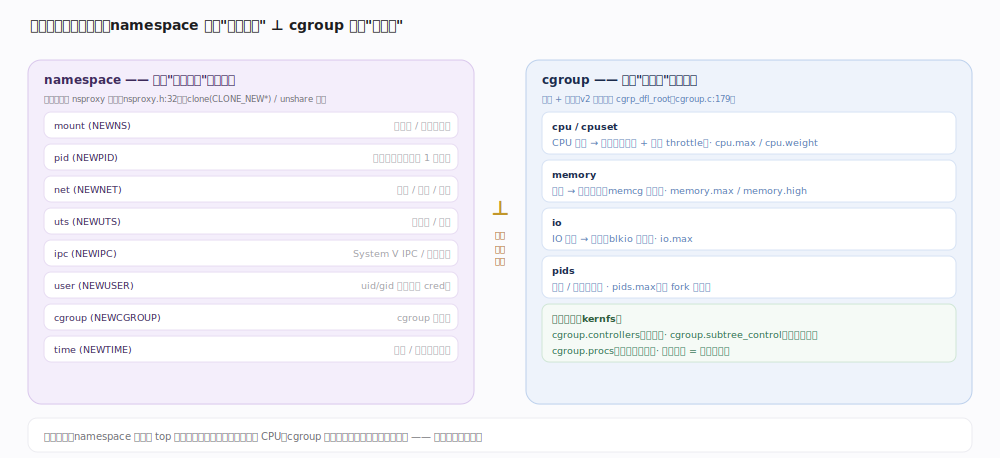
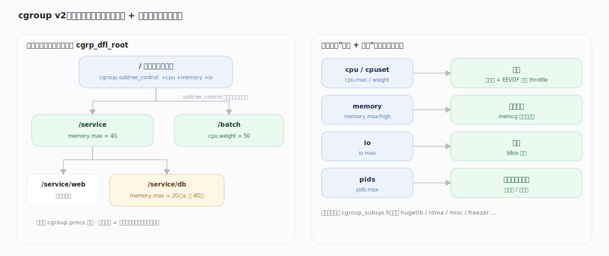
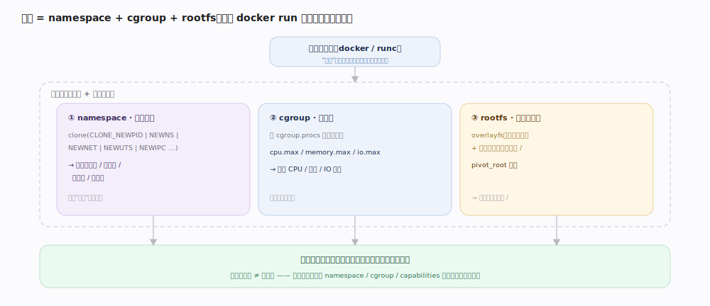

# Linux 内核原理 · cgroup 与 namespace

> **定位**：**保障能力域**（隔离与资源控制，容器的内核基石）。namespace 隔离"看到什么"（视图），cgroup 限制"用多少"（资源）。前台 = 记账 / 限额校验、隔离视图解析；后台 = 统计聚合、资源释放。依赖调度（cpu 控制器）、虚拟内存（memcg）、块层（io 控制器）；被容器运行时经接触面使用。7.1.3 源码树。

## 一、两条正交的隔离维度

容器隔离由**两条互相正交的维度**拼成，混淆两者是最常见误区：

- **namespace —— 隔离"看到什么"（视图）**：让一组进程拥有独立的资源"命名空间"。进程的 `nsproxy`（`include/linux/nsproxy.h:32`）持有一组 namespace 指针；同一 pid namespace 里进程从 1 号重新编号、看不到外面的进程，mount namespace 有独立挂载树，net namespace 有独立网卡/路由/端口。它回答"这个进程能**看见**哪些进程/文件系统/网络"。
- **cgroup —— 限制"用多少"（资源）**：把一组进程的 CPU、内存、IO 等用量**记账并设上限**。它回答"这个进程组能**用掉**多少 CPU 时间 / 多少内存 / 多大 IO 带宽"。

两者**互不替代**：namespace 让容器里 `top` 只看到自己的进程，但不限制它吃满 CPU；cgroup 限住 CPU/内存用量，但不改变它能看到什么。容器要"看不见别人"又"吃不垮宿主"，两者缺一不可。

## 二、namespace 家族与创建路径

共 8 种 namespace，由 `CLONE_NEW*` 标志（`include/uapi/linux/sched.h`）选择：

| namespace | 标志 | 隔离的视图 |
|---|---|---|
| mount | CLONE_NEWNS | 挂载点 / 文件系统树 |
| pid | CLONE_NEWPID | 进程号（容器内从 1 号起） |
| net | CLONE_NEWNET | 网卡 / 路由 / 端口 / 防火墙 |
| uts | CLONE_NEWUTS | 主机名 / 域名 |
| ipc | CLONE_NEWIPC | System V IPC / POSIX 消息队列 |
| user | CLONE_NEWUSER | uid/gid 映射（经 cred，非 nsproxy） |
| cgroup | CLONE_NEWCGROUP | cgroup 根视图 |
| time | CLONE_NEWTIME | 单调 / 启动时钟偏移 |

创建有两条路：`clone(CLONE_NEW*)` **建新进程时**顺带建新 namespace（fork 路径 `copy_namespaces`，`kernel/nsproxy.c:169`）；`unshare(CLONE_NEW*)` 让**当前进程脱离**旧 namespace 换到新的（`create_new_namespaces` + `switch_task_namespaces`，`nsproxy.c:234/245`）。注意 user namespace 挂在 `cred` 上、不在 `nsproxy` 里。

---

## 深化 · cgroup v2 统一层级与控制器

cgroup v2 的关键设计是**统一层级**（unified hierarchy）：全系统一棵树 `cgrp_dfl_root`（`kernel/cgroup/cgroup.c:179`），所有控制器挂在这**同一棵**目录树上（v1 时代每类资源可各有一棵树，进程在不同树里位置不一致、极难协调）。判断某 cgroup 是否属默认层级即 `cgrp->root == &cgrp_dfl_root`（`cgroup.c:345`）。

- **控制器（subsystem）**：`cgroup_subsys.h` 列出全部——`cpu`、`cpuset`、`memory`、`io`、`pids`、`hugetlb`、`rdma`、`misc` 等。每个控制器把某类资源的记账与限额挂到对应**能力域**：`cpu` → 调度（组调度 + CFS/EEVDF 带宽 throttle）、`memory` → 虚拟内存（memcg）、`io` → 块层（blkio 限速）、`pids` → 进程数上限。
- **接口文件（kernfs）**：每个 cgroup 目录里，`cgroup.controllers`（`cgroup.c:5437`）列可用控制器；父目录写 `cgroup.subtree_control`（`cgroup.c:5441`）把控制器**下发给子目录**启用；写 PID 到 `cgroup.procs`（`cgroup_procs_write`，`cgroup.c:5392`）把进程**移入**该组；各控制器暴露限额文件如 `cpu.max`、`memory.max`、`io.max`。
- **自上而下**：父组的限额是子组的天花板，形成层级配额（如父组 `memory.max=4G`，其下所有子组合计不得超 4G）。

## 深化 · 容器 = namespace + cgroup + rootfs

"容器"不是内核的一个对象，而是运行时（Docker/containerd/runc）用**三块内核积木拼出的假象**，贯穿一个 `docker run` 看它们各管一层：

1. **namespace（隔离视图）**：`clone(CLONE_NEWPID|NEWNS|NEWNET|NEWUTS|NEWIPC…)` 让容器进程有独立的进程号空间、挂载树、网络栈、主机名——它"以为"独占一台机器。
2. **cgroup（限资源）**：把容器进程放进一个 cgroup（写 `cgroup.procs`），设 `cpu.max` / `memory.max` / `io.max`，限住它能用的 CPU/内存/IO——防止吃垮宿主。
3. **rootfs（根文件系统）**：用 overlayfs 把只读镜像层 + 可写层叠成容器的 `/`，再 `pivot_root` 切根——让它"看到"自己的文件系统。

**要害**：容器**不是虚拟机**——所有容器共享**同一个宿主内核**，没有独立内核、没有硬件虚拟化。隔离强度取决于 namespace/cgroup/capabilities 配置，而非硬件边界。

---

## 拓展 · user namespace 与 capabilities

| 机制 | 作用 |
|---|---|
| user namespace | 把容器内 root（uid 0）**映射**到宿主的普通 uid → 容器内"root"在宿主无特权，是非特权容器的基础 |
| capabilities | 把 root 的全能拆成细粒度能力位（CAP_NET_ADMIN 等），容器只保留必需的几项，降低逃逸后危害 |
| seccomp | 过滤容器可用的系统调用，缩小攻击面（属接触面·系统调用主线） |

---

## 调优要点（关键开关，均据 7.1.3 源码）

- `cgroup.subtree_control`（`cgroup.c:5441`）：父组写此文件把控制器下发给子组，未下发则子组无该控制器接口。
- `cpu.max`（配额 + 周期）/ `cpu.weight`：cpu 控制器的带宽上限与相对权重（衔接调度组调度）。
- `memory.max` / `memory.high`：memcg 硬上限与软压回水位（衔接虚拟内存回收）。
- `io.max`：块设备读写 IOPS/带宽上限（衔接块层）。
- `pids.max`：进程/线程数上限，防 fork 炸弹。

---

## 常见误区与工程要点

- **容器是虚拟机**：错。容器共享宿主内核、无硬件虚拟化；隔离靠 namespace+cgroup+capabilities，强度弱于 VM。
- **cgroup 能隔离视图 / namespace 能限资源**：错，两者正交。cgroup 只记账限量、不改可见性；namespace 只隔离视图、不设配额。
- **cgroup v2 和 v1 一样每类资源一棵树**：错。v2 是**统一单一层级**，所有控制器共用一棵树，进程位置唯一。
- **user namespace 也在 nsproxy 里**：错。user namespace 经 `cred` 追踪，`nsproxy` 只含 mount/pid/net/uts/ipc/time/cgroup。

---

## 一句话总纲

**容器隔离由两条正交维度拼成：namespace 隔离"看到什么"（8 种视图，经 `nsproxy` 指针，由 `clone(CLONE_NEW*)` 或 `unshare` 创建），cgroup 限制"用多少"（v2 统一单一层级 `cgrp_dfl_root`，控制器把 cpu/memory/io 的记账限额挂到调度/虚拟内存/块层，经 `cgroup.subtree_control` 下发、`cgroup.procs` 纳管）；一个容器 = namespace + cgroup + overlayfs rootfs，共享同一宿主内核，绝非虚拟机。**
