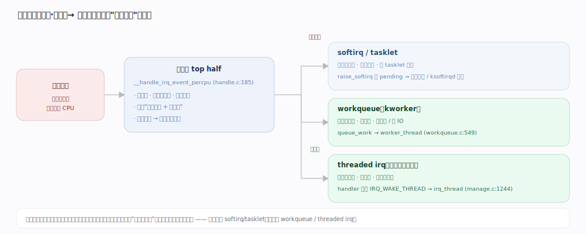
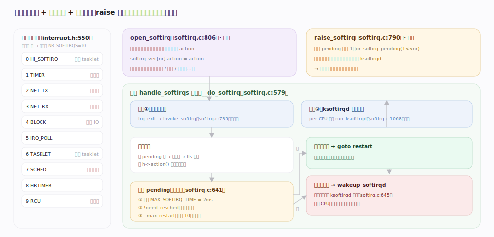
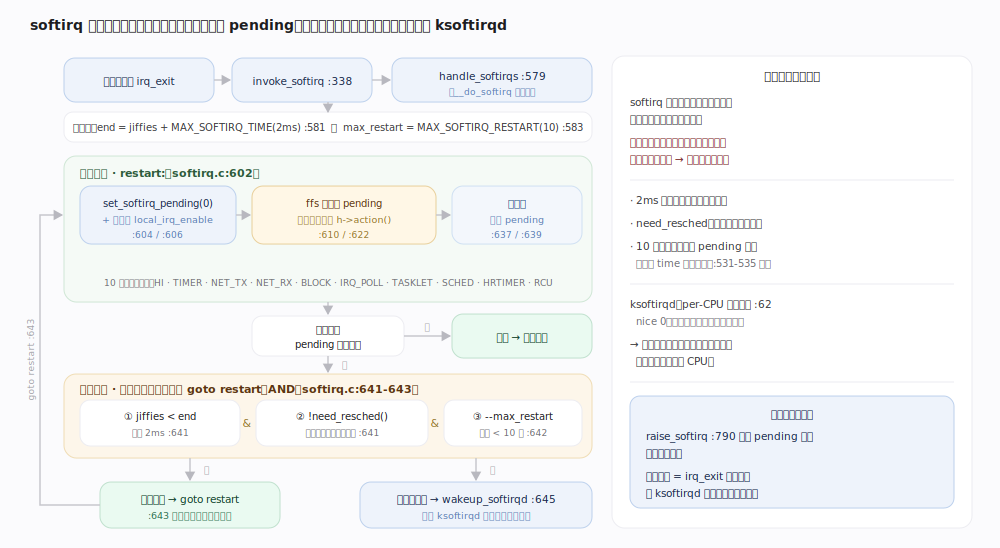
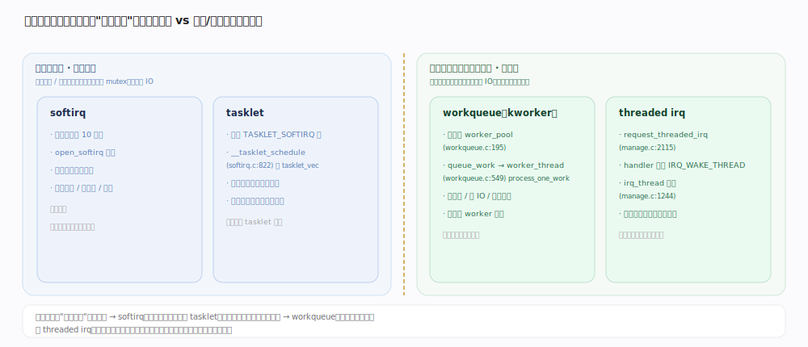

# Linux 内核原理 · 中断与软中断

> **定位**：**保障能力域**。响应硬件异步事件，遵循"上半部尽快返回、下半部延后处理"。前台 = 硬中断上半部（关中断、极短）；后台 = softirq / ksoftirqd / tasklet / workqueue 下半部。被网络栈、块层等依赖（它们的后台半靠软中断）；依赖调度（唤醒 ksoftirqd/kworker）、同步原语（关中断临界区）。7.1.3 源码树。

## 一、中断处理骨架：上半部 / 下半部

硬件通过中断控制器打断 CPU，内核在**关中断的原子上下文**里跑注册的处理函数——这就是**上半部**（top half）。上半部原则是**尽快返回**：只做"确认硬件、取走数据、登记待办"这类必须立刻做的事，把耗时工作**打标延后**给下半部（bottom half）。原因是上半部期间关中断、不可睡眠，长时间占用会丢中断、拖高延迟。

`__handle_irq_event_percpu`（`kernel/irq/handle.c:185`）沿该中断号的 action 链逐个调 `action->handler`。驱动的 handler 返回值决定后续：返回 `IRQ_HANDLED` 表示已处理完；返回 `IRQ_WAKE_THREAD` 则 `__irq_wake_thread`（`handle.c:229`）唤醒该中断的**内核线程**（threaded irq）去做下半部。下半部有三条主要路径，按"是否可睡眠"分野：softirq/tasklet（原子、不可睡眠）、workqueue（进程上下文、可睡眠）、threaded irq（专属内核线程、可睡眠）。

## 二、软中断向量与执行时机

软中断是**编译期静态注册**的下半部机制，共 10 个固定向量（`include/linux/interrupt.h:550`）：`HI` > `TIMER` > `NET_TX` > `NET_RX` > `BLOCK` > `IRQ_POLL` > `TASKLET` > `SCHED` > `HRTIMER` > `RCU`（`NR_SOFTIRQS=10`）。子系统启动时用 `open_softirq`（`softirq.c:806`）把向量号绑到处理函数。触发端 `raise_softirq`（`softirq.c:790`）只是把该向量的 pending 位置 1（`or_softirq_pending`），**并不立即执行**。

执行有两处时机：① **中断返回时**——`irq_exit` 路径的 `invoke_softirq`（`softirq.c:338/735`）在硬中断退出、若有 pending 就地跑 `__do_softirq`；② **ksoftirqd 内核线程**——当软中断在中断上下文外被触发、或一轮处理超载时，唤醒 per-CPU 的 `ksoftirqd`（`softirq.c:62`）在进程上下文补跑。

---

## 深化 · softirq 处理循环与过载兜底

核心是 `handle_softirqs`（`softirq.c:579`，`__do_softirq` 的实现体）的一轮处理：先 `set_softirq_pending(0)` 清空 pending 位、**开中断**，再 `ffs` 逐位扫描 pending，对每个置位向量调 `h->action`。跑完一轮后重新读 pending——若又有新软中断到达，**不无限循环**：只在同时满足 ① 未超 `MAX_SOFTIRQ_TIME`（2ms，`softirq.c:543`）② 无 `need_resched`（不欠调度）③ 重启次数 `--max_restart` 未耗尽（初值 `MAX_SOFTIRQ_RESTART=10`，`softirq.c:544`）时才 `goto restart` 再跑一轮；任一条件不满足就 `wakeup_softirqd`（`softirq.c:645`）把剩余工作甩给 ksoftirqd，让出 CPU。

这是一条**反馈限流律**：软中断可能被高速硬件（网卡收包）持续 raise，若在中断返回路径里一直跑会饿死普通进程。用"时间 2ms + 次数 10 + 是否欠调度"三闸门封顶，超限即降级到普通优先级的 ksoftirqd 线程排队处理——**既保吞吐又不饿死调度**。

## 深化 · tasklet vs workqueue：可睡眠性是分水岭

下半部选型的**第一判据是"要不要睡眠"**。tasklet 建立在 `TASKLET_SOFTIRQ` 软中断之上：`__tasklet_schedule_common`（`softirq.c:822`）把 tasklet 挂到 per-CPU 的 `tasklet_vec`（`softirq.c:819`）再 `raise_softirq_irqoff(TASKLET_SOFTIRQ)`；因此它跑在**软中断原子上下文、不可睡眠**，但保证同一 tasklet 不在多核并发。workqueue 则把 work 交给内核线程池 `worker_pool`（`workqueue.c:195`）的 `kworker`，由 `worker_thread`（`workqueue.c:549`）→ `process_one_work` 在**进程上下文**执行，**可以睡眠**（可持 mutex、可等 IO、可分配可能阻塞的内存）。

| 维度 | softirq | tasklet | workqueue | threaded irq |
|---|---|---|---|---|
| 上下文 | 软中断（原子） | 软中断（原子） | 进程（kworker） | 进程（专属内核线程） |
| 能否睡眠 | 否 | 否 | **是** | **是** |
| 并发性 | 同向量可多核并行 | 同 tasklet 串行 | 池内多 worker 并行 | 单线程串行 |
| 注册方式 | 编译期静态 10 个 | 动态创建 | 动态 `queue_work` | `request_threaded_irq` |
| 典型用途 | 网络收发、定时器、块层 | 简单驱动延后 | 需睡眠的延后工作 | 驱动中断线程化 |

---

## 拓展 · 中断亲和性与中断线程化

| 机制 | 作用 | 入口 |
|---|---|---|
| 中断亲和性（affinity） | 把某中断绑到指定 CPU，均衡中断负载、保 cache 局部性 | `/proc/irq/N/smp_affinity` |
| threaded irq | 上半部只判断、繁重活交内核线程 | `request_threaded_irq`（`manage.c:2115`），线程主体 `irq_thread`（`manage.c:1244`） |
| 强制线程化 | 启动参数把可线程化中断统一转线程（RT 常用） | `force_irqthreads` / `threadirqs` 参数 |
| 默认主处理函数 | 未提供上半部时兜底唤醒线程 | `irq_default_primary_handler`（`manage.c:997`）返回 `IRQ_WAKE_THREAD` |

---

## 调优要点（关键开关，均据 7.1.3 源码）

- `MAX_SOFTIRQ_TIME`（`softirq.c:543`，默认 2ms）+ `MAX_SOFTIRQ_RESTART`（`softirq.c:544`，默认 10）：单轮软中断在中断返回路径的时间/次数上限，超限降级 ksoftirqd。
- `/proc/irq/<N>/smp_affinity`：中断亲和性掩码，高吞吐网卡常配合 RSS 多队列分散到多核。
- `threadirqs` 启动参数：强制中断线程化，降低硬中断关中断时长、利于实时性。
- `/proc/interrupts`：观测各中断在各 CPU 的计数，定位中断热点。

---

## 常见误区与工程要点

- **软中断/tasklet 里可以睡眠**：错。它们在原子上下文，睡眠会导致内核崩溃或死锁；要睡眠必须用 workqueue 或 threaded irq。
- **`raise_softirq` 会立刻执行软中断**：错。它只置 pending 位，真正执行在中断返回点或 ksoftirqd，是延后的。
- **ksoftirqd 越忙越好**：ksoftirqd 长期高占用通常意味着软中断过载（如网卡收包风暴），是**降级兜底被触发**的信号，应排查而非视为正常。
- **同一 tasklet 能被多核并行跑**：错。tasklet 保证同一实例串行；要并行得用 softirq 或 workqueue。

---

## 一句话总纲

**中断处理分两段：上半部在关中断原子上下文里极短地"确认硬件+登记待办"，把耗时工作按"是否需要睡眠"移交下半部——不可睡眠走 softirq/tasklet（`raise_softirq` 置 pending，中断返回或 ksoftirqd 时执行，靠 2ms/10 次/欠调度三闸门限流降级），可睡眠走 workqueue（kworker 进程上下文）或 threaded irq（专属内核线程）。**
