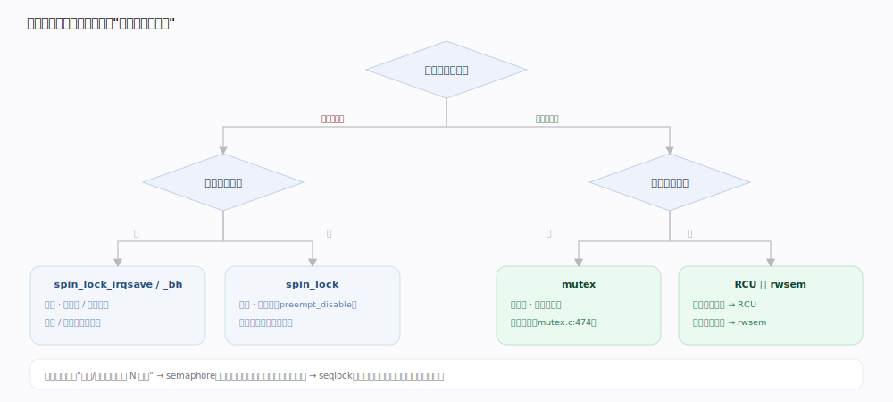
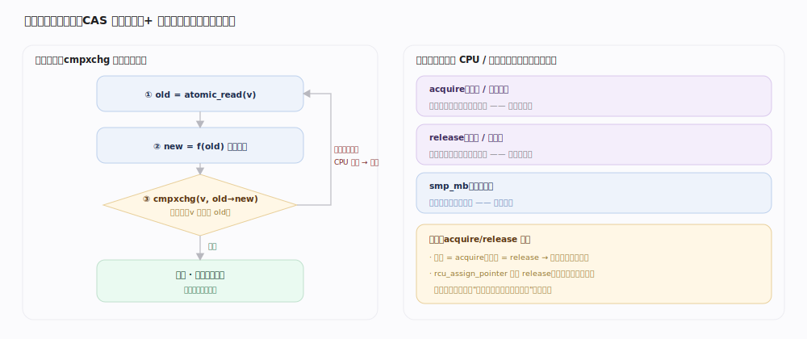
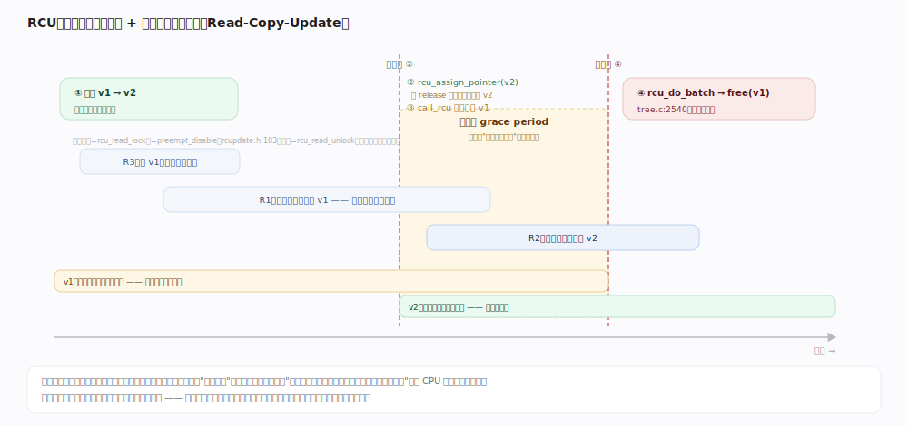
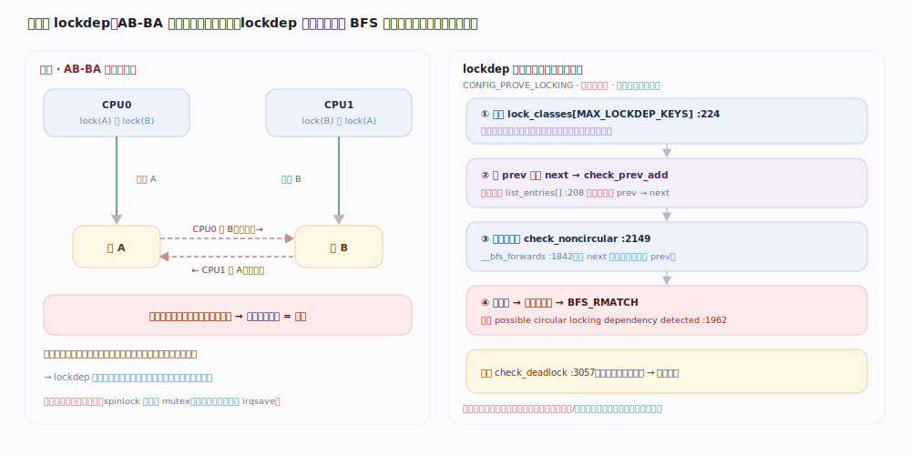

# Linux 内核原理 · 同步原语

> **定位**：**保障能力域**。在多核并发下保证共享状态的正确性。前台 = 自旋锁 / 互斥 / 原子（临界区保护）；后台 = RCU 宽限期与延后回调。被几乎所有能力域依赖（它们都要并发保护）；依赖调度（睡眠锁让出 CPU）与中断（关中断临界区）。7.1.3 源码树。

## 一、锁家族：先按"临界区能否睡眠"分野

选锁的**第一判据是"持锁期间会不会睡眠"**（等 IO、可能阻塞的内存分配、调用可能睡眠的函数）。

- **忙等类（不可睡眠）**：`spinlock`。拿不到锁就**原地自旋**，因此临界区内绝不能睡眠、必须极短。`spin_lock` 会 `preempt_disable` 关抢占（`spinlock.h`）；与中断共享数据要用 `spin_lock_irqsave`（关本地中断）或 `spin_lock_bh`（关软中断），否则中断里再抢同一锁会自死锁。
- **睡眠类（可睡眠）**：`mutex` / `rwsem` / `semaphore`。拿不到锁就**让出 CPU 睡眠**（入口都有 `might_sleep()`，`mutex.c:623`、`rwsem.c` down_read/down_write），因此不能在原子上下文（中断、持 spinlock）里用。
- **无锁读类**：`RCU` / `seqlock`，读侧几乎零开销，见下方深化。

| 原语 | 上下文 | 抢不到时 | 读写并发 | 典型场景 |
|---|---|---|---|---|
| spinlock | 原子（不可睡眠） | 忙等自旋 | 互斥 | 短临界区、中断上下文 |
| mutex | 进程（可睡眠） | 睡眠 + 乐观自旋 | 互斥（单持有者） | 一般长临界区 |
| rwsem | 进程（可睡眠） | 睡眠 | 多读或单写 | 读多、临界区可能睡眠 |
| semaphore | 进程（可睡眠） | 睡眠 | 计数（可 N 并发） | 资源配额、生产消费 |
| seqlock | 原子/进程 | 读者不阻塞、重试 | 写优先、读重试 | 极读多写少、读可重试（如时间戳） |
| RCU | 读侧原子 | 读者不阻塞 | 读全并发、写复制 | 极读多写少、读侧要零开销 |

## 二、原子操作与内存屏障

比锁更轻的是**原子操作**：`atomic_t` 上的 `atomic_inc` / `cmpxchg` 由硬件保证不可分割，是所有锁与无锁结构的底层砖。`cmpxchg`（比较并交换）是**无锁算法**的核心——"读旧值→算新值→CAS 写回，失败则重试"。但多核下 CPU/编译器会**乱序**执行访存，故需**内存屏障**约束顺序：`smp_mb`（全屏障）、以及 acquire/release 语义（`atomic_read_acquire` 等，`include/linux/atomic/`）——加锁 = acquire、解锁 = release，保证临界区内的访存不会溢出到临界区外。发布指针必须 `rcu_assign_pointer`（内含 release 屏障），否则读者可能看到"指针已更新但指向的内容还没写完"。

---

## 深化 · RCU：读多写少的无锁读

RCU（Read-Copy-Update）是内核并发的灵魂之一，专治"读极多、写极少"。它把读写彻底分开：

- **读侧零成本**：`rcu_read_lock`（`rcupdate.h:833`）在非抢占内核里就是 `preempt_disable`（`rcupdate.h:103`）——**不加锁、不写任何共享变量、不阻塞**，读者用 `rcu_dereference` 取指针即可访问旧版本数据。
- **写侧 Copy-Update**：写者不原地改，而是**复制**出新版本、改好，再用 `rcu_assign_pointer` 把指针**原子地指向新版本**（含 release 屏障）。此后新读者看到新版本，**已在读旧版本的老读者继续安全访问旧版本**。
- **延后回收**：旧版本不能立刻释放（老读者还在用）。写者调 `call_rcu`（`tree.c:3249`，异步登记回调）或 `synchronize_rcu`（`tree.c:3349`，同步等待），等一个**宽限期（grace period）**——即"所有在发布前已进入的读侧临界区都退出"（每个 CPU 都经过一次静止态）。宽限期结束后由 `rcu_do_batch`（`tree.c:2540`）执行回调、释放旧版本。

**要害**：读者永不等待、永不写共享状态，把全部同步成本转移到写侧的"延后回收"。代价是旧版本要多存活一个宽限期、写侧改的是副本——因此只适合读远多于写、且能容忍读者短暂看到旧值的场景（路由表、`dentry` 缓存、模块列表等）。

## 深化 · 死锁与 lockdep

死锁的经典成因是**锁序不一致**（CPU0 持 A 求 B、CPU1 持 B 求 A）。内核用 `lockdep` 运行时校验：它为每类锁记录**获取顺序图**，一旦发现某次获取会形成环（或在关中断上下文里拿了会开中断的锁等违规），立即打印告警栈。规矩很硬——**全内核统一锁序**、`spinlock` 里不能拿 `mutex`（原子上下文不能睡）、中断可能抢的锁一律 `irqsave`。lockdep 是调试期开关（`CONFIG_PROVE_LOCKING`），生产内核通常关闭以免开销。

---

## 拓展 · per-cpu 与免锁设计

| 手段 | 免锁原理 | 代价 |
|---|---|---|
| per-cpu 变量 | 每 CPU 一份，本地访问无需跨核同步 | 读全局要遍历各 CPU 求和 |
| RCU | 读侧无锁、写侧延后回收 | 旧版本多存活一个宽限期 |
| seqlock | 读者读序号→读数据→再读序号，变了就重试 | 写频繁时读者反复重试 |
| 原子 / CAS | 硬件级不可分割 + 重试 | 高竞争下 CAS 反复失败（cache 抖动） |

---

## 调优要点（关键开关，均据 7.1.3 源码）

- `CONFIG_PROVE_LOCKING`（lockdep）：运行时锁序/死锁检测，调试开、生产关。
- mutex 乐观自旋 `mutex_optimistic_spin`（`mutex.c:474`）：持有者仍在别的 CPU 上运行且自己无需重调度时，**先自旋等而非立刻睡**（`mutex_spin_on_owner`，`mutex.c:385`），避免睡眠/唤醒开销——这是 mutex 常比 semaphore 快的原因。
- `spin_lock_irqsave` vs `spin_lock_bh`：按共享方是硬中断还是软中断选，别过度关中断。
- RCU：`rcu_barrier`（`tree.c` 附近）在卸载模块前等所有 call_rcu 回调跑完，防用已释放代码。

---

## 常见误区与工程要点

- **自旋锁临界区里可以睡眠**：错。spinlock 关抢占、忙等，睡眠会死锁或崩溃；要睡眠改用 mutex/rwsem。
- **RCU 读侧临界区可长期持有**：不宜。读侧越长，宽限期越长、旧版本堆积越多、写侧回收越慢；读侧应短小。
- **RCU 能替代所有锁**：错。它只解决"读多写少 + 可容忍读到旧值"；写写之间仍需自有的锁保护。
- **发布共享指针用普通赋值即可**：错。必须 `rcu_assign_pointer`（release 屏障），否则读者可能看到半初始化对象。

---

## 一句话总纲

**同步原语按"临界区能否睡眠"分野：不可睡眠用忙等的 spinlock（与中断共享再叠 irqsave/bh），可睡眠用 mutex（乐观自旋）/rwsem/semaphore；读极多写极少时用 RCU——读侧 `rcu_read_lock` 不加锁零开销，写侧复制新版本经 `rcu_assign_pointer` 发布、旧版本待一个宽限期（所有先前读者退出）后由回调回收；最底层由原子操作 + 内存屏障（acquire/release）保证不可分割与顺序。**
