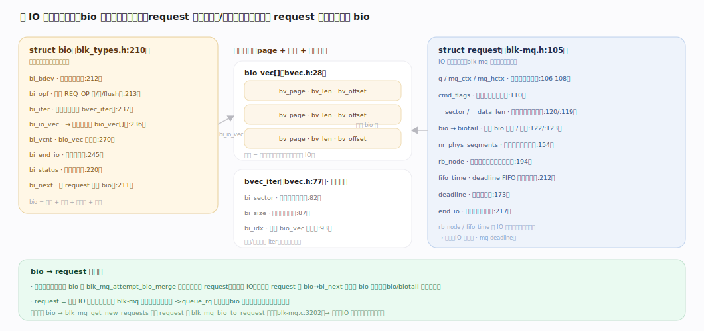
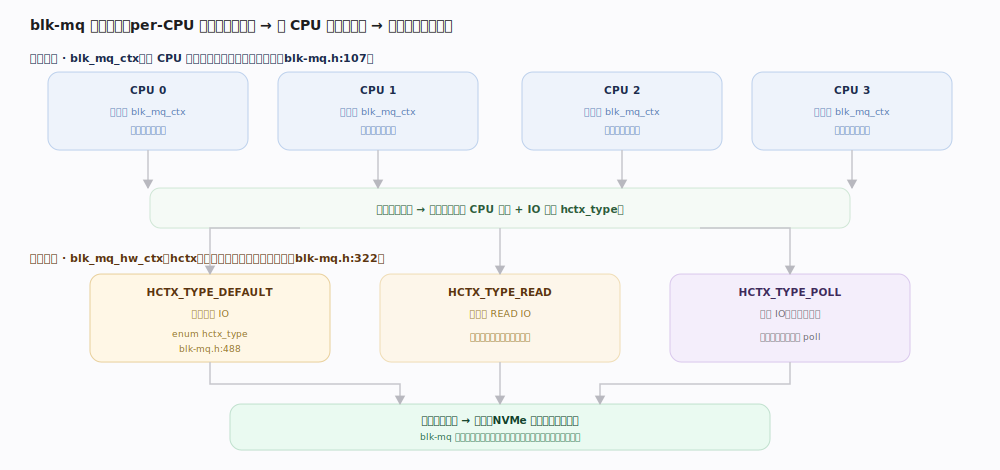
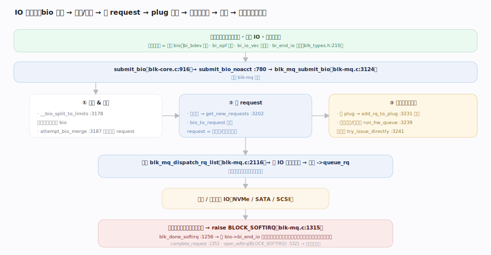
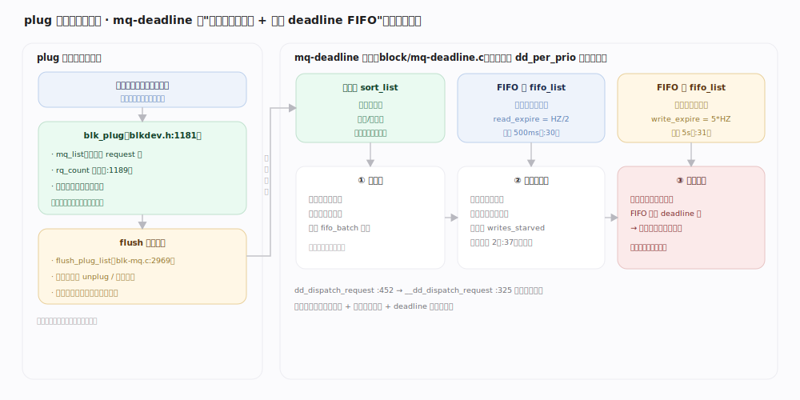
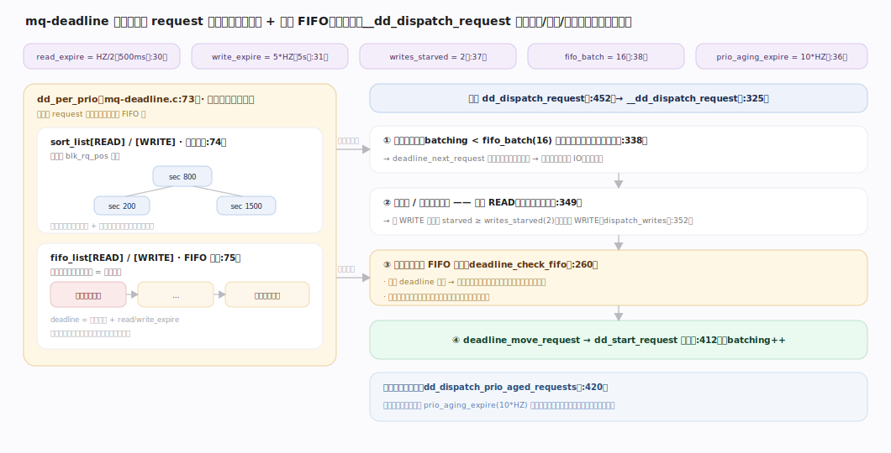

# Linux 内核原理 · 块层与 IO 调度

> **定位**：**底座能力域**。把文件系统/裸设备的读写请求组织成块 IO，经多队列(blk-mq)与 IO 调度器下发给驱动。前台 = 请求提交 `blk-mq`；后台 = IO 完成软中断、请求合并/排序。依赖**驱动**与**中断**；被 VFS/文件系统依赖。源码树 7.1.3。

## 一、块 IO 的两个核心对象：bio 与 request

上层（VFS 页缓存回写、直接 IO、裸设备）产生的每次块传输是一个 **bio**(`include/linux/blk_types.h:210`)——描述"往哪个设备(`bi_bdev`)、什么操作(`bi_opf`：读/写/flush)、哪些内存段(`bi_io_vec`/`bi_iter`)、完成回调(`bi_end_io`)"。块层把一个或多个相邻 bio 组织成一个 **request**（可被合并、排序、下发给驱动的调度单位）。

## 二、多队列架构 blk-mq：软队列 per-cpu，硬队列对驱动

现代 SSD/NVMe 有多个硬件队列、支持并发提交，blk-mq 用**两级队列**消除单锁瓶颈：

- **软队列 `blk_mq_ctx`（per-CPU）**：每 CPU 一个提交上下文(`blk-mq.h:107`)，本 CPU 提交请求先入本地软队列，**无跨 CPU 锁竞争**。
- **硬队列 `blk_mq_hw_ctx`（hctx）**：对应驱动的一个硬件提交队列(`blk-mq.h:322`)。软队列按 CPU 映射到硬队列；队列还按类型分 `HCTX_TYPE_DEFAULT/READ/POLL`(`enum hctx_type`，`blk-mq.h:488`)，让读、轮询 IO 走独立队列。

---

## 深化 · IO 提交到完成全路径

贯穿示例：一次写回的 bio 从提交到回调：

1. **提交**：`submit_bio`(`block/blk-core.c:916`) → `submit_bio_noacct`(`blk-core.c:780`) → `blk_mq_submit_bio`(`block/blk-mq.c:3124`)。
2. **切分与合并**：`__bio_split_to_limits`(`blk-mq.c:3178`)按设备上限切分；`blk_mq_attempt_bio_merge`(`blk-mq.c:3187`)尝试把 bio 并入已有相邻 request（省一次 IO）。
3. **建请求**：未合并则 `blk_mq_get_new_requests`(`blk-mq.c:3202`)分配 request，`blk_mq_bio_to_request` 填充。
4. **入队**：若当前有 plug → `blk_add_rq_to_plug`(`blk-mq.c:3231`)**攒批**；否则入软/硬队列并 `blk_mq_run_hw_queue`(`blk-mq.c:3239`)，或直发 `blk_mq_try_issue_directly`(`blk-mq.c:3241`)。
5. **派发**：`blk_mq_dispatch_rq_list`(`blk-mq.c:2116`)从硬队列取请求，调驱动 `->queue_rq` 下发到设备。
6. **完成**：设备完成 → 硬中断只做最少工作 → `blk_mq_complete_request`(`blk-mq.c:1353`)在请求发起 CPU 上 `raise_softirq(BLOCK_SOFTIRQ)`(`blk-mq.c:1315`) → `blk_done_softirq`(`blk-mq.c:1256`，`open_softirq` 注册于 `:5321`)软中断里跑 `bio->bi_end_io` 回调，唤醒等待者。**完成处理放软中断，缩短硬中断关中断时间**（衔接中断主线）。

## 深化 · IO 合并与 plug（攒批下发）

`blk_plug`(`include/linux/blkdev.h:1181`)是**每任务的临时请求暂存**：进程在一段代码内（如回写循环）产生的多个请求先攒进 plug 的 `mq_list`(`rq_count`，`blkdev.h:1189`)，而非逐个下发。到 `blk_mq_flush_plug_list`(`blk-mq.c:2969`)统一 flush（进程主动 unplug 或**调度切换时**自动 flush）。攒批的价值：**相邻请求在此期间可合并、可批量派发**，减少驱动交互与锁获取次数。

## 深化 · IO 调度器（mq-deadline 决策）

`mq-deadline`(`block/mq-deadline.c`)每优先级维护**两套结构**(`dd_per_prio`)：按**扇区排序的红黑树**(电梯/合并用)与按**到达时间排序的 FIFO**(超时保护用)。`dd_dispatch_request`(`mq-deadline.c:452`) → `__dd_dispatch_request`(`:325`)的选择逻辑：

1. **批处理**：正在服务某方向(读或写)时，沿红黑树按扇序连续取，直到 `fifo_batch` 上限——顺序访问、省寻道。
2. **换向选方向**：批结束时优先选**读**（读通常同步、更敏感），除非写已被饿 `writes_starved` 次(默认 2，`mq-deadline.c:37`)则轮到写。
3. **超时抢占**：选定方向内，若队首 FIFO 请求的 deadline 已过(`deadline_check_fifo`)，跳去服务这个最早超时的请求——**防止某请求被排序无限推迟**。读 deadline `read_expire = HZ/2`(500ms，`:30`)、写 `write_expire = 5*HZ`(5s，`:31`)。

---

## 拓展 · IO 调度器对比与记账

| 调度器 | 策略 | 适用 |
|---|---|---|
| none | 不排序，FIFO 直下发 | 高速 NVMe/多队列（设备自身乱序优化） |
| mq-deadline | 排序 + 读写 deadline 超时保护 | 通用 HDD/SATA SSD，防饿死 |
| bfq | 按进程/cgroup 公平配比带宽 | 桌面/交互，重公平与延迟 |
| kyber | 按目标延迟自适应限流 | 快速多队列设备 |

IO 记账与限流经 `rq_qos`(提交路径 `rq_qos_throttle`/`rq_qos_track`)接入 blk-cgroup(blkio 控制器)，按 cgroup 限带宽/IOPS → 详见 cgroup 主线。

---

## 调优要点（关键开关，均据 7.1.3 源码）

- `/sys/block/<dev>/queue/scheduler`：切换 none/mq-deadline/bfq/kyber。
- `/sys/block/<dev>/queue/nr_requests`：每队列在途请求上限，深度影响吞吐与延迟。
- mq-deadline 的 `read_expire`(默认 500ms)/`write_expire`(默认 5s)/`writes_starved`(默认 2)：`block/mq-deadline.c:30/31/37`，经 sysfs 可调。
- `/sys/block/<dev>/queue/read_ahead_kb`：顺序读预读窗口。

---

## 常见误区与工程要点

- **blk-mq 一定比单队列快**：错。它消除的是**多核提交的锁竞争**；单队列慢设备(HDD)靠调度器排序减寻道才是关键。
- **IO 完成在硬中断里处理**：错。硬中断只做最少确认，真正的 `bi_end_io` 回调放 `BLOCK_SOFTIRQ` 软中断。
- **none 调度器总是最优**：仅对能自身乱序优化的高速多队列设备；HDD 用 none 会因不排序而寻道暴增。
- **plug 是全局队列**：错。plug 是**每任务**的临时暂存，调度切换时自动 flush，不跨任务。

---

## 一句话总纲

**块层把上层读写封成 bio、组织成可合并排序的 request，经 blk-mq 两级队列（per-CPU 软队列免锁提交 → 映射到对驱动的硬件队列）下发：plug 按任务攒批合并、IO 调度器（如 mq-deadline 用"扇区排序红黑树 + 读写 deadline FIFO"防饿死）决定派发顺序，驱动 `->queue_rq` 送设备，完成时在 `BLOCK_SOFTIRQ` 软中断里跑 `bi_end_io` 回调。**
