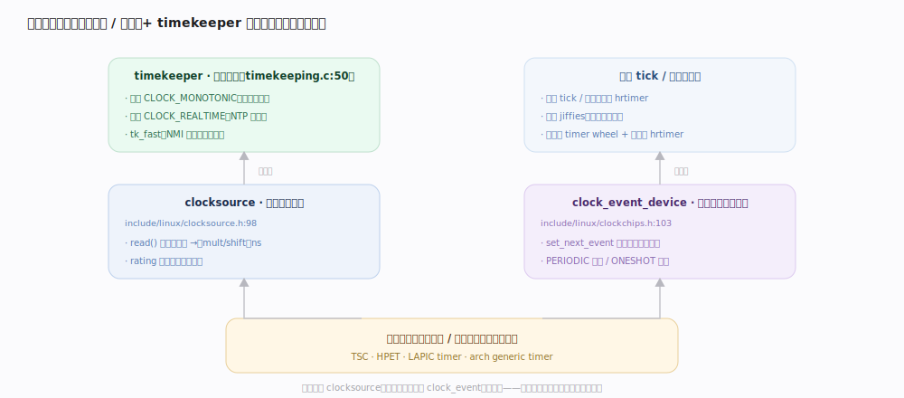
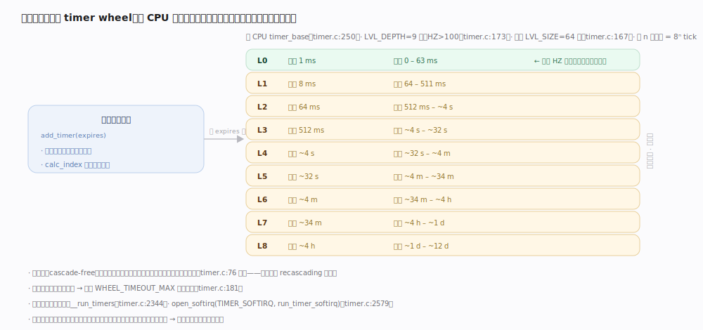
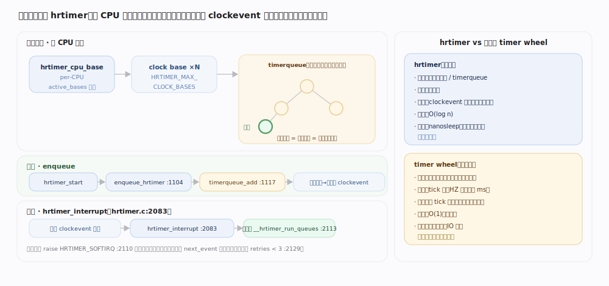
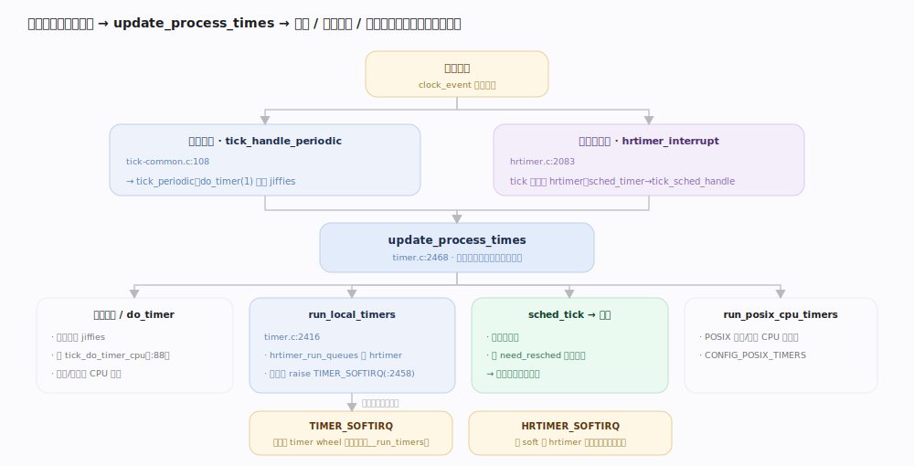

# Linux 内核原理 · 时间与定时器

> **定位**：**底座能力域**（基础设施）。提供两件事——**时间基准**（现在几点/单调走了多久）与**超时机制**（到点回调）。前台 = 读时间、设定/取消定时器；后台 = 时钟中断驱动 tick、到期回调批量执行。依赖**中断**（时钟事件设备的中断是一切节拍的源头）；被**进程调度**（节拍/时间片）、**网络协议栈**（重传/keepalive 超时）、**块层**（IO 超时）等几乎所有超时逻辑广泛依赖。源码树 7.1.3。

## 一、时间体系：两类硬件、两套时间

内核把"计时硬件"拆成**职责正交的两类**：**clocksource**（时钟源，只负责*读出*一个单调递增的计数，如 TSC/HPET/arch timer；`include/linux/clocksource.h:98`，靠 `read` + `mult`/`shift` 把周期数换算成纳秒，`rating` 越高越优先被选中）；**clock_event_device**（时钟事件设备，只负责在*未来某点触发一次中断*；`include/linux/clockchips.h:103`，支持 `CLOCK_EVT_FEAT_PERIODIC` 周期模式与 `CLOCK_EVT_FEAT_ONESHOT` 单次模式两种能力）。**读时间用 clocksource，等到点用 clock_event**——一个是"尺"，一个是"闹钟"。

`timekeeper`（`kernel/time/timekeeping.c:50`）在其上维护两套时间：**单调时间**（`CLOCK_MONOTONIC`，只增不退，用于测量间隔/超时）与**墙钟时间**（`CLOCK_REALTIME`，可被 NTP/settimeofday 调整，用于日历）。为让读时间不被写锁阻塞，另有 **NMI 安全的 `tk_fast`**（`timekeeping.c:92` 附近）做无锁快照。

| 抽象 | 职责 | 关键字段 / 能力 | 代表硬件 |
|---|---|---|---|
| clocksource | 读出单调计数 → 纳秒 | `read` / `mask` / `mult` / `shift` / `rating` | TSC、HPET、arch generic timer |
| clock_event_device | 到未来某点触发中断 | `set_next_event` / periodic / oneshot | LAPIC timer、arch timer |
| timekeeper | 维护单调 + 墙钟时间 | 双套时间 + `tk_fast` 无锁读 | —（软件） |

---

## 二、节拍 tick：周期节拍与无节拍

节拍是"每隔固定间隔（`1/HZ` 秒）产生一次时钟中断"，用来推进 `jiffies`、驱动调度与定时器扫描。周期模式下 clock_event 的处理函数是 `tick_handle_periodic`（`kernel/time/tick-common.c:108`），它调 `tick_periodic`（`tick-common.c:86`）：**只有被选为 `tick_do_timer_cpu` 的那颗 CPU** 才 `do_timer(1)` 推进全局 `jiffies`、`update_wall_time` 更新墙钟（`tick-common.c:95`）；每颗 CPU 都跑 `update_process_times`（`tick-common.c:101`）做本地时间记账、扫描定时器、触发调度节拍。

无节拍是省电与降抖动的两个开关：**`NO_HZ_IDLE`** 让 CPU 进入空闲时停掉周期 tick（无事可做就别每毫秒醒一次）；**`NO_HZ_FULL`** 在 CPU 上只剩一个可运行任务时也停 tick（HPC/实时场景消除节拍抖动）。停 tick 后靠一个 hrtimer 记录"下一个真正该醒的时刻"。

---

## 深化 · 低精度定时器（timer wheel 分级定时器轮）

内核绝大多数超时（网络重传、IO 超时、TCP keepalive）用的是**每 CPU 的分级定时器轮** `timer_base`（`kernel/time/timer.c:250`）。它把"到期时间"按远近分层：共 **`LVL_DEPTH` 级**（`HZ>100` 时 9 级，否则 8 级，`timer.c:173`），每级 **`LVL_SIZE = 64` 个桶**（`LVL_BITS = 6`，`timer.c:167`），第 `n` 级的粒度 = `8^n` 个 tick（`LVL_CLK_SHIFT = 3`，`timer.c:153`）——越远的到期时间落在越高层、粒度越粗。以 HZ=1000 为例：0 级粒度 1ms 覆盖 0~63ms，最高级粒度约 4h 覆盖到约 12 天（`timer.c` 头部粒度表）。

关键设计：**取消了旧内核的"级联"（recascading）**（`timer.c:76` 起注释）。旧轮为追求精确到期，需把高层桶里的定时器周期性搬到低层，开销大；新轮承认"超时的绝大多数会在到期前被取消，真到期说明系统已异常，稍晚一点无所谓"，于是**用分级粒度做隐式批处理**，高层直接以粗粒度触发，永不搬迁。超过最高层容量的定时器被强制钳到最大值到期（`WHEEL_TIMEOUT_MAX`，`timer.c:181`）。到期扫描在 **`TIMER_SOFTIRQ` 软中断**里跑（`open_softirq(TIMER_SOFTIRQ, run_timer_softirq)`，`timer.c:2579`；`__run_timers`，`timer.c:2344`）。

---

## 深化 · 高精度定时器 hrtimer（红黑树/timerqueue 管理）

高精度定时器 `hrtimer` 用于需要**纳秒级精度**的场景（`nanosleep`、posix 定时器、调度带宽、乃至无节拍模式下的 tick 本身）。每 CPU 一个 `hrtimer_cpu_base`（`include/linux/hrtimer_defs.h:82`），内含 **`HRTIMER_MAX_CLOCK_BASES = 8` 个时钟基**（MONOTONIC/REALTIME/BOOTTIME/TAI 各有硬/软两份，`hrtimer_defs.h:38`）。每个基是一棵按到期时间排序的 **`timerqueue`（红黑树 + 缓存的最左节点）**（`enqueue_hrtimer`，`hrtimer.c:1104`），插入即排序，取"最近到期"是 O(1) 读最左节点。

与 timer wheel 的分工是本主线最易混淆处：

| 维度 | timer wheel（低精度） | hrtimer（高精度） |
|---|---|---|
| 数据结构 | 分级轮 + 哈希桶（`timer_base`） | 红黑树 timerqueue（每时钟基一棵） |
| 精度 | jiffie 级（ms 量级）、粒度随层变粗 | 纳秒级、精确到期 |
| 插入/取最近 | O(1) 入桶，不排序 | O(log n) 入树，最近到期 O(1) |
| 典型用途 | 超时（多在到期前被取消） | 精确睡眠、posix 定时器、无节拍 tick |
| 到期上下文 | `TIMER_SOFTIRQ` | 硬中断 `hrtimer_interrupt` + 软 `HRTIMER_SOFTIRQ` |

---

## 深化 · 到期回调如何被驱动（与调度节拍衔接）

一次时钟中断把三条线同时点亮。**周期模式**下中断打到 `tick_handle_periodic`；**高精度模式**下 clock_event 是单次的，其处理函数是 `hrtimer_interrupt`（`kernel/time/hrtimer.c:2083`），此时**连"周期 tick"本身都变成了一个 hrtimer**（`tick_sched` 的 `sched_timer`，到期回调 `tick_sched_handle` → `update_process_times`，`tick-sched.c:298`）。两条路殊途同归都进 `update_process_times`（`timer.c:2468`），它扇出到：

1. **`do_timer` / 时间记账**：推进 `jiffies`、按用户/内核态给当前进程记 CPU 时间。
2. **`run_local_timers`（`timer.c:2416`）**：`hrtimer_run_queues` 跑到期的 hrtimer；若本地低精度定时器到期则 `raise_timer_softirq(TIMER_SOFTIRQ)`（`timer.c:2458`）——**扫描留到软中断，硬中断只置位**。
3. **`sched_tick`**：把节拍交给调度器（推进时间片、触发抢占标记）——这是本主线与**进程调度**的衔接点。
4. **posix cpu 定时器**（`run_posix_cpu_timers`）。

hrtimer 的实际到期执行走 `__hrtimer_run_queues`（`hrtimer.c:1968`），从各时钟基的 timerqueue 最左端取出所有 `expires <= now` 的定时器逐个回调；标了 soft 的在 `HRTIMER_SOFTIRQ` 里跑，避免长回调压在硬中断里。

---

## 拓展 · 时间接口族（用户/内核如何取时间）

| 需求 | 接口 / 机制 | 时间基 |
|---|---|---|
| 测间隔、超时判断 | `ktime_get` / `CLOCK_MONOTONIC` | 单调，不受调时影响 |
| 日历/时间戳 | `ktime_get_real` / `CLOCK_REALTIME` | 墙钟，NTP 可调 |
| 含挂起时间的单调 | `CLOCK_BOOTTIME` | 单调 + 睡眠时长 |
| 粗略时间（快、免读硬件） | `jiffies` / `CLOCK_*_COARSE` | tick 粒度 |
| 用户态零系统调用取时间 | vDSO（`__vdso_clock_gettime`） | 映射 timekeeper 快照 |

---

## 调优要点（关键开关，据 7.1.3 源码）

- **`HZ`**（编译期，`include/asm-generic/param.h` 及 arch 配置，常见 100/250/300/1000）：周期 tick 频率，也决定 timer wheel 层数（`HZ>100` 时 `LVL_DEPTH=9`，`timer.c:173`）与最低粒度。
- **`CONFIG_NO_HZ_IDLE` / `CONFIG_NO_HZ_FULL`**：空闲/单任务停 tick，省电与降抖动，代价是唤醒/记账复杂度上升。
- **`CONFIG_HIGH_RES_TIMERS`**：开启后 clock_event 走单次模式、`hrtimer_interrupt` 提供纳秒级到期，且 tick 由 hrtimer 承载。
- **clocksource 选择**：`/sys/devices/system/clocksource/*/current_clocksource`，内核按 `rating` 自动选最优（如优选 TSC），可手动覆盖。

---

## 常见误区与工程要点

- **"clocksource 和 clock_event 是一回事"**：错。前者只*读*单调计数（尺），后者只*触发*中断（闹钟），职责正交，常由不同硬件承担。
- **"timer wheel 精确到期"**：错。它按分级粒度隐式批处理、高层粒度可达小时级，且**取消了级联**（`timer.c:76`）；要精确到期必须用 hrtimer。
- **"jiffies 每 CPU 各自推进"**：错。全局 `jiffies` 只由 `tick_do_timer_cpu` 一颗 CPU 在 `do_timer(1)` 里推进（`tick-common.c:88`），其余 CPU 只做本地记账。
- **"定时器到期就在中断里立刻跑回调"**：低精度定时器与 soft hrtimer 的回调都推到**软中断**里执行；硬中断只置位/挑出到期项，避免长回调阻塞中断。

---

## 一句话总纲

**时间与定时器把计时硬件拆成"读时间的 clocksource"与"触发中断的 clock_event"，其上 timekeeper 维护单调/墙钟两套时间；节拍（周期 tick 或无节拍下的 hrtimer）每次把 `update_process_times` 点亮，推进 jiffies、扫描到期定时器、并把 `sched_tick` 交给调度器——低精度超时用无级联的分级 timer wheel 在 `TIMER_SOFTIRQ` 里批处理，纳秒级精度用红黑树管理的 hrtimer 在中断/软中断里精确到期。**
