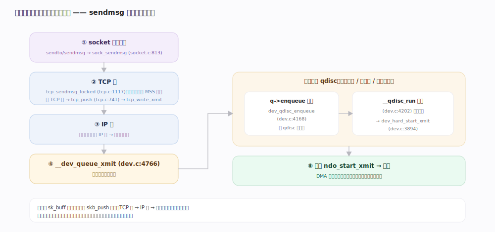
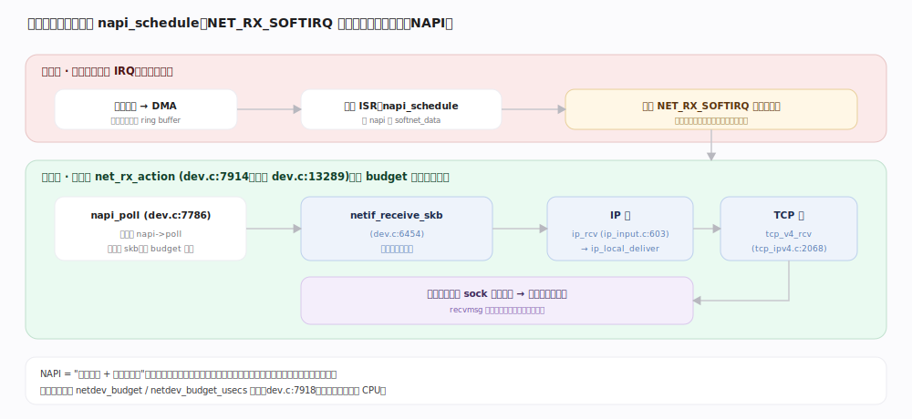
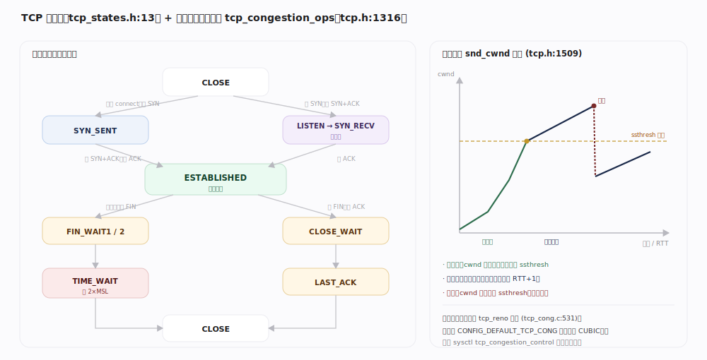

# Linux 内核原理 · 网络协议栈

> **定位**：**计算·通信能力域**。实现从套接字到网卡的收发路径与协议处理（TCP/IP）。前台 = `sendmsg` 发送路径（socket 系统调用触发，进程上下文）；后台 = 网卡中断触发的 NAPI 软中断收包（`NET_RX_SOFTIRQ`）。依赖**中断与软中断**（收包下半部）、**设备驱动**（`ndo_start_xmit` / DMA 收包）、**虚拟内存**（skb 缓冲）；被**接触面**（socket 系统调用）依赖。核心数据结构 `sk_buff` 贯穿全栈——收发两条路径本质是它在各层的加/剥头部。

## 一、套接字与协议族抽象

内核把网络接口抽象成三层对象：用户看到的 `struct socket`（通用套接字）、协议无关的操作表 `proto_ops`（`net/socket.c` 里 `sock->ops`，如 `inet_stream_ops`）、以及协议私有的 `struct sock`（真正的协议控制块，TCP 对应 `tcp_sock`）。所有收发系统调用最终经 `proto_ops` 派发到具体协议实现：发送 `sock_sendmsg`（`net/socket.c:813`）→ `sock->ops->sendmsg`；接收 `sock_recvmsg`（`socket.c:1156`）。这层间接使同一套 socket API 可承载 TCP/UDP/UNIX/netlink 等完全不同的协议族。

## 二、sk_buff：贯穿全栈的报文载体

`sk_buff`（`include/linux/skbuff.h`）是网络栈的通用报文容器。关键布局：线性缓冲区由 `head`/`data`/`tail`/`end` 四个指针框定（`skbuff.h:1094`），`data` 到 `tail` 是当前有效数据；`mac_header`/`network_header`/`transport_header`（`skbuff.h:1083`）分别记录二/三/四层头在缓冲区里的偏移。**收发路径本质是移动 `data` 指针 + 增删各层头**：发送时自上而下 `skb_push` 逐层加头（TCP 头→IP 头→以太头），接收时自下而上 `skb_pull` 逐层剥头并设置 `*_header` 偏移。这套"一个 skb 走全栈、只改指针不搬数据"的设计避免了逐层拷贝。

---

## 深化 · 发送路径（sendmsg → 协议栈 → 驱动）

发送在**进程上下文同步**推进：`sendto`/`sendmsg` 系统调用 → `sock_sendmsg`（`socket.c:813`）→ TCP 的 `tcp_sendmsg_locked`（`net/ipv4/tcp.c:1117`）把用户数据拷进 skb、按 MSS 分段并加 TCP 头，`tcp_push`（`tcp.c:741`）触发 `tcp_write_xmit` 交给 IP 层加 IP 头与路由，最终进 `__dev_queue_xmit`（`net/core/dev.c:4766`）。这里遇到**排队规则 qdisc**：有 qdisc 则 `q->enqueue` 入队再 `__qdisc_run`（`dev.c:4202`）择机出队（流量整形/优先级在此），最后 `dev_hard_start_xmit`（`dev.c:3894`）调驱动 `ndo_start_xmit` 把 skb 交给网卡。发送方**主动驱动**整条链路，直到驱动接手。

## 深化 · 接收路径（网卡中断 → NAPI 软中断 → 协议栈）

接收是典型的**中断上下半部 + 软中断**协作（与中断主线衔接）：网卡收到帧发**硬中断**，驱动 ISR 只做最少工作——`napi_schedule`（`dev.c` NAPI 接口）把设备的 `napi_struct` 挂上本 CPU 的 `softnet_data` 并触发 `NET_RX_SOFTIRQ`，随即返回。真正收包在**软中断下半部** `net_rx_action`（`dev.c:7914`，注册于 `dev.c:13289`）：它在预算 `budget` 内轮询各设备的 `napi->poll`（`napi_poll`，`dev.c:7786`）批量取包，逐个经 `netif_receive_skb`（`dev.c:6454`）按 skb 的协议类型上送——IP 包进 `ip_rcv`（`net/ipv4/ip_input.c:603`）→ `ip_local_deliver` → TCP 进 `tcp_v4_rcv`（`net/ipv4/tcp_ipv4.c:2068`），最终数据挂到目标 `sock` 的接收队列，唤醒等待的进程。**NAPI 用"中断触发 + 轮询批处理"取代每包一中断**，高负载下大幅降低中断风暴。

## 深化 · TCP 状态机与拥塞控制

TCP 连接的生命周期是一台**有限状态机**（状态定义 `include/net/tcp_states.h:13`）：建连三次握手 `CLOSE→SYN_SENT→ESTABLISHED`（主动方）与 `LISTEN→SYN_RECV→ESTABLISHED`（被动方）；断连四次挥手经 `FIN_WAIT1/2`、`CLOSE_WAIT`、`LAST_ACK`，主动关闭方最后停在 `TIME_WAIT`（等 2×MSL 防旧包串扰）。**拥塞控制**是可插拔模块：`tcp_congestion_ops`（`include/net/tcp.h:1316`）定义 `ssthresh`/`cong_avoid` 等回调，内核内置 `tcp_reno`（`net/ipv4/tcp_cong.c:531`）作兜底、默认算法由 `CONFIG_DEFAULT_TCP_CONG`（`tcp_cong.c:314`，通常为 CUBIC）决定。核心变量拥塞窗口 `snd_cwnd`（`tcp.h:1509`）在**慢启动**（指数增长直到 `ssthresh`）与**拥塞避免**（线性增长）间切换，丢包时回退——用滑动窗口把发送速率约束在网络容量之内。

---

## 拓展 · netfilter / tc / XDP

| 挂载点 | 位置 | 用途 |
|---|---|---|
| netfilter hooks | IP 层收发关键点（PRE_ROUTING/FORWARD/POST_ROUTING 等） | iptables/nftables 过滤、NAT、连接跟踪 |
| tc / qdisc | `__dev_queue_xmit` 出口排队 | 流量整形、优先级、限速（发送侧 QoS） |
| XDP | 驱动收包最早点（甚至 skb 分配前） | 高性能丢弃/转发/负载均衡，绕过大部分协议栈 |
| eBPF (socket/tc/XDP) | 各挂载点可挂 BPF 程序 | 可编程包处理、可观测（区别于固定 hook） |

---

## 调优要点（关键开关，均据 7.1.3 源码）

- `/proc/sys/net/core/netdev_budget` 与 `netdev_budget_usecs`（`net/core/dev.c:7918`）：单次 `NET_RX_SOFTIRQ` 软中断处理包数上限与时间上限，调大提高收包吞吐、但增加软中断单次占用。
- `/proc/sys/net/ipv4/tcp_congestion_control`：运行时切换拥塞算法（reno/cubic/bbr 等，`tcp_congestion_ops` 注册机制，`tcp.h:1380`）。
- TCP 读写缓冲 `tcp_rmem`/`tcp_wmem`：影响接收窗口与发送缓冲，决定单连接吞吐上限。
- `SO_RCVBUF`/`SO_SNDBUF`、`TCP_NODELAY`（关 Nagle）：单 socket 级调节。

---

## 常见误区与工程要点

- **"收包全在网卡中断里完成"**：错。硬中断只做 `napi_schedule` 触发软中断，真正收包在 `NET_RX_SOFTIRQ` 的 `net_rx_action` 轮询里（NAPI 上下半部分离）。
- **"每来一个包就一次中断"**：NAPI 在高负载下切换为轮询模式，一次软中断批量收多个包，避免中断风暴。
- **"每层协议都会拷贝一次数据"**：错。同一个 `sk_buff` 走完全栈，各层只 `skb_push`/`skb_pull` 移动指针、加剥头部，不搬运负载。
- **"`TIME_WAIT` 是异常/需要消灭"**：`TIME_WAIT` 是主动关闭方的正常状态，等 2×MSL 确保旧报文消散、防止四元组复用串包；大量 `TIME_WAIT` 通常是短连接模式问题而非 bug。

---

## 一句话总纲

**Linux 网络栈以 `sk_buff` 为贯穿全栈的报文载体，收发即逐层加/剥头部而非拷贝：发送在进程上下文由 `sendmsg` 一路同步下推经协议栈、qdisc 到驱动；接收则"硬中断只 `napi_schedule`、`NET_RX_SOFTIRQ` 软中断轮询批量收包"上送协议栈到 socket 队列；TCP 用状态机管连接生命周期、用可插拔拥塞控制的 `snd_cwnd` 在慢启动/拥塞避免间约束发送速率。**
