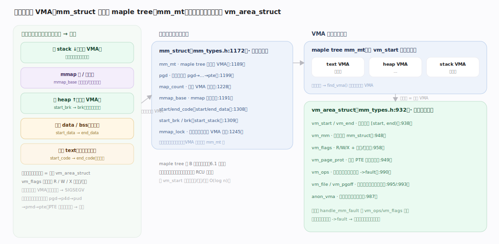
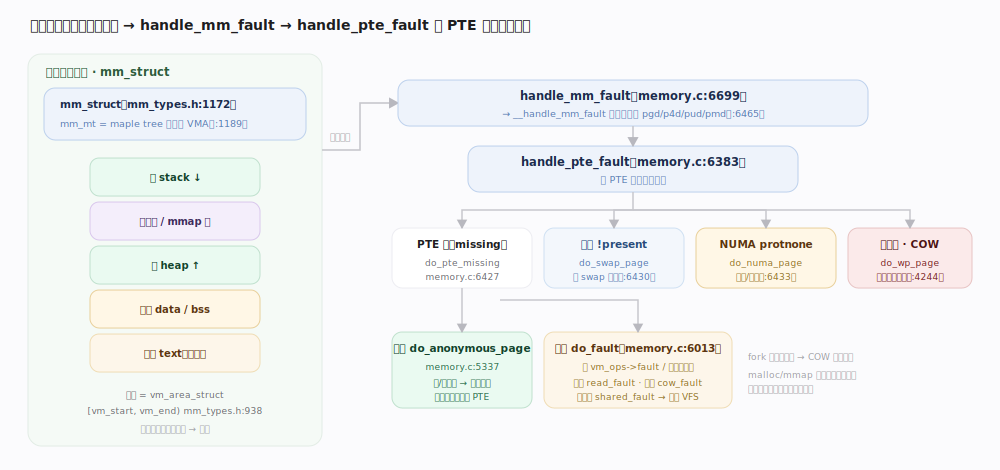
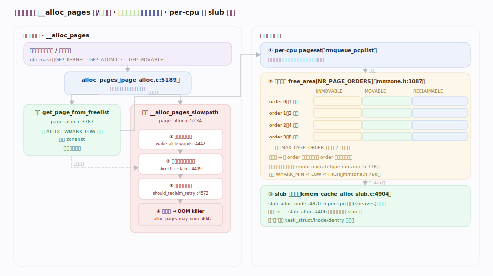
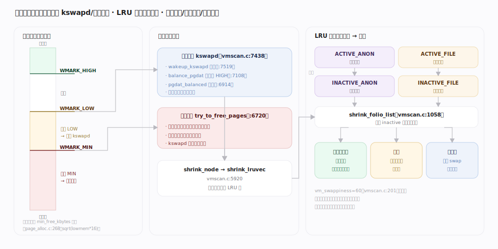

# Linux 内核原理 · 虚拟内存

> **定位**：**底座能力域**。为每个进程提供独立地址空间，管理物理页的分配、映射与回收。前台 = 缺页 `handle_mm_fault`（访问触发）；后台 = kswapd 回收、脏页回写。依赖**文件系统**（文件页/交换）；被所有进程与几乎所有子系统依赖。机制与默认值均以 7.1.3 源码为准。

## 一、地址空间与 VMA：一棵 maple tree 管所有区间

每个进程一个 `mm_struct`(`include/linux/mm_types.h:1172`)描述整个地址空间：代码段/数据段/堆/栈的边界(`start_code/end_code/start_brk...`，`mm_types.h:1308`)、一棵**maple tree** `mm_mt`(`mm_types.h:1189`，6.1 起取代旧红黑树)存放所有 `vm_area_struct`(VMA，`mm_types.h:932`)。每个 VMA 是一段连续、权限一致的虚拟区间 `[vm_start, vm_end)`(`mm_types.h:938`)，携带 `vm_ops`(`mm_types.h:990`，文件映射由具体文件系统提供 `->fault`)。**虚拟地址映射到物理页靠多级页表**（pgd→p4d→pud→pmd→pte），而页表项在**首次访问时才按需填充**——这就是缺页。

## 二、缺页分发：一次访问落到哪条分支

`handle_mm_fault`(`mm/memory.c:6699`)是所有用户缺页的入口，`__handle_mm_fault`(`memory.c:6465`)逐级 `p4d/pud/pmd_alloc` 建页表，最终 `handle_pte_fault`(`memory.c:6383`)看 PTE 状态**四路分发**：

| PTE 状态 | 含义 | 分支处理 | file:line |
|---|---|---|---|
| PTE 为空（无映射） | 首次访问 | `do_pte_missing` → 匿名 `do_anonymous_page` / 文件 `do_fault` | `memory.c:6427` |
| 有值但 `!pte_present` | 页被换出 | `do_swap_page`（换入） | `memory.c:6430` |
| `pte_protnone` 且可访问 | NUMA 提示页 | `do_numa_page`（迁移/统计） | `memory.c:6433` |
| 写访问但 `!pte_write` | 写只读页 | `do_wp_page`（写时复制 COW） | `memory.c:6443` |

---

## 深化 · 缺页处理链路（handle_mm_fault 四分支）

四类缺页的实质各不相同：

- **匿名缺页**（堆/栈首次写）：`do_anonymous_page`(`memory.c:5337`)分配一个零页、建立反向映射、填 PTE。读优先给共享零页，写才真正分配。
- **文件缺页**（mmap 文件/代码段）：`do_fault`(`memory.c:6013`)再分三路——只读 `do_read_fault`(`memory.c:5889`，可 `do_fault_around` 预填周边)、私有写 `do_cow_fault`(`memory.c:5921`)、共享写 `do_shared_fault`(`memory.c:5963`)。它调 `vma->vm_ops->fault`（如 `filemap_fault`）经**页缓存**取页——与 VFS 交汇。
- **交换缺页**：`do_swap_page`(`memory.c:6430` 分支)从交换区读回页、恢复映射。
- **写时复制 COW**：`do_wp_page`(`memory.c:4244`)在写一个只读共享页（如 fork 后父子共享）时，复制出私有副本再改可写。**fork 不复制物理页，靠 COW 惰性分裂**。

## 深化 · 物理页分配（伙伴系统 + per-cpu + slub）

页级分配入口 `__alloc_pages`(实现 `__alloc_frozen_pages_noprof`，`page_alloc.c:5189`)分**快/慢两路**：

1. **快路**：`get_page_from_freelist`(`page_alloc.c:3787`)以 `ALLOC_WMARK_LOW` 水位遍历 zonelist，命中即返回。单页优先走 **per-cpu pageset**(`rmqueue_pcplist`)免锁；否则 `rmqueue_buddy` → `__rmqueue` → `__rmqueue_smallest`(`page_alloc.c:1883`)从**伙伴系统**取。
2. **慢路**：快路失败进 `__alloc_pages_slowpath`(`page_alloc.c:5234`)——`wake_all_kswapds`(`page_alloc.c:4442`)唤醒后台回收 → 降水位重试 → `__alloc_pages_direct_reclaim`(`page_alloc.c:4409`，`__perform_reclaim`→`try_to_free_pages`)当前进程**直接回收** → `should_reclaim_retry`(`page_alloc.c:4572`) → 仍失败 `__alloc_pages_may_oom`(`page_alloc.c:4042`)触发 OOM killer。

**伙伴系统**按 2 的幂分级：`free_area[NR_PAGE_ORDERS]`(`mmzone.h:1087`，order 0..MAX_PAGE_ORDER)，每级链表按**迁移类型**分桶(`enum migratetype`，`mmzone.h:118`：UNMOVABLE/MOVABLE/RECLAIMABLE…)以抗碎片；缺大块时高 order 分裂成两个"伙伴"，释放时同 order 伙伴合并回上一级。

**slub 小对象分配**：内核结构体（`task_struct`、`inode`、`dentry`…）走 `kmem_cache`。`kmem_cache_alloc`(`slub.c:4904`)→ `slab_alloc_node`(`slub.c:4870`)先从**per-cpu 缓存**(7.1.3 的 per-cpu sheaves，`alloc_from_pcs`)无锁取对象，空了才 `__slab_alloc_node`(`slub.c:4485`)→ `___slab_alloc`(`slub.c:4406`)从伙伴系统拿新 slab 页切成对象。**slub 把"页"细分成"对象"，避免每次都惊动伙伴系统**。

## 深化 · 回收与换出（水位 / kswapd / LRU）

每个 zone 三条水位线 `WMARK_MIN < WMARK_LOW < WMARK_HIGH`(`enum zone_watermarks`，`mmzone.h:796`)，由 `min_free_kbytes` 换算(`page_alloc.c:268`，默认按 `sqrt(lowmem*16)` 计算并 clamp 到 [128,262144] KB)。回收分两条路：

- **后台回收 kswapd**：空闲跌破 LOW 时 `wakeup_kswapd`(`vmscan.c:7519`)唤醒每 node 的 `kswapd`(`vmscan.c:7438`)线程，`balance_pgdat`(`vmscan.c:7108`)持续回收**直到回到 HIGH**(`pgdat_balanced`，`vmscan.c:6914`判定)——异步，不阻塞申请者。
- **直接回收**：跌破 MIN 且 kswapd 来不及时，申请进程**自己**在分配路径里 `try_to_free_pages`(`vmscan.c:6720`)同步回收——阻塞、有延迟毛刺。

回收对象由 **LRU 双链**选择：每个 lruvec 分 anon/file × active/inactive 四条链(`LRU_INACTIVE_ANON/ACTIVE_ANON/INACTIVE_FILE/ACTIVE_FILE`)。`shrink_lruvec`(`vmscan.c:5920`)按比例扫描，`shrink_folio_list`(`vmscan.c:1058`)对候选页：**干净文件页直接丢弃**（可从磁盘重读），**脏页先回写**，**匿名页换出到 swap**。`vm_swappiness`(`vmscan.c:201`，默认 60)调节"回收 file 页 vs 换出 anon 页"的倾向。

---

## 拓展 · 大页 / COW / 内存 cgroup

| 机制 | 作用 | 落点 |
|---|---|---|
| THP 透明大页 | 用 2MB 页减少 TLB miss 与页表层级 | `mm/huge_memory.c`、khugepaged 后台合并 |
| COW 写时复制 | fork 惰性分裂、共享零页 | `do_wp_page`(`memory.c:4244`) |
| 页缓存 | 文件页缓存，可回收 | `do_fault` 经 `filemap_fault` → 详见 VFS 主线 |
| 交换 swap | 匿名页换出到磁盘/zram | `do_swap_page`、`vm_swappiness` |
| 内存 cgroup(memcg) | 按组限内存、组内 OOM | `mem_cgroup_enter_user_fault` → 详见 cgroup 主线 |

---

## 调优要点（关键开关，均据 7.1.3 源码）

- `vm.swappiness`（`vmscan.c:201`，默认 60）：越低越倾向回收文件页而非换出匿名页。
- `vm.min_free_kbytes`（`page_alloc.c:268`）：抬高则三条水位整体上移，预留更多空闲页、更早触发回收。
- `vm.overcommit_memory`（`util.c:781`，默认 `OVERCOMMIT_GUESS`）：0 启发式 / 1 从不拒绝 / 2 严格按比例，控制 `malloc`/`mmap` 是否超额承诺。
- `vm.dirty_background_ratio`（`page-writeback.c:75`，默认 10）/ `vm.dirty_ratio`（默认 20）：脏页占比触发后台/同步回写的阈值。

---

## 常见误区与工程要点

- **`free` 显示可用内存少 = 内存不足**：错。页缓存(buff/cache)可回收，看 `available` 而非 `free`。
- **fork 会复制父进程全部内存**：错。fork 只复制页表并标只读，写时才 COW 分裂，惰性分配。
- **malloc 成功就有物理内存**：错。仅承诺虚拟地址，物理页在**首次写访问缺页**时才分配（overcommit）。
- **swap 用得多 = 一定卡**：不必然。冷匿名页换出可腾出内存给热页/缓存，`swappiness` 控制倾向；抖动(thrashing)才是问题。

---

## 一句话总纲

**虚拟内存给每进程一棵 maple tree 管的独立地址空间，访问时靠缺页 `handle_mm_fault` 按 PTE 状态四路分发（匿名/文件/交换/COW）惰性建立映射；物理页经"伙伴系统按迁移类型分级 + per-cpu 免锁 + slub 切小对象"三层分配；空闲跌破水位时 kswapd 后台回收、跌破 MIN 时申请者直接回收，用 anon/file×active/inactive 的 LRU 双链选牺牲页（干净页丢弃、脏页回写、匿名页换出）。**
