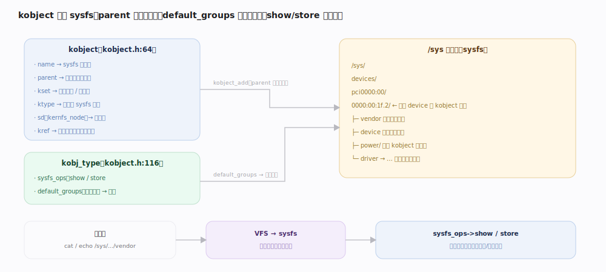
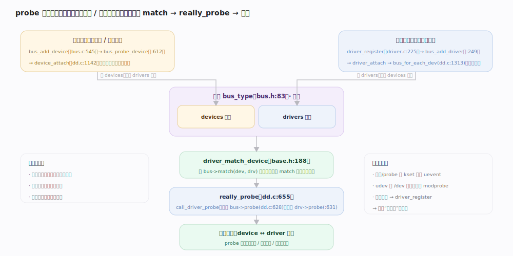
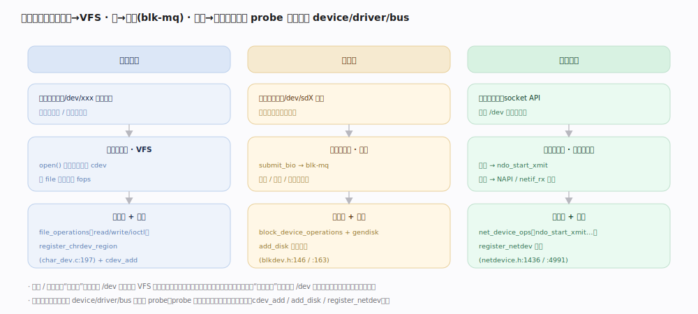

# Linux 内核原理 · 设备驱动模型

> **定位**：**底座能力域**（设备抽象）。用统一的 `device / driver / bus / class` 模型 + `kobject` 层级把千差万别的硬件抽象出来，经 sysfs（`/sys`）暴露给用户态；三类驱动（字符/块/网络）分别对接上层子系统。前台 = 设备读写（经 VFS/块层/网络转到驱动）；后台 = 探测（probe）、热插拔、uevent 上报。被 **VFS / 块层 / 网络协议栈**依赖（它们经驱动访问硬件）；依赖**中断**（驱动注册中断处理下半部）。源码树 7.1.3。

## 一、kobject / sysfs 层级：内核对象树映射成 `/sys` 目录树

设备模型的基石是 **`kobject`**（`include/linux/kobject.h:64`）——一个"内嵌到各种内核对象里的通用节点"，携带四样东西：`name`（在 sysfs 里的目录名）、`parent`（决定它在**目录树**中的位置）、`kset`（所属集合/子系统，也管热插拔）、`ktype`（`kobj_type`，含 `sysfs_ops` 与 `default_groups`），外加 `kref` 引用计数管生命周期、`sd`（`kernfs_node`，即那个 sysfs 目录项）。`struct device` 正是把 `kobject` 内嵌进来（`include/linux/device.h:629`）并带自己的 `parent`（`device.h:630`），所以**设备天然构成一棵 kobject 树**。

映射规则很直接：`kobject_add` 按 `parent` 在 `/sys` 下建一个**目录**；`ktype->default_groups` 里声明的每个 `attribute` 变成该目录下的一个**属性文件**；用户态 `cat`/`echo` 这些文件时，VFS 把读写转成 `sysfs_ops` 的 `show`/`store` 回调打到内核。这样"内核对象 + 其属性"就以文件系统的形式对用户态可见可调。

| kobject 概念 | sysfs 中的体现 | 源码 |
|---|---|---|
| `kobject.parent` | 目录的父目录（决定路径层级） | `kobject.h:67` |
| `kobject.name` | 目录名 | `kobject.h:65` |
| `ktype->default_groups` 的 attribute | 目录下的属性文件 | `kobject.h:119` |
| `sysfs_ops->show/store` | 读/写属性文件的回调 | `kobject.h:118` |
| `kset`（+ `uevent_ops`） | 一类对象的集合 + 热插拔事件源 | `kobject.h:168` |
| `kref` | 引用计数，归零才 `release` | `kobject.h:71` |

---

## 二、device / driver / bus：三方在总线上会合

设备模型把"硬件实例"与"驱动代码"解耦成两张表，挂在同一条**总线 `bus_type`**（`include/linux/device/bus.h:83`）上：一侧是**设备**（`struct device`，"我这块硬件在这"），另一侧是**驱动**（`struct device_driver`，"我会开这类硬件"）。总线提供三个关键回调：`match`（判断某设备与某驱动是否配对，`bus.h:90`）、`uevent`（生成热插拔环境变量）、`probe`（`bus.h:92`）。**总线是媒人**：设备和驱动都不直接找对方，全靠总线用 `match` 撮合。

`match` 的语义随总线而异——PCI 比对 vendor/device ID，platform 比对 `compatible`/name，USB 比对接口描述符。没有 `match` 回调的总线默认"全部匹配"（`driver_match_device`，`drivers/base/base.h:188`）。

---

## 深化 · 驱动注册与探测（probe 的双向撮合）

配对是**双向对称**的，因为设备和驱动谁先出现都不确定：

- **新设备出现**（总线枚举/热插拔）：`bus_add_device`（`drivers/base/bus.c:545`）先把设备挂上总线、建 sysfs 目录，再 `bus_probe_device`（`bus.c:612`）→ `device_attach`（`drivers/base/dd.c:1142`）**遍历这条总线上所有驱动**，逐个试 `match`。
- **新驱动注册**：`driver_register`（`drivers/base/driver.c:225`）→ `bus_add_driver`（`driver.c:249`）→ `driver_attach` → `bus_for_each_dev(__driver_attach)`（`dd.c:1313`）**遍历这条总线上所有设备**。

两条路都汇到同一判定与绑定链：`driver_match_device`（调 `bus->match`，`base.h:188`）判定配对 → `really_probe`（`dd.c:655`）→ `call_driver_probe`（`dd.c:624`）：**优先调总线的 `bus->probe`，没有才调驱动自己的 `drv->probe`**（`dd.c:628-631`）。probe 成功即完成**绑定**（device 与 driver 互指），驱动在此初始化硬件、注册中断、创建设备节点。热插拔时，`uevent` 经 `kset` 上报到用户态（udev），由 udev 按需加载模块——**模块加载又触发 `driver_register`，回到上面的第二条路**。

---

## 深化 · 三类驱动如何接入上层子系统

设备模型统一了"注册与匹配"，但三类驱动**接入上层的方式截然不同**——这正是"驱动是底座、被上层子系统依赖"的落点：

| 类别 | 核心操作集 | 用户态入口 | 接入的上层子系统 | 关键源码 |
|---|---|---|---|---|
| **字符设备** | `file_operations`（read/write/ioctl） | `/dev/xxx` 设备节点（主/次设备号） | **VFS**：`open` 经设备号找到 `cdev`，把 file 的 fops 换成驱动的 fops | `fs/char_dev.c:197`、`cdev` |
| **块设备** | `block_device_operations` + `gendisk` | `/dev/sdX` 块设备节点 / 挂载点 | **块层**：IO 下发 `submit_bio` → blk-mq 调度 → 驱动 | `include/linux/blkdev.h:146`（gendisk）、`:163`（fops） |
| **网络设备** | `net_device_ops`（`ndo_start_xmit`…） | **无 `/dev` 节点**，走 socket API | **网络协议栈**：发包经协议栈到 `ndo_start_xmit`；收包 `netif_rx`/NAPI 上送 | `include/linux/netdevice.h:1436`、`:1441`、`register_netdev`（`:4991`） |

要点：**字符与块设备是"文件式"接入**（有 `/dev` 节点，经 VFS 路由），块设备额外多一层块层做合并/调度；**网络设备是"非文件式"接入**（没有 `/dev` 节点，收发包直接挂到协议栈两端）。三者都先走本主线的 `device/driver/bus` 注册与 probe，probe 成功后各自向对应子系统登记（`cdev_add` / `add_disk` / `register_netdev`）。

---

## 拓展 · class 与 devtmpfs（设备节点从哪来）

| 机制 | 作用 |
|---|---|
| `class`（`/sys/class/*`） | 按"功能类别"（而非物理总线）再组织一遍设备，便于用户态按类别发现 |
| `uevent` + udev | probe/热插拔时经 kset 上报事件，udev 在用户态据规则建 `/dev` 节点、加载模块 |
| `devtmpfs` | 内核启动早期自动填充 `/dev`，让 udev 起来前也有基础设备节点 |

---

## 调优要点（关键开关，据 7.1.3 源码）

- **`drv->probe_type`**（`dd.c:941` 附近）：`PROBE_PREFER_ASYNCHRONOUS` 让 probe 异步并行，缩短启动时间（`__driver_attach` 里据此走 `async_schedule_dev`，`dd.c:1290`）。
- **模块自动加载**：`match` 生成的 modalias 经 uevent 交给用户态，`modprobe` 按需加载驱动模块——驱动不必常驻。
- **`/sys/bus/*/drivers_probe`、`bind`/`unbind`**：手动触发/解除某设备与驱动的绑定，用于调试与热重载。
- **`bus_rescan_devices`**（`bus.c:871`）：强制重扫总线，为尚未绑定的设备重试匹配。

---

## 常见误区与工程要点

- **"kobject 只是引用计数器"**：不止。它同时是 **sysfs 目录树的节点**（`parent` 建层级、`default_groups` 建属性文件），引用计数只是它的一个职责。
- **"设备和驱动直接互相查找"**：错。二者解耦，全靠**总线 `bus->match` 撮合**；谁先注册都能配对，故 probe 是**双向遍历**。
- **"probe 一定调驱动的 probe"**：不一定。`call_driver_probe` **优先调 `bus->probe`**，没有才回落 `drv->probe`（`dd.c:628-631`）。
- **"网络设备也在 `/dev` 下"**：错。字符/块设备有 `/dev` 节点经 VFS 访问，网络设备**没有** `/dev` 节点，只经 socket + 协议栈收发。

---

## 一句话总纲

**设备驱动模型以 `kobject`（parent 建层级、default_groups 建属性文件、kref 管生命周期）把内核对象映射成 `/sys` 目录树，并用 `device / driver / bus` 三方在总线上解耦：总线的 `match` 撮合设备与驱动，新设备遍历驱动、新驱动遍历设备双向触发 `really_probe`（优先 `bus->probe` 再 `drv->probe`）完成绑定；绑定后字符驱动（file_operations）与块驱动（gendisk+blk-mq）以 `/dev` 节点经 VFS/块层接入，网络驱动（net_device_ops）则无 `/dev` 节点直接挂到协议栈两端。**
