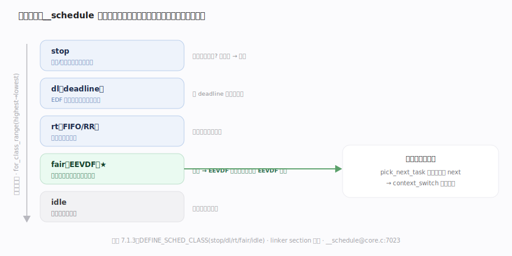
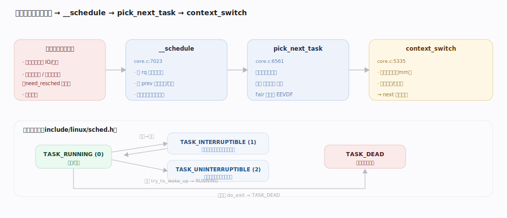
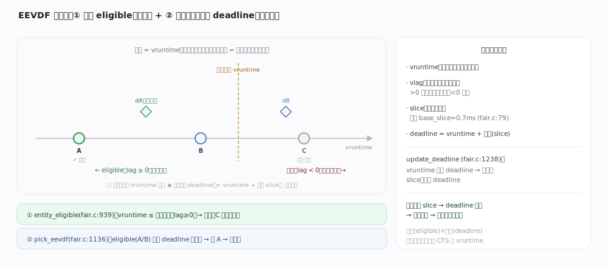
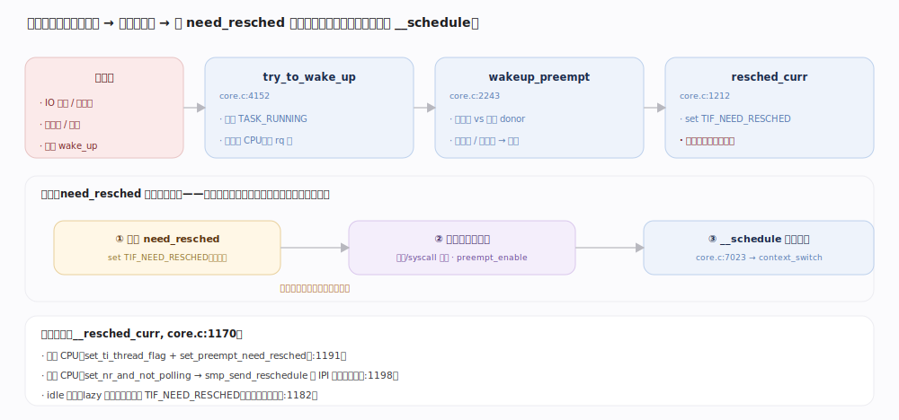
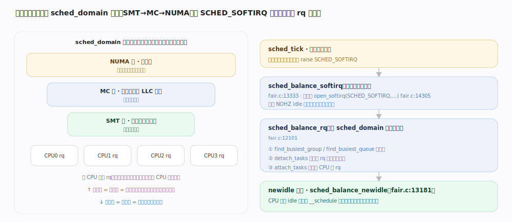

# Linux 内核原理 · 进程调度

> **定位**：**计算能力域**（与本篇同层的"进程与任务管理"管生灭，本篇管"选谁跑"）。分配 CPU 时间。前台 = 调度切换 `__schedule`（阻塞/抢占/唤醒触发）；后台 = 周期负载均衡、时钟节拍。依赖**中断**（抢占时机）、**时间与定时器**（节拍）、**同步原语**（rq 锁）；被所有会阻塞/让出的路径依赖。7.1.3 的 `fair` 类是 **EEVDF** 调度器。

## 一、调度类栈：按固定优先级分层挑选

内核把调度器组织成**优先级固定的调度类栈**——`stop > dl > rt > fair(EEVDF) > idle`（`DEFINE_SCHED_CLASS`，靠 linker section 从 `__sched_class_highest` 到 `__sched_class_lowest` 排序）。`__schedule` 从最高类往下逐类问"你有可运行任务吗"（`for_class_range` 遍历），**第一个有任务的类**给出下一个任务。

| 调度类 | 用途 | 相对优先级 |
|---|---|---|
| stop | 停机/迁移等最高优先内部任务 | 最高 |
| dl（deadline） | EDF 硬实时（有截止期保证） | 高 |
| rt | 固定优先级实时（FIFO/RR） | 中高 |
| **fair（EEVDF）** | 普通任务（绝大多数） | 普通 |
| idle | 无事可做时的 idle 任务 | 最低 |

---

## 二、一次调度切换：`__schedule` 主干

调度切换在三类时机发生：任务**主动阻塞**(等 IO/锁)、**时间片耗尽/被唤醒抢占**(`need_resched` 置位后到抢占点)、**显式让出**。`__schedule`(`kernel/sched/core.c:7023`)持 rq 锁、关抢占，调 `pick_next_task` 沿调度类栈选出 `next`，再 `context_switch`(`core.c:5335`)切换地址空间与寄存器上下文。任务在 `TASK_RUNNING(0)` / `TASK_INTERRUPTIBLE(1)` / `TASK_UNINTERRUPTIBLE(2)` / `TASK_DEAD` 等状态间迁移（`include/linux/sched.h`）。

---

## 深化 · EEVDF 选任务（vruntime / vlag / deadline）

`fair` 类内用 **EEVDF**（Earliest Eligible Virtual Deadline First）选任务，每个调度实体维护四个量：**vruntime**(已消耗的加权虚拟时间)、**vlag**(相对加权平均 vruntime 的滞后，>0 表示"欠跑")、**slice**(请求时间片，默认 `sysctl_sched_base_slice = 700000ns ≈ 0.7ms`，`fair.c:79`)、**deadline**(= vruntime + 按权重换算的 slice)。选任务两步：

1. **资格 eligible**（`entity_eligible`，`fair.c:939`）：vruntime 不超前于加权平均(lag ≥ 0)——保证**公平**，跑超量的暂时没资格。
2. 在 eligible 者中选 **deadline 最小**者（`pick_eevdf`，`fair.c:1136`）——保证**低延迟**，请求小 slice 的任务 deadline 更近、更快被选，交互响应好。

任务跑到 vruntime 追上 deadline 时 `update_deadline`(`fair.c:1238`)续一个 slice、推进 deadline。**这套机制同时给了公平(eligible)与延迟(deadline)两个旋钮**，取代了旧 CFS 单靠 vruntime 最小 + `min_granularity/latency` 的做法。

---

## 深化 · 唤醒与抢占

睡眠任务被 `try_to_wake_up`(`core.c:4152`)置回 `TASK_RUNNING` 并入队；`wakeup_preempt`(`core.c:2243`)判断新任务是否该抢占当前任务，若是则 `resched_curr`(`core.c:1212`)置 `need_resched` 标志——**不立即切换**，而是等最近的抢占点(中断返回、系统调用返回、显式抢占点)再走 `__schedule`。

---

## 深化 · 多核负载均衡

每个 CPU 一个运行队列 `rq`。**周期均衡**由 `SCHED_SOFTIRQ` 软中断驱动(`open_softirq(SCHED_SOFTIRQ, sched_balance_softirq)`，`fair.c:14305`)，沿 `sched_domain` 层级(SMT→MC→NUMA)从繁忙 CPU 向空闲 CPU 迁移任务(`sched_balance_rq`，`fair.c:12101`)；**newidle 均衡**在 CPU 即将变空时即时拉活。均衡兼顾吞吐(用满多核)与局部性(减少跨 NUMA/缓存迁移)。

---

## 拓展 · 组调度与 CPU 带宽（cgroup 衔接）

`task_group` 让调度实体**层级化**，对应 cgroup 的 cpu 控制器：组作为一个实体参与上层调度、组内再调度，实现按组分配 CPU；CFS bandwidth(throttle) 给组设**配额上限**。→ 详见 cgroup 与 namespace 主线。

---

## 调优要点（关键开关，均据 7.1.3 源码）

- `sysctl_sched_base_slice`（`fair.c:79`，默认 700000ns）：EEVDF 基础时间片，调小降延迟、增切换开销。
- `nice` / 权重：`nice` 经权重表映射为调度权重，影响 vruntime 步进与 slice 换算（决定**相对比例**，非绝对时间）。
- cgroup `cpu.weight` / `cpu.max`：组权重与带宽上限。
- rt 相关：rt 带宽限制(rt throttling)防实时任务饿死普通任务。

---

## 常见误区与工程要点

- **`nice` 决定绝对 CPU 时间**：错。它决定**相对权重/比例**，实际时间随负载变化。
- **7.x 还是 CFS**：`fair` 类已是 **EEVDF**(vruntime+vlag+deadline)，不再是纯 CFS 的 `min_granularity/latency` 模型。
- **实时任务不会饿死普通任务**：rt/dl 类**优先于** fair，配置不当会饿死普通任务，靠 rt throttling 兜底。
- **置 `need_resched` 即立刻切换**：错。只是打标，到最近抢占点才切。

---

## 一句话总纲

**Linux 调度分两层：调度类栈按固定优先级(stop>dl>rt>fair>idle)决定"哪类先跑"，`fair` 类内 EEVDF 用"资格(公平) + 最早虚拟截止期(低延迟)"选具体任务；`__schedule` 在阻塞/抢占/让出点做上下文切换，多核经 SCHED_SOFTIRQ 沿调度域做负载均衡。**
