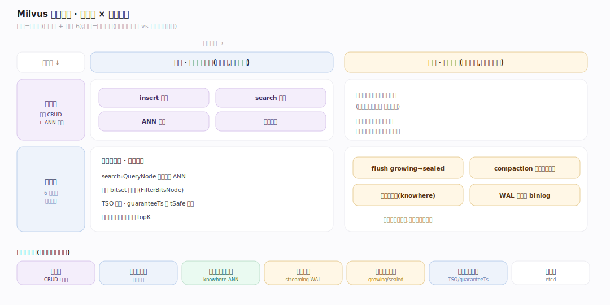
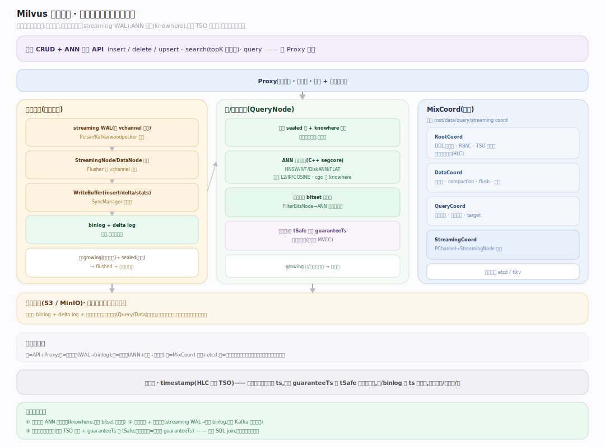
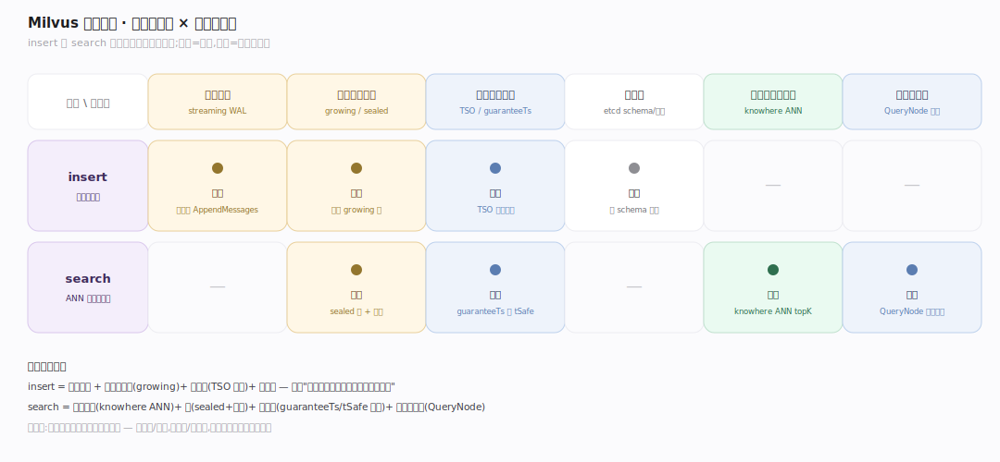
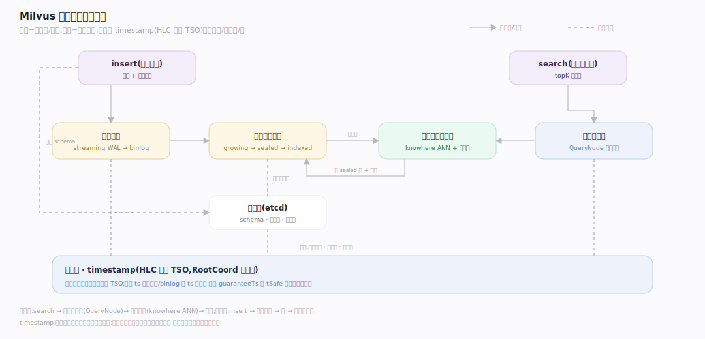

# Milvus 原理 · 全景主线框架

> 统领全部原理文档:Milvus 是**分布式向量数据库**(新家族:向量数据库/相似度检索——接触面是向量 CRUD + ANN 检索 API,核心是近似最近邻搜索,存算分离 + 日志驱动)。源码基准 **Milvus(git 6ca0350944)**(`~/workdir/milvus`;Go 协调面 + C++ 向量核 internal/core)。

Milvus 的世界观:**把高维向量的相似度检索做成分布式数据库**。数据是向量(embedding)+ 标量字段,查询是"给一个向量,找最近的 topK"(ANN)。它不做 SQL join,而是把 ANN 检索 + 标量过滤 + 分布式扩展 + 日志一致性缝合成一个系统。理解"存算分离的节点分工 + knowhere 向量索引 + 日志驱动写入 + 时间戳一致性"四点,就理解了 Milvus。

> **结构提示(写文档必看)**:① 协调器已合并成 **MixCoord**(内嵌 root/data/query/streaming coord,`internal/coordinator/mix_coord.go`);② **IndexNode 已并入 DataNode**(`internal/datanode/index/`);③ 写入走**日志驱动的 streaming WAL**(`internal/streamingnode/`,Pulsar/Kafka/woodpecker 为底);④ 向量索引/检索是 **C++ core**(`internal/core/`)经 cgo 调 **knowhere**(第三方 ANN 库);⑤ 元数据存 **etcd/tikv**;⑥ 段分 growing(可变内存)/ sealed(不可变落盘)。

---

## 一、双维模型:能力域 × 执行时机

- **能力域**:接触面(向量 CRUD + ANN 检索)面向用户;支撑侧——分布式架构、向量索引与检索、写入路径、段与生命周期、一致性与时间、元数据。
- **执行时机**:前台(insert/search 请求、ANN 检索、标量过滤)vs 后台(flush growing→sealed、compaction 合段应用删除、异步索引构建、WAL 消费)。

---

## 二、总架构图(位置即语义)

Client → **Proxy**(接入/路由)→ 写入经 **streaming WAL**(按 vchannel 分片的日志)→ **StreamingNode/DataNode** 消费日志、buffer 成 binlog 落**对象存储**(S3/MinIO)→ growing 段 flush 成 sealed 段 → **DataNode 的 index 子系统**异步建向量索引(knowhere)→ **QueryNode** 加载 sealed 段 + 索引,执行 ANN 检索(标量过滤 bitset 预过滤)。**MixCoord** 统管元数据/调度/TSO(内嵌 root/data/query/streaming coord);元数据存 **etcd**。

---

## 三、7 条主线的分层归位

| 层 | 主线 | 一句话职责 |
|---|---|---|
| 接触面 | **向量 CRUD + ANN 检索** | insert/delete/upsert + search(topK 最近邻) |
| 架构 | **分布式架构** | MixCoord + Proxy/QueryNode/DataNode 存算分离 |
| 检索 | **向量索引与检索(核心)** | knowhere:HNSW/IVF/DiskANN/FLAT + 标量预过滤 |
| 写入 | **写入路径** | Proxy→streaming WAL→DataNode→binlog→对象存储 |
| 存储 | **段与生命周期** | growing→sealed→flushed→indexed;compaction |
| 一致性 | **一致性与时间** | TSO(HLC)+ 一致性级别 + guaranteeTs/tSafe |
| 元数据 | **元数据** | etcd:collection schema、段信息、索引元 |

---

## 四、接触面 × 能力域 依赖矩阵

insert 依赖写入路径(streaming WAL)+ 段生命周期(growing 段)+ 一致性(TSO 定序)+ 元数据;search 依赖向量索引(knowhere ANN)+ 段生命周期(sealed 段+索引)+ 一致性(guaranteeTs/tSafe 快照)+ 分布式架构(QueryNode 执行)。

---

## 五、能力域依赖关系图

实线=数据流/调用,虚线=状态约束。贯穿层:**timestamp(HLC 时间戳)** 横切写入/一致性/段——每个操作领一个全局单调 TSO,读按 guaranteeTs 等 tSafe 追上、看一致快照;段/binlog 也按 ts 版本化。

---

## 六、三条贯穿声明(Milvus 区别于关系库/传统检索)

1. **一切围绕 ANN 向量检索**:核心操作是"给向量找最近 topK"(L2/IP/COSINE),靠 knowhere 的近似最近邻索引(HNSW/IVF/DiskANN)——不是精确匹配、不是 SQL join。标量过滤是"配菜",通过 bitset 预过滤缝进 ANN 遍历。

2. **存算分离 + 日志驱动**:计算(QueryNode 读、DataNode 写)与存储(对象存储)分离,节点无状态可弹性;写入不直接改存储,而是先进 **streaming WAL**(按 vchannel 分片的日志),再异步消费落 binlog——日志是写入的真相,类比 Kafka 的分区日志。

3. **时间戳驱动的一致性**:RootCoord 单点发全局单调 TSO(混合逻辑时钟),所有操作按 ts 定序;读带 guaranteeTs,QueryNode 等 tSafe(已消费日志的水位)追上该 ts 才返回——一致性级别(Strong/Bounded/Eventually/Session)就是选不同的 guaranteeTs。

---

**一句话定位**:Milvus 是分布式向量数据库——核心是 ANN 向量检索(knowhere 的 HNSW/IVF/DiskANN + 标量 bitset 预过滤),存算分离(MixCoord 统管,Proxy/QueryNode/DataNode 分工,数据在对象存储)、写入日志驱动(streaming WAL 按 vchannel 分片→异步落 binlog)、一致性靠全局 TSO 时间戳(guaranteeTs 等 tSafe 追上看快照);段分 growing(内存可变)/sealed(落盘不可变+异步建索引)。
