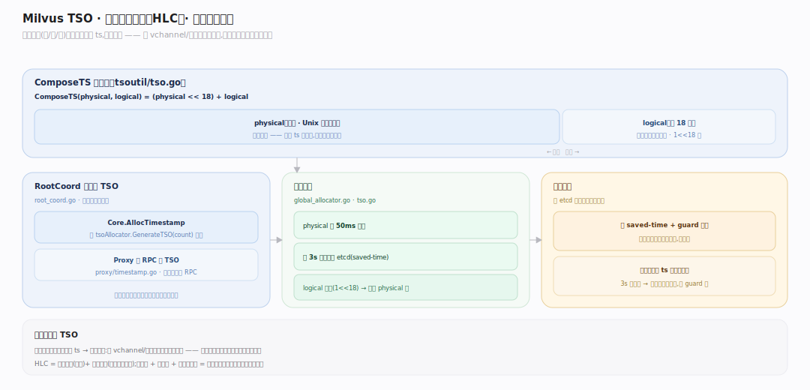
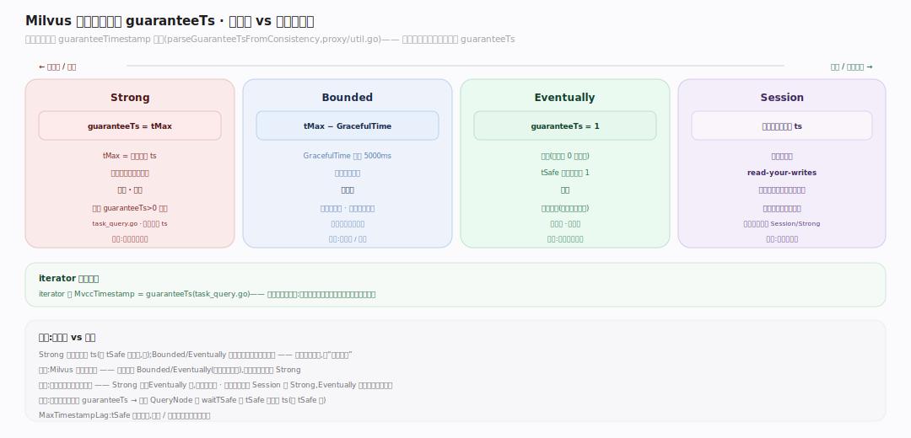
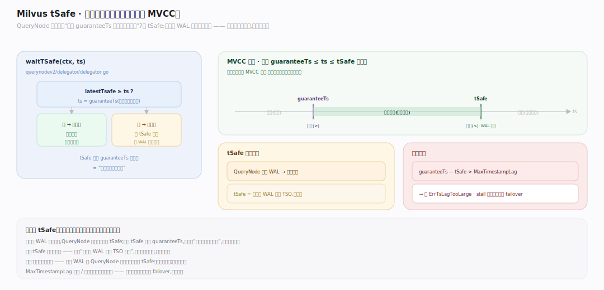

# Milvus 原理 · 支撑主线 · 一致性与时间

> **定位**：属"一致性能力域"。管操作定序与读快照:TSO(混合逻辑时钟)、一致性级别(Strong/Bounded/Eventually/Session)、guaranteeTs 与 tSafe。RootCoord 单点发 TSO,横切所有操作。被【写入路径】定序、被【向量检索】读快照。源码基准 **Milvus(6ca0350944)**(`internal/tso/`、`internal/proxy/`、`internal/querynodev2/`)。

分布式系统里"读到的数据有多新"是可选的权衡。Milvus 用**全局时间戳(TSO)**给每个操作定序,读时带 **guaranteeTimestamp**、QueryNode 等 **tSafe**(已消费日志的水位)追上该 ts 才返回——保证读到一致快照。一致性级别就是选不同的 guaranteeTs:要最新(Strong)还是容忍延迟换性能(Bounded/Eventually)。

---

## 一、TSO:混合逻辑时钟

**TSO**(`internal/tso/`)是全局单调递增时间戳,混合逻辑时钟(HLC)布局:`ComposeTS(physical, logical) = (physical << 18) + logical`(`pkg/util/tsoutil/tso.go:26`),physical = Unix 毫秒、logical 18 位。

- **RootCoord 单点发**:`Core.AllocTimestamp` 调 `tsoAllocator.GenerateTSO(count)` 批量分配(`root_coord.go:1793`);Proxy 经 RPC 领 TSO(`proxy/timestamp.go:60`)。
- **单调保证**:physical 每 50ms 前进、每 3s 持久化到 etcd(`global_allocator.go:77`);logical 用尽(`1<<18`)则强制 physical 进(`tso.go:188`)。重启从 saved-time + guard 恢复。

**为什么全局 TSO**:所有操作(写、删、读)领同一时钟的 ts,天然全序——跨 vchannel/节点的操作可比较先后,这是分布式一致性的基础。

---

## 二、一致性级别与 guaranteeTs

读的一致性由 `guaranteeTimestamp` 决定(`parseGuaranteeTsFromConsistency`,`internal/proxy/util.go:1301`):

| 级别 | guaranteeTs | 语义 |
|---|---|---|
| **Strong** | `tMax`(最新分配 ts) | 读等所有已提交数据,最强最慢 |
| **Bounded** | `tMax - GracefulTime`(默认 5000ms) | 容忍固定延迟,性能好 |
| **Eventually** | `1`(不等) | 最快,可能读旧 |
| **Session** | 客户端上次写的 ts | 读自己的写(read-your-writes) |

Strong 要求新鲜 ts(预设 guaranteeTs>0 被拒,`task_query.go:636`)。iterator 分页钉 `MvccTimestamp = guaranteeTs` 保跨页快照稳定(`:893`)。

**权衡**:一致性级别是"新鲜度 vs 性能"的旋钮——Strong 每次等最新(慢),Bounded/Eventually 容忍延迟换低延迟高吞吐。

---

## 三、tSafe:读快照的时间闸门(MVCC)

QueryNode 怎么保证"读到 guaranteeTs 时刻的一致快照"?靠 **tSafe**:

- **tSafe = 已消费 WAL 到的时间水位**:QueryNode `shardDelegator.waitTSafe(ctx, ts)`——若 `latestTsafe >= ts` 快路径返回,否则阻塞等 tSafe 随 WAL 消费推进(`delegator.go:488`)。
- **MVCC 闸门**:读只看 ts ≤ tSafe 且 ≥ guaranteeTs 的数据——这就是时间戳驱动的 MVCC 快照。
- **滞后保护**:`guaranteeTs - tSafe > MaxTimestampLag` 报 `ErrTsLagTooLarge`;stall 超时触发副本 failover。

**为什么 tSafe**:写入经 WAL 异步落段,QueryNode 消费日志推进 tSafe;读等 tSafe 追上 guaranteeTs,才确保"该看的数据都到了",给出一致快照——这是日志驱动系统实现读一致性的标准做法。

---

## 拓展 · 一致性与时间关键结构一览

| 结构 | 定义 | 职责 |
|---|---|---|
| ComposeTS / TSO | `pkg/util/tsoutil/tso.go:26` | HLC 时间戳(physical<<18+logical) |
| Core.AllocTimestamp | `internal/rootcoord/root_coord.go:1793` | RootCoord 单点发 TSO |
| parseGuaranteeTsFromConsistency | `internal/proxy/util.go:1301` | 一致性级别→guaranteeTs |
| waitTSafe | `internal/querynodev2/delegator/delegator.go:488` | 等 tSafe 追上 guaranteeTs |

## 调优要点（关键开关）

- **一致性级别**:实时性要求高用 Strong;仪表盘/推荐容忍秒级延迟用 Bounded 换吞吐;Session 保读己写。
- **gracefulTime**(默认 5000ms):Bounded 的容忍窗口;调小更新鲜、调大更省等待。
- **MaxTimestampLag**:tSafe 滞后上限;网络/消费慢时防查询无限等。
- **写后立即读**:用 Session 或 Strong;Eventually 可能读不到刚写的。

## 常见误区与工程要点

- **误区:Milvus 总是读最新。** 默认可能 Bounded/Eventually(读稍旧换性能);要最新用 Strong。
- **误区:一致性级别不影响性能。** Strong 每次等 tSafe 追最新 ts(慢);Eventually 不等(快)——是明确权衡。
- **误区:tSafe 是墙上时钟。** 它是"已消费 WAL 到的 TSO 水位",随日志消费推进,不是实时钟。
- **误区:写入即全局可见。** 写进 WAL 后 QueryNode 要消费到才推进 tSafe、才对读可见;有传播延迟。
- **归属提醒**:TSO 给【写入路径】定序;tSafe 随【写入路径】WAL 消费推进;读快照约束【向量检索】;TSO 持久化在 etcd(【元数据】)。

## 一句话总纲

**Milvus 用全局 TSO(RootCoord 单点发的混合逻辑时钟,physical<<18+logical,单调递增)给所有操作定序;读带 guaranteeTimestamp——一致性级别就是选不同 guaranteeTs(Strong=最新 tMax 等所有已提交、Bounded=tMax-gracefulTime 容忍延迟、Eventually=不等、Session=读己写),QueryNode 的 waitTSafe 等 tSafe(已消费 WAL 的时间水位)追上 guaranteeTs 才返回,只看 ts≤tSafe 且≥guaranteeTs 的数据——这是日志驱动系统的时间戳 MVCC 快照,新鲜度与性能的旋钮。**
