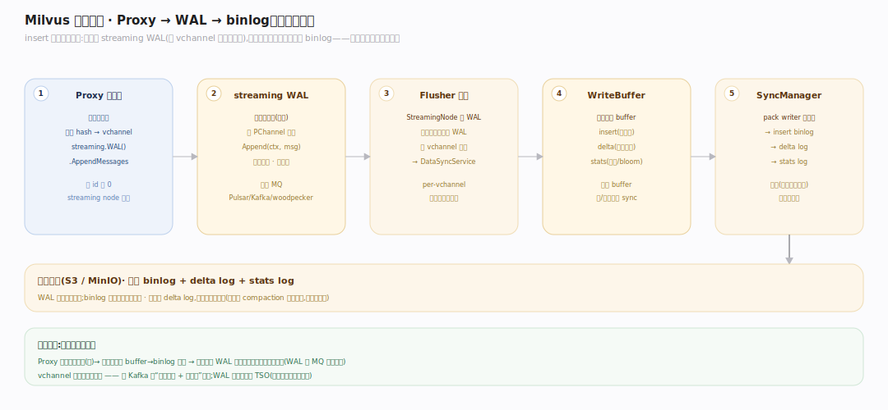
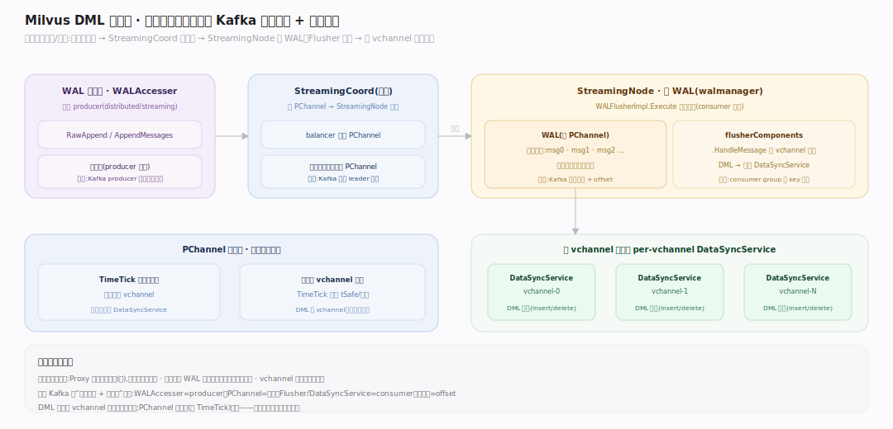
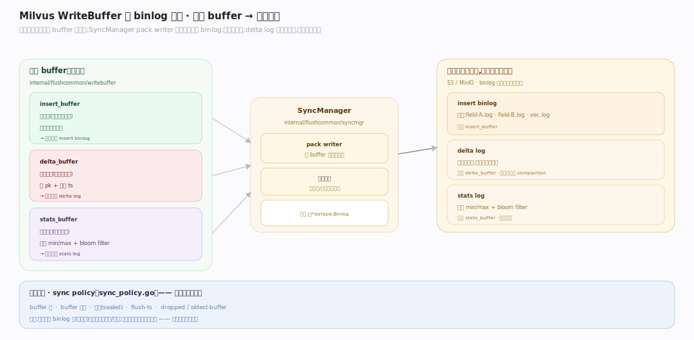

# Milvus 原理 · 支撑主线 · 写入路径

> **定位**：属"写入能力域"。管数据从 API 到持久存储:Proxy → streaming WAL(按 vchannel 分片的日志)→ StreamingNode/DataNode 消费 → buffer → binlog → 对象存储。依赖【一致性与时间】的 TSO 定序、落进【段与生命周期】的 growing 段。源码基准 **Milvus(6ca0350944)**(`internal/proxy/`、`internal/streamingnode/`、`internal/flushcommon/`)。

Milvus 的写入是**日志驱动**的:insert 不直接改存储,而是先追加到 **streaming WAL**(按 vchannel 分片的日志,类比 Kafka 分区日志),再由消费端异步落成 binlog。这让写入快(顺序追加)、可回放(崩溃恢复)、可解耦(写入与落盘分离)。理解"WAL 是写入真相"就懂了写入路径。

---

## 一、写入全景:Proxy → WAL → binlog

一条 insert 的旅程:
1. **Proxy** 建可变消息、按主键 hash 分到 vchannel、`streaming.WAL().AppendMessages`(`task_insert_streaming.go`)追加日志。段 id 此时为 0——**由 streaming node 分配**。
2. **streaming WAL**(`internal/streamingnode/server/wal/wal.go:19`)按 **PChannel** 组织,`Append(ctx, msg)` 写日志;底层 MQ 是 Pulsar/Kafka/woodpecker。
3. **Flusher 消费**(`wal_flusher.go`):从恢复检查点扫 WAL,按 vchannel 路由消息给 per-vchannel 的 DataSyncService(`flusher_components.go:117`)。
4. **WriteBuffer → binlog**:消息 buffer 成 insert/delta/stats 三类 buffer(`internal/flushcommon/writebuffer/`),SyncManager 序列化成 binlog 落对象存储。

WAL 是写入的真相;binlog 是异步落盘的产物。

---

## 二、DML 消息流:日志驱动架构

写入是**基于消息/日志**的(现代 streaming 架构):

- **WAL 客户端**:全局 `WALAccesser`(`internal/distributed/streaming/streaming.go:64`),`RawAppend`/`AppendMessages` 写日志。
- **StreamingCoord**:管 PChannel → StreamingNode 的分配(balancer)。
- **StreamingNode**:持 WAL(`walmanager`),`WALFlusherImpl.Execute` 消费日志(`wal_flusher.go:75`)。
- **消息路由**:`flusherComponents.HandleMessage` 按 vchannel 分发给对应 DataSyncService;PChannel 级消息(如 TimeTick)广播所有服务。

**为什么日志驱动**:写入与落盘解耦——Proxy 只管追加日志(快),消费端异步落盘;崩溃后从 WAL 检查点回放恢复未落盘数据;vchannel 分片让写入并行。这与 Kafka 的"分区日志 + 消费者"同构。

---

## 三、WriteBuffer 与 binlog 生成

消费端把消息攒进 buffer 再落盘:

- **三类 buffer**(`internal/flushcommon/writebuffer/`):insert_buffer(新数据)/ delta_buffer(删除标记)/ stats_buffer(统计,如主键 min/max、bloom filter)。
- **SyncManager 落盘**:pack writer 把 buffer 序列化成 binlog——insert binlog + delta log(删除)+ stats log,返回 `[]*datapb.Binlog`(`internal/flushcommon/syncmgr/`)。
- **触发同步**:sync policy(`sync_policy.go`)按 buffer 满/过期/段封/flush-ts 等条件选段落盘。

binlog 是列式的(每字段/列组一个 binlog 文件),存对象存储;delta log 单独记删除,查询时叠加应用。

---

## 拓展 · 写入路径关键结构一览

| 结构 | 定义 | 职责 |
|---|---|---|
| insertTask | `internal/proxy/task_insert_streaming.go:28` | Proxy 追加 WAL |
| WAL | `internal/streamingnode/server/wal/wal.go:19` | 按 PChannel 的写日志 |
| WALFlusherImpl | `internal/streamingnode/.../wal_flusher.go:75` | 消费 WAL → 落盘 |
| WriteBuffer | `internal/flushcommon/writebuffer/` | insert/delta/stats 三 buffer |
| SyncManager | `internal/flushcommon/syncmgr/` | buffer → binlog 对象存储 |

## 调优要点（关键开关）

- **vchannel 数(ShardsNum)**:写入并行度;高吞吐调大。
- **WAL 底层 MQ**:Pulsar/Kafka/woodpecker;按运维选,影响写入延迟与吞吐。
- **flush 触发**:buffer 大小/时长阈值;调大攒批省 binlog 数、调小降内存/延迟。
- **批量写**:攒批 insert 远快于逐条;避免大量小写产生碎片段。

## 常见误区与工程要点

- **误区:insert 直接写对象存储。** 先追加 streaming WAL(快),消费端异步 buffer→binlog 落盘;WAL 是真相。
- **误区:段 id 由 Proxy 定。** Proxy 传 0,段 id 由 streaming node 分配(写入侧统一)。
- **误区:删除立即从 binlog 移除。** 删除写 delta log 标记,查询叠加应用,数据由 compaction 惰性清除。
- **误区:写入即持久不丢。** WAL 落 MQ 后才持久;崩溃从 WAL 检查点回放恢复未落盘部分。
- **归属提醒**:WAL 定序靠【一致性与时间】的 TSO;落成的段在【段与生命周期】;段信息元数据存 etcd(【元数据】);写入并行单位 vchannel 见【分布式架构】。

## 一句话总纲

**Milvus 写入是日志驱动:Proxy 按主键 hash 把 insert 分到 vchannel、追加 streaming WAL(段 id 由 streaming node 分配,底层 Pulsar/Kafka/woodpecker),StreamingNode 的 Flusher 消费日志、按 vchannel 路由给 DataSyncService,WriteBuffer 攒 insert/delta/stats 三类 buffer、SyncManager 序列化成列式 binlog + delta log 落对象存储;写入与落盘解耦(Proxy 只追加日志、消费端异步落盘、崩溃从 WAL 检查点回放)——与 Kafka 分区日志同构。**
