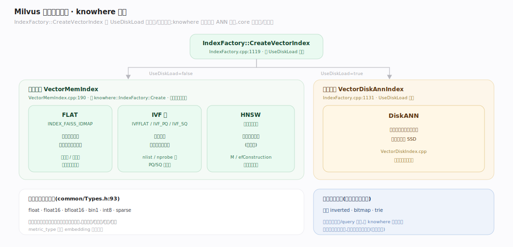
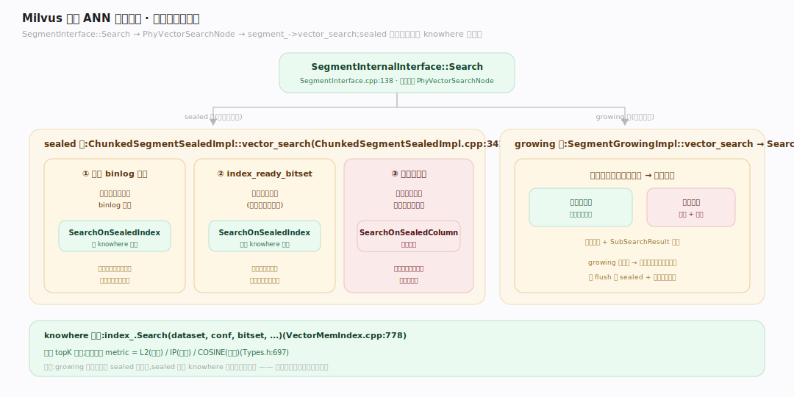
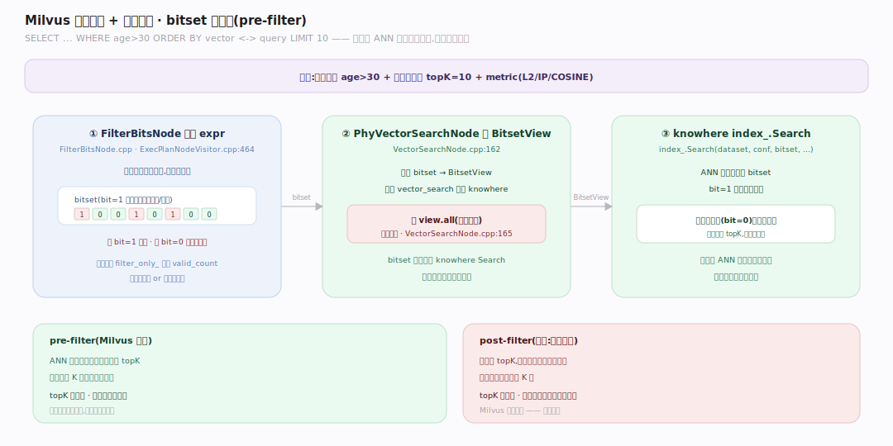

# Milvus 原理 · 支撑主线 · 向量索引与检索

> **定位**：属"检索能力域"——Milvus 的核心。管近似最近邻(ANN)检索:向量索引类型(HNSW/IVF/DiskANN/FLAT via knowhere)、段上检索执行、标量过滤 + 向量检索的融合(bitset 预过滤)。被【向量 CRUD 接触面】的 search 调用、在【段与生命周期】的 sealed 段上执行。源码基准 **Milvus(6ca0350944)**(`internal/core/`,C++ + knowhere)。

向量数据库的立身之本:**给一个查询向量,快速找最近的 topK**。精确算要与全库每个向量比距离(暴力,慢);ANN(近似最近邻)用索引把它降到近对数级,牺牲一点召回换巨大速度。Milvus 的 ANN 引擎是 **knowhere**(第三方库),C++ core 是集成/分发层。理解"索引类型 + 段上检索分发 + 标量预过滤"三点,就懂了检索核心。

---

## 一、向量索引类型（knowhere 分发）

knowhere 是 ANN 引擎,`IndexFactory::CreateVectorIndex`(`internal/core/src/index/IndexFactory.cpp:1119`)按**磁盘 vs 内存**分两族:

- **内存索引 VectorMemIndex**(`VectorMemIndex.cpp:190` 经 `knowhere::IndexFactory::Create`):
  - **FLAT**(`INDEX_FAISS_IDMAP`):暴力精确,小数据/高召回。
  - **IVF 族**(`INDEX_FAISS_IVFFLAT`/IVF_PQ/IVF_SQ):倒排聚类,先粗筛簇再精搜。
  - **HNSW**:分层小世界图,高召回高性能(最常用)。
- **磁盘索引 VectorDiskAnnIndex**(`IndexFactory.cpp:1131`,`UseDiskLoad` 为真时):**DiskANN**——向量太大放不进内存时,索引主体在 SSD。

模板覆盖 `float/float16/bfloat16/bin1/int8/sparse`(`common/Types.h:93`)。标量字段另有倒排/bitmap/trie 等索引(独立于向量索引)。

---

## 二、段上 ANN 检索执行

检索入口 `SegmentInternalInterface::Search`(`internal/core/src/segcore/SegmentInterface.cpp:138`),物理算子 `PhyVectorSearchNode` 调 `segment_->vector_search(...)`。段类型决定路径:

- **sealed 段**(`ChunkedSegmentSealedImpl::vector_search`,`ChunkedSegmentSealedImpl.cpp:3416`)三分支:① 临时 binlog 索引 → `SearchOnSealedIndex`;② `index_ready_bitset` 就绪 → `SearchOnSealedIndex`(**正常 knowhere 索引路径**);③ 否则只有字段数据 → `SearchOnSealedColumn` **暴力**。
- **growing 段**(`SegmentGrowingImpl::vector_search`)→ `SearchOnGrowing`:有临时索引则用,否则暴力分块 + `SubSearchResult` 归并。

**关键**:growing 段(内存可变、无索引)总是暴力搜;sealed 段建了索引才走 knowhere 快路径——所以"未建索引前查询慢"是正常的。knowhere 查询 `index_.Search(dataset, conf, bitset, ...)`(`VectorMemIndex.cpp:778`)返 topK,度量 L2/IP/COSINE(`Types.h:697`)。

---

## 三、标量过滤 + 向量检索:bitset 预过滤

`SELECT ... WHERE age>30 ORDER BY vector <-> query LIMIT 10` 这种"过滤 + ANN"怎么高效做?Milvus 用**预过滤(pre-filter)**:

- **先算标量谓词成 bitset**:`FilterBitsNode`(`FilterBitsNode.cpp`)评估 expr 谓词,输出位图列(**bit=1 表示该行被过滤掉/排除**,`ExecPlanNodeVisitor.cpp:464`)。
- **bitset 传进 ANN 搜索**:`PhyVectorSearchNode` 把上游 bitset 转成 `BitsetView`,交给 `vector_search`(`VectorSearchNode.cpp:162`)。bitset 一路穿到 `knowhere index_.Search(dataset, conf, bitset, ...)`——**过滤在 ANN 遍历内部生效**,knowhere 跳过被过滤的行,而非搜完再滤(post-filter)。
- 若 `view.all`(全被过滤)直接返空(`VectorSearchNode.cpp:165`)。优化器还可 `filter_only_` 先算 valid_count 决定迭代式还是一次性过滤。

**为什么预过滤更优**:post-filter 搜 topK 后再滤可能剩不够 K 个;pre-filter 让 ANN 只在候选集里找,保证 topK 质量。

---

## 拓展 · 检索关键结构一览

| 结构 | 定义 | 职责 |
|---|---|---|
| IndexFactory::CreateVectorIndex | `core/src/index/IndexFactory.cpp:1119` | 按 disk/mem 分发向量索引 |
| VectorMemIndex | `core/src/index/VectorMemIndex.cpp:190` | 内存索引(HNSW/IVF/FLAT)knowhere |
| VectorDiskAnnIndex | `core/src/index/VectorDiskIndex.cpp` | DiskANN 磁盘索引 |
| ChunkedSegmentSealedImpl::vector_search | `core/src/segcore/ChunkedSegmentSealedImpl.cpp:3416` | sealed 段检索三分支 |
| FilterBitsNode | `core/src/exec/operator/FilterBitsNode.cpp` | 标量谓词→bitset |
| PhyVectorSearchNode | `core/src/exec/operator/VectorSearchNode.cpp:162` | bitset→ANN 检索 |

## 调优要点（关键开关）

- **索引类型选择**:高召回+内存够→HNSW;超大向量放不下内存→DiskANN;小数据/要精确→FLAT;省内存→IVF_PQ/IVF_SQ。
- **度量类型** metric_type:L2(欧氏)/IP(内积)/COSINE(余弦),须与 embedding 训练时一致。
- **索引参数**:HNSW 的 M/efConstruction、IVF 的 nlist/nprobe——召回率与速度权衡。
- **及时建索引**:growing/未建索引 sealed 段走暴力;导入后触发建索引让查询走 knowhere 快路径。
- **过滤选择性**:高选择性(过滤后候选少)预过滤收益大。

## 常见误区与工程要点

- **误区:向量检索是精确的。** ANN 是近似——牺牲一点召回换速度;要精确用 FLAT(暴力)但慢。
- **误区:标量过滤是搜完再滤(post-filter)。** Milvus 是预过滤:先算 bitset、ANN 遍历内跳过被过滤行,保证 topK 质量。
- **误区:刚导入就能快查。** growing 段和未建索引的 sealed 段走暴力搜;要等异步索引建好才快。
- **误区:knowhere 在 Milvus 仓库里。** knowhere 是第三方库;core 是集成/分发层(IndexFactory/VectorMemIndex/VectorDiskIndex)。
- **归属提醒**:被检索的段在【段与生命周期】;索引构建时机在【段生命周期】的异步建索引;检索在 QueryNode(【分布式架构】);读快照的 ts 在【一致性与时间】。

## 一句话总纲

**Milvus 检索核心是 ANN 向量最近邻:knowhere 按内存/磁盘分发索引(HNSW 图 / IVF 倒排聚类 / FLAT 暴力 / DiskANN 磁盘,度量 L2/IP/COSINE),段上检索分 sealed(建了 knowhere 索引走快路径、否则暴力)与 growing(内存可变总暴力);标量过滤用预过滤(FilterBitsNode 先算 bitset、传进 knowhere Search 在 ANN 遍历内跳过被过滤行,bit=1 表示排除),保证 topK 质量优于 post-filter——所以及时给 sealed 段建索引是查询快的前提。**
